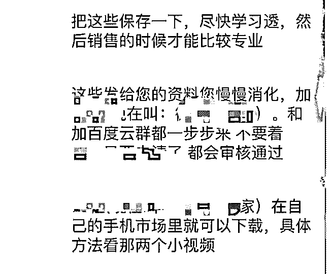

# 捧个场，增加下花爷

白一喵 : 捧个场，增加下花爷的工作量（大雾）

▌背景：来个小故事 今天，我在商场男厕门背后，看到这么一个东西（图 1）。 第 1 反应：这啥玩意儿？！脏！

第 2 反应：我讨厌的广告，可能包含我不知道的商业手法。放

下喜恶，拆解看看呗～ 哎可悲的工作习惯... _(:_」∠)_

▌提出问题：这个生意能持久不衰吗？优势在哪里？

▌基本逻辑：收入 = 流量 * 转化 * 客单价。这个生意如果不 会死，至少要在以下 1 项中做得好：

① 获客成本低

② 转化率高

③ 利润空间高

按照常识，这种壮 Y 药都是暴利产品，不过需要拿到更多数据 才能验证。

不如先关注：做了什么，来便宜的获得流量、提升转化？

▌随手开始挖掘信息 （这一部分可跳过阅读）

① 搜微信，加好友，一直没通过。看个性签名（图 2），疑似 商品口号。微信、PC 上搜索之

② 找到：

◆ 产品官网，有微商团队招募，各种成功案例，还有加盟方

法

◆ 产品上架了 JD 官网

◆ 全网有大量的微商发帖引流

③ 官网扫码加微信咨询，套话（过程太长，略去不表） —— 获得代理价格（图 3，交代理费拿货的方式），非常详尽培训 资料清单截图（图 4、图 5），对方的朋友圈（太不 HX 就不放 图了）

▌初步结论：

① 便宜的流量可能和不 HX 小视频玩 se 流的套路类似：

◆ 在不容易被发觉的地方（如厕所门）留微信，精准又隐 秘，还自带了人群筛选效果。雇一个小工去刻个印章就好， 成本几乎为 0

◆ 招募代理全网铺帖，人力成本靠加盟费填上

② 假设官网案例提供的数据为真（通常 6 个新增好友能成交 2 个），转化率能到 33%

问了一下做微商的朋友，据说很高了。高转化可能源于：

◆ 微商团队集体使用美女人设（下沉市场 + 土直男审美）

◆ 各种标准化的交流话术。很会挑拨情绪，和“杀猪盘”的套

路类似 —— 把内容生产标准化、让没背景的小白也能学会的

经验，值得所有做内容的人学习

以上结论，有待花爷交叉验证。

▌留给花爷的问题

看这家的微商朋友圈，内容非常不 HX，游走在危险边缘，预 感早晚被封。 仅从成本和预期收益的角度看，这家公司为什么敢这么做？

更多数据和截图，我就单独给花爷了，放在这里太污染精神 了 _(:_」∠)_

容我洗洗眼睛去 =。 =||||||| 2019-08-07(12 赞)

评论区：

花爷梦呓换酒钱 : 收益里除了获客成本，也计算了被封的成本。而且做 se 流的其实一直不算是被微信封的重点对象。

白一喵 : 或者说，应该是“周期性”被重点关注的对象。对么？（好像不能说太多

花爷梦呓换酒钱 : 我印象里连周期性都比较少，至少不是被封的最严的那个等级。毕竟 se 流只要不诈骗，带来的现实伤害有

限……

关注公众号"懒人找资源"，星球资源一站式服务