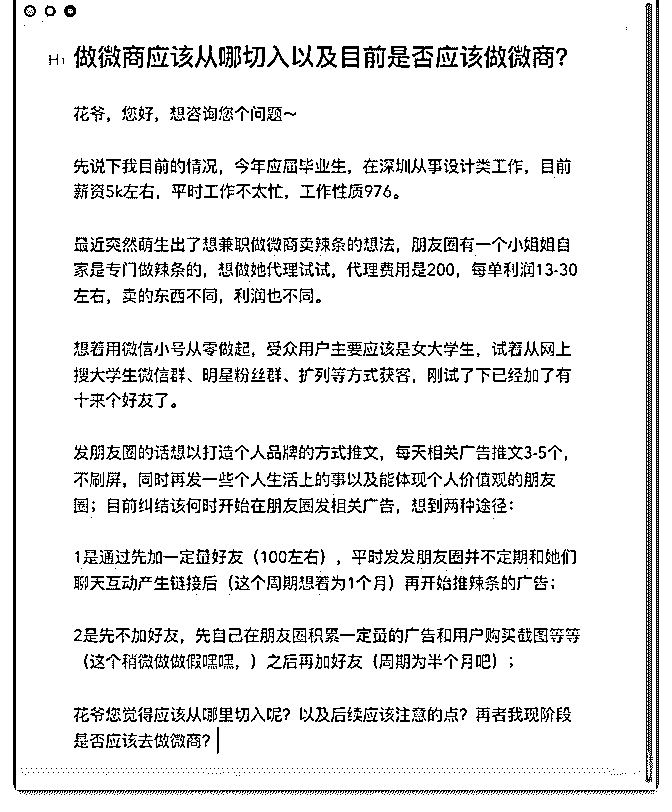

# 花爷您好，今天突然

(提问)匿名用户 : 花爷您好，今天突然冒出来的一个想法，自 己对这方面还挺感兴趣，第一时间过来咨询下您的建议 - -

2019-08-02

回答：1.做女大学生的微商，就要了解女生、了解大学生。

女大学生的需求：种类全、价格便宜。 只要你完成这两点，

获客其实不难，稍加一些裂变手段，大学生就会奔走相告。

用辣条做微商这事，你没说价格，所以我无法判断“价格便

宜”这个条件是否满足，但“种类全”这个条件，肯定是满足不

了。 2.那是不是不值得做了？ 不是。 种类全、价格便宜、运

营强悍，这些条件是很难一次性达成的。新手小步快走，先

选一个自己看中的品类去尝试，是没有任何问题的。 只要你

记得，当你尝试之后，更了解用户之后，要不时地停下来，

回头想一想是否需要增加品类、是否需要修改宣传策略。 总

之，代理费也就 200，试错成本不高。只要你感兴趣，大胆去

做，如果效果不好，很正常，收获一份失败的总结，继续尝

试其他方法就好。 3.直接开始做微商，还是先攒一定的广告

再做？ 一定是前者，还是那句话，试错成本很低，小步快走

就好，没必要攒一波广告内容再开始做。 一个人憋大招，期

望一击必中，这种心态是新手的致命伤。 4.该不该做微商？

我也不知道，你自己也不知道。 所以，既然感兴趣，为什么

不试一试？做一阵子发现不喜欢，就适可而止呗。 只要花全

力去努力，哪怕最后失败了、放弃了，也可以说一声我尽力

了，不留遗憾。(13 赞)

关注公众号"懒人找资源"，星球资源一站式服务