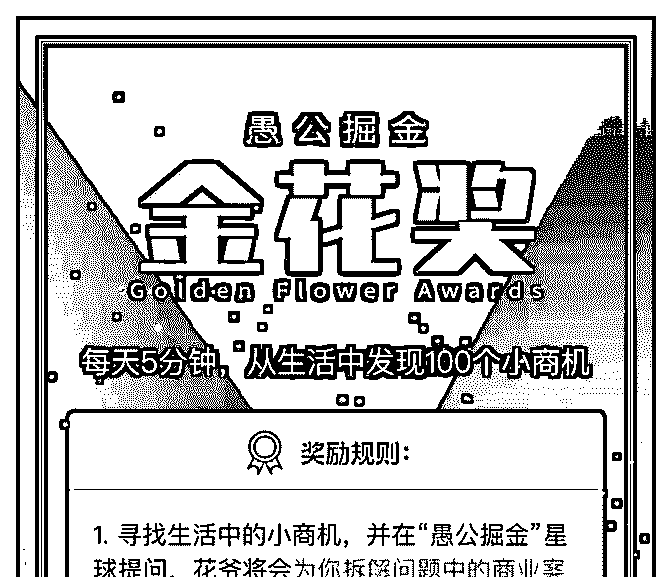
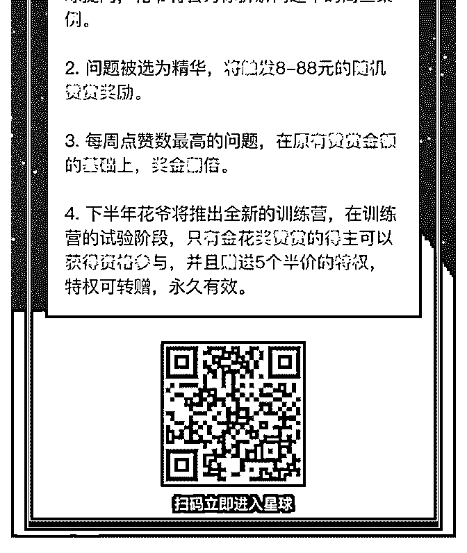

# 我们有没有可能，通

花爷梦呓换酒钱 : 我们有没有可能，通过每天五分钟的思考积 累，给自己换一个大脑，为人生切换一个轨道？

我觉得可以。

“金花奖”活动的初衷，就是如此。昨天我在公众号公布了金 花奖的细则：

简单来说，就是你按照文中的方法，去发现生活中的小商 机，然后向花爷提问。

只要带上 的标签提问，即可参与活动，活动的奖励包括：

1\. 只要你按照上面的思路，寻找生活中的小商机，并在“愚公 掘金”星球提问，花爷将会为你拆解问题中的商业案例。

例如，全家便利店明明不便宜，为什么这么受欢迎、开这么 多店？

2\. 你的问题被花爷选中为精华，将触发 8-88 元的随机赞赏奖 励。

如果你在提问的同时，带上自己的思考和分析，触发大额赞 赏的几率就更大。

3\. 每周点赞数最高的问题，将获得双倍奖金。例如，被选为 精华时获得 88 元奖励，当选周点赞数最高后，将额外获得 88

元奖金。

4\. 下半年花爷将推出全新的训练营，在训练营的试验阶段， 只有金花奖赞赏的得主可以获得资格参与，并且赠送 5 个半价 报名训练营的特权，特权可转赠，永久有效。

[作为一个小实验，活动时间持续一个月，我会在活动期间持 续调整规则，大家玩得开心。](https://mp.weixin.qq.com/s/d3YTTyoba-HF5P9LZU_hxA)[如何每天用](https://mp.weixin.qq.com/s/d3YTTyoba-HF5P9LZU_hxA)[5](https://mp.weixin.qq.com/s/d3YTTyoba-HF5P9LZU_hxA)[分钟，找到](https://mp.weixin.qq.com/s/d3YTTyoba-HF5P9LZU_hxA)[100](https://mp.weixin.qq.com/s/d3YTTyoba-HF5P9LZU_hxA)[个](https://mp.weixin.qq.com/s/d3YTTyoba-HF5P9LZU_hxA)  [小商机？](https://mp.weixin.qq.com/s/d3YTTyoba-HF5P9LZU_hxA)

2019-08-02(12 赞)

评论区：

你是年少的欢喜 : 先完成再完美，找问题去。

朱较瘦 : 同意楼上。

关注公众号"懒人找资源"，星球资源一站式服务