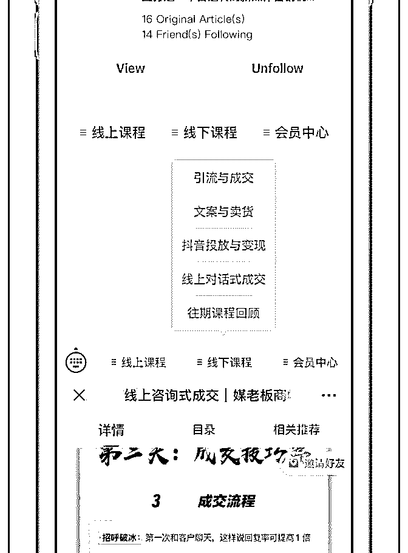
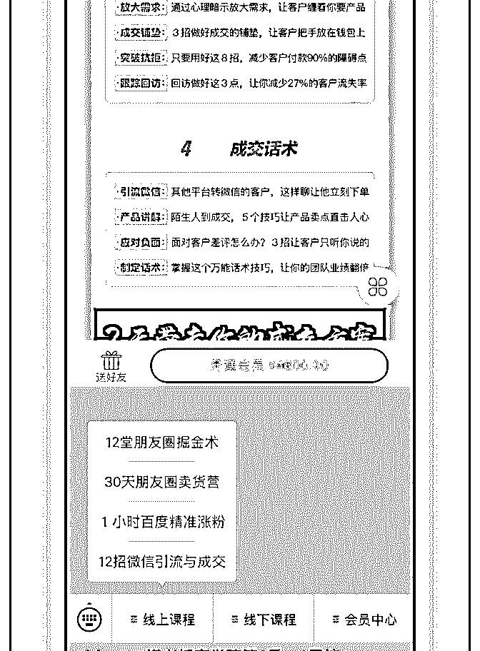
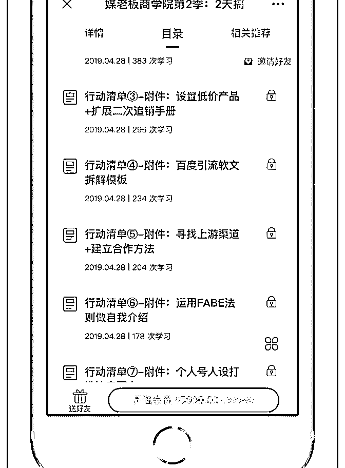

# 这类所谓商学院，感

(提问)亿枫 : 这类所谓商学院，感觉好多，收费标准也越来越 高，看到目录感觉分的细，直觉感觉内容没(⊙o⊙)啥可延续 性（期待花爷的分析）

（目前观摩，线下排场不弱，高大尚。线上算专业，至少包 装不差）

略看了几个讲师转变故事，文化底蕴一般（大学学历以下） 经历一般（普通上班族转到新媒体行业或自媒体行业，（经

历多久时间成长不知，没写））

反正就是因为写文章等原因一下子收几百万，就各种卖课， 各种培训，各种收割（也不知道自己是不是对其中有一些偏 见）

想知道，如果是花爷，会怎么看？

2019-07-31

回答：就以你发的新媒体商学院为例，新媒体已经有很久

了，不是新东西，商学院在常青藤高校里也有很多年历史

了。 这两个东西都不新，但是一结合，就成了新东西。 你

看，创新其实就是旧的流行元素，用一种新的方式排列组合

诞生的产物。 先看商学院，初期的商学院、MBA 是给谁上

的？大企业的高管，一边学习，一边结识人脉，不亦乐乎。

再看新媒体，早期的新媒体非常屌丝，很多现在知名的新媒

体，当年穷困潦倒。但现在不一样了，新媒体行业出了无数

个年入百万的年轻人，也出了不少年营收过亿的企业，大家

都知道了，哦，新媒体行业也能像传统企业一样赚钱，而且

向上攀爬的速度更快。 所以，两者一结合看，呈现出来的现

状就是： 1.新媒体作为新贵行业，其实也有企业、也有高 管、也有高收入的从业者 2.这些从业者其实也有学习、积累 人脉的需求，但他们不能去传统高校的商学院，因为那里教 不了他们，而且都是传统企业的人，积累不了新媒体人脉 3\. 所以，新媒体商学院的需求，就在时代的变化中诞生了。他 就是一个传统商学院，在新媒体行业的变种。 有人说了，我 参加过这种商学院，不仅有新媒体的资深人士，还有很多小 白、传统企业人、甚至体制内人员啊，怎么回事？ 任何一个 商学院，在打出学习和积累人脉的噱头之后，在宣传出名头 之后，都会吸引小白和各行各业的人，很正常。 现在你是体 制内领导，你是传统企业老板，大家都在搞新媒体，你搞不 搞？你想搞的话，怎么学？不能去上 99 的课吧，太丢分了， 新媒体商学院正好是个合适的选择。 新媒体商学院是如此， 微商学院、短视频商学院、社群商学院等等，都是如此，都 是以一个行业为切入点，做这个行业的高端付费产品。 所 以，本身课程内容已经没那么重要了，在新媒体这个领域， 能讲好的人没有一万也有一千。 重要的切中了高端需求，并 且宣传和产品让目标用户愿意买单。(13 赞)

评论区：

欧欧 : 那在做这个商学院前，其实是先敏锐的发现了这波目标客户群体的需求，然后才设计出这样的产品去满足呢？

亿枫 : 这个逻辑没有毛病 比如我 心法家园的圈子，是自己发现轻创业群体，没有成品牌或团队规模前，做线上交流，营

销，成交策略，团队复利几个环节当中，总有一两个环节是很薄弱的 因为自己在行业当中有做，其环节当中的细节是非常

敏感的，因为也遇到无法突破的瓶颈，而这个瓶颈还是跳出了圈外之后，才得到了豁然开朗

关注公众号"懒人找资源"，星球资源一站式服务