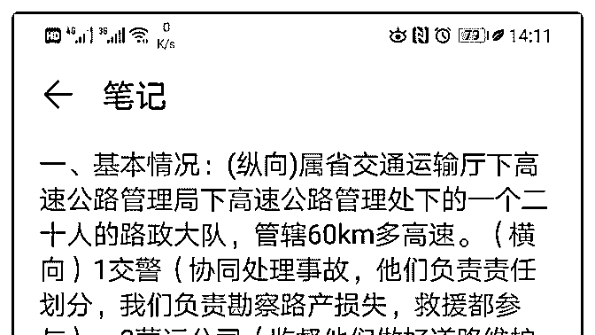
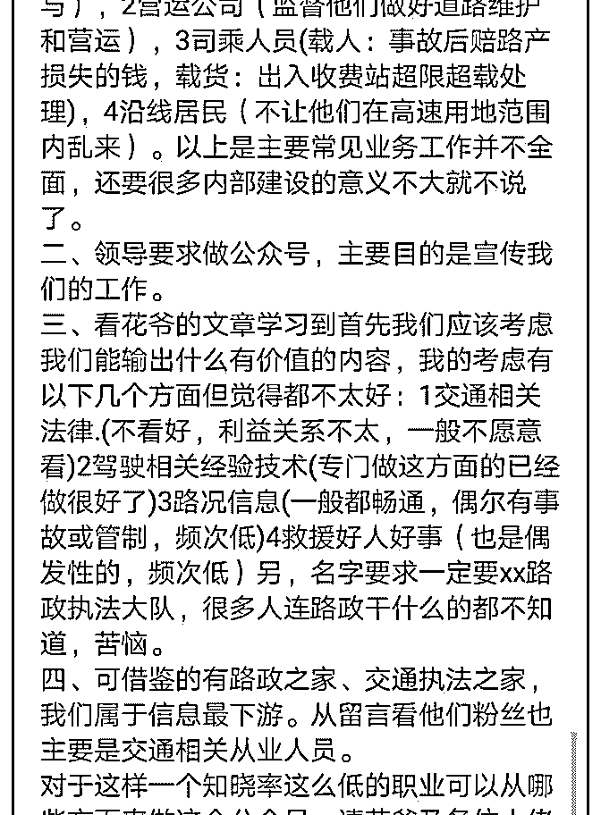
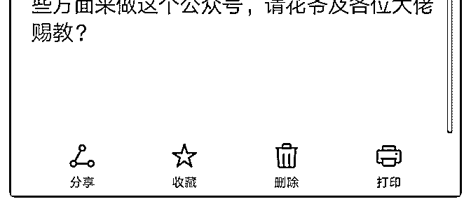

# 花爷好，问题有点长

(提问)seeking~ : 花爷好，问题有点长，烦请看图。

2019-07-28

回答：不好意思，最近手机信号一直罢工，久等了各位。 你

说的很多，做公众号，一定要输出有价值的东西，但你没搞

清楚另一个更深层的问题，对谁有价值？ 没有目标对象，就

没有价值可言。 举个例子，你在公众号写高端电子产品，对

手机发烧友可能有价值，但对种地的农民老伯有价值吗？一

毛钱价值都没有。 同理，你写各种交通内容，对普通老百姓

有价值吗？没有，你自己都列出来并且一一否定了。 那真正

的价值在哪？ 就在你的问题里：领导要求做公众号，主要目

的是宣传我们的工作。 看到没，这是政绩，是影响力，是帮

领导做给领导的领导看的东西。 自媒体影响力这个东西，别

的领导如果做了，你的领导没有，你的领导多尴尬？别的如

果没做，你的领导如果有，你的领导多有面子？ 这个公众

号，就是一个展示影响力的东西，影响力越大越好，别管有

没有真正的实际使用价值。 明白这一点，你就能找到写作素

材： 1.什么样的内容，能带来正面的影响力？ 聊部门取得的

成绩，聊大家的付出，聊群众的证明反馈。 上个月我们做了

什么，成绩多么好，群众反向多么热烈，这类内容你懂吧？

尽量写得生动、自然一点，在事实的基础上适当美化，让领

导和同部门的人既不觉得夸张，又觉得心里飘飘然。 2.怎么

通过公众号，在系统内部，扩大影响力？ 你可能要问，写这

些内容，用户不爱看，没反响啊！ 废话，你看哪个体制内的

文章是大家爱读的？为什么不爱读阅读量还这么高？因为要

求大家一起看，一起点赞啊！所以多和你列的那些关联部门

搞好关系，让各部门帮忙转发、宣传。 当然，也许你确实叫

不动其他部门的小领导，那就让你的领导帮忙疏通一下，美

名其曰“部门对外宣传工作的一部分”。 3.怎么通过公众号，

在整个市区、交通系统内扩大影响力？ 想做到这一点，对你

的要求就很高了。 你可以尝试写本地的交通系统变迁历史， 写出本地突飞猛进的自豪感，这种文章容易在区域内爆火。 这一点，你可以借鉴公众号“地球知识局”。 或者也可以蹭热 点的交通新闻，写时事点评，新闻的传播速度永远是最快 的。 但总体来说，第三点很难很难。 说到这，可能有人不愿 意了：花爷，你怎么教人家溜须拍马呢？ 不好意思，这就是 体制内的现实，不然你告诉我，一个二十人的路政大队有什 么做公众号的必要？这事儿在非体制内环境，本身就概率极 低。 如果你做自媒体的能力很强，可以再问我如何蹭热点、 如何和用户互动等等，但我必须明白的告诉你，二三线城市 的体制内部门，业余时间做公众号非常成功的概率，无限接 近于零，这就是现实。 所以，最好的策略，就是做好 1、2 两 点，同时一定要多跟领导沟通，让他感觉到你对这事儿上 心、在不断努力。至于第 3 点，确实看个人天分了。(7 赞)

评论区：

可乐 kele : “没有目标对象，就没有价值可言” 拿小本本记下来。

seeking~ : 感谢花爷解答，天分是没有了，只能努力了。

黄黄 : 我也是在体制内做公众号的。最近广东省宣传部门下发了一个通知，要求县级镇级以下的政府原则上只能保留一个

公众号，所以基层部门的公众号最近都按照这个整改要求关停了一大批。 嗯，建议你查一下相关的政策，跟领导解释一

下，目前关停这种太小的政务公众号是上级部门的意思，是大势所趋，你的这项工作就可以省下不用做了。

seeking~ : 感谢建议，但是呢，政策文件这个东西，上级要求下级做的事得做，作为下级，还真不好去讲，我们都明白基层

没必要做这个，领导应该也是明白的，做是出于其他原因，我想耐心等着我们省叫停的那天比较好。

花爷梦呓换酒钱 : 对，别把领导当傻子……这种事让他自己去发现……

关注公众号"懒人找资源"，星球资源一站式服务