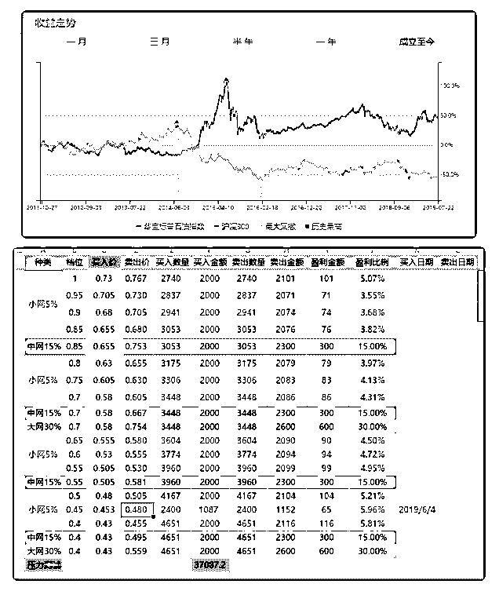
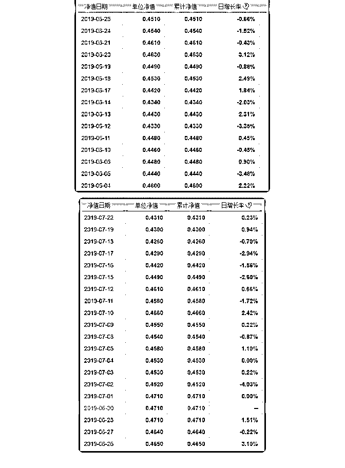
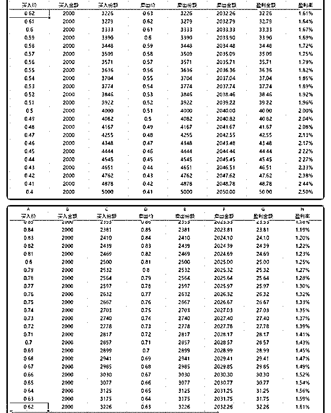
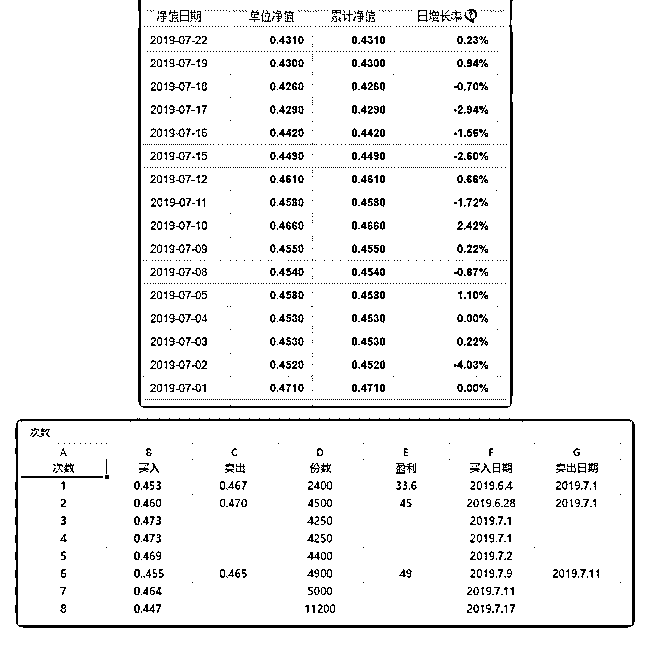

# 分享主题：股市”网

花爷梦呓换酒钱 : 分享主题：股市”网格交易“—华宝油气交易 的实操分享

花爷提醒：投资需谨慎，不要盲目跟从他人的投资经验 分享嘉宾：cgrowth 嘉宾介绍：未踏上社会、先进入 A 股市场的小韭菜一枚。今天

想与大家分享的是：在学习“ETF 拯救世界”之网格交易系列文

章之后，对华宝油气(162411)两个月来的网格交易实操记录，

希望对大家有所帮助。(另：市场有风险，入市需谨慎。）

分享正文： 一、网格交易简介。

什么是网格交易：假设一个交易品种的价格在[P0-P10]之间， 按照等差数列或者等比数列将其价格设置为序列 P0,P1,P2,

…,P10，其中，每一个价格称之为“一网”。

按照既定的价格序列，当价格降低某个序列时进入买入，当 价格上升至某个序列时进行卖出，即为网格交易。

譬如：当价格从 P6 降至 P5，那么按照 P5 的价格买入一定的份 额；当价格再从 P5 升至 P6，那么按照 P6 的价格将已有的份额 进行卖出，从而获利。

二、网格交易的适用性

1、网格交易适合的品种：一个交易品种长期来看没有什么涨 跌幅，中短期来看波动不小，并且不会存在退市等毁灭性的 品种，比如上证指数，这么多年了还是在 3000 点徘徊，但是 却中间发生了巨大的波动。

2、网格交易不适合的场景：

（1） 牛市的一直涨，每次盈利较少，不如长期持有。

（2）熊市的一直跌，会导致仓位越来越重，占用资金。

（3）波动较小，导致很长时间都难以进行一次交易。 价格差如何设定以及每次买入的金额：一般而言价格差在 3%-

5%较为合适，可以根据个人的喜好进行选择，当价格差选择

较小的时候，交易次数较为频繁；当价格差选择较大的时

候，交易次数则较少。个人根据自己投入资金量，列好表格

后做好压力测试(即全部买入而不卖出时所需要的资金量)即

可。每次买入的金额可以一样，也可以不同，一般低位是买

的较多，高位时买的较少，但一定要做好压力测试。

三、网格实操起源 说来幸运，在跟随”长赢指数投资计划”近一年后，计划主理

人“ETF 拯救世界”于今年 5 月左右陆续分享了三篇关于网格交

易的系列文章。

诚如契诃夫所言“如果在第一幕里出现一把枪,那么在第三幕枪 一定要响。”，在学习了上述三篇网格交易的文章之后，我便 在某证券开通了交易账号，对华宝油气(162411)开始了我的网 格实操。

刚才谈到网格交易适合长期不会死、短期有波动的品种，因 此 ETF 指数基金是较为适合的交易品种。我这里用于网格交易 的华宝油气便是一种指数型基金其，全称为“华宝标普石油指 数”。

（图 1） 从上图中可以看出自 2016.12.12 日左右，华宝油气每一份的价

格都低于 0.75 元，并且 2019 年以来更是没有低于 0.42 元，高于

0.57 元。这意味着如果长期持有不动，既不会有大的盈利，也

不会有大的亏损。便宜的价格和不会造成较大的亏损，是我

选择华宝油气交易的原因之一。

四、第一次网格与交易 第一次通常是痛的，嗯。下图是我第一次做的网格交易表

格，按照 0.025 元的价格差做的等差数列。

（图 2） 第一笔交易的发生日期为 2019.6.4，买入价 0.453 元，买入份额

2400，预计的卖出价格是 0.480 元，价格差达到了 0.027 元，如

果这笔交易完成，获利 240* 0.027=64.8 元。实际上，这笔交

易一直没有成交。

可以看一下在我 6.4 号买入之后，华宝油气的交易价格发生了 怎样的变化。

（图 3、图 4） 从 0.460 元跌至最低 0.433 元，验证了“当你买后就会跌”股市定

律。于是在买入后，我就开始装死，一直等待 0.48 元的到来...

华宝油气后来的价格走势由低到高，再到最近的走低。如果 我一直抱着 0.48 元的价格再卖，可能我就和现在的进化后的网 格交易无缘了。（实际上，第一笔卖出是在 7.1 日的 0.467 元， 中间近一个月的华宝油气交易价格 0.44，0.45,0.46 元我都没有 任何动作）。

五、反思与进化 现在回顾华宝油气的 6 月份的短期走势，最大价格差在 0.038

元，预定价格差为 0.025 元，似乎是可以做到的。

但是实际上，这份表格是完全做不到的，因为没有考虑执行 网格的是人。最主要的因素是贪婪，在后面又分别对网格做 2 次，3 次改进的时候，价格差分别为 0.03 元，0.04 元（这里可 以看到，不管嘴上怎样说，内心的贪婪还是会表现做事上 的。）并且，这份不成熟甚至是失败的表格，还会直接影响 到个人的情绪，导致无法正常的进行工作和学习。

在七月初的一次反思中，意识到这份网格太贪婪，不能够让 我舒服的交易和生活，于是重新规划表格，网格之间的价格 差为 0.01 元，表格如下图：

（图 5、图 6） 同时将七月份的华宝油气走势图以及交易记录截取如下：

（图 7、图 8）

从走势图中可以看出，七月份以来，华宝油气价格呈现由高 到低，到高再到低的走势。按照既定的网格交易，2019.7.9 日 与 2019.7.11 日成功交易一次，获利 49 元；但是在 2019.7.1—— 2019.7.2——2019.7.11 的三次交易中，均处于本月的高点买

入，2019.7.17 的则处于低点买入。另外，由于资金高位被套 住，导致近期的网格无法执行（最近华宝油气价格持续下 跌）。因此，一定要做好压力测试与资金规划！

六、小结 优点：最新的表格在实际操作过程中，交易次数较少，资金

压力合适，符合个人的交易习惯，因此是其优点。

缺点：某一价格(0.473 元)的交易次数达到两次，可以看出在 市场处于上涨阶段，还是难以克服内心的贪念，两次出手交 易，导致处于短期的较高位，后续低价位时资金无法解套。

并且，随着对网格交易的熟悉，会产生一种自以为是的良好 感觉，贪念被无限放大。场内交易看到 0.001 元价格的变化， 心态会发生很大的变化。因此，网格交易最大的难点就是控 制自己。

七、小结与反思

1\. 不去预测。

2\. 严格执行计划。

3\. 减少交易次数，做好资金分配。

4\. 控制自己。 最后，用闲钱投资，不要加杠杆，不要配资，一定要用闲钱

去投资。

好了，这些基本上就是我的实操记录了，大家有什么问题可

以问我。

2019-07-27(7 赞)

评论区：

你海大爷还是你海大爷 : 有个券商的 app 可以直接设定好网格，自动交易[偷笑][偷笑][偷笑][偷笑][偷笑]，不用自己做表了

你海大爷还是你海大爷 : 华宝证券，值得拥有

Lucy : 有些券商还提供基金的智能交易，可以设置基线和交易条件，买卖交易是根据偏离基线的百分比来触发，适合懒

人，没有这位朋友介绍的灵活

欧欧 : 不明觉厉

关注公众号"懒人找资源"，星球资源一站式服务