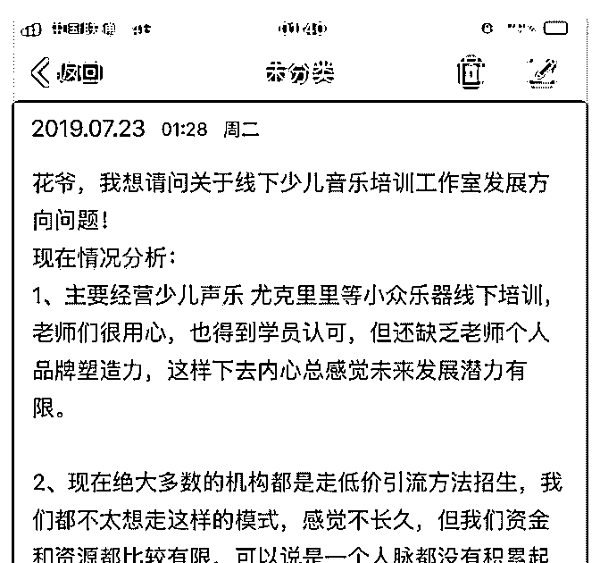
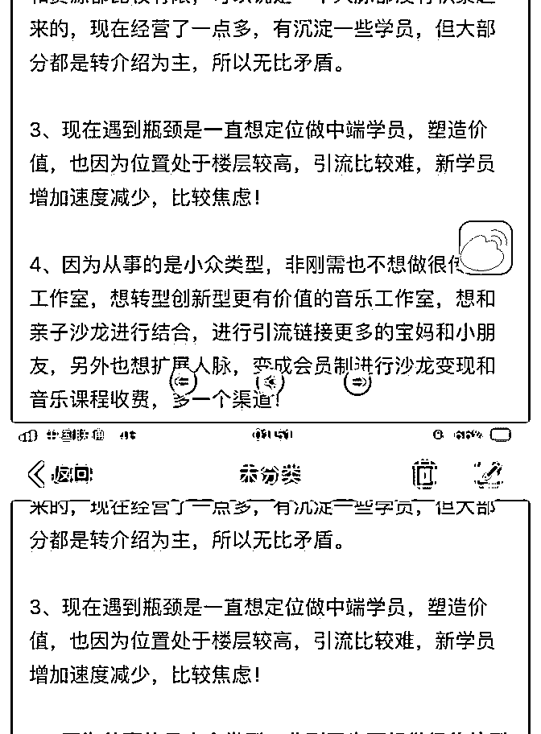
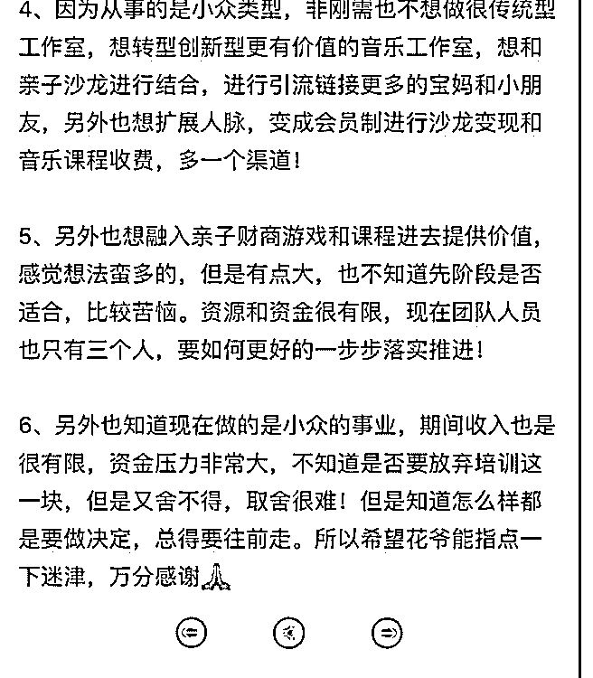

# 花爷，你好！我想请

(提问)匿名用户 : 花爷，你好！ 我想请问关于少儿音乐培训工作室发展方向问题！ 内容文字比较多，我用图片记录下来，麻烦你了！

2019-07-25

回答：1.希望老师们能做出个人品牌，要求有点高了，要么你

自己做出个人品牌，要么你们机构做出品牌，总之主要看

你，不能把希望寄托在其他人身上。 2.位置偏、公寓开店，

低价引流本身就是重要的方法之一，没啥好排斥的。你们知

道去做复购，是好事，但复购不代表不引流，复购和推荐入

学的比例就算再高也有个天花板。 最好早点接受这个现实，

对培训机构来说，招生本来就是工作的重心，指望纯靠复购

和推荐是不现实的。 我在另一个回答里，讲过完整的公寓美

甲店的引流、留存、复购方案，你可以借鉴一下： 3.做中端

学员，还是看市场有没有受众，以及你的中端产品能不能打

动受众。 地理位置和楼层确实会有影响，但不是决定性因

素。如果做中端课的话，建议试试你的低端学员能不能转化

购买中端课，如果不能，那大概率不是引流之类的问题，而

且课程本身没有吸引力。 4.亲子沙龙、财商培训啥的，大概

率还是你想的太多了，不要觉得什么流行就往里装。如果真

要试，先从现有学员里，发起一次活动试一试，看看有没有

响应，不要盲目转型。 其实你看你的问题，写了很多，但大

多数都是问题，你想这样，你想那样，问题一二三四五，而

关于你自己具体的情况介绍呢？只有开头介绍了一句做尤克

里里培训而已。 你在考虑未来发展的时候，也是一样，别总

有那么多想法，不如多花点时间想想，你有什么，你的经历

沉淀下来什么经验，如果只能选一件事去做，你觉得应该做

什么。 很多路都是能走通的，但你能走通的，一定是符合你

自身情况的那条路。 比如你最后问，是否要放弃，难以取

舍。你都没说这个机构是你全职还是投资？盈利情况怎么

样？如果不做这个，你准备做什么？ 如果盈利情况尚可，并 且没有明确未来方向，那肯定不要马上放弃。 多花时间看看 自己，把目前的局势一条条列出来，其实你自己心里有答 案，我从你的问题里感觉的到。(9 赞)

评论区：

麦可欧 : 几个问题的开放程度都很高，应该是一个至少已经发展到中小规模的机构才值得思考的。对于起步阶段的机构来

说，怎么实现营收平衡才是首要问题。 其次，感觉提的问题逻辑性都很差，或者说没有找到问题的根源在哪里。例如老师

的品牌塑造力不是培训机构从 0 到 1 的必要条件（招生能力才是）、又例如招中端学员和楼层有什么必然关系？又例如低价

引流的方法为何不能长久？（相反，流量越来越贵才是招生的痛点，一个懂得低成本裂变获客的人才现在市场价可能在

200K）

巧儿 coey : 这里是开放的，你也不了解实际情况，怎么提问都要被限制，最基本的尊重懂吗？

麦可欧 : 哈哈，你从哪个词看出了我的不尊重？相反，提问者与我毫无利益关系，我为何要不尊重？再次，我花了时间精

力去对提问者的问题做了思考并且回复，然后你妄自对我的回答扣了一个“不尊重”的帽子？算不算是对我的不尊重？这个

问题不再回复，你开心就好。

巧儿 coey : 搞清楚提问者是问你吗？哈哈～

关注公众号"懒人找资源"，星球资源一站式服务