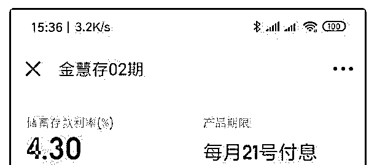
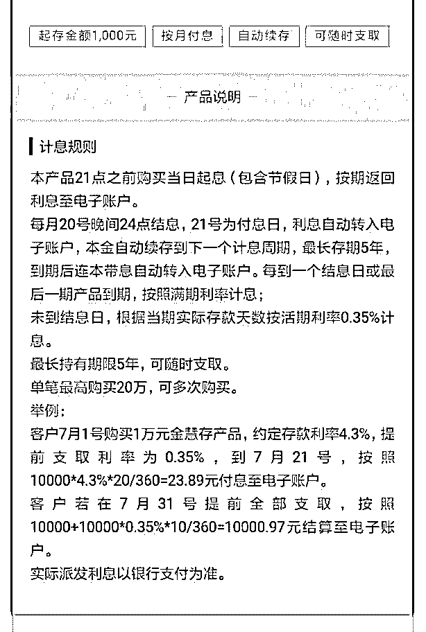
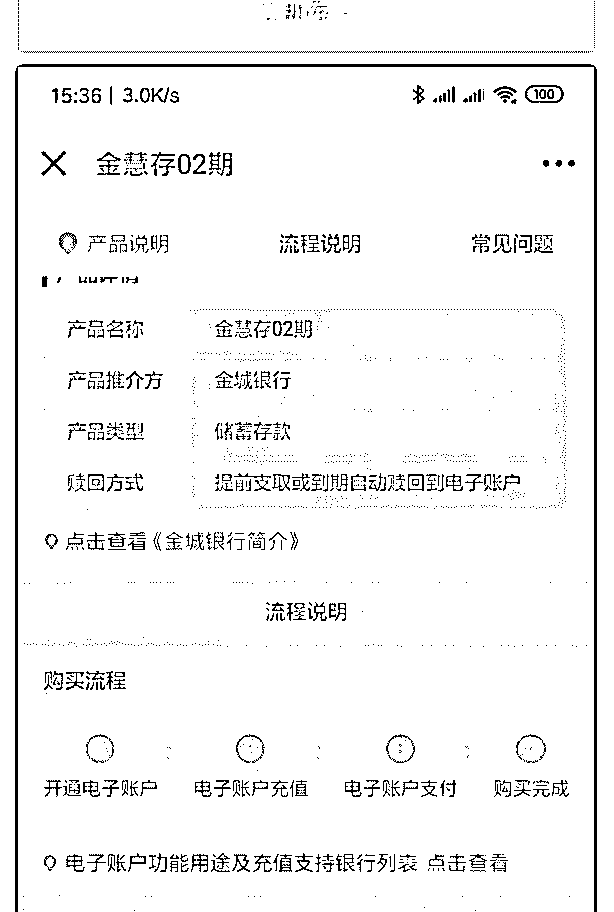
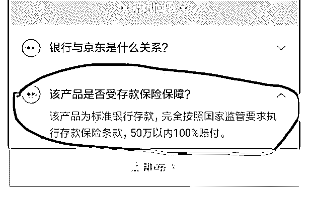

# 分享主题：适合理财

花爷梦呓换酒钱 : 分享主题：适合理财小白入门的快速扫盲科 普介绍

分享嘉宾：yy 分享正文：

大家晚上好，我是 yy，很高兴花爷给予这次分享的机会。先 做个自我介绍，老家河北，大学计算机专业，毕业后做过售 后，二手房地产经纪人，然后自学安卓开发，15 年来到了杭 州，于最近由于机缘巧合离职待业在家（不要羡慕，无工作 的日子其实没有大家想象的那样放松），提前开启了自由职 业生涯。到目前为止还没有取得什么成就，也没有特别擅长 的方面，由于对理财比较感兴趣，所以就理财入门这块做一 个简单对分享，群内有很多投资大佬，之前也有过这方面的 分享，若此次有什么不对的地方，敬请不吝指正。

首先需要明确一点，理财是长期的事，这就需要我们不断的 学习，提升认知，才能正确的找到适合自己的理财方式，就 比如如果能深切理解「天上不会掉馅饼」这句话，其实就能 避免很多理财当中的坑，普通人接触到的年化 10 个点以上的 理财方式，很多时候，多想一步就能避免掉进坑中。

「理财」有很多种理解，我比较倾向于认为是一种思维方 式。比如对什么时候开始理财的讨论，是没钱的时候就开始 还是等有一定资产了再开始，两种说法各有道理，如果单从 收益上看，当资金量过少时理财其实没什么意义，收益很少 很少，但如果把理财当作一种思维方式看待，就应当越早越 好，因为「提升自己」也是理财的一个方式，所以初入职场

最好的理财方式就是提升自己，包括对主业的精进，认知的 升级，圈子的提高等等，从收益上可以实现翻倍式的跨越增 长，这就是「投资自己」，这个过程中，如果再简单了解下 各种理财产品就再好不过了，花上一点点时间就可以。

金融层面理财是指的是对财务（财产和债务）进行管理，以 实现财务的保值、增值为目的。大部分人可以接触到的理财 方式是以下几种。

一、储蓄 储蓄可以简单的理解为把钱存银行。分为活期和定期。

（1）活期

就是自由存取，最方便，利率也最低，一般为 0.3% - 0.4%， 也就是说，一万元，活期放银行一年利息大概为 30 - 40 元， 基本是可以忽略的。近 10 年我国的通货膨胀率大概在 5% - 7%，也就是说收益低于这个数值的，连货币的贬值速度都跑 不赢，从这个方面也可以看出，活期利率多么低，存活期， 主要是为了资金使用方便。

（2）定期 可以简单理解为与银行约定资金存放一定时间，从而获取较

高收益。目前各银行一年期存款利率一般为 2% 左右，一万

元存满一年利息大概为 200 元，可以看出也是远低于贬值率

的，5 年期利率大概为 3.3% - 4% 左右，个别银行与互联网公

司合作通过 App 出售的定期有的能做到 4% - 5%，甚至 5%

以上。下面是京东金融上面的一个银行定期产品，支付宝上

面的银行定期现在只有一个，而且利率也不高。

（图 1，图 2）

可以看到，4.3% 利率，按月付息，自动续存，相比银行柜台 定期产品，优势很大。存定期一定要看下提前支取利息怎么 付的，有的是提起取按活期利率结算，有的是按时间段结 算，有的利息定期支付，有的最后本息一起付。

最后看第二张图片画框出，该产品为标准银行存款，符合国 家存款保险条款，就是说如果银行出问题不能赔付，50 万以 内的存款由存款保险基金 100 % 赔付，所以有个说法是把资 金分开存，每个银行最高存 50 万，就是根据保险条款来的。

我觉得只要是大银行就可以， 6 家大型国有商业银行（中国 工商银行、中国农业银行、中国银行、中国建设银行、中国 邮政储蓄银行、交通银行），12 家全国性股份制商业银行

（招商银行、浦发银行、中信银行、中国光大银行、华夏银 行、中国民生银行、广发银行、兴业银行、平安银行、恒丰 银行、浙商银行、渤海银行），如果这些银行有倒闭的，那 放其他银行结果也都差不多。

由此引申出一个银行理财产品的误区。银行销售的很多理财 产品都不是银行自己的，这点一定要认清，银行很多时候都 会帮助销售其他公司的理财产品，比如基金，信托，保险之 类的，而这些产品不乏高风险的，有些销售人员为了业绩会 故意回避当中的风险，所以从银行购买的理财产品不一定都 是安全的，购买之前一定要认真看介绍，仔细查看合同条 款，以及和自己签约的公司名称。

二、国债 国债就是国家向社会借钱，由于有政府信用担保，所以只要

政局稳定，一般认为是没有风险的。由国家财政部发行，从

债券形式看，我国发行的国债分为凭证式国债、储蓄式国债

和记账式国债。

（1）凭证式国债 用收款凭单作为债权证明，不可交易，从购买之日起计息，

到期后一次性还本付息，可以提前兑取，按实际持有天数和

相应利率档次计算利息，并且收取本金 0.2% 的手续费。利率

一般比银行同期利率高 1-2 个百分点，例如 2019 年第一期凭

证式国债期限 3 年，票面年利率 4%，第二期期限 5 年，票面

年利率 4.27%。可到承销机构网点直接用现金购买，并且可

以用未到期的国债从商业银行质押贷款。到期后需要自行到

网点兑付，逾期不加息。

（2）储蓄式国债 也称电子式国债，以电子方式记录债权，与凭证式国债基本

相同，不可交易，按年付息，提前赎回会扣除一定月份的利

息，并且要支付本金 0.1% 的手续费。购买前需要开通国债账

户，并指定对应的资金账户后方可从银行购买。到期后会自

动将本息转入资金账户，转入后的资金可作为普通银行卡活

期存款计息和使用。利率一般比银行同期利率高 1-2 个百分

点，例如 2019 年第九期储蓄国债期限 3 年，票面年利率

4%，第十期期限 5 年，票面年利率 4.27%。

（3）记账式国债 以电脑记账记录债权，通过证券交易所发行，可以进行流通

交易，购买前需要开通证券账户。利息一般按票面利率年付

或半年付，这些利息可以用来再投资，相当于复利计息。发

行时的票面价格和利率是确定的，但由于可以交易，所以价

格会随市场利率变化，对应的收益率是指以现在的价格买

入，持有到期的收益率，这其中就有了套利的机会。近期的

收益率，三年期为 2.91% 左右，五年期为 3.03% 左右。

综上，可以看到，国债更注重信用，利率其实相比银行定期 也就高一点点，个人认为，如果资金量少，可以从金融类 App 购买银行的定期理财，利率并不低，如果闲置资金量很 大，可以考虑购买储蓄式国债，可以网上认购，到期自动结 算，对于记账式国债，由于受市场利率影响，存在套利空 间，利率反而不如银行定期，一般是机构在做。

三、基金 上面的「储蓄」和「国债」基本可以认为是无风险的，而基

金，就有亏损的风险了，但收益相应也会高。

简单理解，基金就是投资人把钱交给专业的基金公司进行管 理。所有基金都有「净值」的概念，一般分为「单位净值」 和「累计净值」，所有基金刚刚发行时单位净值和累计净值 都是 1。

单位净值 = 基金总净资产 / 发行份额（粗略算法），可以简 单理解为当前基金的价格。

基金盈利后可以选择向投资者进行分红。比如某投资者投资 100 元以 1.0 元/份 的价格买入 100 份某基金，过了段时间， 该基金取得收益，单位净值增长到 1.2 元/份，该基金盈利 20%，然后决定分红 0.2 元/份，该投资者会收到 20 元分红， 然后该基金单位净值变为了 1.0 元/份，注意了，该基金等累计 净值依然是 1.2 元/份。

基金还可以按照一定比例进行拆分，一般是为了降低基金的 单位净值，吸引投资者买入。比如发行时的 1.0 元/份 的基 金，收益良好，单位净值到了 3.0 元/份，然后该基金就可以按

照 1:3 进行拆分，原先 1 份基金份额变为 3 份，基金总净资 产是不变的，所以基金单位净值变成了 1.0 元/份，但累计净值 则依然是 3.0 元/份。

现在大家明白了，单位净值是某个时间点基金的价格，而累 计净值反应的是基金成立以来所获得的回报，包括所有的历 史分红和拆分。

基金的购买渠道很多，比如银行、基金公司、证券交易所 等。基金的分类也很多，标准不同，分类也不同。比如根据 是否可赎回，分为开放式基金和封闭式基金，根据投资对象 不同，可以分为股票基金、债券基金等。下面简单介绍几个 常见的基金，感兴趣的可以自行深入了解。

（1）货币基金 把货币基金放第一位，是因为它比较特殊，市面上各种「宝

宝类」产品，比如余额宝等，本质都是货币基金。货币基金

主要投资短期借贷市场高信用产品，如国债、银行定期、银

行间的货币市场等等，具有高安全性、高流动性和稳定收益

的特点。虽然不保障本金安全，但由于其投资性质，实际当

中极少发生本金亏损但情况，所以货币基金也具有「准储

蓄」的特征。

货币基金比较特殊的是，它的单位净值永远是 1，按万份收益 每天计算利息，万份收益是指一万元当天能产生的收益，七 日年化指最近 7 天的平均年化收益率。

简单说下银行间的货币市场。银行也会有缺钱的时候，所以 会经常互相拆借，特点是资金量大，时间短，利率高，但是 不允许个人投资者进入，所以货币基金就吸收了民间的散 钱，然后以高利率借给银行，从而让个人投资者能够分享到

机构投资者的收益。当年余额宝利率 5、6 个点的时候，正是 银行极度缺钱的时候。反过来，站在银行角度想，货币基金 把本该存到银行的钱给无情的吸走了，然后再反过来以高利 率借给银行自己，你说银行是不是跟吃了个苍蝇一样呢？所 以余额宝才一直被限制，有段时间甚至还要抢购。但随着我 国经济下行，央行开始放了点水，银行不再那么缺钱，所以 余额宝收益一路下滑，目前七日年化才 2.3%

货币基金投资成本极低，一般都没有手续费和其他费用，且 免除分红税，收益每天计算，每日利息累加到本金当中，是 复利投资，而且赎回方便，非常适合短期资金投资。

（2）指数基金

「指数」经常用来反应某一类情况。比如反应空气质量的空 气质量指数，反应国民生活质量和幸福程度的国民幸福指数 等等。同样的，为了反应股票市场的整体情况，人为编制了 各类股票指数，比如沪深 300 指数，按照规模和流动性选择

了 300 家上市公司的股票，按照每个股票各自权重进行组合 计算得出的一个指数，业绩差的公司会被淘汰，然后加入业 绩好的公司，所以有个说法是「指数是不死的」。

「指数基金」可以简单理解为买入某一指数所包含的一部分 或全部股票，目的就是获取和指数相同的收益率，因为是被 动跟踪指数成分股，所以指数基金也可以叫做被动式基金。

「指数型 ETF 基金」是指数基金的一种，在证券交易所上市， 可以自由交易，所以又称为交易所交易基金。

「增强型指数基金」是指基金在被动跟踪指数的基础上进行 主动投资，以期望获取高于指数的收益率。

可以看出，指数基金的投资策略很简单，而且交易费用低 廉，很适合长期投资，长期看，指数基金可以战胜证券市场 70% 以上的资金收益，所以有种说法，指数基金是普通人最 适合长期投资的品种，我个人也认同这个说法。

（3）债券基金 是指专门投资债券的基金。债券是政府、金融机构、企业等

以一定利息向社会借款，发行给投资者的债务凭证。根据证

监会的分类，债券基金是基金资产 80% 以上投资于债券，所

以债券基金不仅仅投资债券，也可以投资股票或其他产品，

但由于绝大部分资金都是投资债券，所以债券基金风险相对

较低，收益也对应的较低。

（4）股票基金 是指投资于股票市场的基金，按照证监会的规定，股票仓位

不能低于 80%。股票买卖有很高的风险，那股票基金当然也

有很大的风险，所以相应收益也高。不建议新手投资。

（5）公募基金 以公开方式向社会募集资金，我们见到的绝大多数都是公募

基金。

（6）私募基金 以非公开方式向特定投资者募集资金，投资门槛 100 万元。

公募基金的基金经理不参与业绩分红，而私募基金经理是有

业绩分红的，这就导致有实力的基金经理一般都会去私募，

而且私募基金规模较小，管理层决策流程效率很高，所以私

募一般比公募收益要高，甚至高出不少。但有时候，风险也

会相应变高。

除了以上基金，还有很多其他基金，比如对冲基金，信托基 金，保险基金等等，基金广义是指为了某种目的而设立的具 有一定数量的资金。感兴趣的可以自己了解下。

四、P2P 即个人对个人的点对点网络借款，属于互联网金融的一种，

是国内新出现的理财方式，10、11 年才开始快速发展，经过

前期的野蛮生长，国家的监管也越来越严，到最后，竟演化

出了血淋淋的各种套路贷，而且这几年 P2P 暴雷潮频出，即

便是上市企业也无法幸免，所以，短期内绝对不要碰了，等

明朗之后可以选择头部的平台再试试水。

五、股票 股票是股份公司发行的所有权凭证。买了某个公司的股票，

就成为该公司的股东，可以获取公司盈利分红。公司上市就

是通过证券交易所把股票出售给投资者，例如某家公司成功

上市，以每股 10 元的价格向市场发行了 1 亿股股票，就会获

取 10 亿元资金用于自身发展，公司上市后就可以通过股票增

发、股份减持、股份抵押贷款等方式再次获得融资。

我国上市公司股票有很多分类，常见的有 A 股，B 股，H 股，一个公司可以发行多种股票，比如 A + B，同时发行 A 股 和 B 股，A + H，同时发行 A 股并在港交所上市发行 H 股。

A 股是大陆公司在大陆发行的普通股票，供大陆投资者以人 民币交易。

B 股是大陆公司在大陆发行的特种股票，以人民币标示价

格，但以外币认购和买卖，一般供港澳台投资者和国外投资 者交易。

H 股是大陆公司在香港交易所发行的股票，以港币标示价 格，以港币进行认购及交易，在港交所开户的投资者都可以 买卖。

还有几个特殊的分类，如新股上市第一天以字母「N」开头， 比如「N 招商」，当天除权的股票以「XD」开头，如「XD 招 商」，公司出现财务或其他状况异常的股票以「ST」开头， 意指被特别处理，警示投资者该股票存在风险，如果被加上

「*ST」，该股票就会有退市风险，通常来讲，股票退市后， 投资该股票的资金就会全部损失。

我们通常所说的股票一般指 A 股。公司上市后都会获取一个 六位数的股票代码，沪市 A 股股票代码以 600、601 或 603 开 头，如招商银行股票代码为 600036，中国平安股票代码为 601318。深市 A 股股票代码以 000、002、300 开头，其中

002 开头的为中小板股票，300 开头的为创业板股票。中小板 和创业板是为不符合主板上市要求的中小企业设立的板块， 其中创业板股票相较其他板块风险较大，所以新开通的证券 账户默认都没有开通创业板，一般需要到对应的证券营业厅 现场开通。

证券交易所可以简单理解为买卖证券（包括股票、基金、期 货等）的地方，目前我国只有四家证券交易所，分别是上海 证券交易所、深圳证券交易所、香港证券交易所和台湾证券 交易所，上海证券交易所也称为沪市、上交所，深圳证券交 易所也称为深市、深交所。

沪市最重要的指数是「上证指数」，也就是我们所说的大 盘，是把沪市的所有股票按不同权重处理计算后得出的指

数，也是反应整体股票市场的指数，经常听到的大盘 3000

点，6000 点，都是说的上证指数。

深市有三个重要指数，「深证成指」、「中小板指」、「创 业板指」，分别反应的深市主板、中小板和创业板整体情 况。与上证指数不同的是，深市这三个指数都是按照一定规 则选择部分成分股，然后按照不同权重处理计算得出的指 数。

此外，还有综合沪深两市制定的指数，如沪深 300，中证 500

等指数。

买卖股票需要到证券公司开通账户，一般通过证券类 App 就 能方便的开通，现在开户一般都是万 2.5 佣金，这是对应的证

券公司收取的，每次买入和卖出股票都会产生佣金，万 2.5 指

买卖一万元的股票需要交给证券公司 2.5 元手续费，但一般会

有最低 5 元的限制，所以实际佣金是 5 元。除了佣金，国税

局按卖出股票成交额的 0.1% 收取印花税，交易沪市股票时，

上交所会收取成交额的 0.002% 的过户费。

A 股股票交易时间为周一到周五的上午 9:30 - 11:30 和下午

13:00 - 15 : 00，其中，上午 9 : 15 - 9 : 25 为集合竞价时间，

以此确定股票当天的开盘价。周六日及国家法定节假日不开

盘。A 股股票每天涨跌幅均为 10%，其中，新股首日最高涨

幅为 44%，ST 类股票每天涨跌幅为 5%。A 股股票实行 T + 1

制度，就是说当天买入的股票，第二个交易日才能卖出。

股票打新是指申购新股，由于我国证券市场较特殊，新股上 市都会获取不菲的收益，翻倍很常见，但是中签率极低，所 以有人便同时使用多个证券账户申购。但是成熟市场，如美 股、港股，新股上市第一天有可能会破发，就是跌破发行 价，这点和 A 股有很大不同。

股票是典型的高风险高收益理财产品，所以一般不推荐给新 手。如果经常玩股票的，里面有一个「国债逆回购」，就是 你请求借出一笔钱，而融资方以国债抵押给交易所，到期后 支付给你本金和利息，由于有证券交易所担保，所以基本认 为是无风险的。国债逆回购利率时时变动，目前基本是 2.5 -

3.0 左右，比货币基金高，如果遇到缺钱的时候，比如春节之 前，利率有可能飙升到年化几十个点，一年总体下来，要比 买货币基金收益好，而且如果买一天期的，钱第二天就会到 账，不影响买股票，非常适合炒股人士。

六、期货、贵金属、外汇 比股票风险还要高，不推荐。而且这其中存在很多诈骗，一

般在网上看到的主动推广这些的，大部分都是骗子，比如把

你拉到一个微信群，群内每天都有人发赚钱的截图，还有烘

托气氛之类的，其实群里除了你一个人，其他都是拖，虽然

手段比较低级，但是被骗的还是大把大把的，而且即便报

案，损失的钱也很难拿回。

七、房地产 不可否认，房地产是过去二十年最好的投资途径。但根据当

前的国家政策及经济情况，我个人认为，刚需房随时可以

买，但如果是为了投资，起码目前不是合适的时候。

八、复利 理财当中一般是指获取的利息可以同样产生利息，时间越

长，财富增长越快。比如本金 10 万，年收益率 10%，10 年

后回报为 25.9 万，20 年后为 67.2 万，30 年后为 174 万，40

年后为 452 万，50 年后为 1174 万，越往后，越接近指数级

增长。

这里有一个很常见的误区，年化收益 10%，是指多年的平均 年化收益，而不是每年的年化收益都是 10%，这个一定要理 解，想要每年都取得 10% 的增长几乎是很难很难的，巴菲特 被喻为股神，但也有年化收益个位数的时候，甚至有个别年 份还是负值。所以我们如果想要长期保持稳定的收益，就不 能仅仅看一年，而是要以多年来规划，争取平均年化收益达 到预期。

复利也是一种思维方式，每天做一点可积累的事，虽然短期 内很难看出效果，但长期下来必定会收获巨大的价值。比如 每天锻炼十分钟，每天看书半小时等等。简单的小事长期做 下来也会有很大的收获。最后，给大家推荐两本理财入门书 籍，「小狗钱钱」和「穷爸爸富爸爸」。

以上就是本次的分享，由于个人能力不足，难免有错漏之 处，希望大家多多包涵，如果有哪里没有解释清楚，欢迎提 问。如果对理财感兴趣的也可以加我好友，私下详聊。再次 感谢大家！

2019-07-21(11 赞)

评论区：

Neal : 通俗易懂，资料详细。赞

碧海潮生 : 非常详细了

关注公众号"懒人找资源"，星球资源一站式服务