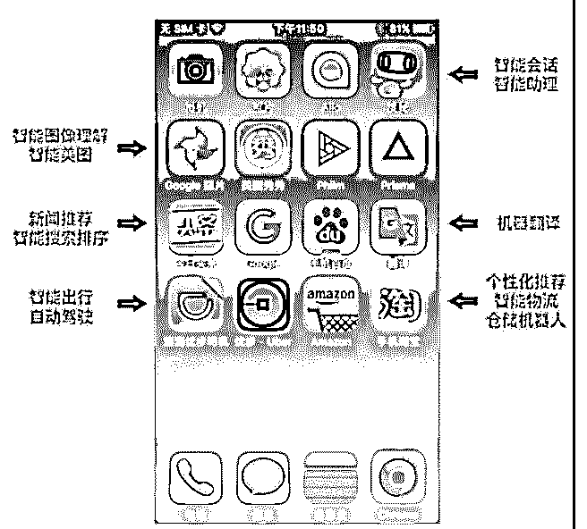

# 分享主题：人工智能

花爷梦呓换酒钱 : 分享主题：人工智能相关的科普以及它的应 用和发展

分享嘉宾：Yukint 分享背景：刚毕业的本科生一名，本科四年以二作身份与实

验室师兄合著数篇 SCI 收录论文，以一作身份成功发表人工智

能相关顶级会议论文一篇，今天想与大家分享的是我对人工

智能的一些不成熟的看法以及未来发展的趋势。

分享正文： 大家好，今天晚上给大家带来的分享是——“人工智能的兴起

与发展趋势”。我是今年刚刚毕业的本科生，虽然已签约算法

工程师一职，但由于实习期过短，对于工业界不敢说有多少

了解，因此今天准备以学生以及半个科研人员的角度为大家

简要分析一下人工智能这个领域的具体内容以及发展趋势。

希望能给大家带来一些启发。

首先先跟大家道个歉，因为我刚刚本科毕业，正巧分享的准 备时间与我的毕业旅行时间撞在了一起，所以最近这个礼拜 我一直都是晚上在宾馆附近的网吧里准备的材料，仓促之下 难免有所疏忽，如果各位对我的分享有不理解的地方或是对 我的意见有不同的看法，欢迎大家之后找我交流探讨，还请 各位大大多多谅解！

今天的分享目录如下： 一、 什么是人工智能

二、人工智能到底能做些什么

三、未来的发展趋势

一、 什么是人工智能 相信在座的各位大部分第一次近距离地与人工智能接触的时

候是在 2016 年的时候，阿尔法狗先后击败了世界围棋的巅峰

李世石和柯洁。随着阿尔法狗的不断胜利，有关人工智能的

热情和恐慌的情绪同时在全世界蔓延开来，也因此引发了一

波人工智能的宣传、研发以及投资的热潮。

但其实这一幕仔细想想来说似乎似曾相识？ 在 1962 年的时候计算机已经能完败世界顶级的西洋跳棋选

手、在 1997 年深蓝在六局棋的对抗系列赛中战胜卡斯帕罗夫

后，几乎全世界的人都在讨论深蓝的强大与可怕，几乎所有

人都认为深蓝就是人工智能的代表，甚至有很多人坚信，在

深蓝巨大的黑色机箱内拥有一颗在棋类博弈领域不属于人类

的特殊“大脑”。

但之后的事情或许大家已经知晓了，在人类的半导体技术不 断地发展的同时，国际象棋、中国象棋已经被计算机玩的滚 瓜烂熟，连一部手机、一部平板上的想起程序都能与人类高 手分庭抗礼的时候，公众立刻开始怀疑这种博弈程序是否还 算得上是人工智能，至少现今的我们不会对区区一个手机上 的下棋软件大惊小怪，称其为人工智能了吧？

今天，没有人怀疑 AlphaGo 的核心算法是人工智能，但想一想 曾经的西洋跳棋以及国际象棋，当时的人们不也一样对这些 战胜了人类世界冠军的程序敬若神明吗？再过几年，当任何 一个普通的围棋程序都可以轻松战胜职业棋手、当所有围棋 比赛都要严查手机作弊的时候，我们是否还会像今天一样将 区区一个围棋程序视为人工智能的代表？实际上从某种意义 上来说，AlphaGo 与当年的深蓝并没有什么本质上的区别，尽 管围棋比象棋复杂了 10¹²² 倍，它仍是对这样一个有穷的状 态进行了一个暴力的穷举。在计算力暴涨的今天，通过更巧 妙的算法使得这个十多年前不可能完成的穷举变成了现实。

因此实际上业界更愿意将目前我们广泛认为的人工智能称之 为“机器学习”。这里给出机器学习这门学科创立时所做出的 定义：机器学习是用数据或以往的经验，以此优化计算机程 序的性能标准。从此我们可以看出，机器学习只不过是一个 可以让计算机程序跑的更快、更准确的算法而已，它并不具 有我们广泛意义上认为的智能。

这里给大家讲一个冷笑话吧：说我是搞人工智能的，其实不 是很确切，其实我只是在搞——机器视觉，指纹识别，人脸 识别，视网膜识别，虹膜识别，掌纹识别，专家系统，自动 规划，智能搜索，定理证明，博弈，自动程序设计，智能控 制，机器人学，语言和图像理解，遗传编程中的一个。

什么是真正的智能？我想目前还没有定论，而且我们对我们 自己的智能还没有足够的了解。不过我很认同瑞士认知科学 家 Jean Piaget 说的：只能是当你不知道如何做的时候你用的东 西。当你无法用你学到的东西或天赋去面对时，你所以用的 东西就是智能。如何去实现有智能的系统呢？可能有很多条 路，但我认为一条很重要的路是需要把载体考虑进去，做有 载体的智能，也就是机器人。

人工智能在现今看起来他似乎是很聪明了，但是从某些角度 上来说他依旧是一个“弱智”：它能在 0.1 秒之内分辨出你和你 家人的脸，但是它并不知道这个区别能够干什么。与其相对 应来说，我们人却可以想出这个区别可以被应用到的无数个 场景：比如说制作不同口味的冷饮，推荐不同的书籍、影 音、甚至是你未来的伴侣。

二、人工智能到底能做些什么 就像我前面开的那个冷笑话那样所说的，现在的人工智能其

实都只是专有人工智能，它只能完成某一个由程序员写完的

固定的功能而已。所以小助手昨天在朋友圈提问就可以被回

答了：小爱同学的“人工智能”主要是体现在了语音识别上，

他可以在大部分情况下可以很轻易的识别出吐字清晰的你说

了什么，然后接下来的他的回答可以说基本都是由负责编写

小爱同学的程序员叔叔们辛勤的一条一条的用代码固定住

的：比如说天气如何；比如说行车路线；甚至于背诵古诗、

宋词。所以其实小助手的问题非常好解决，如何让你的小爱

同学不再听不懂你的话了呢，就是好好的学习如何去敲代

码，进入小米研发，把你能想到的问题以及回答提交到小爱

同学的数据库里，这样下次你问它的时候它就不会装傻啦~

AI 有大致几个方向：计算机视觉（无人驾驶，人脸识别）， 自然语言处理（谷歌翻译，新闻生成），语音处理（语音转 换为文字），推荐算法（淘宝的猜你喜欢），量化交易（自 动买卖股票等金融产品）。

（图 1） 如图所示是一个智能手机里比较常用的一些软件中可能会用

到的人工智能技术。其实这些技术早就在很久以前不知不觉

中渗透入了我们的生活之中。只不过最近因为人工智能的火

爆又重新出现在我们的眼前了而已。就比如我们日常最长遇 见的推荐算法，其算法本质的核心就是我们在中学阶段学到 的向量的余弦定理，当两个向量的夹角一定小的时候，我们 就可以认为这两个人物画像具有相当大的相似度，因此便予 以推荐了。正我上文提到的，机器学习的算法只是加快了这 个程序的运行过程以及提高了它的精度，所以我们才会觉得 现在的推荐系统是越来越准、越来越符合你的心意了。

这里要给大家辟一个谣，总是能看到很多人说自己和朋友的 谈话被监听了，因此才可能你前面刚跟家人朋友说完某样东 西，没过多久淘宝或者百度就立马给你推荐了。这样的操作 技术层面上来说的确是可行的，我们这里暂且不去讨论这些 互联网公司是否真的有这样的职业操守去保证你的隐私不被 滥用，但是从资本角度来说是非常不合算的，不论是人工辨 别你的录音里说了什么、还是去追踪你的不同账号、再精准 地去投放广告，其所付出的人力物力与最后这些公司所能收 到的广告费是完全不成正比的，因此大家完全不用担心你的 隐私被窃听了。这其实就是大数据+AI 之下所能产生的必然的 结果，有太多和你相似的人做了这个搜索，因此他就会顺理 成章地把这个产品以广告的形式推荐给你。在这个过程中， 公司甚至可以完全不用知道你究竟在这段时间里搜索了什 么、购买了什么就可以完成推荐。

一些大家耳熟能详的 AI 的应用我就不在这里一一例举了，在 这个部分的最后我想和大家介绍一点我所了解的行业的一些 前沿动态，说不定这些应用场景可以给在座的各位一些启 发。

比如说某房地产企业的人工智能实验室目前正在研发的 AI 相 关的产品是自动海报设计：由一张初始的设计好的海报自动 生成尺寸不一样的同种风格的尺寸以适应不同的场合。还有 室内装修设计：根据几种预设的风格自动生成室内装修的

2D/3D 图纸、以及室外的楼宇排布设计。

再比如说金融行业的股票预测，据我所知学术界的比较精确 的预测模型在测试集下已经能跑出 76%的精确度了。等等。

还有前段时间风头正盛的某手机厂商的 50 倍变焦就是硬件设 备和超分辨率重建算法结合的原理，再比如它的翻折自动识 别手机大小屏，自动识别手机正反面那一面亮屏等等其实都 有人工智能应用在其中。

三、未来的发展趋势 让我们仔细想一下：机器的出现造成的是一些重体力劳动人

群的失业、计算机的出现则是让一些反复的、繁杂的计算不

再成为困扰我们的问题，其实他们都只是完成了一些一直在

重复的、枯燥乏味的生产活动，而人工智能则只是加快了这

个替代的过程而已，比如电子收费站、比如自动驾驶。

我认为马化腾先生所说的中国移动互联网的下半场：产业互 联网就与人工智能息息相关。人工智能将会逐渐的伴随着互 联网下沉到各行各业中去，为它们带来新的活力以及盈利模 式。

比如前段时间花爷提到的垃圾分类，再比如新零售，再比如 自动泊车。

刚刚突然想到了一个案例不知道有没有已经被实施：比如可 以在线上点单的二维火，可以根据不同人的喜好自动调整菜 单的首页推荐。

综上所述，人工智能依旧是一门确定性极强的学科，更广义 的来说，我们更可以把它当作是大数据时代产生的必然产

物，我们可以很轻易的将一些较为模糊的过程通过代码来实 现，但它得到的结果一定是确切的，

现今被各大公司高薪抢聘的算法工程师，实际上解释出来并 没有那么高大上，大部分人都是戏称自己为调参工程师。因 为任务的输入和目标是固定的，我们所需要做的就是寻找到 一个比较更好的参数使得代码运行的结果更为精确而已。

正如李开复说的那样：与其说 AI 会替代新闻工作者，不如说 它将为新闻工作者赋能。其实这个对于所有职业来说都是一 样的。

因此我认为在座的大部分人其实都不必产生自己会失业的焦 虑，只要各位的职业不仅仅是一味的机械性的反复练习就可 以完成的工作，就基本可以断言在一段时间内不仅人工智能 的兴起不会让你失业，反而它还能给你们工作带来许多便 利。至于它能为大家带来什么样的助力就要依靠大家自己的 经验与智慧了～

谢谢大家，我今天的分享做完了，我的晚饭还在等着我呢

。我本身经历较浅，大家可能也没有什么好提问的，不过大

家如果有什么问题的话我一定会做到有问必答的。

2019-07-21(5 赞)

关注公众号"懒人找资源"，星球资源一站式服务