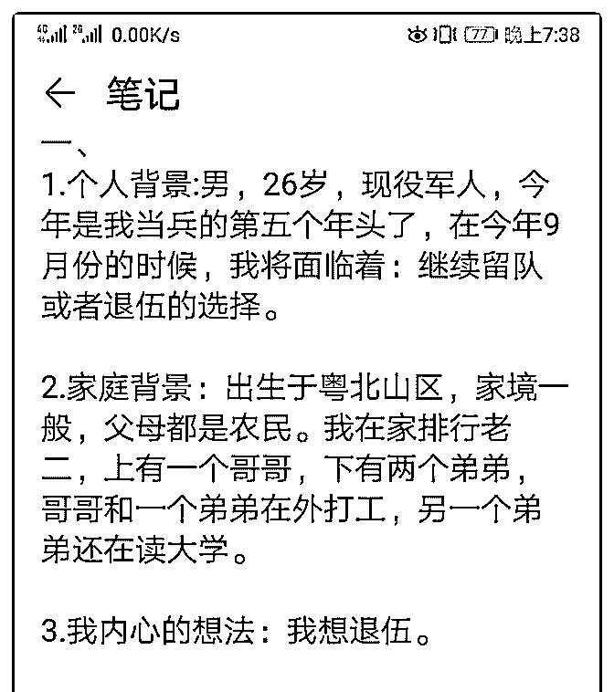
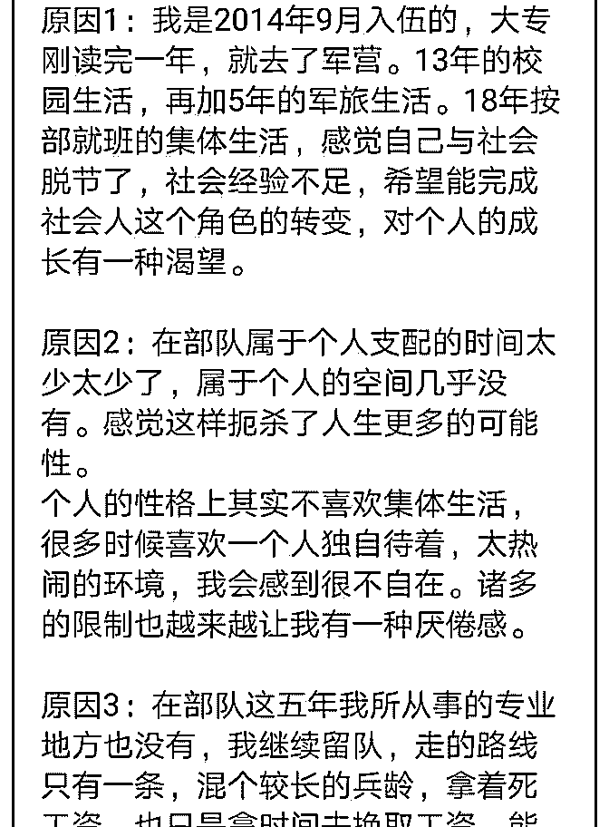
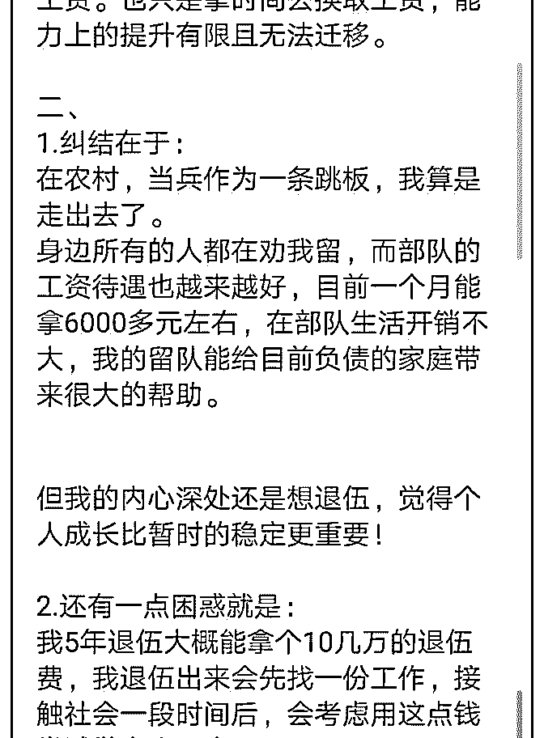
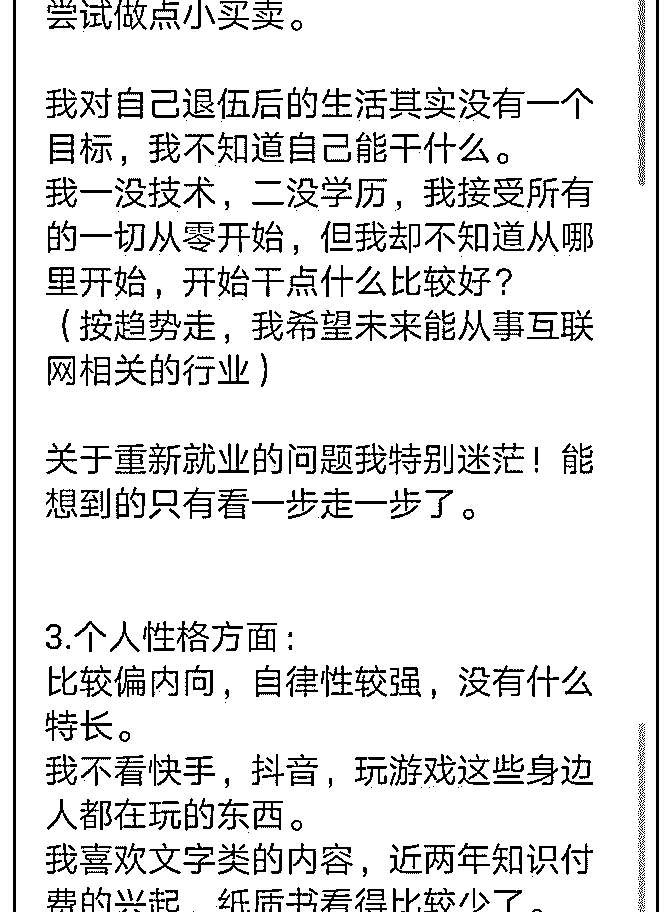

# 花爷您好，我面临着

(提问)匿名用户 : 花爷您好，我面临着一个选择，想听听您的 看法，万分感谢！

抱歉字数超了，截了张图

2019-07-18

回答：问题很详细，特别好。我今天在公众号刚推了一篇文

章，，主要说了铁饭碗的两个限制： 1.越是靠关系才能进的

单位，后续的职场发展，就越看重关系。 在铁饭碗的单位里

钻营这件事，一看爸妈，二看天赋，三看机遇，都不是说我

熬夜努力就能修炼的本领。 我有个朋友是警官学校的，毕业

就是排长（也可能是班长？记不清了），家里找人分配的军

区也很好，这种你怎么比？真的不好比，得人。 2.如果我们

把社会想象成一张大网，大网上纵横交错，形成无数个节

点。能积累财富的人，一定是链接到更多节点的人。 而铁饭

碗的工作体系里，四面的铜墙铁壁确实挡住了外面想和你抢

饭吃的人，但同样也切断了你和外界社会节点的接触，压缩

了未来的可能性。 所以你想退伍，不想一成不变，没毛病，

花爷支持。 但怎么个退法，需要琢磨。 你的问题，和另一个

花友的问题很像（），你们都因为环境原因，和大的商业社

会环境脱节了。 我的建议还是一样，主动去交朋友，扩大社

交圈子，学会发现身边的商机，最好是还在部队的时候就挤

时间做这件事。就跟买菜一样，你得先问一圈价格再决定，

别急着把退伍的费用砸进去。（同样的，后面星球里我会讲

怎么发现生活里的商机） 你说你想做互联网相关的行业，是

这样，互联网行业也分两个大类。 一种是腾讯阿里这种，平

台型的纯互联网，按你说的平常抖音快手游戏都不玩，这类

你是别想了。 还有一类，属于借助互联网做生意，比如淘宝

卖货，其实还是卖东西为主，互联网只是它提高效率的工

具，这种应该是你多关注的对象。 大多数情况你，你有了一

定的商业基础，把一线城市火过的模式搬到小城市再做一 遍，效果都不会太差。(15 赞)

评论区：

子羽兄 : 感觉这个提问者需要一个明确的梳理，目前他需要有人能引导一个方向，不然他还是很恐慌很迷茫

花爷梦呓换酒钱 : 对市场有了解、找到合适自己的方向、建立基础的商业认识，确实很复杂，不是一两句能说清的。后面

会系统的更新这块的内容，最终目标是出训练营，专门做这方面的培训。

王巍 : 骑驴找马！加油！

迷途未晚 : 共勉，战友

关注公众号"懒人找资源"，星球资源一站式服务