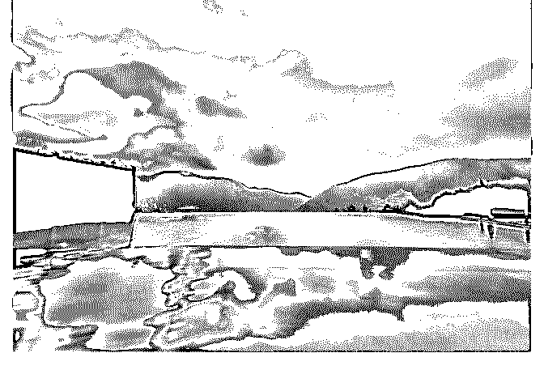

# 我这人吧，到哪都喜

花爷梦呓换酒钱 : 我这人吧，到哪都喜欢看跟钱相关的东西， 所以这次哪怕出去玩，也跟大家聊聊发现的几个有意思的商 机。

去日本的几点小发现：

1.民宿： 日本的酒店普遍很小，12 平左右，而且贵，东京大阪这种热

门城市，普遍 1000+一晚。

所以民宿生意就很火。 在日本做民宿生意的中国人很多，但这个市场不太透明（就

是游客人傻钱多），不同地区、不同装修的民宿，差价还蛮

大的。

用户越精明，商家就越依赖流量。于是 airbnb 这种民宿预订平 台的抽佣非常高，对顾客抽 6%-12%，对房东再抽 3%。

所以不少商家都想跳出平台，自己做流量。最直接的方法就 是做微博，做日本旅游的攻略，建立信任后民宿成交就顺水 推舟了，微信直接交易也会便宜不少。（我一直强调的，信 任货币就是钱）

微博做宣传的人设也五花八门，有的是主打美少女房东，民 宿基本都是网红风，不少女孩子会带摄影机去拍照；有的主 打真诚热情的房东形象，民宿的照片故意不做任何美化，你 看到什么样就是什么样，非常实在，然后也会在微博提供各

种热心服务。

我就特别吃后面这一套，整个体验下来确实很棒。 这个房东也非常聪明，和房东聊天，他说他是做医药的，不

少房客来了之后，直接成了他的代理商。我虽然没做代理，

但仍然留了微信，以后日本那边有什么渠道需要，可以联系

他去帮忙，算是打下一个资源节点。

你看，先做朋友，后做生意，难度就小很多。

2.交通： 同样的，日本交通也很贵。不光出租车贵（2 公里车费近 100

块人民币），新干线（相当于国内动车）也很贵，大概是国

内价格的四倍。

所以在日本，中国人的黑车生意就非常发达。一家四口的周 边游，你坐新干线的钱，可以直接包一辆车一个伺机（会中 文）跟着你跑一天，换成你你肯定也包车。

这些包车生意，主要通过飞猪等平台引流，需求非常大。 你看，哪里不方便，哪里就有生意。

3.迪士尼：

去迪士尼玩，在飞猪上提前订票，很多商家都不是及时出票 的，一定要等到你入园前 1-2 天才给你票。

后来在飞猪找了一圈，找到一家能及时出票的，问他原因， 他说：

那些只能提前 1-2 天出票的，大多是利用灰产漏洞、盗刷之类 的给你买的票，被坑的人来不及举报追查，你的票已经用完 了。

不知道真假，后面没有追查了。但当你不知道别人的商业模 式事，问他的竞争对手，往往能得到一点线索。

4.日本的互联网比中国真的差远了： 日本的移动支付非常差，只有大城市的大商场和便利店才能

刷卡，小城市和乡下都不太支持移动支付，不带现金是要饿

肚子的。

这在国内简直不敢相信，卖红薯的都支持微信和支付宝了。 如果你上过日本的铁路订票系统，你会发现做得比当初的

12306 第一版本还要烂 100 倍……

前阵子 711 好像做了一个专属的移动支付，然后……被盗刷了 很多钱……停掉了……

5.之前在星球里说，我一年的个人花销很少，这是实话，我是 真不爱买东西。能吃个榴莲对我来说就是顶级的日常消费 了。

包括出去玩，我都是住民宿追求性价比。 但偶尔也会享受一下，这次去泡温泉，住了两晚高档酒店，

一晚差不多要四千……只能安慰自己，偶尔体会一下有钱真

好的感觉，才能激发更大的赚钱热情……

（配图是酒店官方图，温泉是全裸泡的不给拍照）

2019-07-18(27 赞)

评论区：

西装暴徒 : 善于各种观察

亿枫 : 勾起了自己之前在葡萄牙西班牙伊朗的一个月流浪住不同类型民宿的回忆~一步不小心，回成都弄一个[骷髅]

恋空 : 花爷的分析真厉害，超有远见，垃圾分类的儿童玩具，淘宝已经大卖了，成本 1688，十几块，利润好几倍，[捂脸]没

有母婴类目的天猫店，享受不到，有母婴类目商家的可以搞起

白一喵 : 一年去 10 次日本的妖怪来补两句。关于 1 和 4。 1.民宿：看起来不错，一般人还是别玩了，有政策门槛。详情 你来

科普吧 最近看到中国人爱玩的，是在日本买整栋楼，改造成 hotel 去经营。别的城市不好说，在东京，只要位置 ok，回报不

差的 4.移动互联网使用：是习惯落后，不是技术落后，千万别有朋友抱着“带着中国先进经验去拯救岛国人民”的心去做项

目哈。会扑街的。 非要做的话，请先去理解日本人和文化，了解一下一个技术先进的国家、对技术应用这么保守的原因，

再下判断

范米索 : 在日本生活过一年多，开过奶茶店，搞过不动产，接触过不少日本 IT 创业公司的中高层，简单说几句： 1.关于民

宿：民宿有门槛，要投资做民宿生意的，了解下民宿经营许可证，现在都在打擦边球，去年民宿法出台后日本专门成立搜

查组就是查各种违规民宿，而且民宿经营许可你办下来了根据民宿法一年只有 180 天，基本没得玩。那大家怎么做民宿呢？

有的就干脆投资一栋楼，把楼里房间分开打包卖，买四套送投资经营签给你注册公司，有的就是独立的小楼带经营许可证

的那种，还有的买一户建，走微信客源和旅行社联合，为啥呢？因为没许可证你上了 booking airbnb 倒霉的就是你，被抓的

就是你。 而且拿公寓做民宿，第一，公寓有管理员，管理员会盯着，如果老发现陌生人进出一定会查你，第二，你有邻

居，邻居会举报。你想做这生意，难。 但民宿投资不是不可以，我有写过很详细的文章，真想了解可以找我要。 2.再说说

日本的互联网公司，说实话渋谷是小硅谷，里面有大量互联网创业公司，另外日本互联网是比中国落后，但现在我 Line 工

作的程序员朋友都要去考一个国际的产品经理资格证，这说明什么？至少中国我没看到产品经理是需要考资格证就能被认

可的。当然也许人家国家有自己的规矩，只是我想说，别小看落后的日本。 另外，还有个情报是我见过日本一些互联网公

司做的小而美，但是商业模式是相当不错的，至少国内还没有，也跟国情有关，关于支付部分是因为日本人很注重隐私安

全，连身份证普及人家都不愿意，不过 line 貌似已经在开通支付功能了，有商家优惠券之类的一些入口。总之，如果真的想

了解还是需要去深入生活的。

花爷梦呓换酒钱 : 民宿可以理解，互联网这个就……日本有很多程序员大神，不是技术不行，但是互联网从体量到渗透度

都差很多，我更倾向于归因为日本的项目制运作方式不够灵活……

范米索 : 是的其实日本现在也在模仿美国，不说比较老的企业，体制已经钉死了，但新生代互联网公司里头不少都是硅谷

挖来的外籍大神，相对还是可以的。然而日本人对于很多需求没有中国那么大，所以有些商业模式就肯定跑不通，每个国

家都有自己的特色，包括外卖也是，日本有外卖网站，但用的人不多，因为人力成本太高了，太贵了。中国廉价劳动力多

需求也大，所以完全没问题。不过互联网要赶超中国还是比较费劲的，影响因素比较多

关注公众号"懒人找资源"，星球资源一站式服务