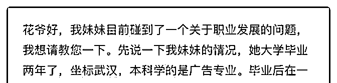
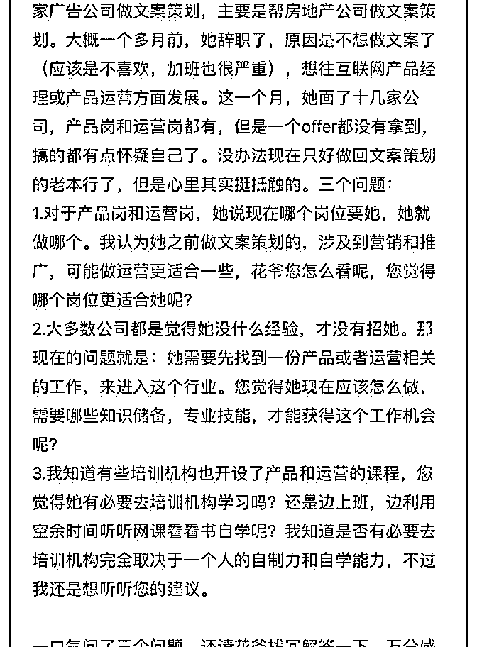

# 花爷好，提问字数超

(提问)xiaoda : 花爷好，提问字数超过限定字数了，所以我把 问题截图下来了，麻烦您耐心看看，感谢！

2019-07-17

回答：背景介绍的很详细，我就直说了： 1.适合运营岗，准

入门槛更低，加上有部分文案背景，成功率更高。现在产品

岗竞争比以前更激烈了。 2.产品和运营，都是经验比知识储

备更重要的职业。你看过十本书、上过多少课，没有做成一

个项目有效果。 这是坏事，也是好事。 坏事是，对非应届生

来说，没有经验几乎是不可逆转的劣势。好事是，你只要做

出点经验、成绩，学历、背景啥的就不重要了。 最好的方

法，是她现在的文案策划工作，能够跟未来的岗位（比如新

媒体运营）多一些重合的技能点，另外去自学一些运营岗的

课程，要带实操作业的那种，然后自己持续用业余时间运

营，做出一点成绩——至少把技能磨练成熟。 这种方法，半

年到一年后，进中小公司的基础岗是有希望的。 3.那种帮助

传统行业转行的培训呢，属于不得已而为之。我在 2 里说的方

法，不是每个人都能坚持下来的，有的人没耐力，有的人不

会自学，最后可能都放弃了。 这种时候，考虑转行培训是可

以的。但就像昨天我在这个回答里说的（），转行培训只是

起点，别觉得一个月多赚了几千块钱就完事了，在互联网行

业，外围基层会被新的廉价劳动力淘汰的。 对了，最后多说

一句，无论任何情况，不要裸辞不要裸辞不要裸辞。(8 赞)

评论区：

xiaoda : 感谢花爷详细的解答。

关注公众号"懒人找资源"，星球资源一站式服务