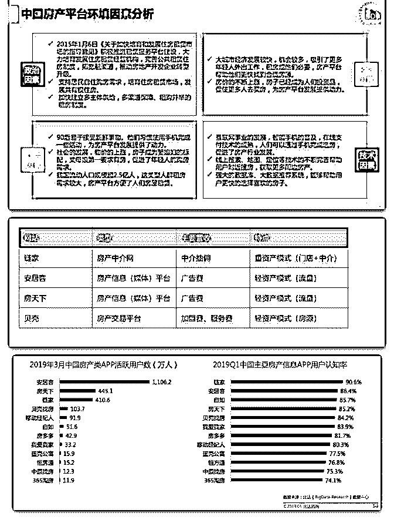
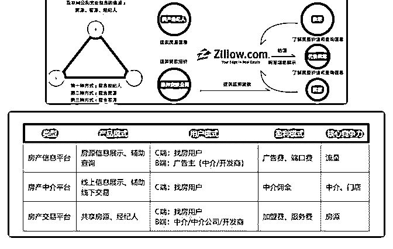

# 分享主题：房地产平

花爷梦呓换酒钱 : 分享主题：房地产平台的商业模式简介 分享嘉宾：登荣

分享正文：

大家晚上好，今天给大家带来的分享是<房地产平台的商业模 式简介>。

我自己目前负责台湾最大的房地产平台的产品运营工作，在 这一细分领域 4 年的经验，也有对房地产平台有一定的接触。

由于房地产关系链非常复杂，我今天只是简单给大家介绍一 些常见平台的运转模式。

没有深入的讲解到的部分，有兴趣的小伙伴后续也可以私 我，我们再一起探讨。

今天分享的内容目录如下： 目录 一、房地产+互联网基本介绍

二、国内常见房地产网站的商业模式 三、国外著名房地产网站的商业模式 四、中国台湾房地产网站的现状

五、总结与分享

一、房地产+互联网基本介绍 在互联网高度发展的今天，相信更大细分领域都有非常强大

的互联网渗入。但是有一个细分领域，至今还无法通过线上

完成全流程，那就是房地产。是什么原因让互联网在房地产

领域的渗透遇到的难题呢？

1、房地产交易常重线下 从看房、买房、交易、手续、贷款等等流程多数在线下完

成。与普通消费不同，房屋交易是一生中非常重大的决定，

涉及资金庞大。其过程更为慎重，许多线下的环节是相对不

容易搬到线上的。

2、房地产受多重因素影响 房地产本身受到政策、市场、环境等等因素影响。而房地产

平台也非常容易同样遭受影响。如下面这张图（图片来自比

达咨询：2019Q1 房产平台报告）

（图 1）

（1）房价下跌，房产中介模式的网站营收就减少。

（2）地价上涨，开发者利润减少，媒体类房地产平台营收对 应减少。

（3）交易量减少，房地产信息平台、房产中介网站的营收都 会受到影响。

3、行业门槛及成本较高 房地产市场本身门槛非常高，房地产平台的投入也比其他领

域高一些。其中成本稍低的是房地产信息平台，但是房源信

息的获取也不是一件容易的事情。而房产中介网多是传统中

介转型，想要从互联网做起，在渗透到房产中介几乎是不可

能。也因为其较高的门槛，互联网化的道路相对崎岖。

二、国内房地产网站商业模式 国内常见的房地产平台商业模式，主要分为三种类型： 房产中介网、房地产信息平台、房地产交易平台。 这是我们平时熟悉的几款产品的类型、营收方式以及特点：

（图 2）

再看看比达咨询的数据报告，安居客和房天下的活跃用户数 高居前两位，因为他们是房地产信息（媒体）平台。必须依 托流量变现的方式盈利，那么他们的推广模式也是同样如此 有针对性的获取流量。

（图 3） 简单给大家介绍几个具有代表性的产品，由于篇幅关系，仅

做商业逻辑方面的简介。

1、链家：房地产中介网站

链家是垂直房产中介领域的 O2O 公司，其本质并不是房地产 平台，而是房产中介网。其网站主要服务于中介，整个商业 模式仍是以配合线下中介成交抽佣的方式。所以链家网是服 务于线下的信息平台，网站本身并不能产生大量利润。

2、贝壳：左老板的平台计划 贝壳是左晖左手倒右手的游戏。表面上看左晖在链家的股份

较为稀疏，利用链家的资源倒腾个贝壳，自己做大股东爽一

下。但是贝壳具有更为重大的意义，突破链家的传统中介模

式，成为真正意义上的房地产交易平台。

左晖一直想效仿国外的 MLS 共享房源系统——房源信息共享 给所有入会的中介，任意一位中介成功销售后，从佣金中抽 取部分给发布者和平台方。

简单的说 MLS 共享房源就是，平台方放出房源（部分中介提 供），平台加盟所有中介都可以公平竞争进行销售。所销售 出去的佣金 6%，分成给销售中介/平台/提供房源的中介。

总之，贝壳是想效仿 MLS 开创的房地产平台，房源不再由链 家独家销售，而是加盟的中介均可销售。平台以抽取部分管 理费（入会费）作为其盈利模式。当然自家的链家经纪人是 最大的客户。但是贝壳不依附于重资产模式的经纪人（不需 要养中介，支付门店成本），而转为轻资产模式的纯互联网 平台，是一大突破。

3、房天下：媒体到中介平台的转型 相比于链家，房天下（搜房网）的发展之路命途多舛。

原本是媒体平台，定位是房地产信息平台，这么注定其盈利 方式是通过信息获取流量，再通过广告变现。盈利模式单 一，容易遇到流量瓶颈。看着各大中介网站赚得盆满钵满， 房天下羡慕得很。

毕竟 2015、2016 年，房价飞涨，成交量大增。中介利润大幅 提升。房地产市场火热朝天，但也许因为不愁卖，广告增量 却没有很大。所以终于按奈不住的搜房网转型房地产中介平 台，进军二手房交易，开始铺设线下门店。尝试在交易抽佣 中也分一杯羹。然而其低佣金的（0.5%）的急速扩张扰乱了 原有的中介市场。导致地产中介联合起来抵制房天下，全面 封杀。

2017 年房天下正式宣布转型失败，回归开放平台策略。放弃 自营门店，转为加盟的模式。加盟模式下，房天下为加盟店 提供品牌授权、技术平台、客源房源流量支持和培训等，但 不负责具体运营，管控较弱。本质上回归最初的房地产信息 媒体平台。主要营收仍是广告收入，除此之外，从加盟店获 得三部分收入：一是品牌授权费；二是佣金提成，约为门店 收入的 3%；三是线索导流费，类似于房源发布业务。

三、国外著名房地产网站的商业模式 1、zillow：从估价起家到房产平台 ziilow 做估价起家，通过不断的收购兼并成为美国最大的房地

产信息平台。目前 Zillow 已经建立了全美最权威的房屋信息数

据库，为消费者在房屋买卖、租赁、借贷、装修等各个相关

环节提供以信息和数据为主的产品与服务。

根据 zillow2018 年年报所示，其 7 成以上收入来自于仲介付费 广告，所以其本质仍然是房地产媒体信息平台。同时 ziilow 发

挥其核心竞争力的估价能力，也介入房贷贷款业务，提供抵 押估价服务。

（图 4）

2018 年 4 月，ziilow 宣布商业转型，从房地产信息平台转型为 交易平台，全面切入房地产买卖市场。（与房天下转型类 似）。宣布的第二天 zillow 股价大跌，表明投资者并不看好信 息平台介入重资产的买卖市场，风险成本过高。

下面到我最熟悉的环节了，讲自己参与的产品。 四、中国台湾房地产的现状 由于台湾土地为私有制，土地可以私人之间买卖。因此房屋

交易更偏线下，重人脉关系。传统中介在台湾是比较吃香

的，互联网化就尤为困难。

但是幸运的是，由于台湾最大的两家中介公司“信义房 屋”和“永庆房屋”都未形成寡头。由于中介之间的的竞争及各 自有主攻的城市，所以缺乏一家汇聚全台房产信息的网站。

就在这个背景之下，台湾最大的房地产信息平台 —— 591 房 屋交易网诞生。虽然名为房屋交易网，但其本质仍是房屋信 息平台。而切入点正是上面所说的，房产中介公司无法形成 垄断，只能覆盖部分城市。因此覆盖全台房屋信息就变得尤 为重要。因此 591 房屋交易网迅速成为台湾最大的房地产平 台，虽然无法与中介抗衡，但是年净利润也过亿。作为房地 产信息平台，盈利模式也是显而易见的广告费。

面对房产中介的丰厚利润，591 也尝试转型房屋交易平台，切 入房产中介，不出意外的以失败告终。在台湾如此传统的房

屋交易方式，是很难脱离传统中介存在的。传统中介公司有 百年历史，依靠其人脉关系得以发展。新生品牌几乎无法立 足，所以中介公司越老越吃香。

同时台湾房地产极其不透明也给很多以信息收集整合为主的 网站带来商机。例如网罗所有中介房源的网站（实质为侵权 抓取）有许多用户愿意付费使用。整理各城市政府公示的信 息的网站，同样也有用户愿意付费。非常多小众的信息收集 和整理平台，都能获取不错的小利润。

在台湾房屋交易价格是个非常隐秘的事情，买房是需要讨价 还价的。买卖多少钱需要看“砍价”能力或者人情关系。能说 会道就有机会和卖家谈个好价钱，不懂行的人经常被坑。而 政府公布的成交记录又是鸡肋（不公开地址），其中的价格 差利润空间巨大。因此也有灰色产业链，在此就不展开说 了。

最后，我来稍微总结一下。 五、总结与分享 1、房地产平台的商业模式 三种类型的房地产品商业模式表如下：

（图 5）

2、房地产与互联网的关系 互联网的多为辅助角色，主要辅助的环节在于看房阶段，也

就是线上看房。例如 VR 看房、实景看房，海量真房源等等，

其本质都是辅助用户在线上看房，但是用户难道在线上看完

房子就敢决定买不买吗？答案是否定的，这么大笔资金的买 卖，不去实地看，谁敢轻易决定呢。

即便是租房，网上选好之后也一定会去看房的，毕竟不是一 件普通商品。所以线上的部分更多是房源信息的展示，主要 解决信息差的问题。当进入后续环节，看房、下定、交易、 手续等等后续环节均无法脱离线下完成。

3、房地产平台最好的商业模式 用互联网的思想，一定是希望边际成本尽量的低，那么中介

模式首先排除。

在整个房地产环节中，产生利润最高的一定是房屋交易环 节，因此从中能分一杯羹，营收规模能放大许多。因此就会 产生，想和中介一样抽点佣金，又不想养着高成本的中介和 门店。那么 MLS 共享房源的方式，确实是最好的选择。

4、MLS 共享房源系统 优点：轻资产，强互联网模式，不需要经营门店和中介，坐

享平台分成。

缺点：房源是核心竞争力，与品牌中介是竞争关系 难点：若大部分房源掌握在少数传统中介手中，难以实现房

源共享。

本次分享到这里就结束咯，大家若是对房地产平台感兴趣， 欢迎私我交流，谢谢大家。

2019-07-14(11 赞)

关注公众号"懒人找资源"，星球资源一站式服务