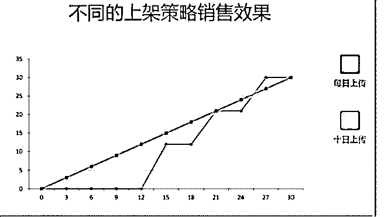
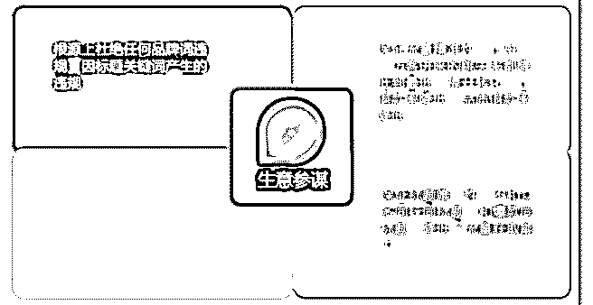
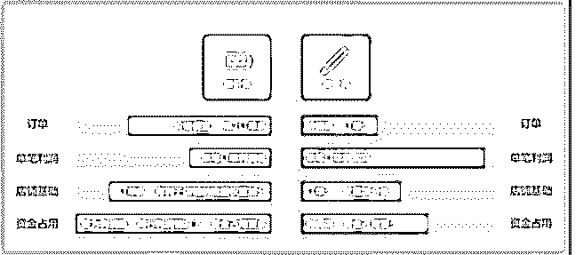
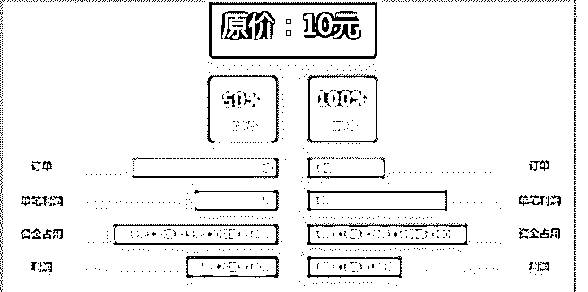
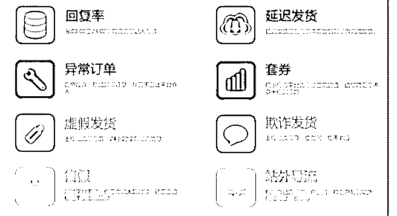
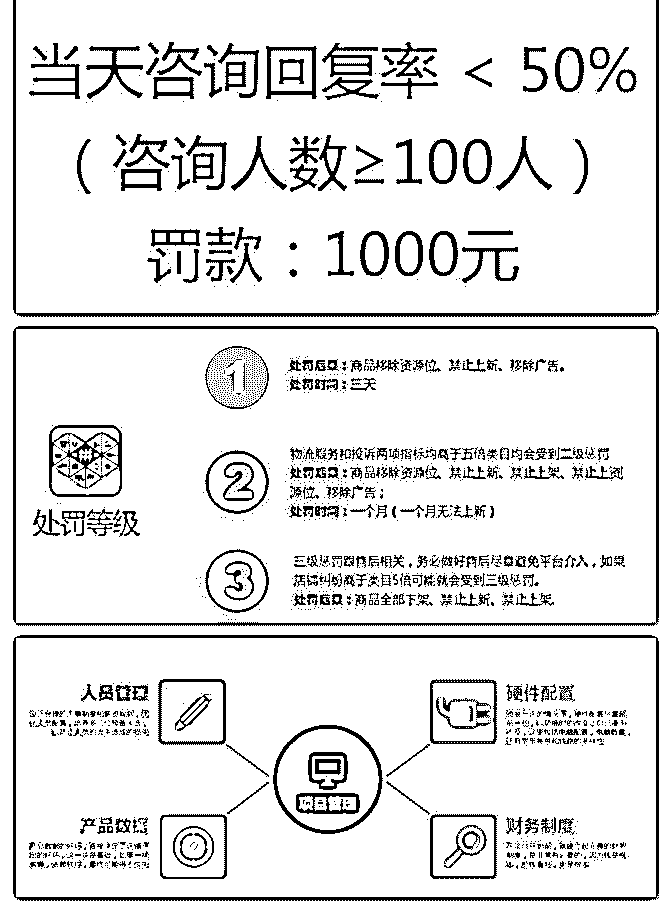
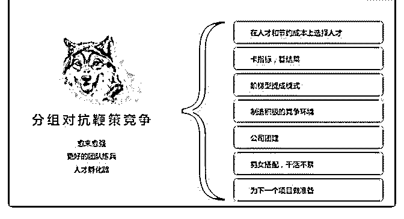

# 昨天讲到国内的店群

花爷梦呓换酒钱 : 昨天讲到国内的店群，也叫作无货源开店， 今天给大家看一个之前花友的分享，讲拼多多店群的。

当然平台规则一直在变，里面一些内容可能已经更新了，而 且店群这种玩法多少有点灰产性质，所以主要给大家多了解 一些思路。

分享主题：拼多多店群玩法入门手册 自我介绍：

我叫小陈，从 2012 年开始从事电子商务行业，距今已有 7 年， 从平面设计到推广然后到运营总监，从去年年初开始愈加发 现电商行业越来越透明化，去技术化，后面的发展方向必然 是供应链以及实力，思维模式的升级迭代，不再是技术能解 决的年代了，且发现身边很多做运营的朋友也出来创业，所 以去年一直在观察项目，毅然决然从去年年底辞职单干，现 在在经营有货源淘宝店以及无货源拼多多店群。

背景介绍： 那我就简单介绍下什么是店群？店群的概念是什么？ 1.采集爆款，采集别人店里卖得好的产品；

2.在原基础上加价，别人卖 100，我们卖 150，多出部分就是 我们利润；

3.上传到自己的店铺，通过开多家店铺，来丰富自己的产品

库；

4.替人下单，当有人在我们的店铺里购买的时候，我们再到 上家下单

简单来说，就是利用开多家店铺，占据平台的流量，如果有 人下单了，就去采购更便宜的货发货。

分享正文： 大家好！我是来自广东佛山的小陈，现在在做有货源淘宝店

以及无货源拼多多店群。今天晚上我们接着昨晚的拼多多店

群分享，从店群的概念开始说吧。

交易流程如下：

1.客户在我们店铺下单；

2.我们去上家拍单，发给客户；

3.客户收到货，确认收款；

4.完成交易； 退货&售后流程如下： 1.客户申请退款，或售后；

2.我们同时向上家发起售后；

3.给客户上家退货地址；

4.上家收到退货，退款我们，我们再退给客户；

店群的本质就是：代购 店群的特性就是：碰概率

靠大量铺货上新带来新品新店权重扶持，拿到“展现”，进而 获取到一定量的访客和成交。店群的门槛一般分为：政策环 境（平台、国家）、资质证明、资金实力、信息更新、开店 数量、培训，这几大块。

平台的选择和区别： 淘宝店：一人一店，压金 1000，竞争激烈，规则完善，处罚

力度大；

天猫店：企业开店，压金 15 万，服务费 6 万一年，5%扣点， 处罚力度大；

京东店：企业开店，压金 3 万起，服务费 1.2 万一年，5%扣 点，处罚力度大；

唯品会：企业开店，主打品牌招商，5%扣点，女性用户偏 多；

拼多多：个人企业均可，无限开店，压金 1000-2000； 项目风险： 98%由于项目本身。其他的就是内部管理以及平台政策所

致。

准备资金：

投入多少资金，决定了这个项目的大小，准备资金分为两大 块：

店铺押金：个人认证 2000 元，企业认证 1000 元 流动资金：去上家拍单，给自己店铺拼团 如果单店月产出 1500 毛利，单店需要准备的资金为： 企业认

证：1000 压金+2000 流动资金 个人认证：2000 压金+2000 流动

资金

注册店铺： 个人店铺：压金 2000 元，店铺少，5-20 家； 企业店铺：压金 1000 元，店铺多，20 家以上； 经营类目： 服饰箱包：有季节性，售后多，但是出单大；

家纺家具：无季节性，销量稳定，家具不要，售后麻烦； 家居生活：无季节性，销量稳定； 美容个护：无季节性，销量稳定，但是容易处罚售假； 母婴玩具：无季节性，销量稳定，宝妈群体大； 食品保健：食品不做；

数码电器：无季节性，销量稳定；

水果生鲜：水果不做，压金 10000，售后多； 虚拟商品：不做；

运动户外：销量稳定； 拍单流程：

单独购买：以单独购买的价格拍下，商家可以直接发货；

发起拼单：以团购的价格拍下，并发起拼团，达到商家成团 要求，商家才发货；

购买软件：便宜的几十一个月，贵的一万多，分为几大块：

1.数据采集&上传。可以采集不同平台数据，并上传到自己的 店铺里面；

2.快捷拍单。可以在一个平台内管理多家店铺订单，并便捷拍 单；

3.自动登录。因为店铺较多，手工登录比较慢，这个是必须的 功能；

4.自动回复。自动回复权重对店群影响大，这一功能非常重 要；

5.数据统计。数据是根本，不管是平台的统计，还是后期的优 化，都要以数据为基础去进行，根据自己的规模，选择适合

自己的。

人员配置： 数据采集：负责数据筛选和采集并且上传到；

客服：及时响应每个店铺的客户咨询，遇到不懂的向上家咨 询。协助售后专员解决售后问题；

拼单：巡查等待成团的订单，检查有没有亏本的订单，确认 无误后用小号进行拼单；

拍单：查看单独拍单的订单有没有亏本，确认无误后用小号 进行拍单；

售后：及时处理售后订单，特别要尽量避免平台介入，否则 售后的亏损漏洞很大；

数据采集：店铺产品数据的好坏决定了店铺的产出； 售后处理：售后问题如果处理不好一个亏钱，二是影响店铺

权重；

店铺少，一人分饰多角；店铺多，专人专事，流水作业。 店铺养成之上架策略：

每日上传：

1.店铺多，数据大，提升明显；

2.只能电脑采集，数据差；

3.人员工作量大；

4.对电脑数量要求较多； 十日上传： 1.突然增长快；

2.店铺少时可以人工做优质数据再上传；

3.人员工作量少，对电脑要求较少；

4.可用于预备店铺的养成； 时间就是金钱

（图 1） 流量规则：

淘宝爆款 ≠ 拼多多爆款，平台无所谓，重在测试，结合自己 的实际情况。采集方法分 2 大块：

直接采集：

1.设置参数，软件直接采集；

2.工作轻松，但出单效果一般；

3.售假严重，违规多，生命周期短；

采集裂变：

1.自己做热词，做标题裂变；

2.出单效果好，流量；

3.操作比较繁琐； 采集时需注意：

品牌词，违规词，直邮，买一送二，售假，真皮，和描述不 符，退货严重；标题短小 重复，员工操作懒惰，不补标题， 效果差，属性与产品不匹配。

不要过份依赖软件。人工最重要，软件只是辅助。

（图 2） 加价策略

（图 3，4） 风险规避

（图 5，6） 坚持每天提现，不要在账户内留钱

（图 7） 项目管理：

（图 8）

团队管理：

（图 9）

基本框架说完了 谢谢大家~ Q&A:

好，分享完之后我再回答下群内提问的问题~

1\. 拼多多店群和淘宝店群有什么区别吗？拼多多官方是什么 态度？

区别： 淘宝：一人一店，压金 1000，竞争激烈，规则完善，处罚力

度大；

天猫：企业开店，压金 15 万，服务费 6 万一年，5%扣点，处 罚力度大；

拼多多：个人企业均可，无限开店，压金 1000-2000，无扣 点，流量红利；

拼多多官方的态度是上升期肯定希望先有鸡再有蛋，也就是 有供应才会产生需求。但做得人越来越多，现在较难突破店 铺开店数量。

2\. 做店群有什么壁垒吗？做好哪一件事是业务的关键？

岁月静好：壁垒就是对市场选品的把握，业务的关键也是如 此，其次就是不停的“搬砖”

3\. 如何引流，成本投入和人员构成是什么样的？ 岁月静好：引流就是多开店铺，把大量的时间和精力投在开

店以及选品，成本投入就是店铺押金、周转资金、公司一些

固定开支，还有一部分软件费，想对选品有帮助的要买一万

多一年的软件服务费，还有一些触碰到规则的罚金。

4\. 现在没有早期开店的红利了，现在是如何批量开店的。企 业和个人分别如何操作，如何获取资源 ？

岁月静好：突破的阶段现在已经基本限制了 企业 5 个 个人两 个

5\. 下单的上家如何选取，如果大量订单，如何避免上家察 觉。

岁月静好：这个目前没有办法，其实上家都知道你是做店群 的

6\. 上传别人家的产品，详情页是直接复制别人家的吗？ 岁月静好：是的 7.想追问下，如果你采集时，上家卖 10 块，你卖 15，结果突

然上家涨到 18 了，这时候你是机器自动跟随涨价？

岁月静好：这种情况一般只有活动期间才会有，一般活动的 产品我们会有软件查看得到最低价，如果上家突然涨价的 话，就继续找别的上家，拼多多，淘宝，一般不会只有一家

上家，机器不会自动跟随，可以人工替换上家，机器可以设 置多家上家。

2019-07-07(12 赞)

评论区：

遇夏 : 想学店群，有什么好的方式吗？

朱较瘦 : 这个可操作性性强，投入门槛不是特别高，感觉可以按花爷的说的，撸起袖子搞起来了。

Tina : 软件可以分享一下吗？[爱心][爱心]

RwatitFahs* : 有什么比较好的采集软件或者是后台管理软件之类的推荐下不？

花爷梦呓换酒钱 : 网上有课，也可以联系分享的花友交流，微信：yaoyao683130

花爷梦呓换酒钱 : 网上有课，有很多软件，一搜就搜到了，也可以联系分享的花友交流，微信：yaoyao683130

花爷梦呓换酒钱 : 网上有课，有很多软件，一搜就搜到了，也可以联系分享的花友交流，微信：yaoyao683130

Tina : 好的，谢谢花爷。花爷，4 群好像没有这个分享。

关注公众号"懒人找资源"，星球资源一站式服务