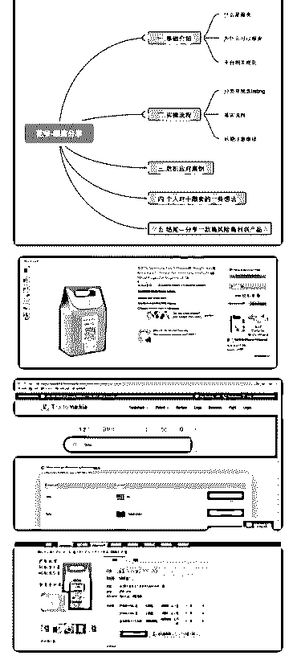
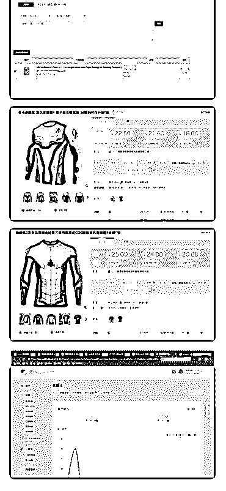

# 分享主题: 亚马逊

花爷梦呓换酒钱 : 分享主题: 亚马逊平台跟卖商品的经验与思 考

分享嘉宾：阿兵 分享背景：17 年毕业至今运作跨境电商亚马逊两年。分享些

基础实操，希望能帮助到想了解这个平台的朋友

分享正文： 大家好。我是阿兵。今天就围绕“亚马逊跟卖”分享一些实操

流程和个人理解。花友群里有很多跨境电商的大神。有讲的

不妥之处还请多多纠正。谢谢大家。

内容大纲

（图 1） 一、什么是跟卖？

卖家在亚马逊平台上上传的 listing 隶属于亚马逊平台。所有人 都可以卖。

通俗地说：相当于淘宝上的宝贝，所有人都能跟上去卖，不 用自己去创建。

这是亚马逊平台相比其他平台比较特殊的一个机制，也是一 大魅力所在。

二、为什么可以跟卖？

亚马逊平台希望减少重复 listing 的数量。两方面：

1.提升客户购物体验，如果重复 listing 太多，顾客搜索一个产 品，出来的都是一模一样的产品。

2.过多的重复 listing 会导致 Google 流量的屏蔽和降权，从而影 响到亚马逊平台本身。

三、相关规则

1.跟卖他人创建的 listing，只允许设置价格数量

2.共享 listing，共享流量，省去前期推广营销工作，准备好货 就行了。

3.这么多人共享一个 listing，那买家到底下单到底买了谁呢？ 这里有一个 buybox 的概念，通俗点叫购物车。哪个卖家拥有 这个 listing 的购物车他就有更高的出单几率。亚马逊 90%的出 单都是来自购物车。购物车是靠卖家们的价格，账号权重， 库存量等等因素条件相互争夺的

4.凡是涉及到专利商标等问题，跟卖的处罚会很严重，封 号，没收仓库货物，吞没账号内剩余美金等。

四、分类挑选 listing 上文已提到专利商标的问题，如果 listing 的建立者拥有这个产

品的商标品牌备案或者相应的专利，你去跟卖他，很可能会

收到警告甚至被直接关店封号。

那么我围绕商标这一点将 listing 们分一下类：

1\. 大品牌，惹不起 例如 Apple，任天堂等等。这类 listing 也是允许跟卖的，前提是

你是正经的经销商，基本上在 listing 下面的卖家会分摊购物车

拥有时间，只是时间段有好有坏罢了。

此类 listing 级别太高，做一个参考即可。 2\. 有品牌有专利也无妨。头铁，照跟不误 那么怎么挑？怎么跟呢？

（1）牌子不大但是在小类目下有一定竞争力和品牌溢价。

根据个人经验，个人认为跟卖这类 listing 就算被发现了，对方 大概率是警告你一下，溜了就行了。但是你死皮赖脸不走也 行。这里就根据每个人想法决定吧

（2）有些卖家的确拥有商标，但是他并没有维护地特别好， 他的店铺里有非常非常多的产品，铺货路线。我们上去跟卖 一个两个，被发现的几率相对来说比较低

（3）时间段选择，选择对方休息睡觉或者节假日时候，不运 营店铺的时候去跟卖。时间段需要慢慢尝试探索。相当于游 击战。

以上几点也是 listing 建立者很讨厌被跟卖的原因。辛辛苦苦培 养起来的 listing 被人家小手一点就分走了一杯羹。

3.无品牌，无专利。任人宰割

找到多个没品牌没专利的 listing。找到货源，通过多个跟卖账 号进行大批量跟卖。这类 listing 怎么找，深圳有很多公司是通 过软件爬虫之类的操作找到这些 listing 和货源的。软件类的我 不太懂哈，就不展开了。。

五、落实流程 接上文所提到的无品牌无专利 listing 跟卖，我随机找一个产品

做个简单演示

（图 2）

1.在平台上通过手动或者软件的方法，去寻找到没有注册品 牌商标的卖家的，再去看他的 listing，然后挑选有销量的并且 有足够利润的 listing，去进行研究。（图片中的 tomu 就是品牌 商标名字）

（图 3）

2.在美国或者其他国家的商标注册网站上进行搜索查询，查 询这个卖家在 listing 上所打的品牌名字，如果查询不到，那就 证明没有品牌商标。（通过查询 显示查询不到，那就是没有 品牌商标）。专利也是如此查询。这里只是做个演示哈

（图 4）

3.这时候如果已经确保安全，就去找到这个 listing 的货源，现 在找货源要比以前方便便捷很多了。这一环节每个人有每个 人的渠道，不做赘述了。

（图 5）

4\. 找到货源之后，通过 erp 软件或者专门的跟卖软件，进行跟 卖 listing，然后发货。（在 listing 界面下找到 ASIN 号码，输入 到 erp 进行跟卖）

5.货到了之后可以进行调价，如果是一个新号，比如对方的 价格是 22 美金，你可能需要调到 19 左右才可以抢到购物车， 但是如果你是老号并且账户绩效够好，可能 21 美金就可以抢 到这个购物车，所以在这个方面，各自的账号需要各自的调 整，而且也需要去计算产品的利润。

6.发货选择自发货还是 FBA 呢？建议 FBA。出单更快些。 六、后期注意事项 1.要经常检查 listing，因为一般来说 listing 建立者是拥有修改权

的，如果他修改了 listing，那么要做出及时地调整。

2.邮箱要积极查看，若有侵权等消息，可以及时反应。

3.买家反馈积极应对，保证自己卖的货是 OK 的。

4.如果收到原主发来的警告信，耐心思考研究。走或不走，看 个人判断。多查品牌专利等事项。

七、危机应对案例 这里分享自身的一个跟卖经历

我曾经跟卖过一个在小类目下的品牌大佬。国内拿的仿品

（质量耐久度大概在正品的 80%左右），放上去当正品卖。

（卖假货了，对不起。虽然不多，但是的确可以赚钱。）

发了一批货到 FBA 仓库。卖了 20 天左右的时候，打出第一笔 款，三千多美金。第 25 天，客户投诉假货，亚马逊将我的店 铺直接关停，listing 下架，货物扣留，并要求我出示经销商进 货发票以确认我经销商的身份。为了解围打听了一圈，有服 务商要价两万人民币帮我把店还有钱救回来。账号里只剩四 千美金不到一点。不划算。

于是我花了四千块向国内正品经销商进了一批货并要求开出 增值税发票。发票到手，一顿修图。上传到亚马逊上请求验 证，第一次退回来了。字体再 P 得更精密一些。第二次上传， 又退回来了。然后再改其他信息，反复尝试。前前后后折腾 挺久，一边忙着运营自己原创的产品。一边每过段时间空闲 就管一下跟卖账号，上传一下重新修图过的发票。直到有一 天突然显示店铺恢复了正常。钱也在不久之后打出来了。非 常兴奋。

算一笔账：货 8000，运费 2000，正品进货带发票 4000，成本 一万四，得到大概五万人民币

账号回来了，踌躇满志进行第二次跟卖。这次把那箱正品货 跟国内的仿品货掺在一起卖。一个礼拜之后遭到经销商举报 侵权，店铺又关了。

把第一次的发票，修一修改一改。又上传上去了，倒腾几次 一个月之后账号又回归了。这次赚了两万左右

之后了解到，针对我的这类侵权问题，好像是亚马逊的发票 审核团队是外包给外面的低端岗位来做的，时薪非常低，所 以审核人员本身并不是那么那么严苛负责，再加上这些岗位 上的外国人对中国发票不太熟，所以非常侥幸地躲过了一 劫。

以上是我个人经历，不代表所有情况。里面的原因我也不是 了解的十分彻底，总之靠它在团队最艰难的时候赚了一点 钱。大家当个案例参考即可

八、个人对于跟卖的一些想法 上文提到的跟卖操作在后续因为经销商管理力度加大我就放

弃了。把赚的钱都投入到了自己的品牌产品中。目前专心经

营自己的品牌。

跟卖类似温水煮青蛙，如果打算长期做亚马逊，还是好好研 究产品呗，总有出头日。

当然了，也有公司就是专门靠跟卖赚钱的，这个我不是很熟 悉，没有大规模的操作过，不发表意见哈。群里应该有更懂 的朋友。

对于踏实做产品的卖家来说，如果不想被跟卖。一定要做好 预防工作，品牌专利备案等等提前弄弄好。

结尾分享一款产品

（图 6，图 7） 同行们应该很早就听说过这个了。

提这个产品是因为自己的朋友之前在 wish 上卖这个，他说想在 亚马逊上卖，当时我觉得没啥希望，这么大 IP 怎么可能不管 控？“小心被灭霸给你打个响指”。

但是我还是帮他开通了亚马逊，上礼拜他的店铺刚被封了，

问我怎么处理，我没招，爱三千遍也没用哈哈。

他选择直接放弃店铺，重新开一家继续搞。算了一笔账赚得 不少，就是不肯告诉我具体数目。只留下一句话“亚马逊真 香”

无论在 eBay，wish 还是亚马逊，这些卖家永远都在，只是店铺 经常换。

刚好最近蜘蛛侠正在上映，又是一波流量喔 再多说一句：感谢花爷提供的这个平台，感谢花友。社群最

开始有一期分享的影视站。凭着兴趣爱好我跟朋友一起实践

了一下，建了个网站，开了个公众号，从四月中旬到六月

初，借着权力的游戏的热度，第一次感受到了涨粉和收广告

费的乐趣。图个乐挺有意思。后面因为工作忙就没再管了。

期待以后向各位花友们多多学习，做更多有意思的事情。

（图 8）

跟大佬们比不了哈 ，我就当个乐。OK 结束，再次谢谢大 家！

2019-07-06(10 赞)

评论区：

海很阔 : 这个没做过亚马逊的可能不了解。小弟也是做了两年亚马逊从业者。非常非常非常厌恶跟卖的。差点花钱找人人

肉跟卖的，一个小拇指。不要觉得狠，有人抢你口袋的钱，你就明白了。

花爷梦呓换酒钱 : 可以理解，不管是跟卖还是国内搞店群，其实都有灰色属性。但我们又不得不承认，这类玩法很难完全

禁止，国内搞盗版课程的也是一样道理，卖家多从源头想办法杜绝，对普通人来说，这种模式终归不长久，理解背后的思

路比赚钱更重要。

