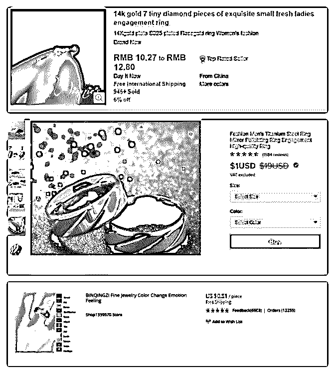
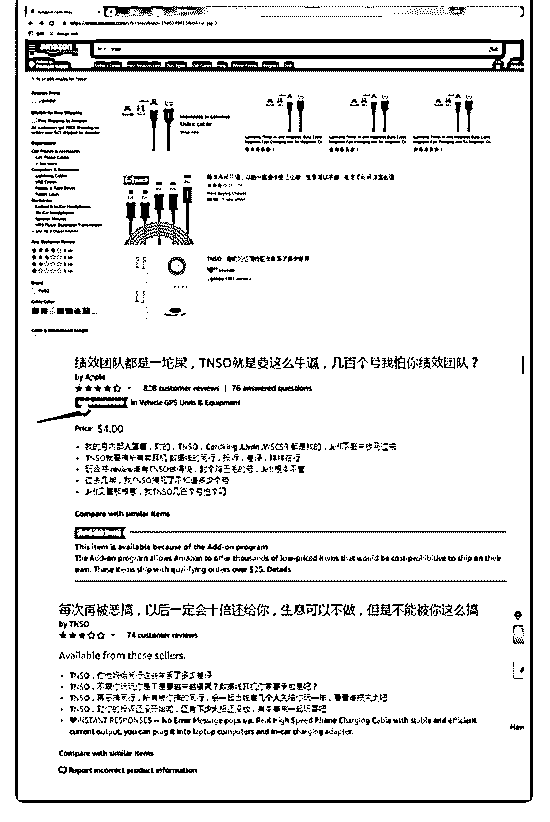

# 分享主题：跨境电商

花爷梦呓换酒钱 : 分享主题：跨境电商平台——速卖通的介绍 和从业经验分享

分享嘉宾：咚

分享背景： 从业跨境零售（主要是速卖通）三年，标类行业 卖家。速卖通是阿里旗下的跨境平台，可以看作是国际版的 淘宝，物流目前基本是国内直发。第一大市场在俄罗斯，占 平台 40 %左右。

分享正文： 大家好，我们今天主要聊聊跨境电商（速卖通）的一些经

验。

我们一般在谈跨境电商，大多谈的是跨境出口零售这块，所 以先狭义地圈定在这个范围内。

谈及电商，往往离不开平台，目前对中国卖家而言，主流的 跨境电商平台主要有：Amazon(亚马逊)、eBay、Wish 以及 Aliexpress(速卖通)，还有近两年势头不错的东南亚平台 Lazada 和 Shopee。

按物流方式，一般分为销售国本地仓发货（先把货从国内发 到国外仓库，客户下单后，再从国外仓库发货上）和国内直 接发到客户手上。

亚马逊通常以销售国为独立站点部署，建设本地仓库，基本 上都是本地仓发货，第三方卖家也是先把货发到亚马逊仓

库，再上架销售，由亚马逊物流配送（Fullfill By Amazon, 行 业内简称 FBA），客户体验好，几乎牢牢占据欧美发达国家 中高端市场。最近也积极入局印度，中东这些新的潜力市 场。

这四大平台里面，速卖通体量大概是垫底的，但是因为是在 阿里旗下，体系相对国内卖家较熟悉，资金风险相对小。

除了亚马逊，其他平台也有本地仓发货，一般称为海外仓， 主要看类目，但大多还是以国内直发的形式为主，尤其是货 值低的轻小物件。

（图 1，图 2，图 3） 上面图片从上往下分别是，ebay，wish，速卖通。 0.99 美金全球包邮! 你没有看错。 大家笑称速卖通为“屌丝通”，运营采购客服发货必须一应俱

全，价格甚至比国内还低，流量还小，简直国际搬运工。

其实，上面所用的物流叫国际小包，包裹重量要求在 2kg 以 下，根据国家地区不同，时效差别很大，10-90 天，甚至更长 都有。国际快递虽然快，但是价格太高，一般适合高价值的 物品。

国际小包的运作，是基于万国邮联的体系。就是我们小时候 交笔友寄信（现在的小朋友可能没这个概念了）,现在寄明信 片这样的邮政系统。

跟信件一样，国际小包分为平邮和挂号，两者区别就是有没 有跟踪信息，所以挂号也比平邮多个一个挂号费，大概十多

二十 RMB。平邮的计费就是按克计费，比如现在速卖通官方 到俄罗斯的平邮渠道，大概是 100RMB/kg。上面一个小戒指 包裹只有 10 多克的话，运费只要一块多。这就不难明白为什 么能 0.99 刀包邮了。

万国邮联协议下，按国家发达程度分为几等，费用不同。中 国被列为发展中国家，等级较低，所以费用很低。

随着这几年跨境电商的快速发展，大量国际包裹，发达国家 特别是美国，也是要求中国邮政必须要涨价，邮政小包费用 也是每年涨，甚至还翻倍地涨。由于发达国家高昂的人力成 本，现在这样其实是在让他们来补贴我们。。。只是不得不 受万国邮联体系的约束，去年还传出美国要退出万国邮联。

。。

插一下，做 Dropshipping 的新手，记得物流选挂号服务，多付 一个挂号费就好了。毕竟有跟踪信息的物流服务才能让客户 安心。虽然是“屌丝通”，但由于产品价格低，性价比高，速 卖通上做 dropshipping 的买家和各个国家的小批发客户还是不 少的。

我们在速卖通上是做标类，半标类的产品，比如数码产品， 五金工具。简单来说，标类产品是相对于服装，饰品这些注 重个性需求的产品而言。标准品，意味着注重功能，需求相 对统一，另一面是同质化严重，不可避免地价格战。

作为平台商家，基本的流量来源都是平台的站内流量，就是 说可以先不用考虑自主引流的问题。平台类目的流量其实是 相对稳定的，平台发展好，投入多，卖家们所获取的总流量 则多，反之亦然。

所以平台卖货，可以看作是赛道赛跑，要比你的对手做得更

好。短期内快速起来的卖家，必然意味要从别的卖家嘴里抢 更多的蛋糕。套用句话，“用技术手段超越低价对手，再用产 品（质量，价格，服务）和高阶对手竞争”。其实很多行业也 是这个道理。

平台算法虽然一直在改，但是核心指标往往离不开 点击率， 转化率，GMV（销售额）。

点击率 = 点击查看产品的次数/展现在客户面前的次数； 转化率 = 成交人数 / 访问人数； 算法依靠数据来判断，既然有数据就可以造数据——持续高

于，甚至远超平均水平的好数据。

说人话 —— 刷单。 算法一直调整，相应高级玩家（尤其是竞争激烈的标类行

业）的刷单资源，刷单模型也一直在升级。依据算法的调

整，类目产品的不同，围绕核心数据去打造产品成长路径模

型。

这一套，淘宝天猫卖家信手拈来，速卖通目前还是低阶版的 天猫，所以甚至还可以参考天猫之前已经落后的打法，这也 算信息差降维打击。但是速卖通收益小，国际市场竞争激 烈，流量也小，很多天猫大卖家还看不上这点蛋糕。

不刷单呢？当然可以，做广告占据优势位置，不赚钱，往往 还要亏本卖个几千件 —— 用钱把数据砸出来。要考虑的就是 收益能否跟前期投入匹配。

造出来的数据只是让你在前期跑在前面，获取平台流量，但

是能不能持续，最终还是要看你的产品。（质量，价格，客 户评价等综合考量）

所以，大佬们都会跟大家说 —— 产品才是王道。 算法，规则调整，带来的技术手段红利，可能会有短则一两

个月，长则一年的窗口期，但这些信息迟早都会被大家获

取，头部卖家更是优先获取了，那么最后还是落到了产品的

竞争上。

说到“产品为王”，大家也不要一味陷入到追求“质量最好”的 产品上。平台上销量最好的产品，往往是针对目标人群，在 质量，价格，评价上综合，满足甚至略高于客户期望的产 品。比如一些客户就特别偏好性比高的产品——觉得自己赚 到了，高于心理预期。有时候，要改进 5%的产品缺陷可能就 要增加 50%的成本。比 5%的缺陷，可能客户更在意 50%的价 格。

我们起初也是小白一个，没有任何供应链上的优势。所以开 始制定的策略就是——模仿，竞争，超越，这样的路线。

在不同类目，每个阶段找不同层次的对手，第一步分析模仿 对手的产品，可能流量渠道，广告关键词位置。慢慢接近的 时候，考虑改进产品质量，差异化，下压价格空间等等，最 后再反过来去优化供应链。超越了一个对手就换下一个目 标。12345，爬阶一样，到现在平台小类头部位置。

Q&A:

问题 1：新手是否还适合进入？

问题 2：个人工作之余兼职做这个的可能性大么？如果可以， 新手需要注意些什么？

嘉宾答： 问题 1 和 2，新手，兼职，我是直接劝退速卖通了。 所需要的资源不谈，速卖通是“麻雀虽小，五脏俱全”，采购

仓储发货，客服售前售后，这些都是维护性的工作，不会直

接带来收益，但同时会耗费大量时间精力。

速卖通的基本盘在俄罗斯，体量还是小。万一哪天速卖通崛 起了呢（我也希望这样），阿里国内深耕多年，1688 淘宝天 猫，供应链卖家一呼百应，对阿里来说最不缺的就是卖家， 只要市场蛋糕够大，直接引入天猫大卖（现在也一直在招 商，只是很多天猫大卖根本没有把精力投入速卖通）。就像 之前天猫替代 C 端淘宝一样，如果一开始没能占据一定位置， 即使后面市场起来了，蛋糕也分不到你。

反而言之，如果是工厂或者天猫卖家，可以先上去占位，看 看后续机会如何。

即使是让我自己重来一遍，应该也不会选速卖通了。同样的 投入，我相信在亚马逊上一定能做更好，而且亚马逊上产品 的生命周期更长，一个产品往往可以卖几年，收益更长远。 速卖通上的产品生命周期有个一年就不错，意味即使同样的 产品，也必须经常上新，这是平台机制的问题。

所以大家自己考虑机会成本的问题。 问题 3：工厂怎么找到适合的跨境商

嘉宾答：

这个跨境商应该是指代运营商吧。还是跨境平台？是代运营 的话，先考虑如何避坑吧。代运营商的口碑如何，有没有相 关类目经验，业绩是截图还是看后台数据，是否依赖刷单造 业绩？

另外，自己有没有朋友能提供相关建议和经验参考。代运营 的收入机制如何，高服务费+低提成，还是基础人工服务费

+高提成？更进一步能否升级合股的机制？

其实靠谱的代运营商一样会担心遇到不靠谱的工厂，做起来 后，以为后续合作，工厂反过来一脚踢出去局，另外找人， 前期的大量投入很可能就白费了。

平台的话，看自己的产品是否适合平台，平台上类似的产品 销量如何。比如速卖通体量太小，很多工厂产品并不适合在 平台上销售。

问题 4：后台界面有中文版么？推荐快递有哪些？速卖通宝贝 权重机制？

嘉宾答： 速卖通后台全中文界面，上产品用英文。普货一般用速卖通

线上物流即可——一般是国际小包。机制跟淘宝天猫类似。

点击率，收藏加购，转化率，GMV 等等，现在也更注重千人

千面了，有人群标签。

问题 5: 从未有过电商、跨境经验的新手，如果想要试水玩跨 境赚美元，有什么压低试错成本、快速验证自己是否能玩这

个生意的建议吗？（可以不局限于速卖通这一种形式）

嘉宾答： 有涉猎 SEO，国际社交平台引流(FB,INS 等)，可以做

dropshipping。这两年 shopify 建站挺火的，导入访客，可以从

速卖通买了货给客户发货。更多就是引流和 ROI（广告投入成

本和产出比）的问题了。

亚马逊。亚马逊市场足够大，即使是一些细分类目流量也很 可观，这些类目国内大卖可能还看不上，就挺适合切入的。 小几万试水，稳健操作的话，我觉得比 A 股靠谱。。。

自己可以快速学习网上优秀的课程，最好能请教朋友。（快 速入门也需要较强的综合学习能力）

熟悉之后，货物可以由国内工厂直接贴标，让货代收货发往 亚马逊仓库。几乎不用自己做客服。

不追求做得很大的话，还是挺符合 OneBiz 的。自己身边就有 这样的例子。

听起来很简单，但核心是以什么类目的产品，切入哪个国家 市场，持续深耕，这个不容易。所以说亚马逊“七分选品，三 分运营”。

至于竞争激烈的类目，国内卖家不择手段的黑历史，每年都 有爆。

（图 4）

这几天身体不适，准备得也不够充分，有不妥的地方，还请 大家包涵。大家慢慢看，有问题可以提出来。

2019-07-03(6 赞)

关注公众号"懒人找资源"，星球资源一站式服务