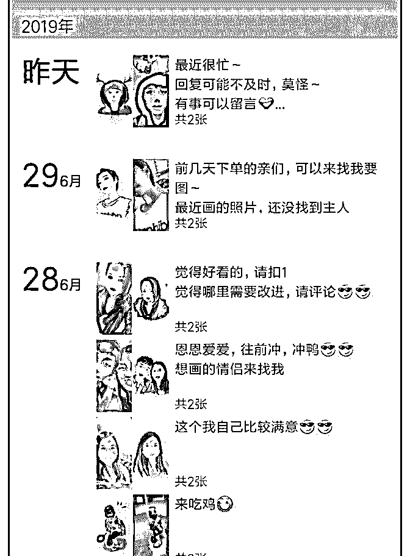
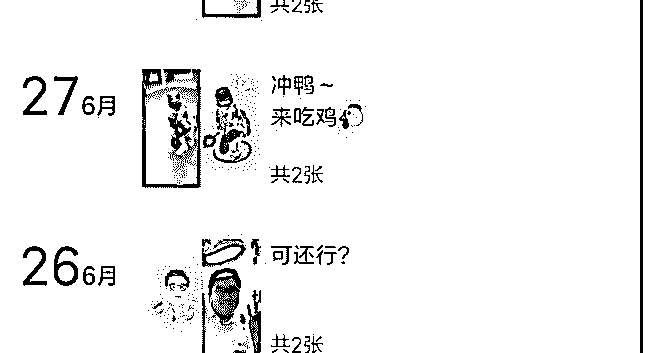

# 上周有位花友问到微

花爷梦呓换酒钱 : 上周有位花友问到微信卖冰粉，想到一个案 例——手绘头像。

主要业务：用户提供照片，帮你画成手绘画做头像，或者帮 你做成卡通版的大头人偶。画手绘头像 10-30 元（看风格难 度），做卡通大头人偶 120 元。

应用场景：头像主要是女生买来做微信头像，以及情侣买来 做情侣头像。卡通大头人偶主要就是情侣节日送礼物了。

引流：我加的这个卖家主要靠微博引流，在热门微博下面带 图评论，花点小钱把评论顶到最上面，先引流到微博主页， 微博主页再通过宣传引流到微信销售。

扩展：

1\. 引流到种子用户之后，开始从购买的用户里招代理，代理 的任务也很简单，介绍人下单拿提成，这些代理本身大多是 小女生，身边相似的目标用户很多。这也是我想跟大家说 的，同一种引流方法很难长期有效，积累到种子用户之后， 如果有可能，一定要做代理或者用户推荐的奖励来带流量。

2.手绘头像生意，其实还有别的模式，比如你去淘宝搜手绘头 像，会发现很多玩家。而除了手绘头像，很多小工艺品也有 类似的玩法，比如沙画、手工点心，顺着这条藤，试试你还 能摸出来多少？

2019-07-01(14 赞)

关注公众号"懒人找资源"，星球资源一站式服务