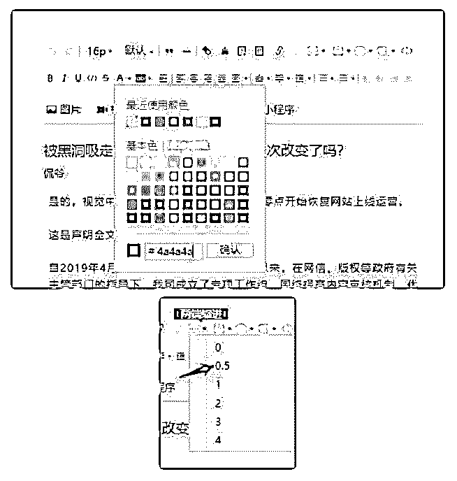
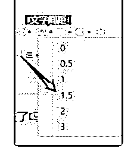
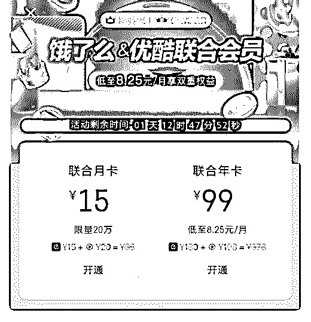

# 分享主题：大学生从

花爷梦呓换酒钱 : 分享主题：大学生从小白开始做公众号的一 些启发

花爷在前面说几句：小宋还是大学生，很早就是我的付费会 员了，当时报名分享但是害怕经验不多分享不好。其实没关 系，人总要迈出第一步，你做了，总比不敢做要好得多，而 且一定会越做越好。这一点对所有花友都一样。当然这次小 宋的分享虽然比较入门，反馈其实还挺好的哈哈～

分享嘉宾：宋天立(大一在校生) 背景：高三暑假加入帅张星球开始提升认知之旅，进入花爷

分享群与星球更是受益匪浅。陆续写过悟空问答与公众号，

准备将公众号作为大学业

余爱好坚持下去。

分享正文： 大家好，我是宋天立（真名）。

我本人是一位准大二学生，能加入花爷的社群非常荣幸，在 其中也提升了自己的认知。今天斗胆在各位大佬面前分享一 下自己的经历（不敢说经验，嘿嘿），希望能给大家提供一 些小小的借鉴。

PS:分享可能比较小白，各位可选择性阅读。 个人经历：

曾加入 Stormzhang 悟空问答后援团，期间有些回答阅读量几百 万。后来经后援团成员推荐，现如今在跟一家公司在做原创 类公众号，刚起步。

做公众号的必要性： 花爷社群里很多人都有公众号，但应该还有朋友没开通公众

号，希望大家今天听过分享后可以做到人手一个（如果真能

实现我也算是达成一个小小的成就了，哈哈）

就我短短写公众号的这段时间里，就深深体会到写公众号的 好处跟必要性。

这里就不赘述打造个人 ip，提升写作能力等这些大家早都知道 与了解的。单说我自己，在写公众号的过程中，打开了我另 一个世界的大门，让我有一个目标来为之奋斗，算是最重要 的了。

花爷社区名字是“愚公掘金”。我觉得做公众号必要性恰好与 这个名字极为契合:写公众号的过程就是像愚公移山一样，慢 慢写，慢慢输入输出，最终达到掘金的目的。

涨粉相关： 做自媒体，涨粉是一个大学问，我这里就简单说些自己所了

解的与公众号相关的。

引流：从其他渠道，如知乎引流到公众号，成功例子：半佛 仙人。前段时间有篇文章就是讲如何从知乎引流，似乎还有 些黑产相关。可惜当时未保存，了解的朋友可以分享一下。

互推：大家平时看到的公众号推荐，很多组成了大大小小的

公众号联盟，这也是涨粉的一个渠道。

分享裂变：做活动，关注公众号领取资源等，这些都算是分 享裂变涨粉，也是比较常见的一些涨粉手段。

曹大有篇文章，感兴趣的可以了解一下：

涨粉虽然难，但还是有其规律和规则的，最终能否留住粉丝 还是需要内容，无论时代如何变，自媒体仍是内容为王。

一些小问题汇总： 排版：刚开始做我自己的公众号时，第一篇文章简直一团

糟，这里给大家一些最简单的排版的帮助：

字体一般为 16 号字体，颜色 4a4a4a （灰黑色，可自行设置）

（图 1）

缩进 0.5 间距 1.5

（图 2，图 3） 这是最基本的，想要排版好看一点的话可以使用微信编辑

器，96 编辑器，秀米等。

更详细的排版技巧也可以看这篇文章：

小工具：

壹伴：（chrome 系浏览器小插件），算是一个比较方便的小 工具。

Markdown 编辑器：个人推荐写作还是用支持 Markdown 的编辑 器，如 WeChat Format：

这里还有一篇相关文章可以了解：

Markdown 的语法不少，但其实掌握一些最基本的也足够使用 了，可自行搜索相关语法。

做公众号有帮助相关文章： 白一喵大大的“微信公众号写作方法论”： 有个美工（可自行设计图片） 六个无版权图片介绍：

巨土文化的爆款文章大礼包（这个号推荐关注，每天都有爆 款文章分享，可以学习）：

在我写公众号的时间里，我每天晚上睡觉前都听“粥佐罗教你 从零开始学写作”，也存钱买了好些教写作的书等，期间也经 历过自我否定等。但写作这种东西，只要写就好了。

好了，这里就是我这次的分享了。我也算是混进了高阶群， 一路潜水到现在，平时在群里也没咋发言，很多时候分享也 没能跟上，不过后来都在小助手的分享里看过了。（这里真 是感谢一波小助手，真是辛苦了）希望能和大家一同进步，

嘻嘻。

[这次分享和以前不太一样，因为本身经历较浅，大家可能没 有什么好提问的，但是大家如果有什么问题的话我一定会做 到有问必答的。谢谢大家。](https://mp.weixin.qq.com/s/r1u0UQnkZ2Kc7iLH1nsY_w)[谈谈增粉这点事排版还能涨](https://mp.weixin.qq.com/s/r1u0UQnkZ2Kc7iLH1nsY_w)  [粉？！公众号必备的排版技巧 安装小插件](https://lab.lyric.im/wxformat/)[+-+](https://lab.lyric.im/wxformat/)[壹伴 微信公众](https://lab.lyric.im/wxformat/)  [号格式化编辑器](https://lab.lyric.im/wxformat/)

2019-06-28(27 赞)

关注公众号"懒人找资源"，星球资源一站式服务

# 618 的时候，腾讯

花爷梦呓换酒钱 : 618 的时候，腾讯和京东出了联合会员，98 元可以买一年腾讯视频会员+京东会员。这边淘宝系马上跟 进，饿了么会员+优酷视频会员一年 99 元。

流量越来越贵，特别是对巨头来说，获取新用户越来越难， 留存就变得更加重要。

联合会员的制度就像筑墙，以后巨头们越有越来越多类似的 策略。其实早在之前，美团就和腾讯视频合作了出会员了， 淘宝很早就有全平台的 88 会员了。

巨头的动作是具有风向标性质的，很多人还在想怎么大批次 的搞流量，但是个人小团队想做长久生意，流量的精准度、 付费转化率、留存和复购率，会比获取新流量更重要。

换句话说，只要你做好上面的这些，有新的获取流量策略出 现，你就直接跟进好了，直接完成闭环，事半功倍。

可能现在还有花友不愿意听这些话，毕竟搞转化和复购没有 搞流量有冲击感，没关系，两年后现实会逼你理解的。

2019-06-27(17 赞)

评论区：

好人 76543210 : 关键问题是，用不上两年，现在就可以了，当然，想挣快钱割完韭菜之后就跑路，做一锤子买卖的，可以暂

时无视花爷的提醒。

关注公众号"懒人找资源"，星球资源一站式服务