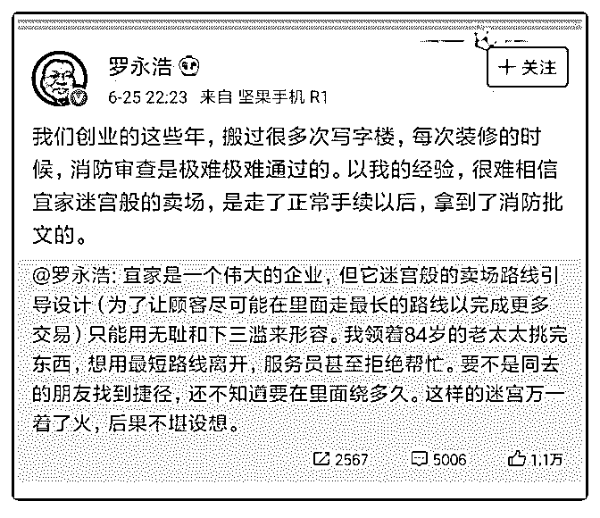

# 为啥我一直不喜欢罗

花爷梦呓换酒钱 : 为啥我一直不喜欢罗永浩呢，因为罗虽然做 营销很有一套，但作为企业家，罗永浩经常表现出非常差的 商业素养。

他不理解供应链，说富士康的生产线是垃圾，做不出他要的 设计；他不了解市场，系统的卖点基本靠主观判断，所以有 时候很惊艳，大部分时候很鸡肋；最难办的是他不会带团 队，不知道让擅长的人去做擅长的事，一个小的细节设计罗 永浩都要亲自管。

昨天罗永浩炮轰宜家商场的路线设计太复杂，像迷宫。对， 罗永浩作为消费者，有权力这么说，但我还是要说一句，宜 家是怎么起家的？不就是通过压榨消费者的停留时间，提升 销量，卖更多的廉价家具吗？消费者买廉价商品，就是要承 担一定的付出，所有品类都是这样。

这种策略，几乎所有廉价卖场都会有，沃尔玛有，家乐福 有，甚至星巴克柜台设计也有。宜家的这种策略什么时候才 会改？不是大家骂宜家的时候，而且大家都不买它的时候， 市场就是这么现实。

罗永浩这么说宜家，你不能说他说得不对，但确实有点奇 怪。更何况罗永浩还无根无据的质疑宜家的消防证书，语气 颇有点我以前不好过你也别想好过的意思，真的非常 low。

咱们回过头看，罗永浩的失败，ofo 戴威的失败，还有早前高 晓松出任阿里星球高管的失败，都在昭示着一个事实：文人 和工匠有他们的专长之处，但弥补不了商业素养的匮乏。而 且随着发展，不管是小企业还是大公司，领头人没有商业思

维都很难长期活下去。

2019-06-27(18 赞)

评论区：

我家的狗不咬人 : 潮退了才能看出来谁在裸泳,可惜看微博上很多人还是在无脑挺他

花爷梦呓换酒钱 : 多好啊，少了很多人和我们竞争

言不尽 : 他真是 LOW 到爆了，据说很多牛人员工都是被他气走的

花爷梦呓换酒钱 : 不是据说，就是……[捂脸]

好人 76543210 : 所以未来进入 5G 以及后互联网时代，普通百姓（比方说我）最好要开眼，了解商业素养才行，因为，现在是

一个个人有机会有能力也可以弄个人品牌的时代了，没商业素养怎么行。

cg 有点才 : 情怀牌快要打没了。。。

syneal : 和菜头说他交那么多朋友，唯一看走眼的是罗永浩

关注公众号"懒人找资源"，星球资源一站式服务