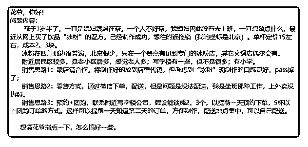

# 花爷，由于字数限制

(提问)匿名用户 : 花爷，由于字数限制，内容已图片形式展 现。还请花爷指点一下，感谢！

2019-06-26

回答：1 和店铺合作，主要倒不是口感好不好，而且这个模式

一旦成了，店铺会迅速更近自己做，把你排挤掉，不长久。

2、3 的配送其实也不是大问题，可以找达达接单配送。 其实

我看下来，你最主要的问题是选品不好，选了一个你们想做

的，而不是用户想要的，冰粉这个品类受众太窄了。 首先冰

粉必须现做现吃，保质期很短，你们能覆盖周围五公里就不

错了。 其次大众吃冰粉的频次不高，上海这边冰粉都是辅助

正餐的周边产品，没人特地去吃它，也很少有人拿它当下午

茶。不知道北京的口味是否不一样，但我估计受众也高不到

哪去。 两者一结合，周围五公里的人群里有强烈欲望吃冰粉

的人就更少了。 给你三个解： 1.如果你家人只是想在家做点

事创收，那我感觉“回家吃饭”这种平台可以尝试，就是你们

家的饭菜多做几份，卖给消费能力高一点的白领，客单价也

会高一些（这些人主要是图个干净、家乡口味，我偶尔会

吃），你可以了解一下，做个备选项。 2.如果你坚持想做冰

粉，那一定要做的很有特色了，所谓特色，要么是很好吃

（这个难度挺高的，我总觉得冰粉再好吃也不会差太多），

要么是有噱头，比如加一些特殊的辅料，宣传可以除湿、调

理皮肤等等，主打女性白领。然后去园区做低价试吃活动，

往微信引流，配合朋友圈的宣传包装。 3.其实这种在家做吃

的成功案例是有的，但不是做冰粉，大多是做点心，做得好

的收入非常可观。首先点心的应用场景多，除了下午茶，包

装的好还可以送礼，其次点心保质期长，可以邮寄，无形增

加了覆盖范围。可以预见的是，即使你做冰粉成功了，冰粉

也是季节性的，如果想长期发展，早期一定要做好手工造、

小众精致的定位宣传，这样以后容易扩展其他产品销售，不

会被冰粉困死。 无论你选哪条路，切记，这种在家手工制作 的食品，精致、逼格、文艺、和顾客的交友关系非常重要， 是立足之本，甚至可能比口味还重要。没有店铺引流的食品 店，复购是最核心指标。(15 赞)

评论区：

monalisali : 看完问题后，没有直接看答案，想了一下，把 1 给 pass 了，理由和花爷的一样。开眼看了一条缝[偷笑]

关注公众号"懒人找资源"，星球资源一站式服务