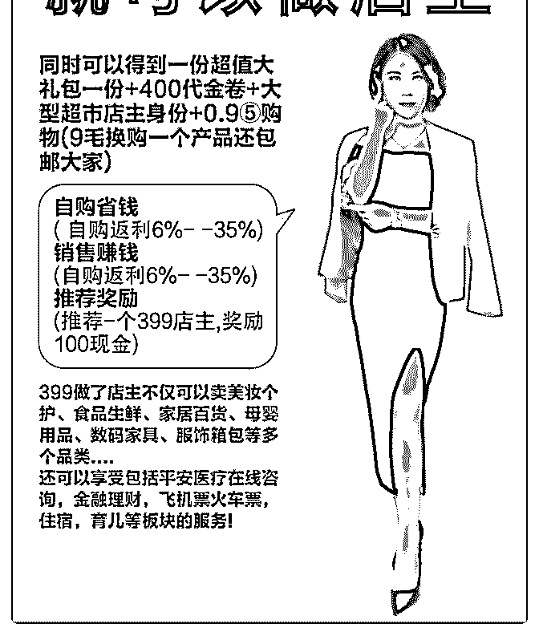

# 还有花友来问，花爷

花爷梦呓换酒钱 : 还有花友来问，花爷这个新起的社交电商怎 么样？其实之前我讲过社交电商和社区团购的区别（），也 有花友专门做了社交电商的分享（）。

得，那我再拎一次重点，社交电商一般有两个特点：

1.付几百块或者完成一定的任务，成为会员。

2.成为会员后，自购省钱，分享赚钱。 所以你做这个，赚钱的途径也是两个，要么拉别人加入会员

拿分成，要么卖货拿分成。

那这两个途径到底能不能赚到钱呢？ 拉人加会员，如果你有充足的人脉和粉丝，是可以赚一批快

钱。所以社交电商起盘的大团长，都是以前的微商团长，这

波人只要一加入，配合平台机制，赚快钱是没有问题的。之

前的社交电商包括云集、每日一淘、环球捕手等等，大团长

都赚到了钱。但这个也是快钱，短期的，因为你做大了，肯

定被 zf 约去喝茶。

所以，如果你没有人脉和粉丝的资源，也没这块的经验天 赋，你就只有交钱被别人拉人头的份。

卖货拿分成能赚钱吗？很不幸，这块很难赚钱。社交电商的 商品单价普遍不高，而且你去分销的利润率大概是 2%- 5%（如果比这个比例高，说明要么价格比市场价高要么质量 差成本低，顾客购买意愿低），单价低+提成少，想赚钱就必

须要销量特别大。

要想销量大，就要求平台的商品特别多，消费者选择才多。 注意，商品一多，对背后供应链的要求就特别高。很多人不 理解供应链的难度有多大，京东做供应链做了十几年，大部 分社交电商平台是没那个能力做好供应链的。举个例子，这 么多搞社交电商的，把会员费这一项给砍掉之后，靠卖货还 有几个能维持势头的，只有一个云集。

总结一下，不管社交电商包装的多好，现阶段所有的新平 台，赚钱快一定是靠会员费，而你能不能从拉会员这批快钱 里分到一杯羹，可以自己掂量一 下。[`t.zsxq.com/IAEIYvZ`](https://t.zsxq.com/IAEIYvZ) [`t.zsxq.com/yjmiQfu`](https://t.zsxq.com/yjmiQfu)

2019-06-25(20 赞)

评论区：

郑璐璐 : 首赞[奸笑]

亿枫 : 认同感加强万倍~

城 : 赞同，刚加入素店，机制设计还算合理，拉人头主要靠加粉软件加微商拉进群

yuquan : 高佣联盟也算社交电商吧？

花爷梦呓换酒钱 : 算

西装暴徒 : 高佣没有会员费，也不提供商品

花爷梦呓换酒钱 : 制度变种，和甩甩宝宝有点像，多级分佣导致只有级别高的才能赚钱，所以核心还是发展下线

嗯，起床了 : 花爷，你这出了点问题，分享的两个链接是一样的

关注公众号"懒人找资源"，星球资源一站式服务