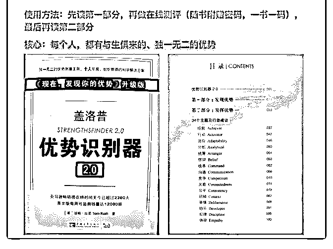

# 分享主题: 1 人 1

花爷梦呓换酒钱 : 分享主题: 1 人 1 公司: 如何科学的做一个干 得少、赚得多的斜杠青年

分享嘉宾：白一喵 嘉宾介绍：

花友们好～我是白一喵。多谢花爷邀请，让我有机会，和大 家分享在做的事儿～

自我介绍不重要，一句概括：人不三不四，经历五花八门。 早期：

正经混职场。没赚几个钱，不算混得好。 现在： 自立门户，过起了「我就是公司」的生活。 人闲（每天正经工作 2 小时）、 开心（只做我想做的事）、

钱也不少（足以支撑我的生活、还有想走就走的旅行）。

详细的个人经历太长，列了个大概。不感兴趣的，直接跳过 吧，无所谓～

-计算机专业毕业，但是个工作后再也没写过代码的假程序员

-在外企做过快速消费品品牌

-拒过美国 UPS 总部市场部的 offer，强行转行做了互联网产品

-瞎创过业（黄了）、在教育行业某上市民企干过内部创业

（黄了）、区块链行业从 0 到 1 做过产品（毫不意外也黄了）

-品牌营销、产品设计、用户运营、增长、团队管理，技能点 都点了一个遍

分享正文： 下面开始正式分享。为了读起来方便，统一把“1 人 1 公司”的

斜杠青年生活，简称为 OneBiz。

PART 1\. 什么是 OneBiz？

PART 2\. 为什么人人都该有 OneBiz 思维？

PART 3\. 从 0 到 0.1 的行动建议

PART 4\. Q&A

（分享内容都是我提前准备好的，会尽量留足时间让大家提 问，我尽力作答）

今天和大家分享的主题是：「如何科学的做一个干得少、赚 得多的斜杠青年」

先给大家一个合理的预期哈：

科学做斜杠青年，是一个系统性的工程，不可能在短短 30min 内讲完。大家别指望听了这个分享，就能得到一些非常具体 的做事方法。抱歉，真做不到。。。

用花爷的话来说，今天的分享，就是让大家“开眼”，先知 道：

-哦，原来还有「1 人 1 公司」这种生活方式存在！

-做好斜杠青年，没有我臆想中那么容易

-做好斜杠青年，也没有我臆想中那么难 了解了这些，今天我在这里 bb 的目的就达到啦～

【PART 1】什么是 OneBiz

OneBiz 全称 One-Person Business（1 人事业），指： 不依靠公司、

不依靠单一收入来源、 不依靠单一收入形式、 不成立全职团队、 仅靠自己 1 个人， 就能像公司一样运作的事业。

特别强调几件事：

（1）OneBiz 不是我杜撰的概念，海外盛行已久，也有非常多 成功案例

近 1～2 年，这个趋势也辐射到了日本、台湾地区。这个图 片，是我在东京和台北扫到的相关书籍

（图 1）

（2）我们过去认为「什么都做，肯定什么都做不好」，但这 是错误的。只要方法得当，人人都可以身兼数职，而且并不 累

给大家展示下发展 OneBiz 需要的知识系统，如图。每一个方 格深挖下去，都是一门学问。所以我才说，今天短短 30min， 只能讲个大概～～

身兼数职，还不能累死，意味着要一个人打造一个“赚钱系 统” —— 就像一个公司有很多盈利的产品线一样，而且产品 线之间还有正向的促进作用。这么说有些抽象，我甩个自己 的例子：

图片是我今年年初的“赚钱系统”，目前已有不同，但是不影 响大家理解概念哈～ 在这个系统里，有多条产品线，不仅是 多个收入来源，运行每个线的过程中得到的经验正好可以互 补，让每个产品线都越做越顺、越来越流程化，耗费精力越 来越少，给用户提供的价值质量越来越稳定

除了我之外，我在知识星球里认识的好几位星主，比如森淼

（星球：风巢）、明白（星球：多元思维），都是这样，1 个

人顶 1 个团队 —— 稍有不同的是，他两是技术背景，会自己

开发；我从不自己动手写代码，学会调用已有的各种工具， 达成我的目的就可以了。

（图 2，图 3） 3）国内市场已有关于「教你打造成功副业」的课程。 但是，我个人认为，OneBiz 不是简单的一门课就能教授的。 而是需要先发现属于自己独特优势和热情，在清晰的“自我认

知”的基础上，去发展一组事业 —— 就算做同样的事情，不

同的人会做出截然不同的样子

讲到这里，就刚好引出下一个话题：

【PART 2】为什么人人都该有 OneBiz 思维

（1）每个人都有与生俱来的兴趣、天赋，但是公司的岗位没 办法让我们充分发挥

上过班的人都懂，很少有公司能做到“因人设岗”，大多数情 况下，大家的工作中都有一大块自己不想做、也不擅长做的 事儿。

还有不少我们想做、感觉自己能做好的事，公司未必给我们 机会做。

（2）为了让我们有更多选项 在中国长大的孩子，从小到大都没有啥自主选择权，更多是

外界环境塞给我们的选项。

在工作上也一样。

通过「副业」的方式，去发展新的事业，就是为了给自己更 多选择的空间。说得直白点，就算公司开了自己，就算哪天 自己对所在的行业和事情厌倦了，还能有其他自己喜欢、又 能赚钱的备选项。

（3）为了赚更多钱，而且让自己更轻松 这是一个很反直觉的观点。我们从媒体听到的，不从来都

是“创业维艰”“辛苦拼搏才能带来财富”吗？怎么可能过得轻

松、又赚得多呢？

大家可以试着想想自己在公司里的一天。到底有多少精力， 在为自己和公司，直接产生利润？有多少精力损耗在了无意 义的事情上？

按照我的经验，拖慢赚钱效率的最大因子，是「人」。 有 3 个因素，让我们有「上班影响赚钱」的感觉：

-管理层能力不足，导致信息流通不畅、做事流程冗长、办公 室政治过头、战略懒惰战术勤奋。。。影响了赚钱效率

-员工在「逻辑清晰，头脑清楚，做事专业」这一点上，能力 参差不齐，所以合作效率低

-如果公司没有通过招聘、沟通公司文化等方式，统一员工的 价值观，在做事上很难取得共识，造成沟通和决策上的低效

相反，1 个人单干，收集信息、决策、执行，都由自己完成， 去除掉了「人」这个最复杂的干扰因素，只要方法得当，赚

钱效率远高于在公司里打工，同样也高于拉一个大团队创业

【PART 3】 从 0 到 0.1 的行动建议 我一开始就说了，今天的分享无法提供特别具体的执行方

法，因为思维改变在前，找具体操作方法在后，没办法在

30min 内完成。

不过，我可以推荐几本书，协助大家先完成做 OneBiz 的基础

—— 更清晰的自我认知。文字啰嗦，直接上图，“读点”我也

标注了

（图 4，图 5，图 6） 看完之后，有个简单的方法，可以帮助大家检验下自我觉察

的程度。见图片填空题。随后的是我的回答，给个参考。

我很独特，因为我：

-知世故，但不世故待人，懂套路，但不滥用套路

-想得足够大，行动又足够务实

-兼有浪漫、现实 2 种矛盾的特质 大家认为我：

-为人和善但是有强烈的个人原则和边界

-善良

-同理心强

-逻辑思维还过得去

-系统思考力强

-善于开导别人

-善于通过 coaching 唤起别人的潜能

-是个不靠词藻、靠真诚赢得人心的表达者

-很会教人

-有艺术家的气质和臭奸商的嗅觉

-善于延迟满足

-任性自我但是不招人讨厌

-对人对己要求都很高 我擅长：

-1 对 1 的 coaching

-面向小班教学

-系统思考

-商业策略（产品、运营、增长、品牌 4 个细分方向）

-把碎片化的信息迅速转化为实践

-审美

-把握信息差福利（语言套利、跨行业套利、跨学科套利，3

个细分方向）

-流程和方法论设计

-配合视觉辅助的抽象思考 我和别人不同，因为我：

-兼有“男性脑”和“女性脑”

-兼有多个行业和领域的从业经验和思维模式

-具有与生俱来的逆向思维和横向思维的能力

-有自知之明，自我优势和短板都非常清楚 大家会把我和：

-蔡康永、王菲、黄渤（明星）

-猫（动物）

-有趣好玩的小众日本品牌（品牌）

-caoz、辉哥、刘润（互联网大 V） 联想到一起。

我的特别之处在于：

-不偏激、不非黑即白

-能在脑子平稳兼容完全相反的两种观点

-童颜童心 + 脸皮厚 注意哦，我可不是拿各种好词，往自己脸上贴金。这里写的

每一条，我都可以拿出具体的依据。我也能清楚的写出，每

个优点背后对应的缺陷。

这个回答需要逐步精简，最后就成了“个人品牌”最基础的构 成元素。不过先要冗余，才能谈得上精简，对不对？

我的分享，先到这里。接下来的时间，大家直接提问吧～～

～～～～

如果我过去有写过相关的文章，我会直接抛链接，指出要 点；

如果我以前没写过，我就在这里尽力作答。 争取让大家尽可能多的，得到新信息。 Q&A：

1、问：你是从什么时候决定自己可以做自由职业的？

答：去年 7 月离职，本来想玩几个月再说。玩了一阵子太累 了，就做做咨询，发现现金流还可以（当时吃不饱饿不死的 状态），就想着，干嘛不自己做………然后就到现在了。

2、问：每天工作 2 小时，这 2 小时的工作内容是什么？剩下的 时间在做什么？

答： 制定策略、制定规则、把平时碎片写作 or 收集的素材整理成

长文章，都在每天 2 小时里做完。

其他时间，状态不好就玩；状态好就读书、收集灵感、总结 经验、分发自己的内容、在知识星球里更新、和其他 OneBizer 谈可能的合作…………

3、问：对转行做餐饮的小白有什么忠告 答：做任何事情，需要对要发生的事情有全盘的掌握。如果

你没做过，又不能提前预知有哪些重要步骤、可能的坑在哪

里、对从业人的核心要求是什么，那一定会一做一个坑 ——

付出的代价会远远超出你的预估

4、问：一人一公司的状态，可以长期从事并稳定收益吗？ 答：请看这篇：

（图 7）

5、问：您一开始做咨询，流量是从哪里来的？ 答：首先明确一下，我的第一个客户和现在的长期客户，没

有一个动用我的校友资源。

先写公众号，立住专业度、权威性，再通过弱关系（半生不

熟的朋友引荐） —— 客不靠获取、靠引。

另外，留存和推荐、以及现金流，重要性超过拉新。 我做了半年，公众号才不到 3000 粉，不影响我的现金流不

错。

6、问：谢谢一喵，多种能力交叉会不会反而是累赘，开展一 项业务是不是更容易让业务主动链接与被链接。

答：围绕核心优势展开，就不会。核心还是清楚的自我认 知。

7、问题：一人创业，如何平衡好心态，偶尔会操之过急，偶 尔懒散无力，患得患失的，做事不起劲

答：看这两篇

一定要和把做事钱关联上 - 粉丝数、活跃、发帖量、十万+、 名气，都不是本质，持续稳定的现金流才是第一。我从 1 月 1 号的第一篇文章开始，就在分销，就在赚钱。

还有，要务实，不要看不上赚 1 块钱

目标聚焦了，个人的使命感在做事中慢慢清楚了，银行卡里 入账越来越多的时候…

放心，到那时候，你真的没有心思焦虑的(￣▽￣)

8、问：白天看群里闲聊，提到课买太多、书买太多、知识星 球买太多，看不过来，想要断舍离？

答：买得多不是问题，看不过来处理不过来，是自己的信息 处理能力有瓶颈没突破

继续往下挖一层：

信息源头扩大了，我们需要用一个漏斗“漏出”自己需要的： 漏斗怎么来的？基于自我的认知、自己知识体系的建立。 没有这个，连输入什么关键词都不知道。 时间差不多了。最后再说两句。大家要好好珍惜花爷，要想

办法榨干他这个宝藏男孩（爷爷？）～尤其是掘金案例。“开

眼”真的真的太重要了。看的时候，把自己的喜恶放在一边，

先“知道有这么个事儿”，再明白“这个事儿具体操作起来没想

象中那么简单、也没那么难” —— 要知道足够多的选项，接

下来考虑具体选什么做副业，才有得选。

[再次谢谢花爷邀请～](https://mp.weixin.qq.com/s/yHzGauDhyWegeaU35inWHw)[没有基石，打得了小战役，建不了大王](https://mp.weixin.qq.com/s/yHzGauDhyWegeaU35inWHw)  [国](https://mp.weixin.qq.com/s/MAbqiEF-cFkY8VL28G7yAw) [2019](https://mp.weixin.qq.com/s/MAbqiEF-cFkY8VL28G7yAw)[年第](https://mp.weixin.qq.com/s/MAbqiEF-cFkY8VL28G7yAw)[1](https://mp.weixin.qq.com/s/MAbqiEF-cFkY8VL28G7yAw)[天，聊聊信息获取能力 能自己赚第](https://mp.weixin.qq.com/s/MAbqiEF-cFkY8VL28G7yAw)[1](https://mp.weixin.qq.com/s/MAbqiEF-cFkY8VL28G7yAw)[个](https://mp.weixin.qq.com/s/MAbqiEF-cFkY8VL28G7yAw)[100](https://mp.weixin.qq.com/s/MAbqiEF-cFkY8VL28G7yAw)[块](https://mp.weixin.qq.com/s/MAbqiEF-cFkY8VL28G7yAw)  [吗？](https://mp.weixin.qq.com/s/MAbqiEF-cFkY8VL28G7yAw)[+|+](https://mp.weixin.qq.com/s/MAbqiEF-cFkY8VL28G7yAw)[最适合普通人的小本创业启动方式和背后的内在逻辑](https://mp.weixin.qq.com/s/MAbqiEF-cFkY8VL28G7yAw)  [2019](https://mp.weixin.qq.com/s/rxyFV019lXat9bMOw12ptQ)[年](https://mp.weixin.qq.com/s/rxyFV019lXat9bMOw12ptQ)[2](https://mp.weixin.qq.com/s/rxyFV019lXat9bMOw12ptQ)[月第](https://mp.weixin.qq.com/s/rxyFV019lXat9bMOw12ptQ)[1](https://mp.weixin.qq.com/s/rxyFV019lXat9bMOw12ptQ)[天，继续聊信息获取能力](https://mp.weixin.qq.com/s/rxyFV019lXat9bMOw12ptQ)

2019-06-21(33 赞)

评论区：

fjh : 谢谢！太有帮助了！

关注公众号"懒人找资源"，星球资源一站式服务