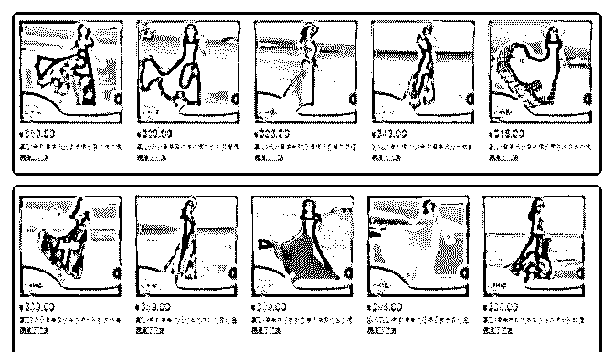

# 分享主题：全店动销

花爷梦呓换酒钱 : 分享主题：全店动销玩法（适用淘系平台） 分享人：邹虎 电商淘系平台连续创业者

分享背景：淘系免费流量获取越来越难，单品爆款搜索流量 同比去年降了 50%，付费流量越来越贵，针对这些问题就衍 生出来了全店动销玩法。

分享正文： 大家好，我是今天的分享嘉宾——邹虎。

这里我先和大家解释下全店动销的玩法，全店动销指的是通 过统一商品风格，让用户在店铺多个商品中逛起来，各个商 品产生联动，从而提高购买转化。具体做法是，一次上新多 个风格统一的商品，然后适量的给部分商品补单或者开直通 车引流。用户通过直通车进店后，因为我统一了商品风格， 用户对一系列同一风格的商品都会感兴趣，就会增加点击和 购买的概率，从而给全店的商品增加搜索权重和付费转化， 最后形成小爆款群。

我再举一个淘系平台-天猫商城-女装类目下二级连衣裙类目案 例，来帮助大家理解。

大家可以先淘宝搜索下店铺：荷浮旗舰店，大家可以稍微看 下。

（叫图片一二）

全店做的都是长款连衣裙，款式多，视觉风格统一。目前月 成交量在 1600 件，退货率在 35%，实际确认收货在 1000 件左 右。衣服的出厂价在 70-90 左右，毛利润可以做到 70%-80%， 月利润在 5 万左右。

大家可以看到图片的价格，为什么定价做 300 左右的客单，这 个客单意味着高利润，70 到 80 的毛利润，另外有工厂配合， 大码的可以改小码，可以打样衣，一件也可以做。如果没有 工厂配合 可以考虑前期去市场拿货，成本会贵到 30-50。

全店动销模式有个厉害之处就是流水线一样复制利润，虽然 出货拍摄工作量不小，但是走通了可以直接复制，图片拍摄 找的外包，有专门摄影公司在做。

那么我再讲一下推广的玩法，上面连衣裙的推广成本 50 元一 件，主要是直通车的成本，但是直通车只是负责引入精准流 量，精准意味这流量少，大流量主要还是靠的上新，上新的 成本比以前用直通车推的成本低。

上新带流量，原理是这样，你的店铺同一个二级类目，比如 连衣裙，一次性上新很多，风格全部统一。上新之后，少量 的补一点单，这时候淘宝规则会给你分配流量。就完成了从 获取流量到转化订单的闭环。如果补单效果好，可以再开直 通车，有了流量之后，因为你打批上新、商品风格统一，用 户购买几率会大大增加，从而再获取更多流量。

这个玩法主要就是利用淘宝的规则，上新的商品，前期都会 补单+少量的付费来获取流量，不做以前单品爆款的思路。上 新指的是上同类产品不同款式，补单就是 shua 单。但是要注意 的是，补单很重要 ，要注意补单人的标签，今年标签很重

要 ，要找符合产品人群的人补单 ，切记不要刷流量，不精准 的流量千万别要。

我们用 销售额=流量*转化率*客单价*复购率 这个公式来逐个 拆解这个模式

1\. 流量 我们可以通过淘系平台生意参谋这个工具看到店铺的主要流

量是搜索流量+直通车流量，

搜索流量的获取是一个徐徐渐进的过程，前期做基础销量评 价，系统会一点一点分配流量做测试，如果各方面数据反馈 都不错，就会继续分配更多的流量，直到一个临界点开始逐 步减少。 直通车流量就是付费流量了，花钱买就可以，因为 全店定位已经是很清晰了是连衣裙女长款，那么直通车就要 做的就是有限的资金获取更多的精准流量了。

2\. 转化率 影响转化率的因素主要是流量精准度，评价，买家秀，问大

家，竞品。所以前期上新一定要做评价和买家秀，问大家可

以自己操作大家都关心的问题，竞品这个自己控制不了。 全

店定位都是连衣裙长款在加上高频上新和统一拍摄风格也是

会影响转化率的。

3.客单价 退货率高，高频上新，势必会造成积压库存，所以毛利润一

定要高。通过数据分析客单价 300 市场容量也不错，所以就选

择了 300 左右这个价位段。库存控制这一块有一个小细节可以

注意一下，工厂可以大码改小码。生产端这块是直接有一个

10 人左右的小工厂做配合。

4.复购率

复购率是这种模式的硬伤，因为只是单纯的卖货，而不是卖 信任。出发点不同，结果也不同。

淘系的玩法基本上都可以这样去拆解。 总结：全店动销玩法核心靠的是多款联动，高频上新，风格

统一。

优势是：可以复制，补单少，推广费少，风险小，利润率 高。

2019-06-20(14 赞)

关注公众号"懒人找资源"，星球资源一站式服务