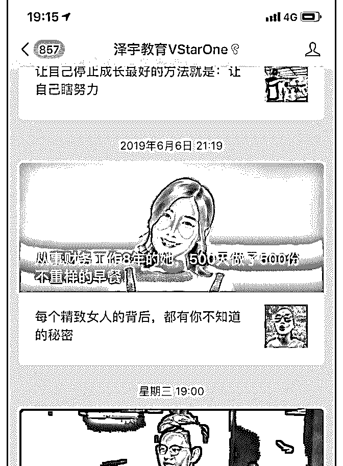
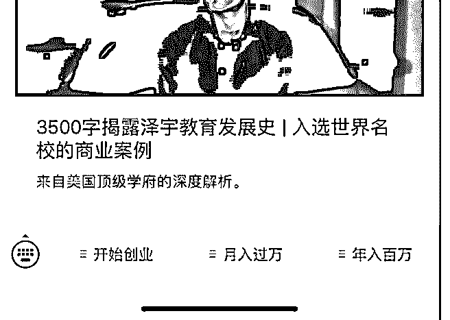

# 花爷了解过泽宇教育

(提问)匿名用户 : 花爷了解过泽宇教育吗 貌似通过卖课程教打 造个人品牌的 好像拉人买课还会有提成 但看他们的宣传文案 没啥干货 但朋友圈和知乎弄得挺高逼格的

这玩意是新型传销吗 个人品牌咨询到底是个啥

2019-06-17

回答：其实还是老式微商的新玩法。 微商发展下线，需要多

级分销；多级分销，就需要足够的利润空间；而课程类产

品，制作成本是固定的，卖的越多，摊到每堂课的成本就越

低，利润空间足够大。 所以课程这样的虚拟产品，最适合多

级分销了。 你可以看到这个泽宇教育的目标用户，其实和微

商的目标用户重合度很高，只不过玩法相比老式微商，有所

升级。 先包装一个高大上的致富故事（不得不说泽宇的致富

故事包装的挺好），然后卖基础的致富课程，课程里教什

么？教你怎么包装个人品牌吸粉，然后…帮泽宇卖课赚钱。

这时候有一部分人心动，交更多钱成为代理，帮泽宇卖课。

循环往复。 强调一点，了解泽宇的运作原理，我希望大家不

要忙着批评人家割韭菜（虽然确实有一定的成分，类似的模

式花爷看得太多了），而是想如何把这种模式用到自己的业

务上。理论上说，不管你卖货招代理、还是做知识付费想扩

大规模，都可以在这个原理的基础上做应用。(14 赞)

评论区：

彬帅 : 能不能帮你打造个人 ip 是一个问题 泽宇和社群空间站类似 由打造个人品牌入手 结果变成了 X 脑卖课 但是模式是对的

会被认为是传销 我觉得主要是课程内容和方向的问题

花爷梦呓换酒钱 : 有干货，这个模式是可取的

彬帅 : 多级分销就是裂变快 但是安全风控要搞好吧

亿枫 : 因为业务因素，自己会接触到很多品牌的微商群体，有学过类似的这些知识，不交流，你就单一看微信就觉得哇，

好牛！ 一旦交流几次，感觉太低端，说白了就是又洗脑又被鸡血，花架子！！！心态浮躁，思维片面 真正有思想有深度的

人，不被吸引，我还是喜欢花爷的观点，适当的包装可以有，对自己该有的价值和能力不能偏离太大，低调而有内涵的做

事[微笑]尤其做长线“生意” 模式上对，直觉是“活”不太久样，也许自己的想法过于古板吧！

花爷梦呓换酒钱 : 首先可以用代理和产品分离的方法规避风险，代理收益在一个小程序/app 上，销售产品在另一个小程

序/app/网页上。其次，不做到特别大的规模或者短时间内爆火，没人有空管你。

花爷梦呓换酒钱 : 所以把产品做好，模式上借鉴有效的一部分就可以了。现在的互联网玩法，其实也就是研究怎么把传统

的非法玩法改得合法而已…

亿枫 : 认同，过了 3 级，又搞大了，下一步，就是罚款蹲大牢了（我这边有一个还在大牢没出来）

关注公众号"懒人找资源"，星球资源一站式服务