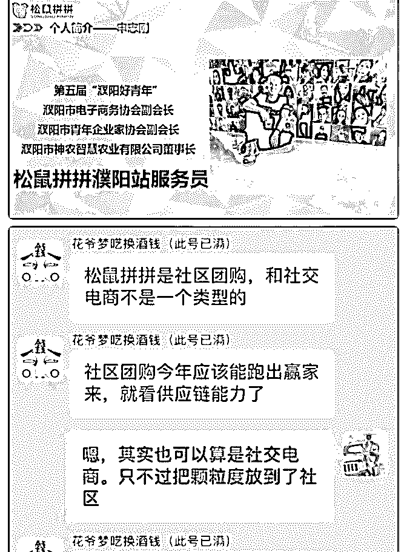
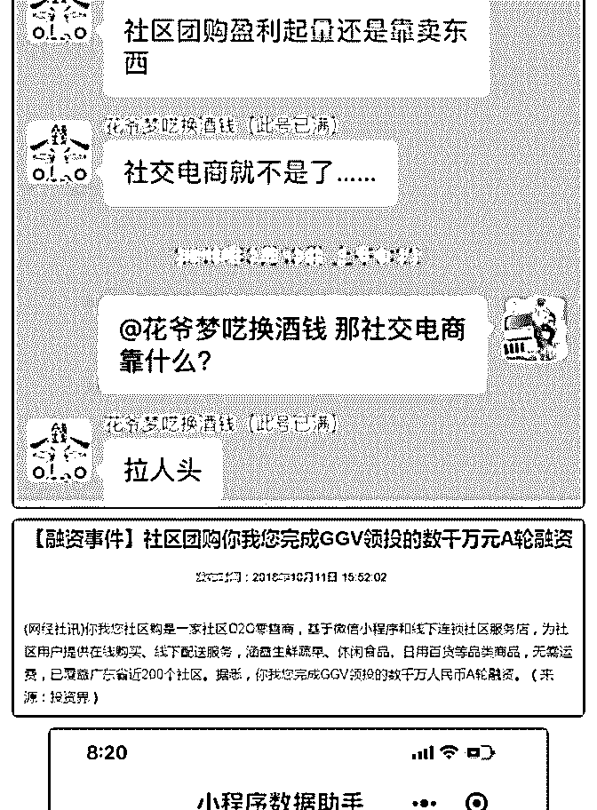
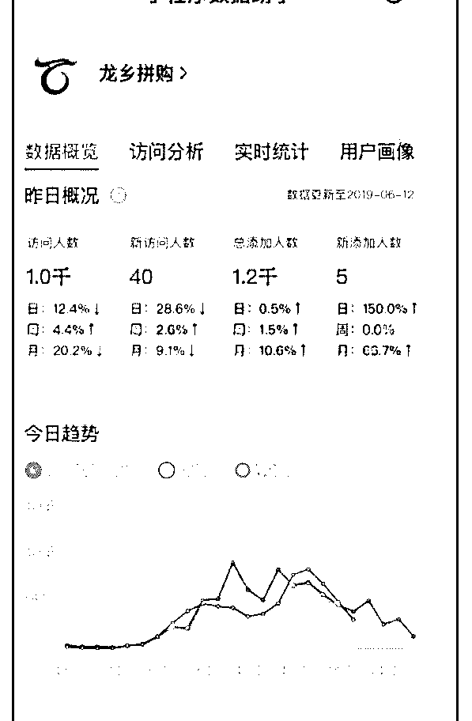
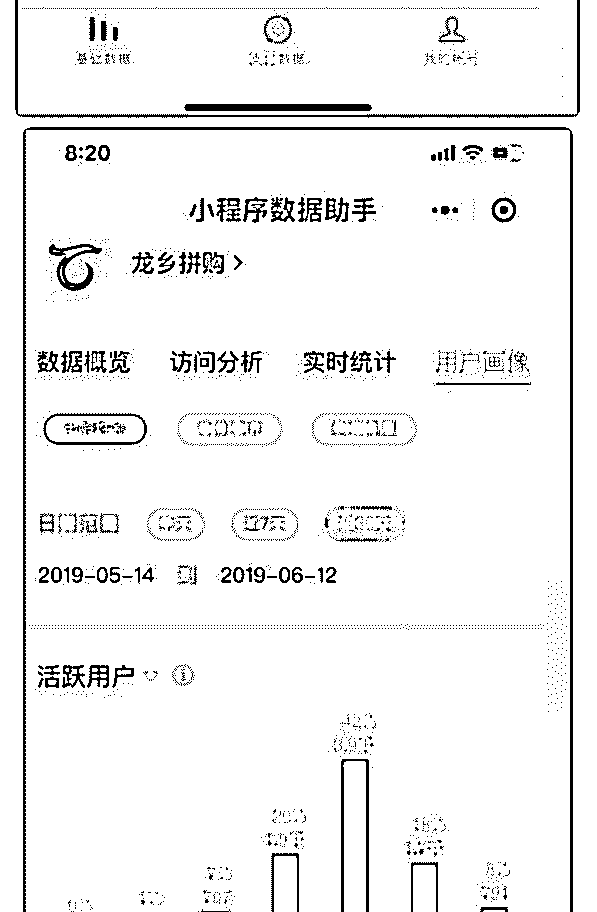
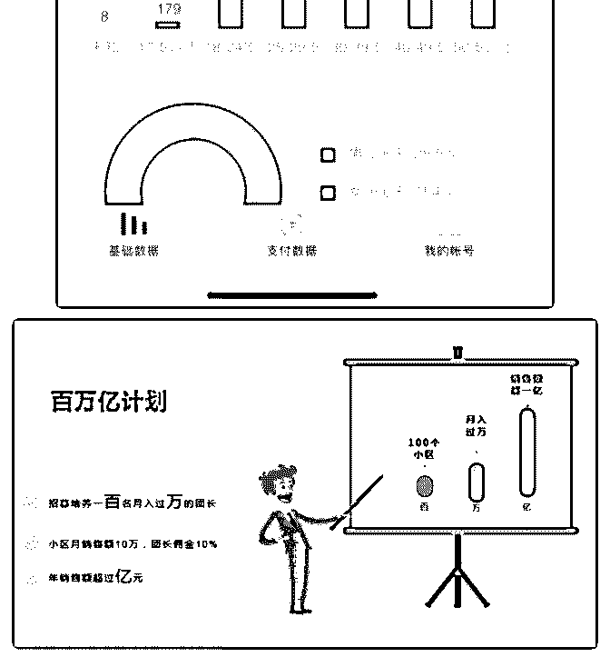

# 分享主题：投入 20

花爷梦呓换酒钱 : 分享主题：投入 200 万做社区团购后的思考 和总结

分享嘉宾：申志刚 嘉宾介绍：去年下半年开始关注社区电商，在家乡县城进行

了小范围测试，效果很好，今年 5 月份开始在市区做，目前已

经试运营一月，日均交易额 2W

分享正文： 大家好，我是社区拼团网站松鼠拼拼濮阳站的负责人申志

刚，同时也是第五届“濮阳好青年”

，濮阳市电子商务协会副会长，濮阳市青年企业家协会副会 长，这个有助于大家理解我的操作思路。

（图 1） 大家都知道这两年社交电商和社区电商发展的如火如荼，社

交电商呢我没有深度参与，社区电商我可以用我的经历，以

我的视角和认知，跟大家做一个分享。分享共计 2000 余字，

占用大家 40 多分钟的时间。感谢花爷提供这个平台，让我能

够跟大家用一种特别的方式认识。

之前花爷曾经跟我说过一个逻辑，社交电商和社区电商最大 的区别是什么？社交电商靠拉人头，社区电商靠挣差价。这 也是我当时选择松鼠拼拼的原因。

（图 2）

所以从这个角度，我必须的感谢下@花爷梦呓换酒钱（此号 已满）

什么是社区拼团？ 准确的定义，大家可以去百度，我说我的理解和认知，所谓

社区拼团，就是以社区为颗粒度组织团购，每个社区设置一

名或多名团长，团长负责组织社区居民进群，并分享产品给

客户，客户购买后，次日将产品配送到团长处，客户自提，

完成交易流程。

为什么做社区拼团？ 去年下半年，我看了一篇文章说你我您社区融资了数千万人

民币，当时就想这个模式好在哪里？为了验证这个模式，我

做了两件事，第一，用自己的思维逻辑来思考社区拼团的逻

辑十分成立，第二，在我所在家乡的小县城做了实验。

（图 3） 在此之前我做电商做了 4 年，特别认可刘强东说的一句话，一

个业态替代另一个业态一定是提高效率降低成本。那我就在

想社区拼团是不是提高了效率，降低了成本。说到这里，我

想提一下我对新零售的理解，传统零售“人找货”——>新零

售”货找人”。

社区拼团是如何提高交易效率，降低交易成本的呢？因为是 满足的日常消费场景，我这里那超市做对标

1、提高交易效率（资金效率、节约时间）

资金方面：社区拼团本质是预售，理想情况下只有客户下单 才会去采购，资金周转特别快，平台是过了 24 小时的售后期 就把钱转到指定账户，给供货商可以选择有账期或者没有账 期。

时间方面：客户不用再出门，翻翻小程序就可以完成购买动 作。

2、降低成本（损耗、配送） 损耗，因为是预售，所以采购数量是可以确定的，不像超市

不知道能卖多少，这样就可以降低损耗。

配送：次日配送到团长手中即可，实现集约化配送，节约配 送成本，这里多说两句，为什么说社区拼团更适合 3、4 线城 市，在北京的履约成本达到了货值的 13%，意思是每 100 元销 售额，就会有 13 元是配送成本。在濮阳这样的 4 线城市我们的 履约成本可以降低到 5%左右。

县城的实验 刚才提到我在县城做了实验，效果特别好，很快发展了 100 多

个村的超市便利店老板当团长，很快就日均销售额过万，给

我最大信心的一件事是有一次我们做地推，在一个小区，一

天做了 170 多单，销售额 3000 多元。这个数字本身没有意义，

但背后的数据让我很诧异!

然后我问地推小伙伴了两个问题，第一，谁买了我们的产 品，第二，为什么买？

他们告诉我，大部分是 20~50 岁的女性购买的，至于为什么

买，她们一般会问产品价格，当得到答复后发现不比超市 贵，这个时候我们的团长就会出来，跟客户沟通，大概话术 是这样的“姐，我也是这个小区的业主，我觉得龙乡拼购这个 平台上的产品特别好，所以就想推荐给咱们邻居，我每天都 在这，您如果不满意随时过来退货就行”只要问过产品价格， 跟团长沟通过的居民，80%都购买了产品，80%，这个转化率 让我很吃惊。

在这里跟大家分享两个数据

（图 4，图 5） 大家可以看到，30~39 岁的女性用户占到了很高比例，达到了

42%

于是我就决定去市区做，做的时候面临一个选择，是自己做 平台还是加盟全国性的平台。后来发生了一件事情，让我决 定走加盟的路子。我有一个农场，做的很多蔬菜，我拿白萝 卜做了一次引流，1 分钱一个白萝卜，白天预告，晚上开抢， 结果，瞬间涌进来 3 万多人次，把我的服务器搞挂了。为了更 稳妥起见，我决定走加盟的路子。

国内平台不少包括你我您，兴盛优选，松鼠拼拼、还有小区 乐等，我先去杭州考察的小区乐，负责招商那哥们，跟我聊 了 1 个半小时，一个小时都在聊他们上面的环球捕手，具体不 展开了，属于社交电商的范畴，就是花爷说的靠拉人头。所 以，在我理解小区乐就是帮助环球捕手洗线下流量的一个工 具，（个人见解）这个不符合我的风格，果断放弃。

后来了解到松鼠拼拼，是美团系的创业公司，又有阿里铁军 代表人物阿干，干嘉伟。去总部培训的时候，ceo 杨俊说了一 句话，我们平台挣的是资本和数据的钱，代理商挣的是差

价。听完这句话，我心里踏实了。跟我想的一样。借助松鼠 拼拼的平台，我就可以实现我的目标。

我选择项目有一个考虑，就是跟收保证金的合作，不跟收加 盟费的合作。背后的逻辑是，收加盟的可能就是惦记你的加 盟费，收保证金的，反而是想跟你一起把市场做大，共享蛋 糕，我做京东是这样，美团外卖也是这样，美团外卖每年从 我这里至少拿走 50 万，但是我觉得很开心，因为，我挣得更 多

接下来，谈一下我的一些认知。 首先，对这个模式的认知，表面上看这是一门生意，但我愿

意深挖一层，透过现象看本质，我认为更有价值的应该是通

过销售产品，形成平台、团长和消费者（社区居民）的信任

链接，一旦信任链接形成而且足够强，我就可以做很多事

情。

比如，有的核心团长，想开花店，我就可以给她投资，然后 跟她共享客户，开美容院，做服装等等，都可以。可以说， 松鼠拼拼就像一颗大树，只要有足够多信任我们的客户，就 能够结出来很多果实，

其次，这个模式可以很好地解决农产品上行问题，可以助力 脱贫攻坚，帮助农民增收，这是实现企业社会价值部分，不 做展开。

再次，这个模式里面有四个角色，供应链，平台，团长，和 消费者，我认为，最重要的是供应链和团长，因为团长是产 品和信任的传递者，供应链解决产品的品质和价格问题，所 以团队分工必须明确，有人主抓团长，有人深入供应链。

最后，我选择的团长的标准，首先是业主，其次是女性，大 部分是宝妈，因为宝妈没办法去工作，但是可以在家就可以 挣钱，她们会比较珍惜。而且因为是业主，更容易取得邻居 的信任，也容易跟物业进行沟通，更重要的是不会轻易换平 台。但也有风险，比如，到暑假带孩子出去玩，就会导致所 在小区无法提供服务。

说一下成绩，我再濮阳做社区拼团是从 2019 年 5 月 8 日开始试 运营的，目前有近 100 个社区已经开通服务，日均销售额，2 万左右，盈亏平衡点，据我们测算应该在日均 2.5 万左右。产 品的毛利率，统常在 20%~30%之间。预计我们会在 7 月份实现 盈亏平衡。

（图 6） 个人认为这个模式非常适合在 3、4 线城市创业，未来可期，

谢谢大家。

2019-06-14(13 赞)

评论区：

花爷梦呓换酒钱 : 社区团购这个模式在小城市确实有市场，而且不一定要做 app 或者小程序，微信群发单+面包车送货就是

最简单的模型

Christie : 社区团购广深等一线可行吗

花爷梦呓换酒钱 : 一线都是大平台做，个人只能做下面的区域代理，想把一线城市供应链吃下来很难

多闻 : 花爷，我们这边也想做社区团购，可以联系到申总向他请教几个问题吗？

花爷梦呓换酒钱 : 可以啊，微信号：shenzhigang3333

多闻 : 谢谢花爷！

