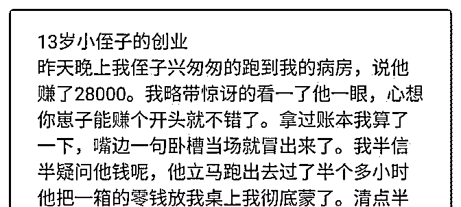
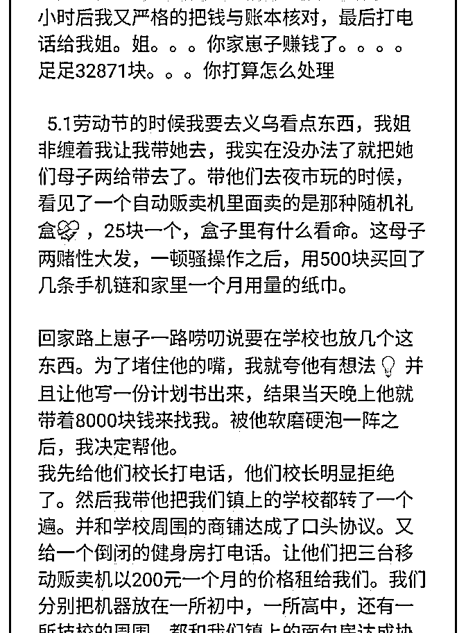
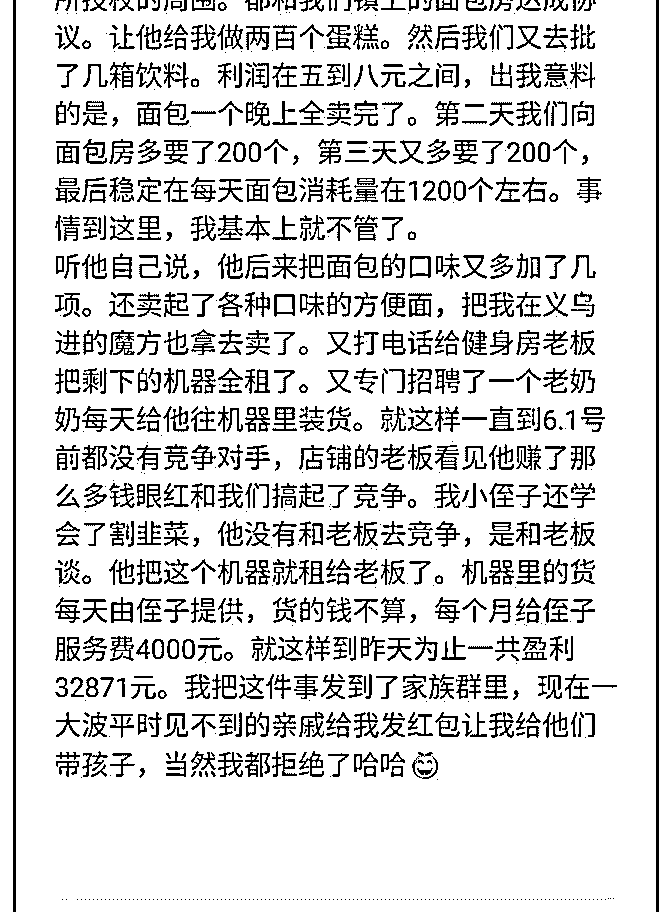

# 舅舅带 13 岁的侄子

花爷梦呓换酒钱 : 舅舅带 13 岁的侄子创业赚了三万块钱，最近 很火的一个案例。看这个案例的反应，可以反应出不同的层 次：

1\. 呵呵，肯定编的

2\. 卧槽太牛了！

3\. 故事应该有一定美化，但还是能总结不少道理

4\. 搞清楚这个玩法的细节，看看是否可行

5\. 这个案例可能不适合我，但案例其中的一部分，可以为我

所用

五个层次，层层递进，你是哪一层？

2019-06-14(11 赞)

评论区：

北城之北 : 第 4 个。

花爷梦呓换酒钱 : 现在第五个角度想，自媒体是可以写这种鸡汤案例（哪怕是假的）放出去传播引流的

白一喵 : 6.这个案例可能不适合我，但案例其中的一部分，可以为我所用，立刻实践看效果；另一部分我用不了，但是有价

值，包装一下反手卖给别人[奸笑] （我偏要自己造一个选项[调皮]）

花爷梦呓换酒钱 : 反手包装给别人不是为我所用吗……

随便 : 7.这个案例和花爷圈里的这些案例有哪些异同，当时的背景，场景和资源是什么，我没有这些怎么做到类似效果

花爷梦呓换酒钱 : 这个可以有

花爷梦呓换酒钱 : 你已经会由点到面最后再归纳出新的点了[机智]

白一喵 : 可以可以，没毛病 小花花侬真是认真(￣▽￣)

