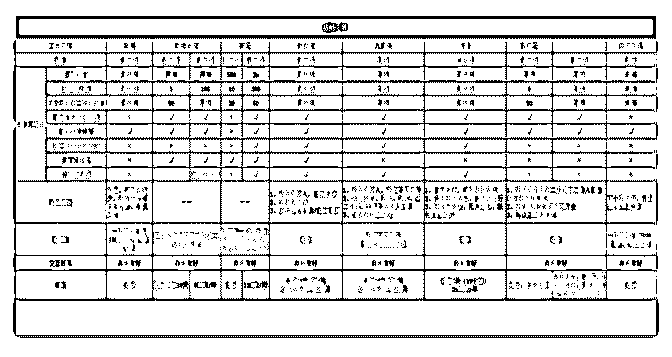
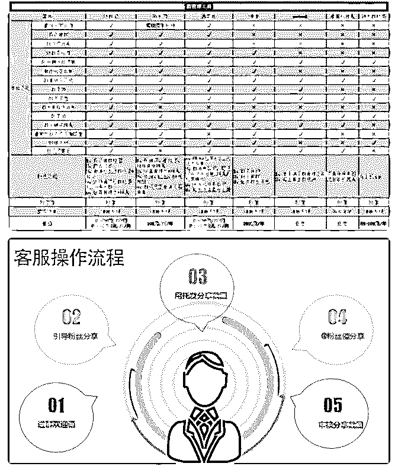
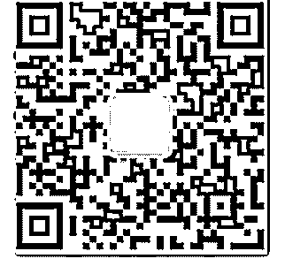

# 分享主题：用萌宝投

花爷梦呓换酒钱 : 分享主题：用萌宝投票活动吸引百万女粉 分享嘉宾：陈亮

嘉宾介绍：陈亮，深圳教你网络科技创始人，12 年互联网经 验，06-10 年做网络电话销售，自学 SEO 优化排名接订单，自 学做网站建设，成为 28 推一期 10 组成员，11 年-14 年在上海创 业做网站建设和微信第三方服务平台，获得第一桶金，15 年- 19 年进入新媒体行业做微信公众号，通过萌宝投票活动和群 裂变获取微信粉丝。

分享正文： 大家好，我叫陈亮，深圳教你网络科技创始人，有 12 年互联

网经验，现在主要在深圳做自媒体，今天给大家分享下我新 媒体的经验和踩过的坑。

因为之前的工作关系，一直在互联网行业，在 15 年的时候进 入新媒体行业，那时候抓住了一个机会，相信很多人也做 过，就是萌宝投票活动。

说起萌宝投票大家大都见过，甚至因各种原因参与过投票活 动，对于一个新媒体人来说萌宝投票活动是一个非常好涨粉 的机会，那么一个萌宝活动要怎样才能做起来呢？

由以下几个因素：

1、投票系统

2、活动参与人员

3、活动奖品 对于投票系统，之前踩过很多坑，各种测试，最终选择了安

装在 DZ 系统上的投票插件禾今，他帮我解决了系统问题，当

然还有很多投票系统，我选择禾今的原因有以下几点：

1、安装简单，只要安装 DZ 系统并购买插件即可，作者还会 帮忙安装；

2、投票功能全，基本上投票的功能都有了，包括仿刷票、奖 品内定等；

3、可以根据自己的情况做二次开发，这个对投票活动的持续 性起到了很大作用；

4、还有贴图库等图床工具，图片文件分离解决了图片过多访 问过慢的问题；

对于如何拉人来报名参加活动呢？ 这是我踩过的又一个坑，很多人知道做活动没人来参加就尴

尬了，我刚做萌宝活动的时候也是没有粉丝的，没有启动

量，那怎么办呢？

之前我就有先搞了一个本地的萌宝大赛，奖品去找商家赞 助，印刷易拉宝等宣传海报让商家一起帮忙报名，还发传单 等方式去拉人报名，但是发现这样很累，效率很慢，报名参 与人员也不一定高。花费 1 个月左右时间找商家赞助和拉人报 名，第一场活动搞起来了，但是这样的活动效率太慢，也不 是所有人都可以去找商家洽谈合作的，没法放大，怎么办

呢？

在第一次活动中有使用介绍人来报名给红包这一方法，发现 还挺管用，所以在第二次活动开始时，就在投票活动首页、 内页等各种地方写明：报名+客服微信即可领取 9.9 红包一 个，介绍报名还可以领取 9.9 红包一个，这样活动就慢慢展开 了。

之前拉赞助的时候也发现到线下去拉赞助不费时费力不说， 拉来的赞助还不一定受欢迎，商家都是要营销的，需要到店 等，需要花很大精力去平衡。后面干脆就自己购买奖 品，iphone 手机、平衡车、各种奖杯奖状、宝宝喜欢的电动车 等直接在 1688 上采购，这样省时省力，成本会高些，但是对 于当时来讲时间就是金钱。

做完第二场活动的时候发现要开始第三场活动又是那么艰 难，如何简单做好每场活动的衔接呢？投票系统搞定了，奖 品又自己在 1688 上购买了，每次活动积累的参赛人员也有， 加上红包吸引介绍人来参赛，咱的活动又是真实活动，奖品 都是免费快递到家，积累了一定的信任度，最重要的，那么 剩下如何更简单的让活动持续下去就是我要解决的问题。

每次活动的投票时间都是持续一个月，我就自己修改禾今投 票系统的报名链接，在活动进行到一半时，就修改报名链 接，不允许在本活动进行报名，而是倒逼用户到第二场活动 上进行报名，这样就把活动与活动之间的连续性解决了。

后面为了多涨粉，又一次修改禾今系统，在一个粉丝投票成 功后提示粉丝识别二维码还可以为他投上一票，在客服工作 时也做好提醒参赛人员告知他的朋友可以多投一票。

这样持续做了半年多，每场活动都有涨粉 10 多万，每个月可

以做几场活动，就收获了百万粉丝，当时有几家做萌宝活动 更猛的，都是疯狂在做萌宝活动，每次报名人数都上万，涨 粉更是疯狂，后面做的人多了，加上各种媒体曝光，慢慢就 没太多效果了，也有段时间投票活动演变成用钱刷钻帮朋友 投票的，这种就解决了用户找人刷票的问题。

后面还有本地的投票活动演变成跟本地幼儿园、培训机构等 有儿童的机构合作，让他们提供报名人数，投票团队提供奖 品，让粉丝刷钻来提升排名，投票团队又赚钱又赚粉。

第二个坑是关于群裂变的，相信现在还有很多人在做群裂 变，各种机构也在做群裂变，因为群裂变确实是低成本获客 的好方法。

要做群裂变也是需要有群裂变系统，我们之前做的时候系 统，就纯手工操作，活码工具用草料，但是这种方式非常原 始，草料也经常封我们的进群活码，这个时候非常苦恼，还 一度差点把这个项目结束掉。

后面就自己合作了一个活码系统，配合 wetool 工具做客服工具 来做，群裂变是比较苦逼的，我们没有现在像进群宝这样的 工具，都是纯手工，人员也是两班倒，早上 6：00 就得上早 班，晚班 00：30 才下班，每个班的工作时长超 12 小时，导致 很多人吃不消，团队不稳定。

也有遇到各种来捣乱的人，刷名片的人，其实他们自己去做 群裂变也可以涨粉丝，不比做刷子来的少，也有遇到海报因 分享过多，被朋友圈屏蔽（朋友看不到你分享的海报），我 们就采取换海报的形式，现在个人微信号封号也越来越严， 我们又研究如何养号，保持活跃度不被封号。

因为群裂变的火爆，现在市面上出现了很多群裂变的工具，

比如建群宝、爆汁裂变、小裂变、有机云、八爪鱼等。

每个工具都有他的优点和缺点，可以根据自己的情况去选 择，我这里把一张各种工具做对比的表格分享给大家，希望 对大家有些帮助。

（图 1，图 2，图 3） 比较少在外面分享，大致的情况分享到这里，有什么问题可

以问我，也可以加我微信详细沟通，谢谢大家！

（图 4）

2019-06-12(7 赞)

评论区：

花爷梦呓换酒钱 : 这个投票裂变的策略曾经是一大杀器，演变出不少玩法。现在裂变活动太多，效果有所下降，需要注意

做好诱饵、留存和转化了。

