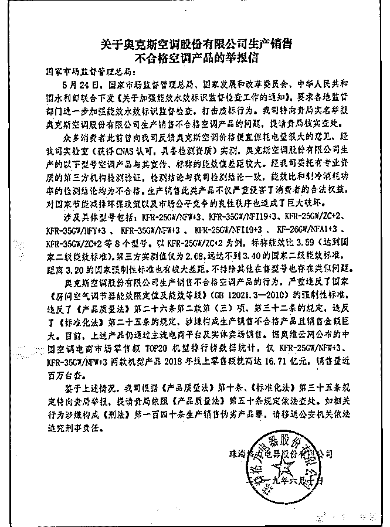

# 今天格力很有意思，

花爷梦呓换酒钱 : 今天格力很有意思，写了封举报信，举报奥 克斯的空调与宣传不符。

还是那句话，别看热闹，去理解新闻背后的商业世界。你有 没有想过，格力为什么跟奥克斯过不去？因为格力有点顶不 住奥克斯了。

你没有看错，可能很多花友觉得格力是空调界的老大。不不 不，看第一季度的空调行业数据，无论是销售额还是销售 量，格力都不是老大， 甚至老二都不是，只能排在第三。

排在格力前面的，空调老大是美的，老二是奥克斯。 奥克斯凭什么这几年反超格力成了行业第二？因为奥克斯虽

然只有格力 70%的质量，但只要格力 50%的价格，在下沉市

场，低价的奥克斯还是占了上风————你看，花爷说过很

多次，很多行业里的龙头都不是质量最好的那家公司。

了解这些，你再反过来看格力的这次举报，就显得非常聪 明。举报奥克斯的质量问题不是目的，举报打不垮竞争对 手，重要的是格力要借此强调自己的品质优势，不能被奥克 斯的低价策略拖垮。

双方来回的商业策略角力，确实值得回味。不过按照以往经 验，用不了多久官方就会出面调停了——可能双方过招的同 时，也在等着官方出面的那一天吧？

细细琢磨，很有意思。

2019-06-11(23 赞)

评论区：

碧海潮生 : 格力贵啊，有买格力的钱，再加点直接上三菱大金了，现阶段大家手头紧，宁愿要便宜的，质量凑合就行了，

看拼夕夕就知道了

敏敏 : 格力这一招公关，出奇制胜，符合董小姐的做事风格，哈哈

晨磊 : 这事估计也不疼不痒吧

