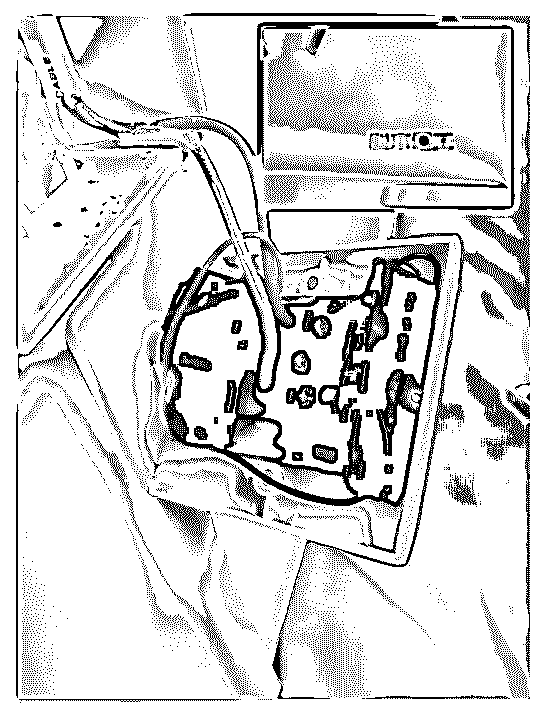
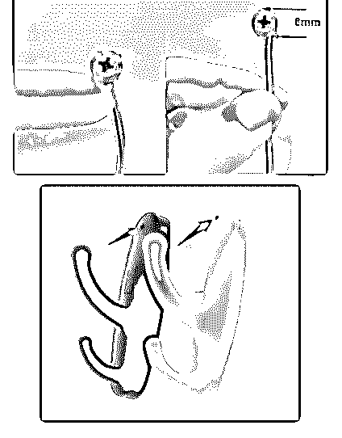
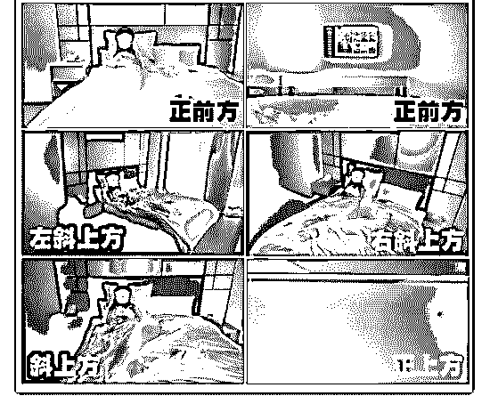

# 最近有个程序员，开

花爷梦呓换酒钱 : 最近有个程序员，开发了一款叫原谅宝的软 件。这个软件号称在全球范围内识别了 10 万从事不可描述职 业的小姐面孔，你只要上传一张照片，就能知道对方有没有 黑历史，自己有没有“接盘”。

显然原谅宝的逻辑肯定不对，你但凡上过几个不可描述的网 站，就知道上面很多女生都是被偷拍的。

这里的偷拍，有一部分是男性主动偷拍，还有很大一部分， 是视频男女主不知情的情况下，被房间里的设备偷拍的。从 事偷拍产业链的人，一般会去酒店开一间房，装上偷拍设 备，然后隔一段时间再去开同一间房，把视频拷贝下来。偷 拍的视频再从论坛、QQ、微信等暗社交流通交易出去。

从业者们层层分工，很难把整个产业链拔掉。真的抓到其中 一两个人，处罚力度其实是很小的。

聊这个，不是让花友靠这个去赚钱，而是通过了解这些产 业，保护自己。国内偷拍的产业链据说有十亿级别，如果从 行业角度来看，十亿的行业不算大行业。但这个事情严重就 严重在，虽然遇到的概率不大，但一旦遇上，就等于百分之 一百。

不知道的人也就算了，花友们最好还是提高警惕，有条件的 出门住好一点的酒店（暗装偷拍设备的人也要考虑开房成本 的），少住民宿，住房租房的时候，可以在全黑情况下用手 机相机扫描一下，如果还不放心，可以去某宝买一个摄像头 扫描的设备。

2019-06-04(7 赞)

评论区： 小雨 : 可怕

猪头特大号 : [除了要留意酒店可能暗藏的针孔摄像头，你还要注意人身安全丨危险解除](https://mp.weixin.qq.com/s/cC-EF0SEfJHHydmsbwMiUQ)[01](https://mp.weixin.qq.com/s/cC-EF0SEfJHHydmsbwMiUQ)

猪头特大号 : 这种习惯很难养成啊

花爷梦呓换酒钱 : 所以还是多赚钱住好酒店比较简单[奸笑]

好人 76543210 : 所以说，赚钱才是最重要的，可以在一定程度上规避风险

