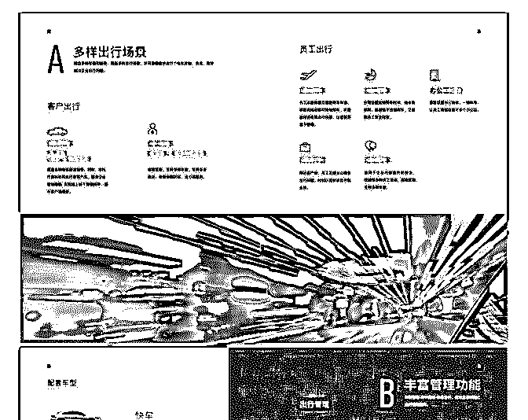
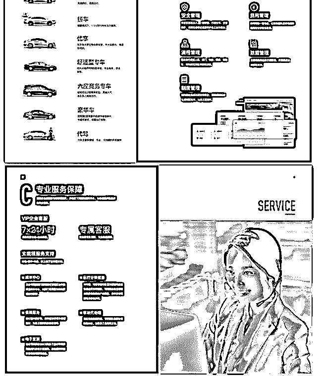

# 花爷，第一次提问，

(提问)蕉言蕉语 : 花爷，第一次提问，也是一个商业机会。

【背景】本人信息技术公司，可提供运营商上网带宽，尤其 是跨境国际带宽。

【商机】机缘巧合跟滴滴合作。现有企业版业务，可以提供 用车方便，并简化管理，降低用车和管理成本。我可以做代 理，推广材料可以见附件。多方共赢：

1\. 企业：比养车和租车费用便宜，规范管理。

2\. 企业员工：企业统一支付，不用自垫资金。统一开票，报

账方便。尤其是派驻外地的。

3\. 滴滴：拓展了业务，增加了收入。

4\. 我：获得代理分成，有额外收入。

【问题：如何拓展】本人偏技术方面，并没有太多的资源， 对于销售及业务拓展不擅长，所以来提问，请花爷给点建 议。有意对接的花友也可联系。

2019-05-31

回答：企业接入滴滴这个需求面其实挺窄的，小公司用不

上，大公司一般直接和滴滴对接了，剩下不大不小的公司，

你得说服他把传统出行报销的 OA 流程换到滴滴上，也不是件

容易事。 走正向思维的话，一般去企业老板、HR 的圈子去试

试推广。这块的人脉链接我讲过很多次了（），不过你技术

出身，这方面资源不多，我就不多说了。 走逆向思维的话，

可以尝试“截流”的路子。举个例子，阿里云的代理商给用户

的价格比官方低，代理商会做搜索优化，当用户搜索云服务

时，看到代理商的网站，自然就买了。另外，代理商有时会

拿到已经买过阿里云的用户电话，打电话告知快到期如果准

备续费，可以加微信联系他们拿到更低的价格。 同理，用户

主动去搜索企业出行服务的时候，也可以用“截流”的思路 做。我随手搜了一下，发现一家在成都地区的代理商网站

（），官网做的跟滴滴真假难辨，普通人肯定以为是滴滴官 方就去联系他们了，等真联系上了，发生毕竟是官方代理而 且价格更便宜，这个客户就留下了。至于 SEO、爬虫找木目 标相关问题埋点这些领域，你搞技术的肯定比我懂。 最后讲 一条更歪的思路，我瞎想的，可行性可能不高，你当听着玩 儿。就是你把企业的出行服务，拆分成 to C 的滴滴打车打折业 务，只要有打折，我相信对 C 端用户是有吸引力的。不过中间 可能涉及人员加入、代扣费用等等问题，我不是很了解企业 版的具体操作，需要你自己评定可行性了。(7 赞)

评论区：

蕉言蕉语 : 我再想想

tf， : 如果能做 2C，我这边可以接点资源做

蕉言蕉语 : vx: xiaojiaofzc2 聊聊

关注公众号"懒人找资源"，星球资源一站式服务