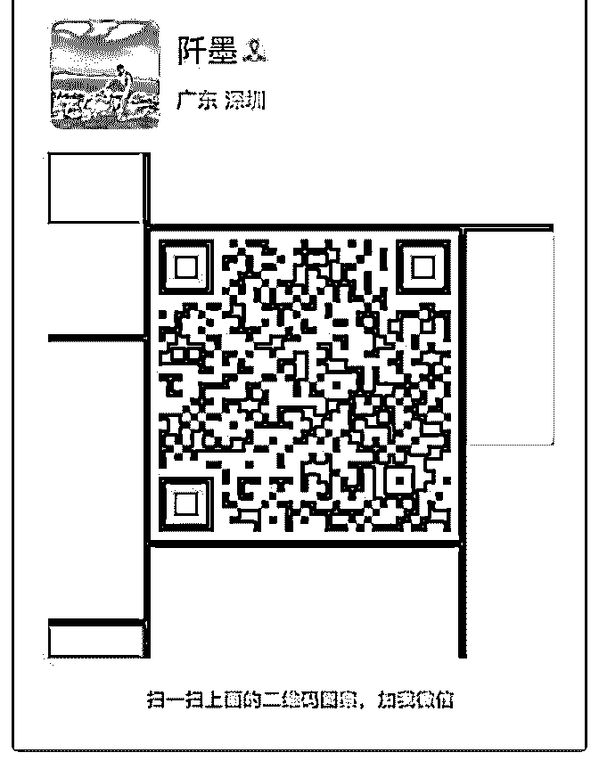
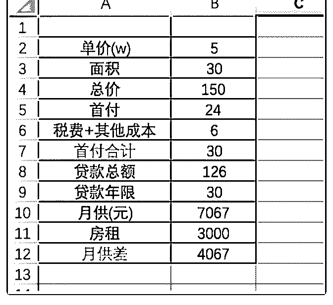
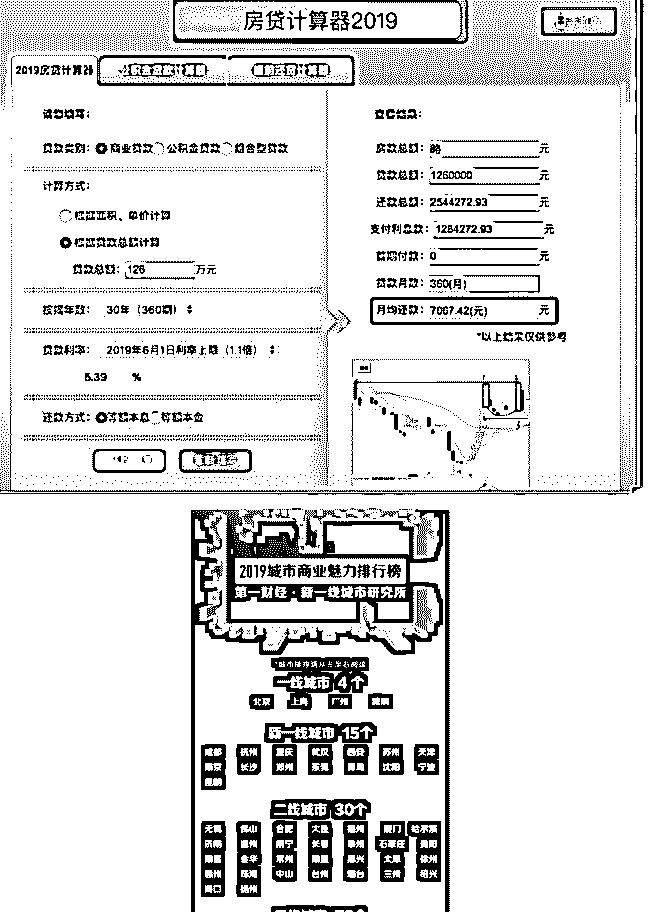
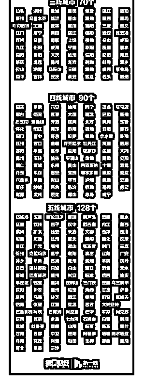

# 分享主题:如何在深

花爷梦呓换酒钱 : 分享主题:如何在深圳买房及买房要注意的 几个点

（在分享之前花爷插一句，小达的分享主要是科普层面，如 果想看内功心法，可以看花爷之前的文章：）

分享人：小达 分享背景：

深圳现在的房价均价在 5.7w 左右,对于在深圳买房，大多数人 都会觉得很难。但是如果对买房的一些细节进行研究之后， 其实你会觉得在深圳买房还是有可能的，今天我就和大家聊 聊如何在深圳买房，以及买房中要注意的一些点。

首先非常感谢大家，能抽出宝贵的时间听我分享，我先来个 自我介绍。

昵称：小达 职业：移动端(安卓)开发 坐标：深圳

籍贯：武汉

经历：深漂多年，17 年接触到知识星球，知道了一些各行各 业的大佬。18 年也开始写自己的公众号，坚持写作，从长期 来看，真的是一件对自己有利的事。也建议您有时间可以写

写作，多分享，分享即学习。

可以分享的东西：

1.对深圳各方面比较熟悉，有关深圳的一切问题都可以问我， 我能解答的尽量解答，之前也写了一篇文章详细的介绍深圳 这座城市，文章链接：

2.部分互联网大厂内推机会

3.如何购买港美股

4.深户办理，深圳房产相关 微信公众号：黄小达 知识星球：一起成长(免费) 可扫码加我个人微信，请备注花友

（图 1） 分享正文：

如果 30w 首付在深圳买房。

有的人肯定会说 30w 首付怎么可能在深圳买房呢，其实是有可 能的哈。大面积的买不起，我们可以买小面积的嘛，比如先 买个 30 平的，后面经济宽裕了，是可以置换第二套的。

30 平，一平 5w。

我简单做了个表格，大家可以看看

（图 2） 税费和其他购房成本差不多占总价的 4 个点

（图 3）

大家可以看看上面第一个表格，这种是按购买二手房算的。 首付合计我只花了 30w，月供 7K，房子买了之后我可以马上 出租，一个月租 3K，最后我每个月房贷只用还 4K 了。如果你 在深圳每个月拿到手能有 10K，每个月省着点，4K 的房贷应 该是没什么问题的。

下面我讲讲买房过程中要注意的一些点： 买房主要考虑的有三点：

1.购房资格

2.资金

3.选筹 一.购房资格

在深圳的话，满足以下条件之一就有购房资格：

1.深圳户口

2.在深圳连续缴纳 5 年社保或个税

当然不满足上面 2 个条件的，想买也是有办法的，想知道的可 以私聊我

二.资金

1.首付多点好，还是少点好？ 有的人手上的钱，可能超过了全款的三成，然后买房的时候

不知道付几成首付好。房贷是普通人群能从银行享受到的最

优的贷款费率了。当然是首付越少越好，

2.贷款年限是越长越好吗？ 是的，我身边有个朋友买房，贷款年限是 15 年，我说你怎么

不贷 30 年，他说不想欠银行钱时间太久，觉得贷 30 年时间太

长了。但是其实贷款年限是越长越好的。因为通货膨胀，人

民币在贬值，房贷是负债，随着时间的推移，你表面上每个

月还同样多的钱给银行，但是你的负债是在缩水的。

而且你如果买的是二手房，你的房子可以出租，每年的租金 是在涨的，你的收益是在增加的。

3.等额本息还是等额本金？ 选等额本息。等额本金前几年月供比等额本息多一些，月供

的头几年，有的人会不适应，选择等额本息还款压力要小一

些。等额本息前期的还的钱少，让更多的钱留在自己手上，

利用率会更高一些。

买房最怕就是断供，所以你每个月需要有稳定的现金流来还 月供。因为深圳买房之后三年禁售，所以至少准备 3 年的防守 资金，最好 5 年。

把前 2 年的月供资金备好，我说的是现金储备哦。有人会说付 完首付手上就没钱了，那你前 2 年，工作稳定，有稳定的收入 也行。第 3 年，信用卡，信用贷什么的都可以用起来。还没用 过信用卡的小伙伴，建议可以学着用起来了。信用卡是个好 东西，有时候可以应急的。

三.选筹 买房有资金很重要，选筹更重要，别花了和别人相同的钱，

回报率却没有别人高。

买房要么用来自住，要么用来投资。自住就选你喜欢的，自 己觉得住的舒服就行。

这种自住的买房大多数都是 6 个钱包，所以要多看房，多踩 盘，像花爷文章里写的那样，看 100 套房，看完之后你自然就 了解行情了，至少一般不会买亏了。如果自己实在没时间没 精力看这么多盘，那就找管家公司，就是要花点服务费。拿 钱买时间。

投资的话就讲求回报率。对于房产，长期看人口、中期看土 地、短期看金融。人多的地方，就会有大量的购买需求，房 产的行情自然不会差，所以投资房产还是首选一二线城市。

送上最新的一线到五线城市排行榜

（图 4） 买房如果为了投资，也需要多踩盘，时刻关注政府的政策。

关于买市内还是远郊，资金如果足够，当然首选市内，从长

远来说，市内升值空间肯定更大。远郊新区得看政府的规

划，如果政府大力发展远郊的新区，那也可以买。

投资的话建议买次新房，就是 05，06 年之后建的房子，买带 电梯的那种，最好离地铁站近，不要买老破小。

和自住一样，如果你觉得自己没那么多时间精力去踩盘，去 研究哪个区房价未来会涨，我觉得可以找多家管家公司出方 案，进行对比，看自己觉得哪个方案最适合自己。管家公司 是专门研究房产这块的，专业的事还是交给专业的人比较 好，可能会花点额外的钱，但是如果房子买对了，未来涨幅 肯定不止这一点。

此次分享的目的是为了大家对房产有新的认识，普通人也是 有可能买到一线城市的房子的。

我的分享结束，可能有些地方没有讲清楚，大家多多包涵。 有问题可以私聊我，最后再次谢谢大家！

对了，昨天有个小伙伴问了个问题，问：现在去深圳买房哪 里性价比高？未来房价继续上涨空间大不大？

看你自住还是投资，自住可以选龙岗，单价低，缺点是升值 慢。投资的话，看资金，资金多，选南山，或者宝安。现在 整体来看，深圳在向西边发展，资金不多的话，可以考虑光 明新区，或者沙井。

一线城市的房价从长期来看，整体趋势还是涨。可以这么 说，以后的深圳，就是现在的香港。

最后要说的是，不同的管家公司也会有自己主推的板块，所 以自己就算找管家公司，也要多思考，多对比，买房毕竟不 是一件小事，对于一般人，可能用的是两代人的积蓄，所以

不管自住还是投资，都需要很谨慎，把账算清楚，想好怎么 控制风险再下手。

[讲的时间有点长哈， 谢谢大家能耐心看完](https://mp.weixin.qq.com/s/cziO8Tzx0ftjvNYiktj6cw) [劳动人民如何买](https://mp.weixin.qq.com/s/cziO8Tzx0ftjvNYiktj6cw)  [人生第一套](https://mp.weixin.qq.com/s/cziO8Tzx0ftjvNYiktj6cw)[房了解深圳，这一篇就够了](https://mp.weixin.qq.com/s/N0gWFzJau5iKV_m58-BDmA)

2019-05-31(9 赞)

关注公众号"懒人找资源"，星球资源一站式服务