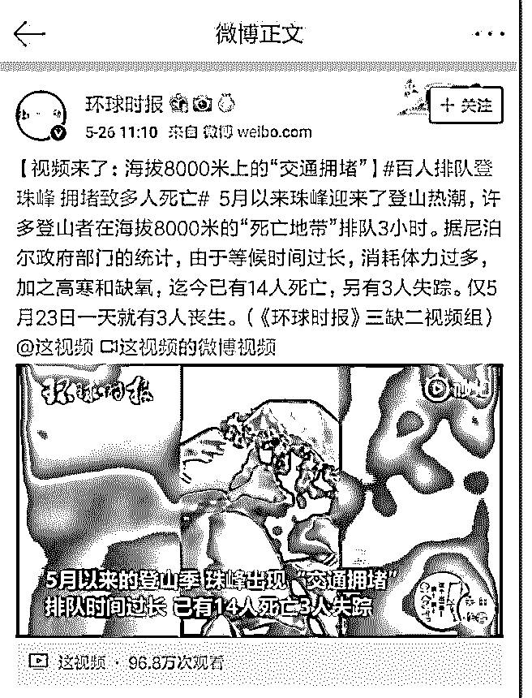

# 最近有条新闻，说珠

花爷梦呓换酒钱 : 最近有条新闻，说珠峰登顶的人多到要排 队，很多人在排队的过程中挺不住，直接丧命。

如果你觉得这些人吃饱了撑的、不爱惜生命（很多人这么认 为），那显然不够聪明。还是那句话，别光看热闹，要有收 获。

实际上爬珠峰是门很成熟的生意，尼泊尔每季度对外发放几 百张外国登山客许可证，每张 1 万美元以上。

这还只是冰山一角。 花 1 万美金买门票上珠峰的，显然不是专业人员，这些有钱人

哪有能力爬珠峰呢。所幸在尼泊尔，有个种族叫夏尔巴人，

从古代穷到现代，干啥啥不行，就是极限登山非常在行。

一个夏尔巴人带有钱人去爬珠峰，一趟能赚几万美金。有钱 人实在爬不动，也没问题，夏尔巴人给你背上去，再付几十 万美金。如果富人身体太差运气太背，不幸在登顶过程中死 了钱也得照付。而且普通人爬珠峰，丧生后遗体也就扔在那 了，有钱人不行啊，遗体得搬回来厚葬，夏尔巴人帮你把遗 体背回来，又是几十万美金。

王石 2003 年就上过珠峰，他说爬珠峰就是花钱请夏尔巴人把 你背上去。

为什么要专门讲这门生意呢？ 我们圈子里常说，别做穷人生意，除非你能覆盖足够多的穷

人。

谁都知道做富人的生意赚钱，但你也得把脑子切换到富人一 样的频道上去啊。如果你看到这条新闻，觉得富人真是脑子 有病，冒着生命危险、花大价钱爬珠峰无法理解，有这钱还 不如捐给贫民，那还谈什么做富人的生意呢？

别把屁股焊在原地，千万别。

2019-05-29(18 赞)

评论区：

人生苦短 : 关健如何切换到富人的频道？卖房子豪车奢华品等？

白歌 : 之前看过一个写攀登珠峰模式的文章，想不起来是那个，等下找到，我发下

RwatitFahs* : 为啥我没看懂[尴尬]

kieda : 根据尼泊尔旅游部门的统计，从 1953 年至 2018 年，成功登顶珠峰的总人数是 5396 人；而根据 Wealth-X 的统计，截至

2018 年全球个人净资产超过 10 亿美金的富豪总人数是 2604 人。这就告诉了我们两件事： 1、做选择题不知道选哪个答案的时

候，一般选 C； 2、赚大钱比攀登珠峰难得多。 和菜头写的，有兴趣可以看看[珠峰大堵车](https://mp.weixin.qq.com/s/qJ9UmzQBHgV59t8MQyatiw)

恋空 : 看问题的视角，对不理解事物的敏感度，是的，的确需要加强锻炼，很多时候我们看的是热闹，挖掘不到价值信息

花爷梦呓换酒钱 : 理解富人的行为，尝试理解任何你觉得不可思议的行为，最起码别觉得人家钱多了烧的慌。

好人 76543210 : 富人不缺钱，所以他们精神追求越来越丰富多彩了，而很多穷人根本不理解，因为穷人的审美、艺术等思维

观念几乎就是零，因此，只能把脑袋焊在屁股上了

关注公众号"懒人找资源"，星球资源一站式服务