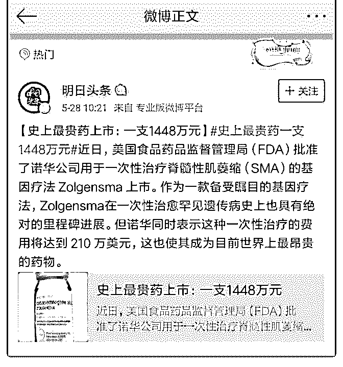

# 昨天讲到“所有用户

花爷梦呓换酒钱 : 昨天讲到“所有用户愿意买单的溢价都是合 理的”（），今天正好看到一条新闻，也和价格有关，很有意 思。

这条新闻说，美国最近批准了一个天价药，这个药可以治疗 一种罕见病，但价格高达每支 210 万美元（换算人民币就是 1448 万）。

对这个新闻，可能会有三种看法，这三种看法，就是人的三 个层次：

1.觉得药厂黑心： 没啥好说的，最笨蛋、也是终将被压榨的最狠的人，屁股焊

在社会底层。

2.觉得合理，因为药厂科研花费巨大： 这种说法在《我不是药神》热映的时候非常有市场，很可

惜，不对。

我们假设现在有一种长寿药，吃完立刻多活 100 年，生产成本 是 100 元。现在有两个价格方案，一是卖 101 元，二是卖 1000 元。请问，如果你是药厂，你会选择卖 101 元吗？明明 101 元 也覆盖成本，还能赚 1 元钱呢。

你不会选 101 元，因为不管是 101 还是 1000，大部分人都能愿 意买，为什么不多赚一点呢？

所以，最正确的理解是：

3.价格高与成本无关，与善恶无关，之所以一支药能卖 210 万 美元，只有一个原因——美国人民买得起。

如果你深入了解，你会发现，天价药虽然卖 210 万美元一支， 但只要一支就能治好，而如果用传统的手术疗法，价格远超 210 万美元（还不一定治得好）。

***** 划重点，价格贵不贵不重要，比竞品有优势就行。 另外，美国有非常完善的医保制度，这 210 万的大部分会由医

保支付（类似于全美国人民一起分担），剩下的部分也允许

患者分期支付，总之咬咬牙能够接受。

**** 划重点，价格贵不贵不重要，用户买得起就行了。 所以结论非常神奇： 这个药贵，贵就贵在它在美国卖，美国人民有钱、买得起，

所以这药就贵。

举个例子，去年七月，美国有个 9 岁的小女孩 Yoder 在夏令营 的时候被一条铜斑蛇咬伤，送到医院紧急注射了四针抗蛇毒 血清，每支血清价格高达 3198 美元。而在仅有一条国境线之 外的墨西哥，类似的血清价格是 200 美元，价格差了 16 倍。

所以现在你可以理解，为什么有些药只在美国销售——因为 只有美国能卖出高价，其他地区的医疗系统支付不起，价格 定低了又会影响美国的价格体系。

价格是商业的灵魂之一，今天的内容可能对部分花友有点

深，多读几遍，好好理解。明天有空的话，再给大家讲讲价 格的另一重意义，突然发现这样每天讲点小知识的形式还挺 好的。[`t.zsxq.com/eqZVVVV`](https://t.zsxq.com/eqZVVVV)

2019-05-28(19 赞)

评论区：

白一喵 : 营销 4P，Pricing 就是一个，就可见不是那么简简单单的事儿啦(｡･ω･｡)

梁帅 : 我总结过一句话「卖 C 心理上能接受的最高价，买 B 心理上能接受的最低价」

梁帅 : 但归根结底「价格是由供求决定的」

花爷梦呓换酒钱 : [强]

梁帅 : 被花爷翻牌子了[怄火][转圈][怄火]

好人 76543210 : 所以说，任何价格都是合理的，因为总有人买得起，买不起的人永远也买不起，比方说房价。哪怕跌倒 1000

一平，照样大批人买不起.......

关注公众号"懒人找资源"，星球资源一站式服务