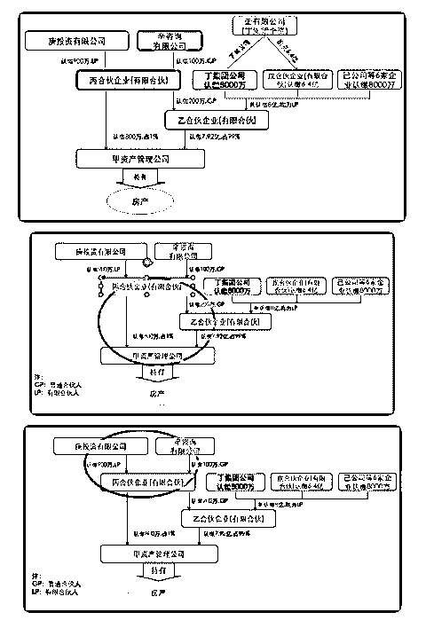
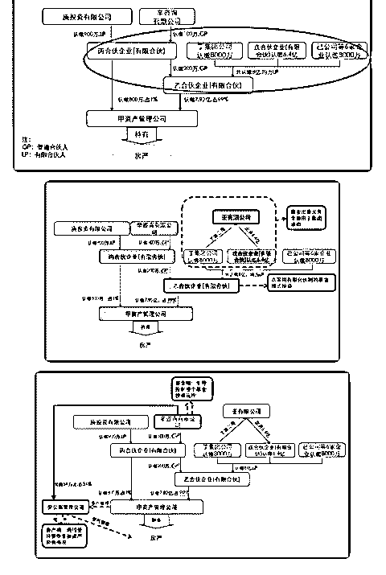
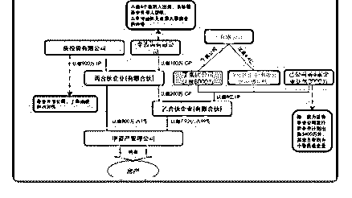

# 分享主题： 有限合

花爷梦呓换酒钱 : 分享主题： 有限合伙企业 GP 和 LP——100 万撬动 8 亿资金的权力游戏

分享人：面面面 分享概览：

1、有限合伙人(LP)与普通合伙人(GP)基本知识介绍

2、案例：100 万撬动 8 亿资金的真实案例

3、企业在寻求创新金融业务过程中的风险与警示 分享正文： 各位花友，大家晚上好。今天我要分享的是一个真实案例，

有关某集团探索金融创新业务、合作私募基金的过程。内容

需要一点点点点基础，稍微有点路人不友好，我尽量讲的清

晰一点。

那么先铺垫一下有关 GP LP 的基础知识。

GP（General Partner）普通合伙人，即基金管理人，发起私募 基金。无论出资多少都可以执行合伙事务、承担管理职能， 对企业债务承担无限连带责任。LP（Limited Partner）有限合 伙人，即投资人，无论出资多少都没有参加管理和执行的权 利，对企业债务以其出资额为限承担有限责任。有限合伙人 做两件事，出资和收益；普通合伙人用有限合伙人投资的钱 做运营决策（这个说法不严谨哈仅供理解）。基金收益的分

成可以通过协议来约定。

网上没有找到很完善的文章介绍，不过基本逻辑可以参考这 篇，大家感兴趣的话可以看一下：

现在大家基本了解了这样的组织形式，我们用案例深入的体 会一下 GP、LP 的斗争，复盘案例中的丁集团是如何在巨额战 略投资的过程中失去主动权的，观察 8 亿资金是如何被出资 100 万的私募基金团队全部掌控。这听起来像是个极端案例， 实际上传统企业或者个人在急于寻求金融创新、收益突破的 过程中，没有基本的专业知识很容易会走这样的错路。但选 择有限合伙型私募基金这个方式必然有他的优点，比如灵活 性大、监管宽松等，GP LP 的纠纷也不是完全没有途径可以控 制，这个在第三点风险警示里面会提到。所以我们先进入正 题，看这个案例。

（图 1） 完整的投资架构图有点眼花哈，我们来一层层拆解，由下往

上依次：

甲资产管理公司由乙合伙企业和丙合伙企业共同出资组建， 其中乙合伙企业以 99%的占比绝对控股甲资产管理公司。

（图 2） 那我们再来看一下乙和丙两家公司的股东是谁。庚投资有限

公司投资 900 万元成为丙合伙企业的 GP,而辛咨询以 100 万的出

资成为丙合伙企业的 GP,也就是负责丙企业的实际经营。

（图 3）

同时，丙企业通过对乙企业出资 200 万，撬动了包括丁集团、 戊合伙企业和己公司等合计 8 亿的资金，掌握乙合伙企业的实 际控制权。

（图 4） 那么再看下面一张图，戊合伙企业认缴的 6.4 亿其实是由丁集

团公司通过全资子公司壬公司出资的达成的（图中蓝色格

子）。

结合上面说过的 GP LP 的基本属性，红色箭头由上往下，辛咨 询公司利用 GP 的职能，来控制丙公司，再通过丙公司来控制 乙公司，最终实现对甲资产管理公司的控制（图中紫色格 子）。

（图 5） 在建立了股权投资关系之后项目开始实际运转时，辛咨询有

限公司又出资 51 万元建立了癸公寓管理公司，由该公司接受

甲资产管理公司的委托，代为管理旗下投资的房产。也就是

说，在整个架构的设置中，大部分的资金出资义务由丁集团

承担，而站位 GP 的辛咨询公司不仅在资金端主导控制整个基

金投资运作，在资产端也通过受托管理的形式掌握了资产经

营情况。

（图 6） 最后，看下除了丁集团以外的其他参与方都是什么来头。

（图 7） 讲到这里，这个案例就结束了，信息量非常大哈。大家可能

觉得有点不可思议，讲道理这不就是个局嘛，怎么会有人或 者会有企业愿意把自己的资金这样交付出去。事实上，被套 路的大有人在，更有很多是公认的聪明人。那么普通人或者 企业在寻求投资创新的过程中（不仅限于成立有限合伙型私 募基金这一种方式），如何来控制投资风险：

其一，投前调查，尽可能利用一切资源充分了解投资的企 业、行业核心竞争力，或者某种新型结构、产品的运作方式 盈利方式。当然，这一点无论是个人投资还是企业投资，不 管什么类型的投资恐怕都是必须程序，确保自己的投资需求 和对投资的理解不存在偏差。如果知识经验不足，一定要寻 求金融啊法律啊之类的专业的帮助，专业的事情交给专业的 人做。例如上面的案例里，丁集团如果有这样的意识，其实 事先可以通过基金合同、合伙协议等途径约定相关的事宜,明 确基金管理人和基金托管人之间的职责划分。

其二，投后管理，就是所谓的定期检查和复盘，确保投资进 展和约定的是一致的，即使出现偏差也可以尽早发现，这同 样是每一类投资无论个人还是企业都必须要做的功课。

本来准备分享到这里就结束了，但基于这个分享被花爷归类 于“100 个淘金案例”系列，那么我们回归主题，寻一点“淘 金”启示出来。因为我是站在一个反面案例的角度来讲述，其 实这种模式不一定会走向这个结局，举这个栗子只是想给大 家做个提醒。那么现在建议大家站在中性的角度上，跳出这 个投资结构，用你的上帝视角，提升一个维度思考一下这个 资金链条，你觉得从甲到壬这一串企业中，每一家企业的作 用是什么，是不是在促成整个链条的过程中可以得到投资收 益，那么成为桥接的一环需要什么样的资源又怎么推进。在 现实生活中，金融创新的灵活性非常大，GP 和 LP 的形式只是 其中的一种，那么组建这样的机会或者想要参与到其中的某 一环，哪一环是你可以伸手触碰到的，你又可以用什么样的

方式参与进去。

以上。 嗯 要分享的大概就是这样 大家有什么疑问或者建 议 欢迎交流 [GP](https://mp.weixin.qq.com/s/nRshs4hRBB5buN7hiR_90w)[与](https://mp.weixin.qq.com/s/nRshs4hRBB5buN7hiR_90w)[LP](https://mp.weixin.qq.com/s/nRshs4hRBB5buN7hiR_90w)[的关系](https://mp.weixin.qq.com/s/nRshs4hRBB5buN7hiR_90w)

2019-05-25(7 赞)

评论区：

支离书 : 辛公司管理团队无募集大额资金经验，这个案例不就是募集了大额资金么

十翼 : 拆解得清晰明了又简短，不只是一般的优秀！

关注公众号"懒人找资源"，星球资源一站式服务