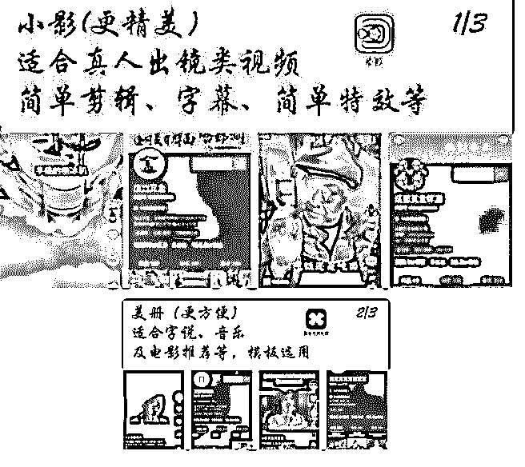
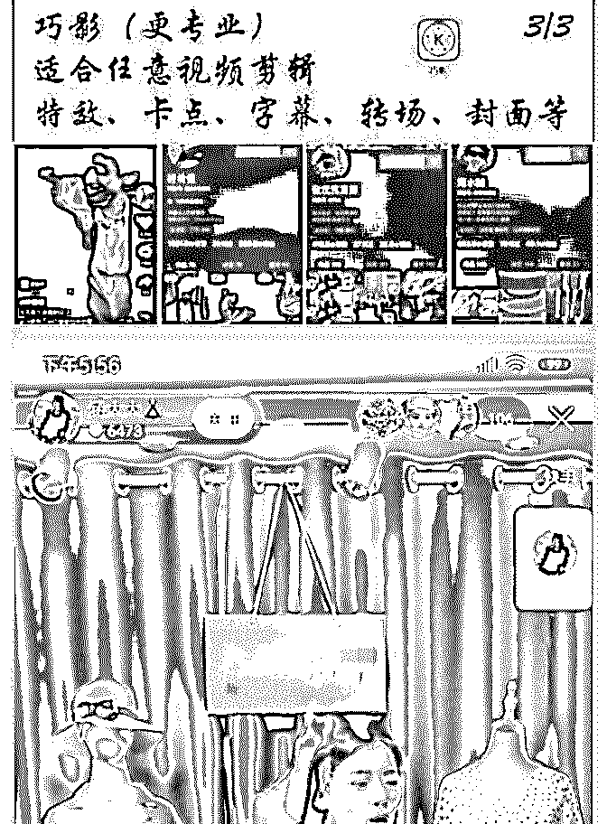

# 昨天铭则的分享评分

花爷梦呓换酒钱 :

昨天铭则的分享评分高达 4.6（满分 5 分），内容很长，图片很 多，整理成了四个部分分享给大家

——————

分享主题：短视频的崛起与如何抓住短视频的风口（四） 分享人：铭则，互联网从业者，进入网赚行业 4 年了，经历过

淘宝，微商，淘客，社群，短视频

分享正文（四）： 最后呢，我有一个特效号，这种帐号呢，不是很多，大家有

时候肯定也会刷到，就是各种什么飞天啊，什么影分身等

等，还有火影忍者那种，把它统称为这种特效号，这个特效

号呢，要说难呢，比较难，要说不难，一点都不难，你只需

要用巧影，你关注巧影的公众号，上面有非常详细的教程，

你包括什么，最近那个很火的变火影忍者那种，都是来自于

他们那里，你直接去摸索一下，因为这个东西我现在讲着讲

不明白的，因为它有很多步。但是你只需要用一个软件就可

以去完成它们。

（图 1，图 2，图 3） 最后我说了很多这种软件，大家肯定已经听糊涂了，不知道

哪个软件，要干嘛，哪个软件比较好，我给大家做了一个总

结：

1、 这个小影适合做这个真人出镜类啊，简单的剪辑字幕，简 单特效。

包括这个 inshot，还有小影，都是这个样子，都是挺不错的， 适合剪辑的。

2、 美册是自说音乐类的，这种有很多这种模板直接可以套用 的。

3、巧影就专业一点，它做这种什么特效，卡点，字幕，转场 这些东西，都是用这个巧影去做的。

这里面有快影还没有说，我觉得它做字幕比较好，我一直用 快影做字幕用的，和剪辑，还有声音的变声，可以用快影去 做。

然后我本来想给大家录两个视频，就是如何去做的，但是我 觉得可能没有必要，我就找了两个之前我们团队录得，这个 东西吧，大家可以看一下，一个是做这种中间带视频的，还 有不带视频的这一种，做这种音乐、电影这种号的。

为什么没有录呢，因为说实话，目前呢，趋势就是趋向于真 人出镜，或者是一个半真人出镜，你包括好物推荐，虽然你 人没有出现，但是是你自己在说。

（图 4） 就是视频基本就是自己拍的这种。

真实案例：自然增长的 1.8 万粉丝，看播率 0.5-1％，平均每场 在线 100 人，三天播一次，每次 3 小时，每场出 70-100 单，月

销售额 2-3 万，不花一分钱。

最后再给大家说一下，大家如果想卖货的话，就推荐做快 手，做快手搞直播，直接就这么卖就行，这是一个真实的案 例，两个月就赚一台奔驰的这个真实的案例。当然这不是 2 个 月赚奔驰的那个，那是做化妆品的。

就是你平均你直播间不用 100 人，150 人，你一天出这个二三 十单都是非常简单的，一单赚个 20 几块钱。

我现在不足呢，是还没有去直播，也在去尝试中，正在学 习，学习镜头的这一个表现力，因为我一直没出现过，没出 过镜，说实话还是这个直播的话，还是稍微有一点不自在， 但是我想我肯定还是会直播的。

好，今天就分享到这里吧，我感觉分享了好长时间。我已经 加快速度，简化了一些，没想到我做那个思维导图做了这么 多。

非常感谢花爷提供这个平台，让我去分享，我觉得这次分 享，最有意思的就是我分享这个割韭菜的一块儿，很早我就 想说了，整天在那忽悠人，这儿那儿的，养号儿什么的，真 的是。

可能我在视频制作上说的没有那么详细，因为我现在用的这 些软件都比较熟了，让我去简单的讲，我是真不知道怎么一 步一步去讲，除非我自己再去录视频。但是我没有录，这两 个也很详细，大家可以看一下。

好的，就讲到这里吧，谢谢，谢谢大家的收听。

2019-05-23(15 赞)

评论区：

花爷梦呓换酒钱 : 铭则的微信：luochengcv10 还有花友只加了星球没进群的，看星球置顶帖加小助手拉你进群！

关注公众号"懒人找资源"，星球资源一站式服务