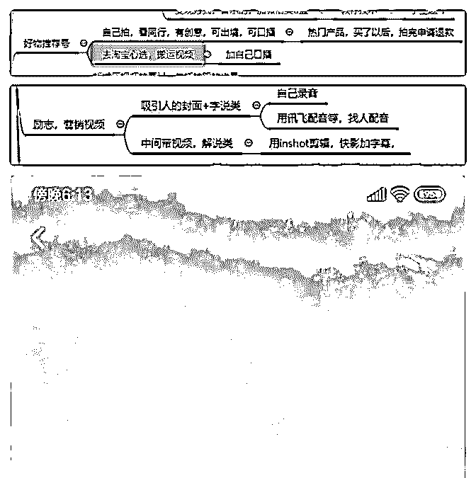
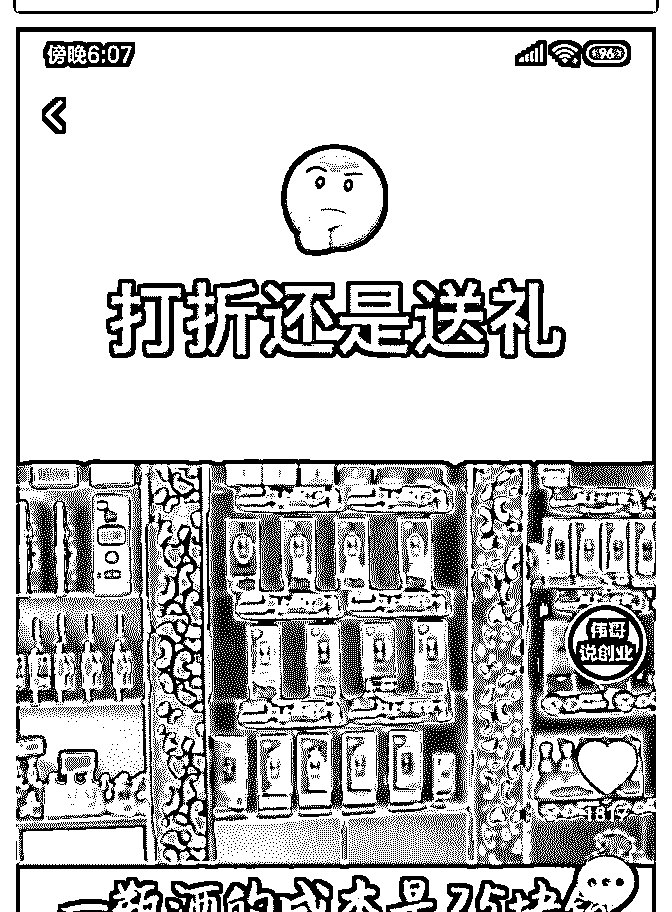
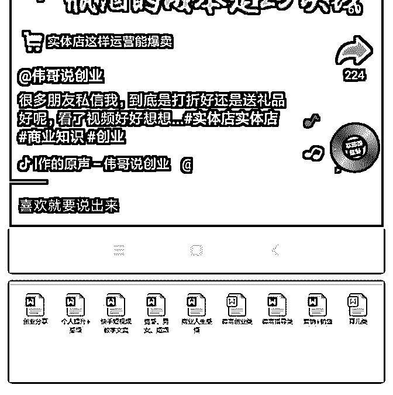
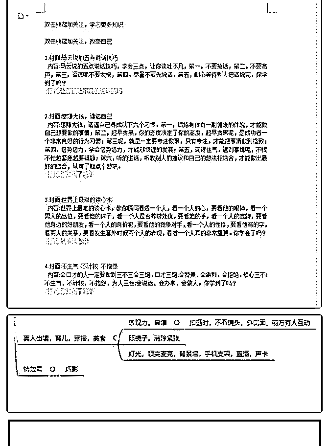
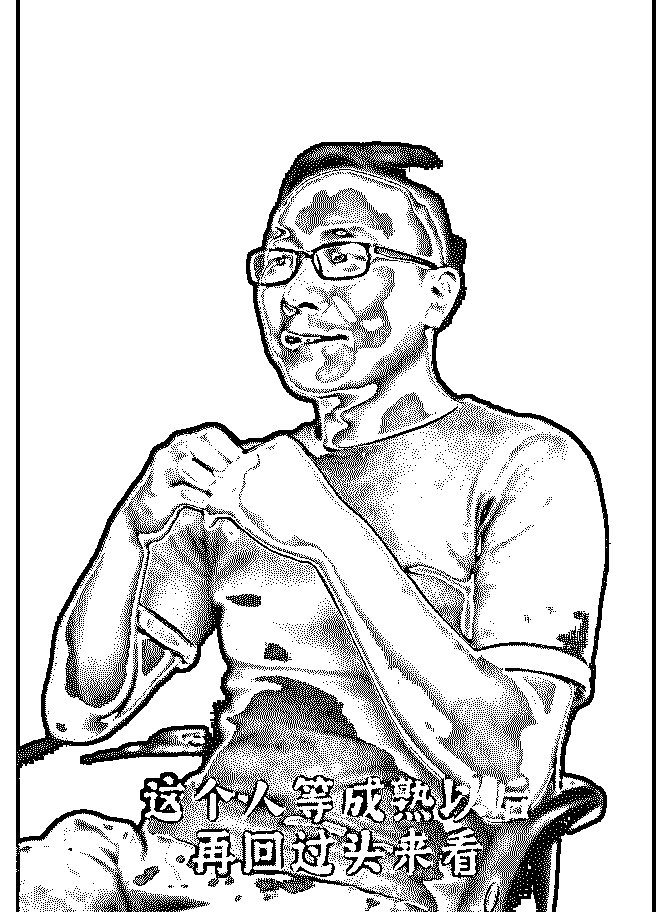
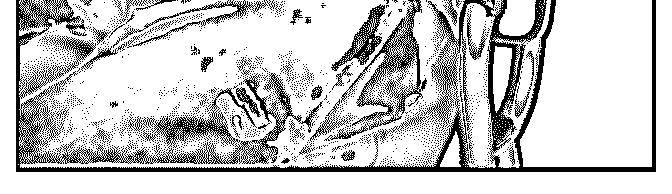

# 昨天铭则的分享评分

花爷梦呓换酒钱 :

昨天铭则的分享评分高达 4.6（满分 5 分），内容很长，图片很 多，整理成了四个部分分享给大家

——————

分享主题：短视频的崛起与如何抓住短视频的风口（三） 分享人：铭则，互联网从业者，进入网赚行业 4 年了，经历过

淘宝，微商，淘客，社群，短视频

分享正文（三）： 再一个是我挺看好的一个类目，当时我也准备做的，就这种

减压号，减压视频，大家应该会刷到过。同理呢，一个是减

压号，一个是护眼号，就是有时候那种护眼的，那种护眼的

视频，我没给大家找，其实我觉得只要是玩抖音的都应该看

到过。

这种制作的是那个方式，有两种，一种是自己拍，自己用这 种碾压机，去 1688 买一个，但是大多数火的都是，其实也有 第一种，也有第二种，第二种就是去 Youtube 上啊，就是油管 儿上找这种视频，找这种护眼的，这种减压的，这种别人做 好的那种视频，下载过来剪过来去做就可以了，因为这些东 西搬运的少，竞争少。所以说基本重复率很低的。

（图 1）

再就是现在非常火的这个抖音淘客，那种好物推荐，这种账 号非常火，你可能半个月的时间做三四十个视频，你可能一 毛钱都没赚，它一个都没火，但是你可能做到第 40 个的时 候，就一个视频火了，一下子就能赚几千，上万，就是这么 爆。 就一下子，你有了这么一个视频，这个非常有意思啊，看了 都反馈不错，一下子就可能把你前面十几天的精力全部都赚 回来了。

这个呢，有两种，一种是他们去淘宝新选挑，上面有很多视 频嘛，别人拍的视频。然后你搬过来，然后加自己的口播， 你如果不加自己的口播或者是录播，不重新录的话，因为这 个就涉及到搬运，基本上很难推荐，最主要的是没什么意 思，你没有那个口播，人家不会觉得有意思。

第二种呢，就是看同行的那些，比如说那个万能胶带火了， 那个什么钢铁侠的机器人火了，直接去找这个店铺，拍下来 也好，跟商家谈也好，我是做这个，其实不用谈也行，直接 就拍下来，拍下来一个，自己拍了（视频）以后再退回去是 吧，反正现在这些店都有无理由退货，买个运费险，也不需 要花运费，然后拍完了再给人家退回去，这样也是可以的。

然后就是仿照他们的形式，那种万能胶带不是贴哪里都行 吗，那你也贴嘛，你自己录，自己贴，自己口播不就行了 嘛；

口播，如果你觉得声音不好听，用那个快影的变声，快影， 快剪辑都有变声，直接变声就可以了，或者是加速声音，加 速以后你的声音也会变成小黄人那种比较萌的声音，然后就 发上去，成本几乎没有。

（图 2）

还有就是这种励志营销类的视频，这种也是非常的火，就教 人如何赚钱，教人如何创业，教人如何做自媒体，励志啊， 就是你要成为老板要做的六件事，你不能再废物啦，这种励 志的这种视频看了以后非常热血，然后可以卖书，可以教他 们赚钱等等。

（图 3，图 4） 这种呢，也是两种形式，一种就是字说类的，就是文字滚

动，现在这个字说类的非常简单啦，快影直接就有字说。你

点开的视频就有，美册直接都有字说，直接用字说就可以

做。

然后再找一个不错的封面，特别是你发快手的时候，封面一 定要做得好，做一个不错的封面，然后用这个快剪辑也好， 快影也好，用哪些软件都可以，这种我说的这几个软件都可 以合成的，到最后我会做一个这些软件的总结，大家也不要 急。

这个重点是你录音这一块儿，就是说你的声音是用别人的， 还是用自己的，你自己录音，这个是比较建议的，特别是你 声音比较好听的话，你可以把别人的文案，比如说我们团队 现在就有这种详细的这种文案。

（图 5，图 6） 我们呢，就是把别人的文案给弄下来，弄到这个文档里面分

类，到时候我们去自己说。因为这些东西是正确的，没有什

么原创不原创，你能说我就不能说了嘛？没有说前后，没有

说原创不原创的，只是说你先说我后说而已是吧，你也可以

稍微修改几句话，那就是自己的，就是自己的原创。就是把 我图片上这种文案给抄下来。

抄文案呢，也是有方法的，用那个 MP3 转换器直接转成文字 就可以了。

再一种呢，就是说咱们把文案抄下来，之后呢，那你如果说 我自己的声音不好听，那你可以用那种配音软件吗，有旋风 拼音，闪电配音，找别人，那些人，还有那种合成的音，合 成以后，你再用快剪辑，把那个声音给剪出来，然后再合成 到视频，就是一个这种文字啊，中间带视频那种视频。

（图 7） 再就是到了这个真人出镜啦，如果你能真人出镜，就最好是

真人出镜，因为以后会竞争越来越激烈，会越来越专业，真

人出境肯定是慢慢需要的，因为我现在慢慢的也在真人出

镜，因为就是我感觉我出镜以后，粉丝对我的认可会更大。

真人出镜现在做的最多的就是这个育儿，在就是美食，穿搭 这几个领域，当然也有可能是我没说到的，我只是说做的最 多的，我们这边做的最多的是育儿，就直接讲那些宝宝的小 知识等等这些。

其实出境的话，最主要的就是这个表现力和自信，那如果说 紧张的话，可以照镜子去说，平常也照镜子去演。

（图 8） 那如果说面对镜头你还是紧张，就是没有那么好的话，那就

只能是侧面去拍了，就像我发的这个图片一样，就感觉有个

人在采访一样，就侧面去说，这样也是很不错的一种方式。

做这个真人出镜，要拍摄必备的些东西是：灯光、领夹、麦 克，还有如果你的背景不是很好的话，你要买一个背景墙， 就是那种背景布，还有手机支架。再就是你要直播的话，要 买这个声卡，声卡的话会让你声音更好听，它还会有各种调 节气氛的那种功能。

2019-05-23(8 赞)

评论区：

花爷梦呓换酒钱 : 铭则的微信：luochengcv10 还有花友只加了星球没进群的，看星球置顶帖加小助手拉你进群！

关注公众号"懒人找资源"，星球资源一站式服务