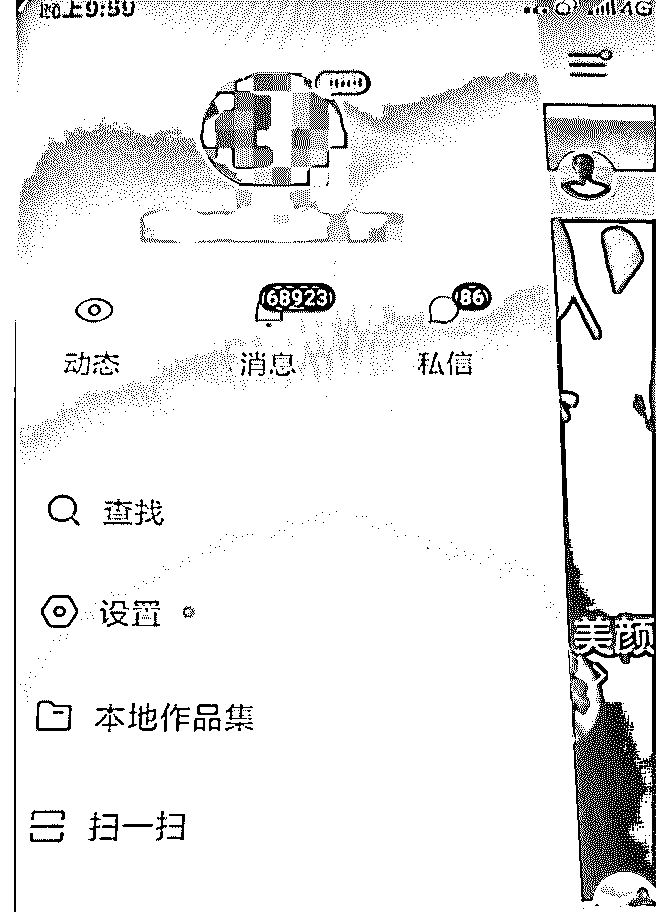

# 昨天铭则的分享评分

花爷梦呓换酒钱 :

昨天铭则的分享评分高达 4.6（满分 5 分），内容很长，图片很 多，整理成了四个部分分享给大家

————————

分享主题：短视频的崛起与如何抓住短视频的风口（一） 分享人：铭则，互联网从业者，进入网赚行业 4 年了，经历过

淘宝，微商，淘客，社群，短视频

分享背景： 18 年抖音的崛起，几亿的日活 快手散打哥，一天卖货 1.2 亿

现在年轻人的手机上都会有抖音和快手，有流量的地方就有 商业

今年李佳琪抖音卖口红卖到爆 各大平台直播火爆，公共号都在直播 我想很多人都在关注短视频也有很多人在尝试做短视频，今

天给大家讲解一下短视频

分享正文（一）：

大家好，我是铭则，今天这个分享我就用这个图片加语音的 形式来分享吧，我感觉语音的话，一个是讲的比较快，（另 外一个是）还能多讲一点。

今天的分享讲一下很火的短视频，从 18 年开始就很火，到今 年会更火的一个短视频。简单的讲一下它的一个趋势，还有 就是一些现在最火爆的，一些好的视频的做法，大家听完之 后呢，肯定是可以直接拿去做的。

在分享之前呢，先给先做一个简单的自我介绍，我是从 14 年 开始，那时候还在大学，算是开始搞互联网，从那时候搞刷 单，到后来开淘宝店。到 15 年的时候开始搞微商，因为（当 时）在淘宝电商卖那个高仿，那时候开淘宝店卖高仿查的没 那么严，被封掉之后就开始转到微信里面，算是开始做微 商。因为一直都是在大学里，算是半做半不做，就是一边玩 儿一边做，但是我那时候就充分感受到，就是在网上，这个 空手套白狼，赚钱是非常容易的，因为我包括做微商，开淘 宝店之后，都是做的无货源的模式，都是找别人代发的。

从 16 年开始呢，（就是）毕业之后，白天上班，晚上开始就 准备搞事情，那时候正好是接触到淘客，就是微信群淘客， 那时候是从 16 年 11 月份开始的，其实微信淘客是从 16 年的 5 月 份（或者）6 月份开始有了第一个群发的软件，那时候如果说 在网上有一定的资源积累，做淘客的都赚到钱了，我那时候 因为白天上班，晚上搞这个，也算是一个兼职，所以说收入 没那么高。但是在我感觉就是说，这个赚钱太容易了，就是 说做淘客赚钱。然后一直到了 17 年的 7 月 14 号开始，腾讯开始 大封杀淘客号。（就是）淘客这种微信号，这个时候开始收 入就断崖下跌。

在 17 年的年底开始接触到这个花生日记算是。现在来看算是

转型的很不错的一个方向，因为从目前来看，就是说做花生

（日记），也算是带我淘客这一块的收入上算是一个比较稳

定的一个方式吧，相比于其他的一个方式。然后那时候

呢，18 年的三月份开始，那时候这个抖音开始火爆，那时候

开始尝试接触这个抖音，但是没有去认真去做。

真正开始接触，还有尝试做短视频，是从今年的年初开始进 军这个短视频（领域）。

为什么要做短视频，我觉得这是一个趋势，确实是一个趋势 和风口，零几年的时候是一个图文时代，那时候就是做公众 号，做这种文章，做网站，做 SEO 搜索，那时候是最赚钱 的。还有后来的这个微博等等这一些，算是一个图文的时 代。

到后来为什么我觉得短视频是趋势和爆发呢？主要是我个人 认为是两个原因：

1、一个是网络的普及，4G 普及之后，让大家上网变得更容 易，就是短视频，用手机就可以播放，更加流畅；

2、再一个就是这个手机的普及了，智能手机开始大范围普 及，人人都可以买得起手机，人人都可以用手机去下载一些 各种丰富的软件，也是这个短视频火爆的一个原因。

其实互联网这个风口的趋势就是随着网络和硬件的普及而不 断的发展的。比如说从网站、论坛、博客到微博、公众号、 知乎，再到这个抖音和快手，就是短视频这一块。

当然，并不是和大家说有什么趋势就一定要去跟风做。只是 说在趋势上赚钱会更加容易点，现在（短视频是）最火的东 西嘛，流量在哪里，这个钱就在哪里。

今天给大家讲的短视频。我主要是以现在最火的两个平台开 始讲，就是抖音和快手，其他平台就先不用说，因为你要做 短视频就是这两个平台为主，其他的平台包括火山也好，美 拍也好，包括小红书也能发视频，这些都是辅助的。

最主要的还是做这个快手和抖音，我先来说一下这个快手和 抖音，这两个平台的分别：

1、首先呢，在这个带货这个方面，快手要比抖音是要强一点 的。

因为在抖音上是以创意视频为主，就是说它没有那么强的卖 货性质。咱们去看那个抖音的直播，基本上都是以这个唱歌 儿啊，聊天儿啊，美女啊等等，这些东西为主，它这个卖商 品的话，卖货也基本是与抖音合作的分成去卖货。

抖音对视频的要求太高，比快手高很多，大家可以看快手视 频的话，它的封面相比较抖音是比较土一点的。

（图 1，快手）

（图 2，抖音）

2、再就是这两个平台呢，抖音是以这个推荐机制（为主）， 就是它向上滑，一个视频往上（或者）往下滑，你看了什 么，它会继续给你看什么，用户的主导权相比于快手是弱一 点的；

快手呢，大家（会看到）是有很多视频，你选择哪一个，你 就自己点，你点你喜欢看的视频，它就在那，所以说快手对 于这个封面的吸引力是比较高的；

3、然后再就是变现性质，在抖音上直播或者发短视频，卖货 广告是比较常见。而快手多了一个可以引流（的优势），快 手引流到微信的限制没有抖音那么大，快手你可以在直播间 里直接就把微信挂到后面，也可以在聊天主页上直接留这个

（微信）。

我目前是做了抖音和快手，各做了好几个账号，最近正好比 较成功的是一个我做口腔护理产品的一个垂直类帐号，我就 正好拿这个例子给大家说一下，这个快手的卖货力度是多么 的厉害，我是见识到了。

（图 3） 我这个号是刚做了也就是一个星期左右，视频只有十几个，

然后就爆了个 308 万的一个播放（量），是讲口腔护理的，因

为我卖口腔护理类的产品嘛，所以我就发这个口腔护理类的

知识，做垂直领域（内容）。

这个被爆了之后呢，我的私信，还有这个评论，里面这个带 货真的是太强了。

（图 4，图 5，图 6） 每天这个私信直接回复不完，全部都是问我，怎么去治疗牙

齿啊，我的电动牙刷多少钱啊，因为我卖电动牙刷嘛，还有

口腔护理的产品直接就是问评论，里面就是问咱们多少钱多

少钱，怎么买这些东西。

所以说当你能为用户提升价值的时候，为粉丝提供价值，你 就能够获得他们的信任，后来获得他们的认可，后来我有一 部分私信直接就说，你们加我微信吧，我最近信息比较多，

看不过来。

还有一部分呢，就是直接就加我微信，当天就加了五六十个 人过来，当天就出了十几单，我一只电动牙刷能赚 100 多块 钱，当然我的产品质量肯定是很好，不能说卖他们不好的东 西。

（图 7） 说到这里呢，就是说到一个定位啊，后面再说吧，后面我会

再讲这个，就是为什么说要做这个垂直账号。

讲完我快手这个帐号之后呢，再给大家讲一个特别想给大家 讲的就是，这个不要被割韭菜。

（图 8） 为什么说不要相信大师被割韭菜呢，我从 18 年（开始），因

为我是在这个网赚圈里，淘客什么的。（然后）每天都是各

种大师搞培训啊，从这个几百元一直到上万元的抖音培训课

程都有，包括现在就是搞那个抖音淘客的培训特别火。

我想就是给大家分享一个就是说。你们真的以为这个学这种 短视频制作也好，就学那个几天就能学会了吗，你给他们 1000 多块钱，几千块钱，你学了三天你就能学会了吗，好也 好，不好也好，他也不管不问。

当然啊，我就是说说，说到这里之后可能又有人说那我们自 己不会，我们不找人学。我们怎么知道怎么做呢。

其实在这里我教大家一个非常简单的方法，就是你直接看同 行，你想做哪个领域，你就直接看这个领域的同行，你找 30

个做的最好的同行。

然后你就拆解他们的视频就行，没有什么技巧是学不了的， 他们用的软件都非常的简单，都是一些手机 APP，连电脑都 不需要的。

后面用哪些软件我再慢慢给大家讲，然后你如果说不知道变 现方式，那很简单，你就看他们有些留微信的，直接加他们 微信，直接抄他们的朋友圈，直接就是一个变现方式，就这 么简单。

就根本没必要说什么抖音 1.0，抖音 8.0，还有一些我就不说 了，什么那个图文号收费两千三千的那种，就教你如何去做 这种视频（之类的课程）。

这些视频你自己看一下同行，就用我刚才说的那种方式都是 可以完成的。

然后再就是，他们会教你一个非常非常有意思的东西，就是 养号，这是一个非常有意思的东西，我今天一定要给大家 说，就是说你这个号没有养好，所以你这个视频（带货的能 力）不行。

（比方说）他找你，收了 2000，教你学（做）抖音，然后你 说没有流量（卖货），他说你号不行，你号养的不好所以这 个（视频）不行，你要换个号做。

想想是多么的可笑，首先他把这个事情撇开，不说自己的课 程不行，是说这个（抖音）号不行，然后也不是（他）这个 人（水平）不行，就说你号养的不好，不是你的内容不行， 是你号不行。

然后这些韭菜和小白啊，他们就会相信，为什么？因为没有 人会相信是自己不行，人都是喜欢找客观的原因，就说，哎 呀，我做了这个号才做了几天，没内容。是我的号不行，不 是我的内容不行，我老师说了我号养的不好，那我换个号再 养好。

然后就因为这个观点，你不会认为是你的这个大师教的不 行，你也不会认为是你自己的内容，不会吸引粉丝，也根本 不会说多做得很烂，就是你号也不行啊，你要继续养号。

那我只想说一句，就是那这个用户，他看你的视频，给你点 赞的时候。他会知道你这个号养的好，我给你点赞，你这个 号养的不行啊，今天我不给你点赞了，他（难道）会看到 说，你号养的好，我给你转发，我给你评论。是不是啊，这 不是很可笑的一件事情吗。

对于养号这个东西，确实当时是存在过，存在于什么时候， 存在于什么地方？存在于 17 年，18 年的时候，最开始抖音还 没有那么火的时候，有人做搬运，因为他一个工作室吧，他 有 10 个、20 个人，10 个、20 个号做，甚至几十个号儿，上百 个号儿，他这个就需要养号，因为你的号不活跃，整天在一 个 WiFi 下也不看视频，这个号可能就是低质量的号。

那如果说我们一共就做一个抖音快手号，就是你自己的号， 你整天没事还拿着看，拿着它出去玩儿，那个 IP 地址整天 换，你用养什么号，根本不需要的，你不火的原因就是你的 内容不行，内容没有吸引力，用户根本不会给你给反馈，更 不会推上热门。

我说到这里，可能有人说不信，可能就是号养的不行呢，那 我其实就给大家一个方法去测试，如何证明是你内容不行 的，

这个方法其实非常简单，你就投抖+，快手上叫粉丝头条，你 花钱行了吧，花钱买曝光，你充上 100 块钱，买个几千上万的 曝光那种行了吧，你买上这个曝光，你花这个钱等于一定会 给你推这么多人，推几千的曝光，那这时候你有了曝光，你 再看一下反馈。看一下有多少人给你点赞，多少人给你评 论，看看能不能给你推上热门。这样你不就知道了吗，知道 你的内容到底是不是好，号是不是不好，还是说是内容不 行，你这么测就马上就能测出来，就是你的反馈其实花完钱 之后还是没有什么进步的。

所以说，在这里主要就是给大家讲，你们去找人培训的时 候，包括自己做的时候，就是内容不行，你的内容不吸引 人，或者说太枯燥，是肯定不会上热门的，你就换位思考就 行了，你看了一个东西毫无感觉，你还是会一直看完吗？在 你毫无感觉的时候，前五秒就想关的时候，你还会在看到第 60 秒吗，那是不可能的。

讲了这么多之后呢，我开始正式开始讲这个，咱们现在最火 的几个热门的一个领域，在就是教大家如何去做。

（图 9）

2019-05-23(15 赞)

评论区：

花爷梦呓换酒钱 : 铭则的微信：luochengcv10 还有花友只加了星球没进群的，看星球置顶帖加小助手拉你进群！

姚大鹿 : 内容为王真的是这样，亲测 100dou+获得的播放量比 1000dou+获得的 15W 播放量要多的多！

关注公众号"懒人找资源"，星球资源一站式服务