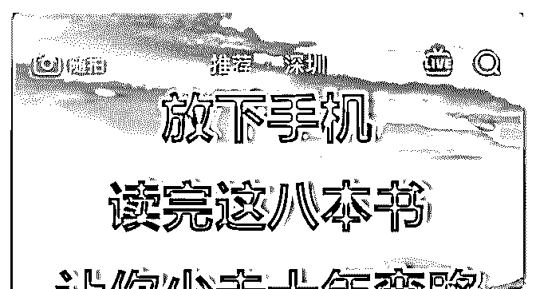

# 花爷，晚上好！我的

(提问)William : 花爷，晚上好！ 我的问题是：空余时间阅读什么样的书籍来拓展自己的是知 识面呢？ 目前的状态是：不知道自己看的微信文章是不是对的。我常 看的公众号是：小北的梦呓、花爷梦呓换酒钱、麦子熟了、 新东方、薇安说、十点读书、逻辑思维、洞见、张德芬空 间、囚徒健身…… 迷茫的原由：小北老师在他公众号上建议我们多看点落地的 文章，就是具有可行性的文章（比如知乎上的哪些行业比较 赚钱之类的文章），他的意思是大家都是成年人了，一些做 人的规则或者常识都应该懂了。同时，在你自己还在温饱线 上挣扎的时候，就不要关注那些宏观上的逻辑思维之类的。 他的这个观点我很赞同。但是看到抖音上推广书的广告我还 是想买。

广告的图片如下

2019-05-22

回答：8 个问答带你思考这个问题： 1\. 书有高低贵贱之分吗？

不好意思，真有，鸡汤文就是比较 low。 2\. 那读鸡汤文有错

吗？ 没错，人不需要追求绝对的正确，只有更加合适的策

略。如果你是读鸡汤文的水平，那读鸡汤文就很正常。 3.既

然没错，为什么读鸡汤文会被瞧不起呢？ 因为错的不是读鸡

汤文，而是只读鸡汤文。人类不断探索、进步的过程，就是

走出舒适区，迎难而上的过程。你三岁看连环画，三十岁还

看连环画，就不太合适。 4.可我一读有深度的书籍就困怎么

办？ 那就别勉强自己读有深度的书，不如换个角度，先疯狂

看鸡汤文，看到吐、看到审美疲劳为止——鸡汤文的最大弱

点正是不耐读。 5.我一本书要看一两个月，一年最多看十

本，根本到不了看吐的水平啊？ 终于问到了点子上，其实你

看什么不重要，有正确的看书习惯才重要，只要方法对，一

周看一本绝对不是问题。阅读量大了，你接触到好书的概率 也就大了。 6\. 如何一周读一本书？ 不要每个字都看。先看目 录，了解内容梗概，然后一目十行的看，不到重点不要停下 来。 7.这么看不是囫囵吞枣吗？ 反正你认真看，几个月后能 记住几句金句就不错了。既然不影响结果，那速读换取阅读 数量就是个好方法。 8.鸡汤文速读，有深度的书也速读吗？ 对，鸡汤文速读，你会发现鸡汤文都差不多。有深度的书速 读，你会迅速了解此书是否对你有用，如果没用，迅速抛 弃，去读下一本书。 所以，读什么书不重要，合适才最重 要；书看不懂不重要，重要的是速读，扩大阅读的宽度，先 有个概念再说；就好像我直接给你的答案其实也不重要，重 要的是像聪敏人一样去思考。(36 赞)

评论区：

William : 谢谢花爷，您的回答不仅仅是回答了我的问题，更是能帮我更好的认清自己的现状！非常感谢 很幸运能加入这

个星球[抱拳][抱拳]

花爷梦呓换酒钱 : 有收获就好，大家有问题及时来问，别拖着

William : 嗯嗯，谢谢 还有就是我现在业余时间百分之七十都放在学英语上，主要用懂你英语 app，百分之二十拿来跑步

健身，百分之十是陪家人等。目前自己是做亚马逊产品开发，要用到英语。另一个是从心底羡慕英语好的人，觉得英文水

平高很牛逼。 以前是把自己的时间分的好细，同时练字，学英语，健身，练咏春，学小北老师的优联荟课程，阅读实体

书，阅读公众号文章等。但是发现多门开花，反而一无所成。 现在是想主要攻英语，以点带面，以后换工作或事其他的也

能多一门技能傍身。 现在也没练字，练功这些了，这样算不算思想和执行成的一种进步？[捂脸]

花爷梦呓换酒钱 : 可以尝试多项，但主攻放在一项上。另外定一个小目标，完成后考虑是否要更换主攻项。

William : 花爷，我微信私信发你几张截图，你帮我看下这个困惑的后续，总觉得还没完全理清头绪[抱拳]

William : 因为这里只能一次发一张截图，而我的问题可能要四五张截图，不好意思在这刷屏[抱拳][抱拳]

韩淙戎 : 你学英语主要为了阅读文字还是口语？

William : 偏向口语，但是跟中文一样，想阅读和口语都提升上来

关注公众号"懒人找资源"，星球资源一站式服务