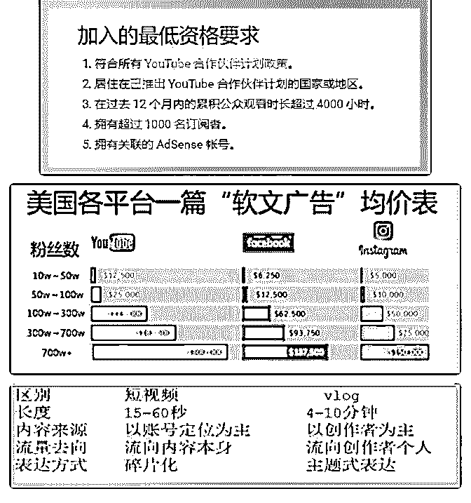

# 分享主题: You

花爷梦呓换酒钱 : 分享主题: YouTube 上 vlogger 赚钱的背后 分享人：郑璐璐

分享人背景:目前是大四在校生,今年 6 月份毕业,本专业是

「工程管理」,大二对编程感兴趣,开始自学编程,大二升大三的

暑假,找到了一家公司实习,随后一直工作到现在.因为接触的人

比较多,再加上兴趣,所以了解的就比较多一些

分享正文： 大家好,我是郑璐璐,目前是某个不知名二本院校的一名大四在

校生(厚着脸皮还能说自己是学生).当时能够被花爷选入这个

圈子,是因为我一直在 csdn 上面写有博客,这种分享的精神被

花爷看中.

今天和大家分享的内容,相对前面的大佬们来说,是小巫见大巫, 说的不好,还请大家见谅哈.

好了废话不多说了,接下来跟大家聊聊 YouTube 上 vlogger 赚 钱的背后.

我先来介绍一下,什么叫 vlog . vlog 就是 video log ,视频博客,创 作者可以用手机,单反等摄影器材,拍摄自己的日常生活,生活趣 闻等,算是最近兴起的媒体形式,目前在欧美,日本,台湾比较火.

我在这里,之所以选 YouTube 这个平台来分析,是因为它是面 向全球竞争者的,数据更大一些,背后的模式也更加有代表性一 些.

还有就是在这里选的是台湾的市场,因为台湾的市场形态感觉 和国内差不多,更容易理解一点.其实还有一点,也是最重要的一 点,这个等下会提及到.

先来说说, YouTube 的分成模式.

YouTube 本身支持创作者利用其发布在 YouTube 上的内容获 利,可以通过在视频中投放的广告以及观看内容的 YouTube Premium 订阅者赚取收益.但是这里有个前提:要加入 YouTube 合作伙伴计划.这是加入的最低资格要求:

（图 1）

在这里,强调一点,目前台湾地区是支持这种变现方式的,但是中 国大陆和香港暂时还没有列入合作伙伴计划的适用地区(这也 是为什么选择台湾作为研究对象的原因).

更加详细的大家可以看一下这个网址(需要科学上网): 这是从赚取 YouTube 平台广告收益这个角度来说的.如果你的

内容创作能力足够出色,受到金主爸爸的青睐,那么变现模式又

增加了三种: CPM ,固定费用,销售分成.

CPM ,就是根据影片的观看量的数据,给予相应的报酬.也就是 说,给你的报酬,是和影片的观看数量直接挂钩的,观看次数多赚 取的就多,观看次数少,赚取的就少.

固定费用,这个就是根据金主爸爸的要求,就能稳定赚取费用的 一种方式.比如我们现在看到的微信投放广告,就是我推一篇软

文,金主爸爸给多少钱,至于转化率怎么样,效果怎么样,我是不 考虑的.

销售分成,这个很容易理解,就是根据销售量,给你收益.这种玩 法在国内也是比较常见的.

其中, CPM 是绝大多数腰部 + 长尾网红们的常规商业合作结 算方式.

这个时候,问题就来了,采用 CPM 的方式的话,我报价多少合 适?这张图片或许可以给你一些参考:

（图 2）

但是这个报价只是一个参考,具体能不能到这个程度,还要看金 主爸爸的行业,还有就是 vlogger 自身的定位.就比如,如果你是 做汽车方面的内容,那么相对就比较高,大概就是这么一个意思.

除去靠 YouTube 本身平台获益,除去靠商业广告赚钱之外,还 有一个方向可以参考:付费订阅.

这个玩法就和国内的「知识付费」玩法差不多了,就是通过在 平台上宣传,让用户付费,然后自己提供不同形式的服务,比如可 以提供电子书,实体书,贺卡等等不同形式的服务.我在这里就不 多说了.

在上面也说了,中国大陆和香港暂时还没有列入合作伙伴计划 的适用地区.所以对于国内来说, vlogger 会不会是下一个风口?

我觉得很可能是,玩抖音的小伙伴们应该关注到这个信息了: 4

月 25 号的时候,抖音推出了”10 亿流量 vlog 扶持计划”,而且国 内不仅仅是抖音有相关扶持政策, B 站,新浪微博,快手等等都 已经开始了.

那么如果我想要去尝试一下,我该怎么做呢? 在这里列举一下,变现能力最强的爆红 vlogger 的三大关键:

<今周刊>编辑团队,持续 240 天跟踪「理科太太」的每日订阅 人数变化，整理出三个爆红的关键原因：(在这里,我只是摘录 了一部分,想看完整内容,可以看这个链接:

1、奠定知识性人设

理科太太刚刚突破 20 万订阅人数时,就接到厂商的广告邀约, 产品是一款多功能电子锅,标榜的卖点是比传统锅具保留更多 新鲜营养.

理科太太为了证明广告商品的功效,实际将用电子锅煮过的鸡 汤送交 SGS（全球领先的检验、鉴定、测试和认证机构）检 验,不但成功证明营养更高,高质量广告也引发讨论.

理科太太擅用理科专长及高学历背景塑造权威形象,成功奠定 人设,不仅让厂商喜欢与她合作,也为她所推荐的商品提高了可 信度.

2、疯狂曝光,平均两天就上传一个视频

理科太太在去年 12 月 1 日至今年 1 月 20 日这 51 天内,就总

共上传了 23 支影片,且每日都有超过万人订阅,这段疯狂曝光

期，让她在两个月内极剧增粉 60 万.

对 YouTuber 来说，发片的频率快，比较占优势.影片更新速 度越快，越能累积粉丝反馈数据，立刻进行调整.

3、和 A 咖明星合作 天后蔡依林曾与理科太太合作,在影片中露脸，这让理科太太

与主流演艺圈接轨,知名度大增,当天就增加了 2 万订阅.蔡依

林之后,许茹芸、黄子佼、蔡康永、萧敬腾等大明星都接连在

她的影片中出现.

以上三点,使得理科太太,成为了变现能力最强的一位爆红

vlogger

接下来复盘一下, YouTube 上 vlogger 赚钱的背后,有三种收益 的方式:首先是 YouTube 平台本身的效益,然后是金主爸爸们 的合作,最后是付费订阅,也就是在自己的订阅者基础之上,发展 自己独特的服务.

也可以联系到国内的微信公众号的生态,差不多也是这个模式. 首先是微信公众号订阅数超过一定数量之后,底部会有广告,也

就是在赚取「微信」平台本身的利益.

接下来就是当微信公众号的影响力慢慢变得越来越大的时候, 就会有各个广告主的合作找上来.

再然后就是如果自己还有精力的话,可以发展一下自己独有的 服务,这个就看各位的能力了.

最后说说, vlog 与短视频有什么区别,为什么目前它火了起来. Vlog 就是视频博客,短视频也是视频,它们之间的差别在哪儿

呢?

（图 3） 从上面这些区别我们能够看出来,短视频是以账号定位为主的,

而 vlog 是以创作者个人为主的,这就是 vlog 为什么会是风口的

原因,因为短视频可以抄袭类似的主题,类似的内容,但是 vlog

不同,它是以创作者个人为主,那么一个 vlog 就代表着一个人的

生活,短视频的内容主题可以抄袭,但是每个创作人的生活却不

会雷同.

这就意味着,如果平台可以让很多用户来玩 vlog ,就相当于几乎 是 0 成本增加了很多可持续的创新内容,这样会吸引更多的流 量,而这些流量的吸引,又可以用来补贴 vlog 的创作,怎么算都 是百利而无一害,所以这是很多平台开始扶持 vlog 的原因.

到这里,想和大家分享的内容,就差不多了,如果对您有所启发, 甚感荣幸.感谢各位~如果各位有什么问题,欢迎提出,咱们一起 讨论[`support.google.com/youtube/answer/72851?hl...`](https://support.google.com/youtube/answer/72851?hl=zh-Hans)

[`www.setn.com/News.aspx?NewsID=498678)`](https://www.setn.com/News.aspx?NewsID=498678))

2019-05-18(23 赞)

评论区：

光光 : 在 YouTube 上做 vlog 明显比做搬运更可持续、更赚钱，但操作更高、工作量也更大

花爷梦呓换酒钱 : 不光是在 YouTube 的问题，vlog 化可能是短视频的趋势，包括国内

masmacer : 我怎么看不到图啊，大家都能看见图吗

郑璐璐 : 滑到最下面，也还是看不到嘛？

masmacer : 能看到，就是不太习惯

关注公众号"懒人找资源"，星球资源一站式服务