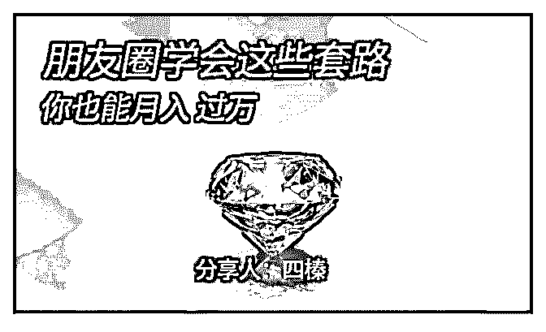
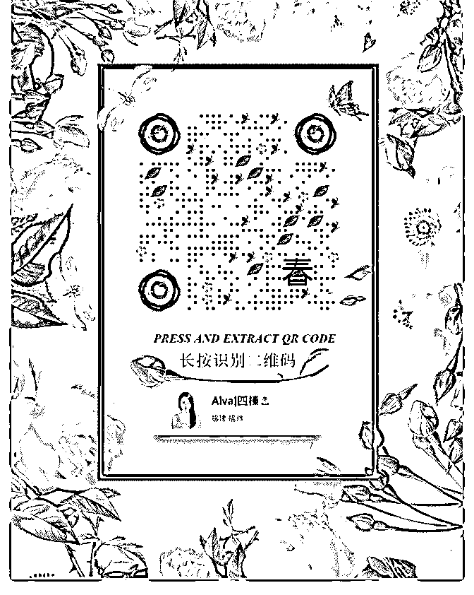
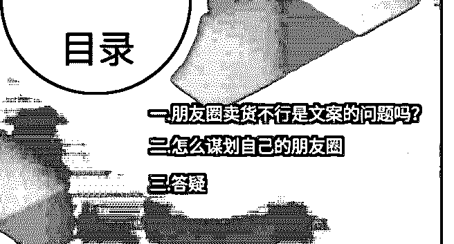
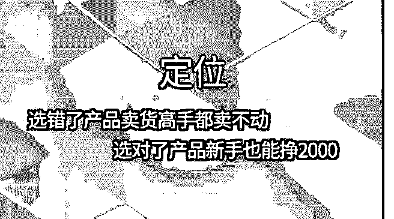
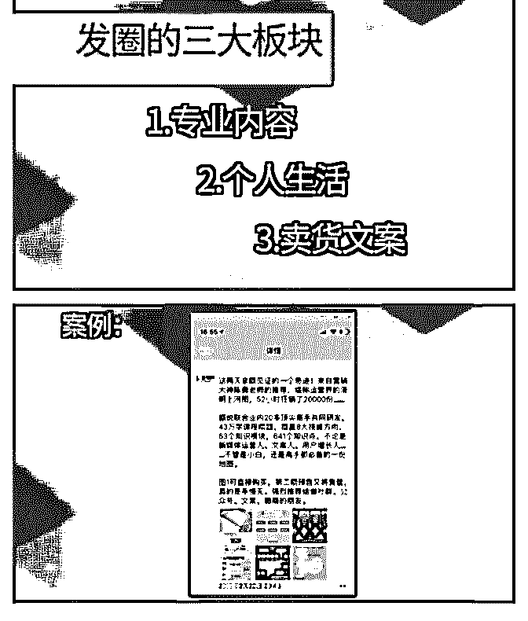
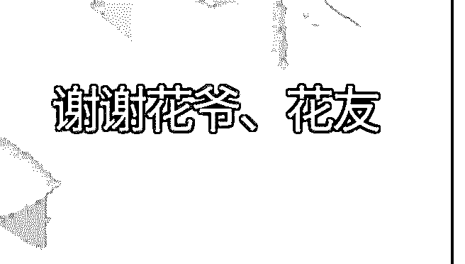

# 分享主题：朋友圈学

花爷梦呓换酒钱 : 分享主题：朋友圈学会这些套路，你也能月 入过万——普通人快速入门朋友圈销售掘金术

分享人：四榛，5 年会计生涯，18 年入行研究微商朋友圈销 售，发现朋友圈是离钱最近的地方，朋友圈不仅可以掘金， 还是打造个人品牌的重要战场。

分享正文： Hi,各位花友晚上好！ 我是四榛，现在开始分享！

今天分享的主题是：朋友圈学会这些套路，你也能月入过 万。[普通人快速入门朋友圈销售掘金术]

（图 1） 先发下我的自我介绍：

【昵称】:四榛

【坐标】：福州

【职业】：主管会计

【我的优势】：拥有和迪斯尼 、似鸟等大牌合作的鞋厂

【想链接的人】：向上生长、终身学习者、同频的伙伴

（图 2） 可能会有人疑惑，为什么我不分享关于工厂方面的知识，而

是选择朋友圈营销呢？这是花爷给你我启发，微商不容小

觑，他的整个现金流在市场，是非常庞大，有小部分的人在

微信上年销量可以达到千万级别，小百万的多有人在。而身

后的这个人，他原本只是个普通人。

所以说朋友圈是现在普通人，离钱最近的地方，这个行业的 起点比较低，跳一下，大家都够得着。

我有问过身边的人，你是怎么评价“微商”？ 大多数的人表示，不喜欢被刷屏。做微商的也表示“人微言

轻”。

怎么办？放弃吗？当然不行！ 花友的力量就是帮助大家一起掘金！众人拾柴火焰高。 我们没有出生在我们父母那辈，只要肯努力，卖力气就能当

老板的年代，但，我们现在的网络的时代，只要紧跟有想法

的大佬，然后执行就能有更好的生活。能不能突破自己的阶

级不敢保证，但是挣足旅游经费还是可以的。此时不出，更

待何时！

看过《穷爸爸 富爸爸》的人都知道，打工是不可能财务自由 的，不管你怎么 996 。所以从今天起像经营一家公司一样经营 自己。

今天分享的内容是我参加过的训练营和学过的课程，结合起 来分享给大家。

下面开始朋友圈掘金术 01 版本 在这个人人都离不开微信的时代，怎么让你的朋友圈越来越

值钱。我们今天分三个部分来讲。

（图 3） 第一部分，我们来探讨朋友圈卖货不行是文案的问题吗？你

觉得呢？是还是不是？第二个部分，我会讲，我们要怎么谋

划自己的朋友圈，用来打造朋友圈，让自己真正赚到钱。第

三部分是答疑。

为什么同一篇朋友圈文案，别人发朋友圈可以转化上百单， 我连十单都转化不了呢？明明文案都一样呀？为什么呢？

因为我们并不知道的是别人为此铺垫了多少？很多时候并不 是一条文案有多牛逼，而是你之前所发的所有文案都是做了 贡献。也就是说别人都是提前用文案在朋友圈养熟圈子，获 得了好友的信任，这是他长期以来他发的每一条文案所积累 下来的结果。

你在瞎玩朋友圈，还是有意识地谋划你朋友圈？ 重点：今天的发圈行为一定要在以后产生结果 那么对于新手怎么通过朋友圈营销，来实现挣钱的小目标，

甚至说利用朋友圈文案来打造自己的个人品牌呢？

接下来讲第二部分：谋划自己的朋友圈，打造能挣钱的朋友 圈阵营

第一个关键词：定位

（图 4） 怎么才能精准定位？

最靠谱的一个办法就是分析你自己：；你是谁？你会做什 么？你想做什么？长处是什么，特色是什么？根据你从事的 职业或者想做的副业，还有优势特色兴趣爱好，以及你手里 都有什么样的资源，通过这些筛选出一个特定的领域，当你 找到这个特定的领域就不断地去展现，人们的心里，必须有 一个非常清楚的认知，知道你是干啥的，做过什么？做的好 不好？这样定位成了！

你喜欢美食，那你就可以把自己定位成美食达人，你就护肤 化妆很有经验，那就可以把自己定为朋友圈的化妆达人，如 果你做设计很在行，那就可以定位自己为朋友圈设计专家， 深耕一个领域，做精做专做透！

强调一下这里的这个专业，是相对来说的，而不是绝对的， 专业就是在你的圈子里，你能做到比 80%以上的人好就可以 了。

有了明确的定位，接下来我们要开始打造自己的专业形象， 建立朋友圈的信任。我们就要开始去死磕如何发好每一条朋 友圈了。这时候你的朋友圈文案就不能像以前那样很随意的 去发布了，而是要规范的去发布，让你的这个形象在圈子里 得到落地，然后持续地去发酵，最终达到销售的目的。

操作指南：

首先杜绝刷屏，这种神操作，这会让你离被屏蔽越来越近。

（图 5） 分三大板块，建议每天发 4~6 条，每天尽量固定时间点发。 第一个板块是专业内容 分享的是干货知识。看个人定位而定，一天两条。内容不能

太专业（官话），一定要通俗易懂，用大白话把知识点说清

楚就可以了，一次就讲清楚一个知识点就好。

没有很多知识和经验可以分享，怎么办？分享几个素材来 源。

1、购买领域内的经典书籍（一本够发个小半年了）

2、相关视频演讲（截图加上自己的感悟，有质量的专业内容 就出来了）

3、公众号（每个领域都有很好的公众号，找到它）

4、付费社群（星球、轻社群） 第二个板块是个人生活

很多在朋友圈列表的朋友，是没有见过面的，怎么产生信任 营销。展示你生活场景，会让你们的关系更近，就像生活在 你身边的朋友一样，我知道你是谁，长什么样，过着什么生 活。什么都不了解你，怎么跟你买产品对吧？生活板块的要

义就是真诚、用心，所见所闻、兴趣爱好都是可以发的素 材。每天坚持发两条。

第三个板块是卖货文案 最后一步，我们来重点说说怎么写朋友圈文案，我们前面做

了那么多铺垫，提供专业的分享，展示自己真实的生活场

景，就是为了在需要的时候出来卖，这是我们谋划朋友圈的

终极目的。不过在写产品文案之前，你还得解决一个问题，

那就是要卖什么！根据你的定位给你个思考工具

选品 3 个原则

1、市场受众大（城市 VS 全国）

2、客户需求强（不买就难受）

3、复购频率高（N 年一次的高端料理机和 1 个月买 4 次的美食 你选哪个？）

不过不管你卖什么有一条标准应该遵循，那就是你推荐的任 何产品一定是你喜欢的认可的，你真的喜欢认可这个产品时 你写的时候才有底气有感觉。

发圈的产品文案写作万能公式 最头疼的文案，下面给你一个能挣钱文案公式，你直接套用

就行。主要是多模仿多写。

我正在+自身感受+适合人群+立即购买理由 看一个案例

（图 6）

体现产品对别人的最大价值：1、生理上的获得 2、心理上的 获得 3、财富的获得。

在朋友圈写产品推销文案，特点卖点不是最重要的，最重要 的是什么呢？是体验，而且是你的体验，这种体验甚至要超 过产品本身，因为这是基于个人的信任营销！

经营好自己的朋友圈，因为你发的朋友圈每一条其实都是销 售文案，推销的就是你自己。相信我，你的朋友圈一定是你 开始挣钱的宝地。

不想做微商，也要经营自己的朋友圈吗？ 答案是肯定的，个体崛起的时代已经来临，还在悄摸摸藏

着，大胆的展示出来，或许你金主爸爸就在你朋友圈。

现在就开始着手打造有灵魂有价值能挣钱的朋友圈吧。 现在开始第三部分：答疑

1、怎么打造个人品牌？

其实大家不用把这件事想的特别高大上，凯文凯利说过一句 话：“你只要有一千个铁杆粉丝，你就可以不用上班了。 ”1000 个有点难。其实只要你能够影响到 1 百人，你就会有一 笔很不错的收入了。

打造个人品牌的本质是：自我赋权，就是通过一系列的行 动，不断的让自己在某个细小的领域里，变成权威。当你变 成一个小小的权威以后，你就能够影响大众。

怎么进行自我赋权呢？只要你锁定了一个好方向，比一般人 领先一点点就可以了。

一定一定要去平台展现自己，我就在星球里遇到花爷的。平 台有很多：朋友圈也是平台、付费社群星球、知乎、公众 号。就算你是钻石，也得让大家看到才行。

今天的世界是平的，我们的目标不是成为喜马拉雅，而是仙 人掌上的一根刺。

所以问题来了，花爷，你这么多粉丝，现在把自己养得怎么 样了？

1、朋友圈没生意的情况下，微信还有啥引流拓新的妙招？

引流吸粉，一直是老大难的问题。大家最想知道问题，应该 都差不多。客户是哪些，客户在哪里，客户怎么来，代理咋 维护？

这两个问题一起回答。结合在一起就是引流、维护。

朋友圈没生意，可能是之前刷屏，导致被人屏蔽。

3 点建议：

1、重建形象（参考上面分享的发圈方法）（加餐）微信形象 打造方法：

（1）取个好微信名，好记好写好传播 好微信名=好记忆、好拼写、有特点

熟悉的元素：人物名、称谓 例如：水果西施 、花爷、同道大 叔

熟悉的事物：植物类 动物类 食物类：切糕王子 、年糕妈妈、 小包子爸爸

在你的微信名里添加你的职业也会凸显你的专业性、职业职 位、真实性。也方便别人在搜索框里快速找到你。比如大家

忘记你叫什么了，但是依稀记得你的职位或者代表性的元 素，一搜就找到你。当然这里是不建议在微信名签名加 A 或者 电话号码直接加载上面。有点 LOW 这样。

（2）一个好头像，快速提升微信信任感 微信头像怎么做，才能持续定位，为持续变现，带来更多可

能呢？

微信头像的重要性，仅次于微信名，他相当于你和别人见面 的一个形象。我发现很多会用自己的小宝宝、宠物、风景来 当头像，那这样的情况，就好像和别人见面，旁边顶着自己 和宝宝，或者顶着自己的宠物一样。别人看不到你的脸，但 事实交流的是你自己。

虽然可以理解用自己的喜好，来表达自己的喜爱之情或者心 情，但却不利于微信上的交流。尤其难产生信任。

微信上交流，原本就是点像虚拟世界上的交流，如果能以本 人照片来当头像交流，也能体现出真实感和真诚，更能产生 信任感，更利于微信变现。

2、相册封面及个性签名，做好你个人广告

先认识下封面和个性签名

封面就是点开微信头像进入到朋友圈页面时，顶部的那个封 面图。底部有一行字，就是你的个性签名（最多 30 个字）

封面和个性签名，就是你的广告位，别人加你的时候，第一 看到的就是你封面、个性签名。

相册封面个性签名体现你的个人形象广告，除了体现个人定 位，同样可以体现个人精神面貌。传达个人的追求和价值 观。可以创达自己内心的图片，或者是自己的设计的图片和 文字，都可以。

3、清理好友 市面上有免费也是付费的，推荐付费，这样不会打扰别人。

（1）添加新好友，引流的 3 个方法

1）平台输出引流（参照花爷）

2）微课涨粉（准备自己的课程（平台：荔枝微课、微信群、 QQ 群），可以是时间管理、微信变现、文案训练任何你所擅 长的，重点是受众要大，避免这种教大家制作清明茶，开个 玩笑）

3）混群（材料包涨粉，需要注意的是，首先在群里需要提供 你的价值，比如帮助群主管理秩序，帮群员答疑，在有好感 度的时候，适当的时间点发，这种涨粉方法现在比较常见。 和群主搞好关系，就可以试着和群主商量，在群里分享讲 课，这样的粉丝链接更强）

引流的本质：价值！提供价值！你能给别人提供什么价值！ 维护的本质：价值！提供价值！你能给别人提供什么价值！

为什么要持续关注你，想好这个问题，就解决维护粉丝的问

题了。花爷的粉丝为什么这么铁，无论是星球还是公众号，

就是提供了价值两个字。

问答： 1、微信现在风控比较严格了，答主如何解决封号问题呢？ 四榛：先说下为什么被封的四种原因：

1\. 登入异常：经常切换微信的登录环境，会被系统检测为登 入异常。这个比较好解决，根据提示就能把号找回来。

2\. 被举报：这个是做微商最常碰见的，因为很多人认为受到 了打扰，要多人举报才行。所以不要刷屏，做个能提供价值 的微商，不仅能卖货，还能让大家喜欢。如果已经出现了这 种状况。参考一下做法

如果只是某些功能被封，可以通过微信团队进行微信解封。 向微团队持续发信息要求解封即可；

百度“微信官网”，然后点击进入，点击微信官网网页的底部 的“联系我们”。根据微信给出的联系方式进行解封；

进入“微信官网”后点击界面左下方的“客服中心”，选择网页上 的“微信解除限制”，然后根据网页的提示填写认证信息进行 微信解封；

进入“微信官网”后点击网页右侧的在线客服，与腾讯客服对 话，然后点击确定，通过 QQ 进行微信的解封，说明情况即 可。

3.安装抢红包插件和传播不法和色情信息：这个我就不说了， 我们群里应该没有这种人。

2、在运用微信的时候，有没有什么需要注意的 四榛：9 个特别需要注意的内容：

1\. 不要问在吗？有事直接说事。

2\. 少发语音，多打字！

3\. 尽量别求赞，求转发，求投票，或者群里发链接、祝福、 广告。

4\. 发给别人的自我介绍不要过长，过长对别人来说也是负 担。

5\. 朋友圈尽量不发负能量内容，会影响别人的情绪。

6\. 看到别人的内容好，想要转发！转发前记得点赞，评论在 转发，如果是别人的原创，注明出处即是尊重！

7\. 不是特别熟的好友，不要轻易发起视频通话。

8\. 发不自己销售的商品，一定要是自己能保证品质的东西。

9\. 注意保护他们的隐私。 分享结束

（图 7）

2019-05-18(30 赞)

评论区：

&herongwei : 满满干货，感谢分享[强][强]

鈡涛 : 学习[强]

光光 : 花友们有没有带货能力强微商好友，推荐下，想观摩下朋友圈。

seeking~ : 你是不是被抄袭了？

花爷梦呓换酒钱 : 应该是吧，这套理论讲的人很多，分享的花友本身也是上完课之后自己又总结了一遍，然后给大家分享

的。 我的文章、星球内容被抄的太多了，管不过来，没什么办法。

可乐 kele : 我微信好友里边有两个哈哈

关注公众号"懒人找资源"，星球资源一站式服务