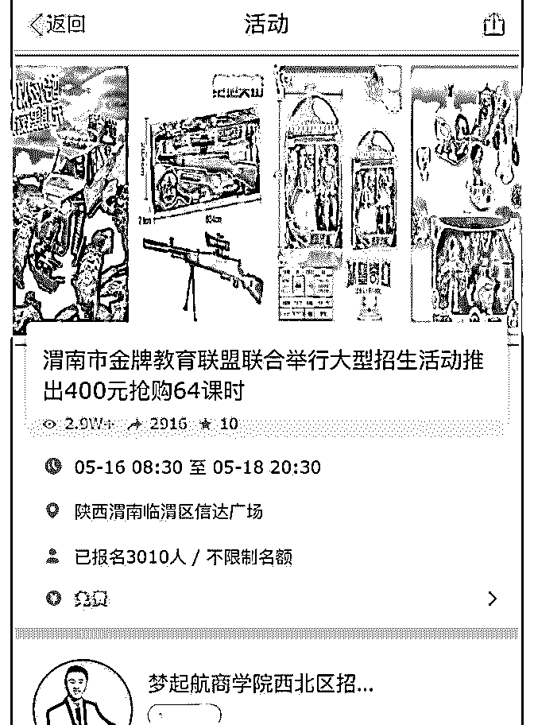
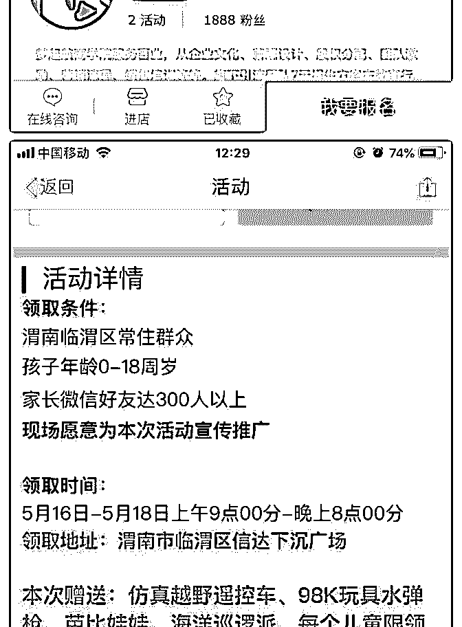
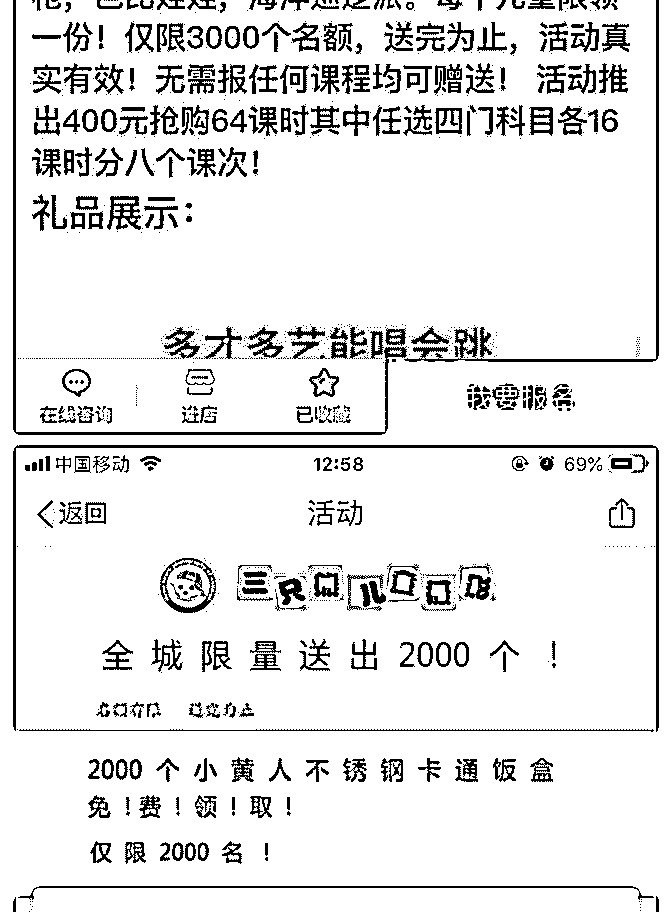
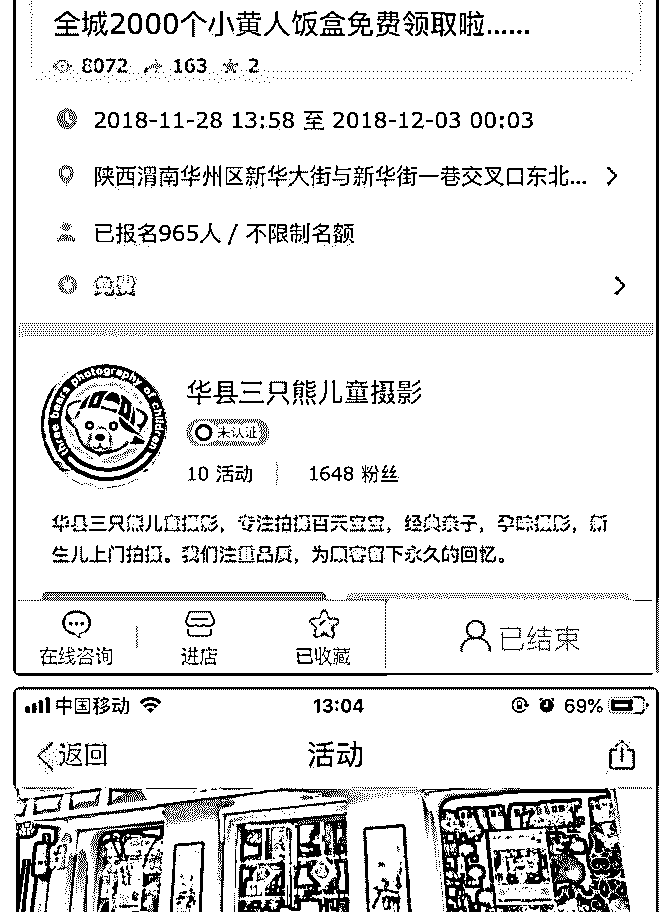
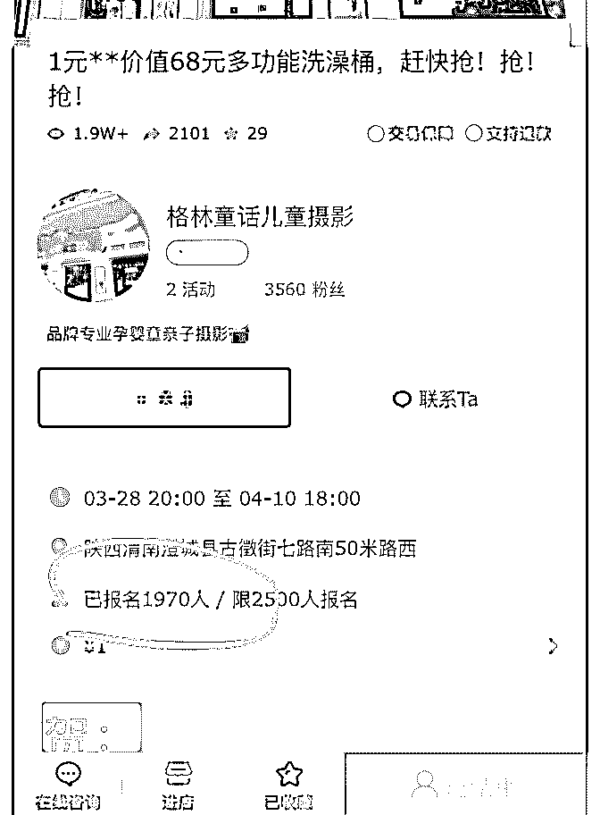

# 花友@散装青年在群

花爷梦呓换酒钱 : 花友@散装青年在群里提到的例子，用成本 几块钱的玩具、儿童用品做裂变活动，四线城市，几千人参 与。

对传统教育机构、儿童摄影来说，这个参与量以前不知道要 发多少传单才能做到。

但你说这招多稀奇吗？不稀奇吧，互联网圈都玩烂了，再说 这文案、这图片，远远谈不上精致。但在小城市，新鲜啊， 有用啊，效果好啊。

当然说这个例子，不是让大家一窝蜂去做裂变。裂变传播只 是一个开始，后续运营、精准粉丝才是关键。

但我想说，很多时候啊，当你能力到达一定水平以后，真的 别把自己往专家这条路上逼，绝顶高手那都是万里挑一的。 咱们换个市场还不行吗？咱们换个对手还不行吗？

古代打仗，以少胜多的、以弱胜强的，那些个案例，都是用 势、用自然环境。胳膊没有别人大腿粗，就别得找人掰腕 子。笨蛋干力气活，聪明人靠脑子。

2019-05-16(14 赞)

评论区：

EL : 这种也只能往信息效率低的城市下行

gh0st : 就是目标低点呗[捂脸]

花爷梦呓换酒钱 : 运营深度精选团队，专门帮企业做裂变服务的生意，做了几年了还在做，不知道这套的企业太多了。可

以说北上广的这套裂变进化史，在每个城市都能复制一遍。

正经®武夷岩茶-龙峰 : 这个是哪个活动发布平台？

花爷梦呓换酒钱 : 活动行吧

正经®武夷岩茶-龙峰 : 多谢，刚几个平台对比了下，是互动吧

花爷梦呓换酒钱 : 哈哈那我看错了，功能都差不多，合适就行

多闻 : 很多人的认知就是这种真是占了大便宜。这种套路现在依然有效，而且很明显。

关注公众号"懒人找资源"，星球资源一站式服务