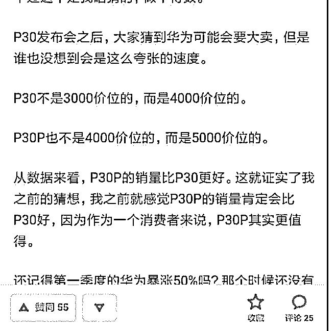

# 华为最新的 P30 系

花爷梦呓换酒钱 : 华为最新的 P30 系列，售价四五千，月出货 量能到 500 万台。

反观国内第一个跑出来的品牌小米，之前被 oppo、vivo 压着， 现在又被华为赶超。在国内，你会发现所有主打性价比的品 牌，无论任何品类，比如小米、比如网易严选，都能做到快 速起量，但永远做不到所在品牌的第一。

华为有点现在有点像十年前的苹果，大部分年轻人和中老年 人都认可它好，但你去问老百姓，华为拍照好在哪？系统好 在哪？没多少人能和你讨论参数的真假，一句华为好我朋友 都在用就完事了。

性价比就意味着对用户认知要求高，但大部分用户，永远不 懂行；性价比就意味着没有溢价，但大部分消费品类的第一 品牌，都需要卖出溢价。

不是说质量不重要，但在质量不错的基础上做生意，让用户 觉得产品 100 分，比产品真的 100 分，要划算的多。毕竟很多 用户，并不需要产品真的 100 分。

2019-05-15(23 赞)

评论区：

tx : 首赞[呲牙]

恋空 : 花粉，爱上了就放不了！

白一喵 : 中国还没有几个真·品牌。诸如喜茶这样的品牌，表面 ，其实是没有内核的。 【真正】懂品牌营销的，仍然是

稀缺人才。 TA 们在哪里？被大外企垄断，或者都单干了呀❤

随便 : 哈哈，你是华为的花粉还是花爷的

钱钰 : 手机市场的格局看着复杂，其实也不复杂，目前还是很简单的。 不管你喜欢不喜欢，现在谁碰华为谁死，和华为争

市场很不明智，可惜，只有小米这么不明智。 vivo 转型是最快的，率先降了投放，出了新品牌 IQOO 也算神来之笔，一下搞

了近百万台的量，把米 9 前期饥渴的量吃了大半，现在米 9 供货顺畅了，销量也下来了。vivo 的量增长很快，从落后到和

OPPO 不相上下了，Q1 可能比 OPPO 还卖的多点。风险最大的地方在于弹出摄像头作为旗舰机，是不是能被主流市场认同，

或者说市场规模能做到多大。 OPPO 船大，掉头就慢些，而且冒的风险也比较大，Reno 新品牌替代了 R 系列可以说是大胆

之举。不过现在也慢慢调整过来了，尤其是 Realme 的回归，恐怕会成为最大的助力。这款产品走线上，直接怼的小米，但

整体机器其实和红米的 K20 比较相似。（差别可能是芯片和弹出摄像头居中，红米 k20 是偏的，所以自拍的时候可能会有一

些畸变。） 目前线上市场就是荣耀和小米，而且小米翻盘无望，原因也简单，线上市场不到 30%，一半在京东手里，京东

和米家有竞争，当然更愿意扶持荣耀，几次给荣耀站台损小米刷单可见一斑。不过两家独大也不符合电商平台的利益，之

前京东就推了很多小品牌，比如锤子就算占到了这个红利，可惜都没推起来。所以京东天猫苏宁都力挺 Realme 是大概率事 件，线上如果变三足鼎立，小米互联网手机第二的位置可能也就不保了。 所以现在各家的策略很清晰，华为继续做高大上 和国际市场，荣耀主要是出海抢海外中档市场包括海外红米市场，vivo 的 IQOO 摆了小米一道，就看会不会出个品牌去抢红 米市场了。而 OPPO 的 Realme 也很清晰，就是海外抢红米，国内抢小米，挑战荣耀。当然华为的 nova 还盯着 OV 的市场，配 合 P30 系列和 OV 的 X 和 Reno 也是三国杀的局面。 这么看，OV 的策略很清晰，互相竞争保住基本盘，然后抢小米红米的份额 保增长。毕竟都是高通系，竞争起来比较容易。华为系的芯片摄像头都是独成一系，直接竞争容易说不清楚，加上华为现 在有美国总统加持，绕开还是最好选择。如果小米和红米还傻呵呵的盯着华为使劲，国内被 OV 打崩是大概率事件。 花爷梦呓换酒钱 : 两年前华为还没现在这么猛，小米已经至少被打懵两次了，但因为讲性价比，也没什么调整空间。预计 家居电器市场想进一步扩张也有难度，好在这块空间大。

恋空 : 都是[呲牙]

随便 : 高端市场还有个一加

关注公众号"懒人找资源"，星球资源一站式服务