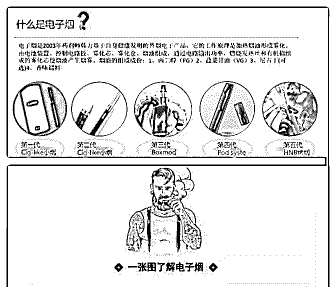
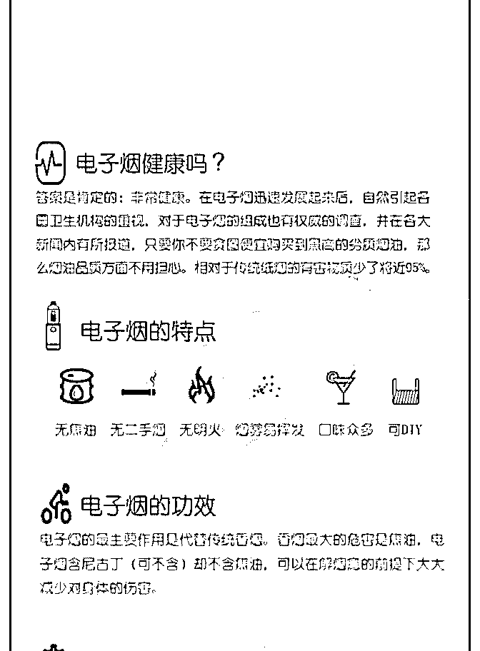
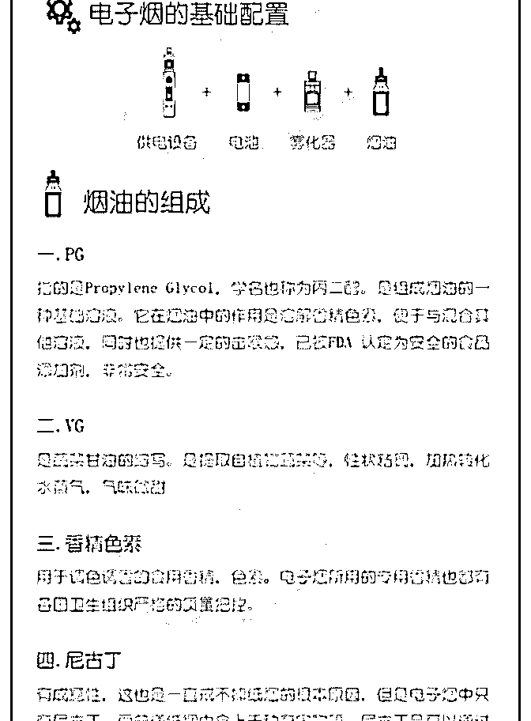
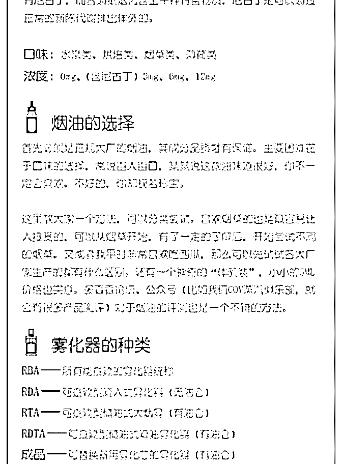
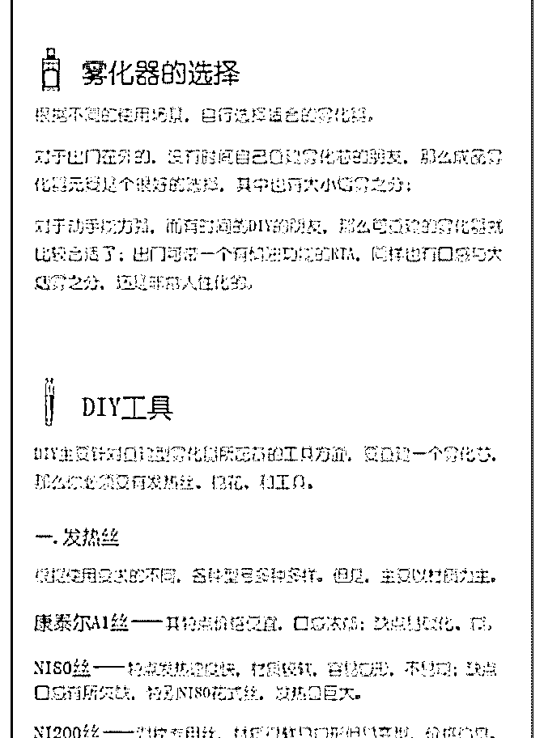
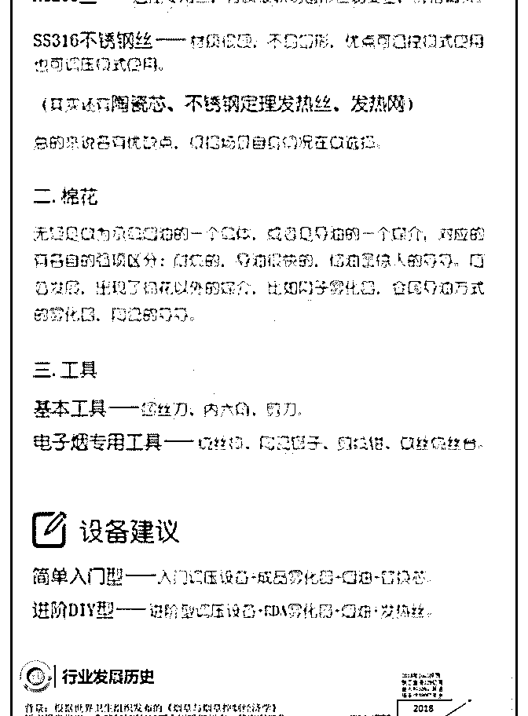
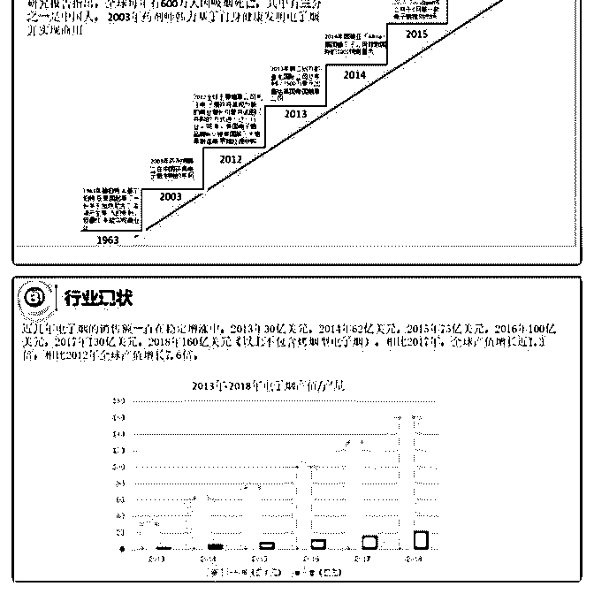
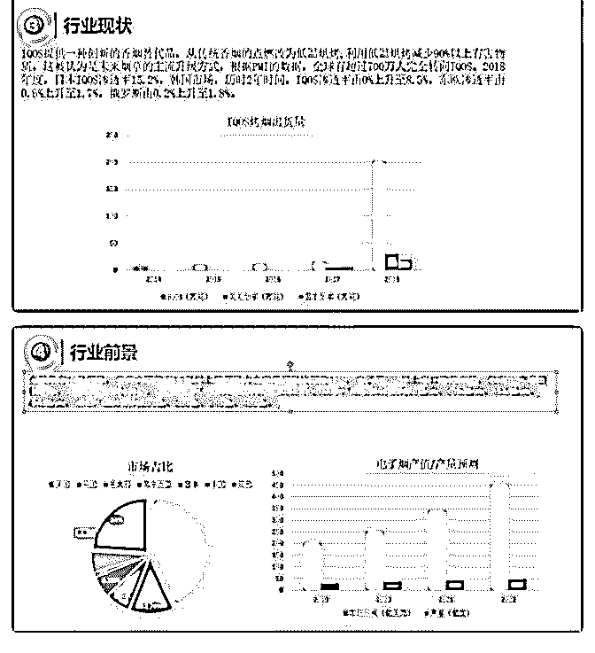
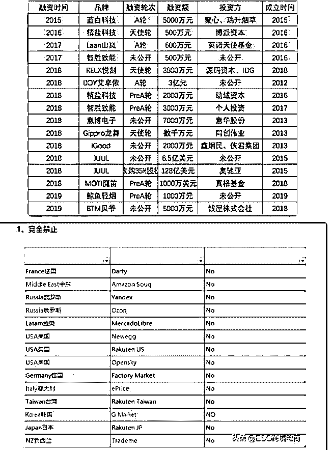
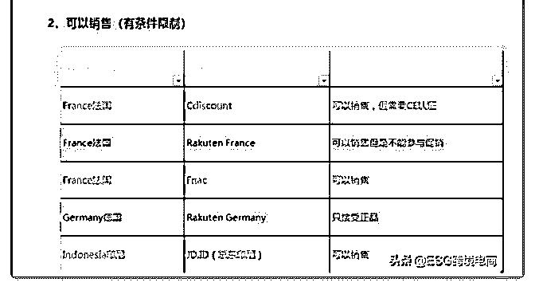

# 分享主题：以研发的

花爷梦呓换酒钱 : 分享主题：以研发的角度给大家分享电子烟 的背景、现状、国内国外的政策和未来趋势。

分享人：Luke，从事品牌手机结构设计和方案公司堆叠设计 多年，17 年初个人判断电子烟将会是下一个创业风口（18 年 已成为风口行业），于是从手机行业转向电子烟行业。目前 就职于某知名品牌厂商（13-15 年曾是行业龙头），借此了解 电子烟从设计到成品、供应链、市场规模以及目标市场。

分享背景： 大家好，我是 Luke，今天由我给大家分享电子烟的背景、现

状、国内国外的政策和未来趋势。

分享之前给大家普及什么是电子烟

（图 1） 上图我们可以看到电子烟是 1963 年发明的，只是当时技术原

因没有实现商用，直到 2003 年药剂师韩力发明并申请了专利

后才实现商用。

电子烟的现状： 近几年电子烟的销售额一直在稳定增涨中，2013 年 30 亿美

元，2014 年 62 亿美元，2015 年 75 亿美元，2016 年 100 亿美

元，2017 年 130 亿美元，2018 年 160 亿美元（以上不包含烤烟

型电子烟）。相比 2017 年，全球产值增长近 1.3 倍，相比 2012

年全球产值增长 7.6 倍

（图 2）

电子烟行业可以分为两大类:一类为民营企业，包括设计公 司、研产销一体的电子烟制造商、电子烟配件公司、资本方 投资的互联网营销公司，以上大部分中等偏小规模;另一类则 是传统的烟草巨头，他们通过自研或收购或寻找代工来参与 竞争。

（图 3） 市场分布分别是美国 43.2%，英国 12.7%，意大利 6.9%，马来

西亚 6.2%,日本 1%，中国 6%，其他市场 24%

行业前景： 全世界有 10 亿烟民，单单中国就有 3.3 亿以上的烟民占全世界

烟民比例约 33%，电子烟 90%以上出口欧美市场，仅有 6%产

品销往国内，烟民转换率仅有 1%。根据前瞻产业研究院研究

预测 2019 年-2022 年产量增长分别为 29 亿支、36.2 亿支、41.5

亿支、47.5 亿支。全球产值分别为 200 亿、250 亿、340 亿、450

亿。

从图中数据看，中国未来潜在前景巨大，如果有百分 10 的烟 民改抽电子烟，中国将成为全球最大的电子烟市场。

（图 4） 美国历年政策整理：

2008 年 12 月：美国食品与药品管理局(FDA)规定，暂停进口电 子烟产品，因为这些电子烟产品是未经批准的烟碱输送装

置。

2009 年 4 月：美国一家电子烟经销商——Smoking Everywhere，就美国食品与药品管理局禁止进口电子烟产品， 向该局提起法律诉讼。

2009 年 6 月：美国国会通过法律授权 FDA 管理烟草制品。

2010 年 1 月：美国哥伦比亚特区地方法院对 FDA 停止进口电子 烟做出判决，称该局无权禁止进口电子烟产品。

2010 年 6 月：FDA 发布控烟规定，禁止向未成年人销售卷烟以 及无烟气烟草制品，并限制他们的营销。

2010 年，FDA 举行公开会，围绕关于电子烟的技术问题进行 讨论。当时的众议院议长 John Boehner 先生向食品与药品管理 局的官员写信，表达了他对于 FDA 监管电子烟的担忧，他在 信中说：这些拟定法规可能会“阻碍行业创新，并且把不必要 的负担强加于电子烟产业之上”。

2011 年 4 月：FDA 表示他们计划扩大对烟草制品的监管权力， 包括电子烟产品。

2011 年 6 月：FDA 发布了新的吸烟有害健康的图片警示。

2012 年：FDA 禁止销售电子烟，引发了电子烟生产商对其提 起法律诉讼。

2014 年 4 月：FDA 称要将电子烟和雪茄烟也作为烟草制品同等 对待，并进行监管，并禁止向 18 岁以下未成年人出售电子 烟。

2015 年，美国电子烟行业座谈会上，FDA 表明在法规出台后 会公布相关的窗口供全球以及中国企业向 FDA 进行电子烟的 认证申请以及检测流程。

2016 年，美国 FDA 新规将电子烟纳入烟草制品监管。包括电 子烟等电子尼古丁输送系统（ENDS）。产品未在 2007 年 2 月 之前上市的，蒸汽烟产品前需提交上市前申请（PMTA），时 间期限为两年。2017 年，监管框架调整，推迟蒸汽烟产品合 规日期至 2022 年，ENDS 等非燃烧型产品的 PMTA 提交日期推 迟到 2022 年 8 月 8 日；扩展电子烟宣传。

2017 年 7 月 28 日，美国 FDA 局长斯科特·戈特利布正式宣布“尼 古丁本身与癌症无直接因果关系。夺去美国和全世界数百万 人生命的肺癌、心脏病等并非尼古丁直接作用，是点燃烟草 后产生的其他未知成分致癌和危害健康”

2018 年 6 月：FDA 计划监管电子烟在网上的销售方式。该局指 出，电子烟产品有以下问题：吸引力——生产商所设计的口 味对青少年太有吸引力了；获取容易——向未成年人销售电 子烟太容易了。

2018 年 11 月：FDA 对所有的电子烟实体商店提出附加要求， 他们在销售时需要和传统卷烟一样，必须进行身份验证后才 可以出售此类产品。

2019 年 2 月：美国出台对于电子烟额外征收消费使用费的规定 加拿大：

烟草法案的 S-5 法案获得了许可，允许向 18 岁及以上的人群销 售雾化产品，但限制他们的宣传，包括禁止所有生活方式广 告以及赞助和名人代言。这一政策的实施标志着加拿大电子

烟市场在今年正式合法化

英国： 目前，英国成为国际上最为认可电子烟的国家，认为比传统

烟草危害更小并提倡烟民使用电子烟，英国首相卡梅伦在首

相问答时公开表明支持电子烟在英国发展

国内政策：

1、2017 年 3 月，全国人大代表、广东省烟草专卖局(公司)局长 郑伟向十二届全国人大五次会议提交了《关于加强电子烟产 业监督管理，促进电子烟产业健康发展的建议》。中国国家 烟草专卖局答复，中烟局已在积极研究制定加强电子烟新型 烟草制品监管的可行性方案，加快推动对电子烟的监督管理 工作，希望尽早结束当前电子烟市场“无标准”“无监管”“无秩 序”的现状。同时，对于电子烟产品的广告宣传问题也在落实 中。

2、国家标准计划《电子烟》、《电子烟液烟碱、丙二醇和丙 三醇的测定 气相色谱法》由 TC144 （全国烟草标准化技术委 员会）归口上报及执行，主管部门为国家烟草专卖局，电子 烟的国家标准预计今年审批通过、发布执行；

3、明确电子烟的监管部门，很大程度上归口到中国烟草专卖 局进行管理；

很多人担心国内突然监管市场归零，但是烟䓍局用实际行动 告诉大家政策只是让电子烟成为更规范更健康发展的行业， 因为电子烟行业从者人员超过 100 万，每年不管是税收、就职 还是创造外汇，政府不得不考虑

今年大部分行业都在收缩战线准备过冬，网络上到处刷屏裁 员停止社招，电子烟行业还在大量招聘创造就业岗位

未来趋势: 1、中国加热不燃烧产品出口市场广阔；

2、中国烟草对加热不燃烧烟草的研发与制造投入了大量资 源；中国烟草正在加大力度与资源，提高加热不燃烧烟草制 品的市场知名度与销售渠道建设

3、越来越多的中国人开始重视健康，电子烟是很好的替烟产 品，中国烟民只要转换率达到 10%就有几千亿的产值而成为 全球最大的电子烟市场；经过央视 3.15 晚会点名曝光，更多普 通人知道有种产品叫电子烟，换弹小烟类产品仍然是主流， 大烟雾量大烟也会越来越多年轻人入坑，成为年青人的耍酷 至爱

4、未来两年继续会有更多资本参与进来，竟争会越来越激 烈，没有核心技术和资金支撑的公司将会面临倒闭，有核心 技术及研发实力的公司将与国际国内传统烟草巨头同台竟争

（参考手机行业的趋势)

5、国外已经有不少市场开放大麻烟油的电子烟，这一块未来 有很大的想像空间。全球 CBD 开放医用的市场大概有澳大利 亚、爱尔兰、美国 33 个州、加拿大、以色列、乌拉圭、德 国、韩国、泰国、英国等，中国已知有三个省份地区合法种 植大麻，其中有云南，黑龙江，吉林。

电子烟有多火？从图中我们可以看到 18 年至今部分公布融资 公司

（图 5）

问答： 下面开始回复群友的问答

1\. 作为一个没有抽烟习惯的，比较好奇为啥电子烟突然后成 了风口？记得电子烟好早就有。

Luke：之所以突然成为风口是因为 14 年万宝路的 IQOS 上市风 靡日韩市场和 15 年 JUUL 的扁烟风靡美国市场之后慢慢被资本 所知。大家突然发现还有这么一行业在高速增长，特别是去 年 JUUL 人均 130 万美元年终奖和 380 亿多美元估值更是刺激到 更多人的神经。在现行经济下滑和人民币有贬值预期的情况 下，资本需要寻找一个利润高进入门槛低的行业做为投资标 的。

2\. 2017 年时是怎么判断电子烟会成为风口的 Luke：基于两点： 1、进入门槛低，任何一个有研发能力的公司都可以跨界研发

电子烟产品；

2、利润高，一款产品成本从几十块到一百多不等，零售价十 倍起步

3\. 大众型电子烟产品上未来的趋势是什么类型的产品？有任 何迭代型产品吗？如果目前是流行一次性替换型烟弹的话。

Luke：大众型电子烟产品未来三年的趋势一定是换弹扁烟和 烤烟型电子烟，再往后趋势谁也说不准。电子烟每几年就会

有创新产品出现，往后还有很大的创新空间，目前需要解决 的首先是 100%接近卷烟口感问题和漏液问题。

*   .电子小烟现在技术成熟度如何，类似漏油、口感不稳定 等 问题有没有根本解决，我抽了几款小烟或多或少都有问题

Luke：漏油问题原因很多，有设计考虑不周、有来料公差问 题、有生产组装不良造成。老牌厂商这几方面已经积累了大 量技术经验，设计出来的产品漏油比例已经控制在 1%-2%。 之所以没有公司敢号称 100%不漏液是因为雾化产生的蒸气， 冷却后会产生冷凝液，很多新用户是不懂这点以为是漏油。 关于口感这种千人千面的问题是没有办法统一的，有的人觉 得气阻偏大吸起来费劲，有的人肺活量大的觉得刚刚好，所 以挑选合适自己的最好。正常来说吸起来顺畅不气闷，气动 开关灵敏度高瞬间起雾都可以算正常

5.电子烟 主要销售渠道有哪些？

Luke：电子烟可以在便利店，商超，网吧，酒吧，专卖店等 传统零售渠道销售，国内所有电商平台、国外部分电商平台 都可以销售，目前普遍厂商是自有品牌国内外开专卖店+电商 平台+代理批发+国外品牌 OEM/ODM.

6.电子烟市场后期政策风险有些？ Luke：从烟草专卖局积极推动《电子烟》、《电子烟液烟

碱、丙二醇和丙三醇的测定 气相色谱法》相关标准和监管，

政策是越来越明朗。在烟䓍公司没有完全布局好烤烟市场情

况下，电子烟相关公司不宣大肆宣传。前阵子自媒体的一

篇“中国香烟为什么只骗自己人？”去抹黑卷烟提升电子烟知

名度，让很多从者人员都摄了一把冷汗。“分分钟可以让你

活，分分钟可以让你死”这是今年某领导对电子烟行业说的

话，所以说电子烟从业者还是安守本分，做好制造的同时不 要过于盲目膨胀

国外电商允许销售的平台

（图 6--图 7）

2019-05-12(15 赞)

评论区：

fjh : 感谢分享！

Neal : 我隔壁就是做电子烟，从去年几百人到今年上千人，还在不断扩生产线，都是出口的。个人猜想国内烟草局允许电子

烟茁壮成长么.......

花爷梦呓换酒钱 : 当然以后会管制啦。其实做电子烟的前几年就有了，现在好多投资人进来，没机会闷声发大财了，政策

也要出台了，老一批做电子烟的非常生气……

Neal : 做电子烟与人于国不是坏事，只不过动了别人的奶酪........起码电子烟二手烟危害就比传统烟草小很多，尤其室内

花爷梦呓换酒钱 : 反正不能企业独享利润就对了

Neal : 也是。胳膊拗不过大腿.......民企生存真艰难

关注公众号"懒人找资源"，星球资源一站式服务