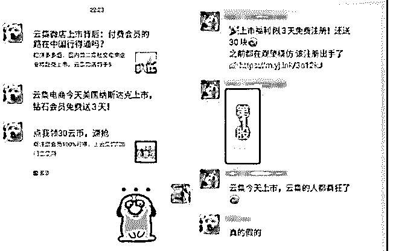
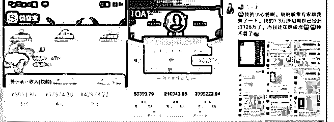
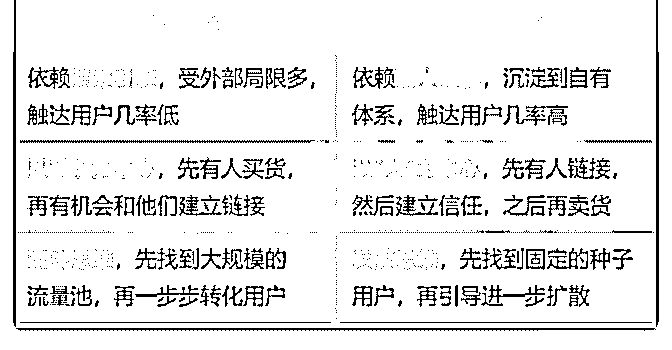
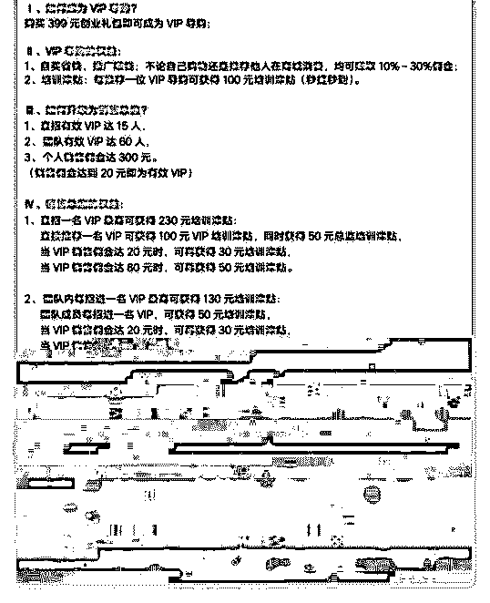
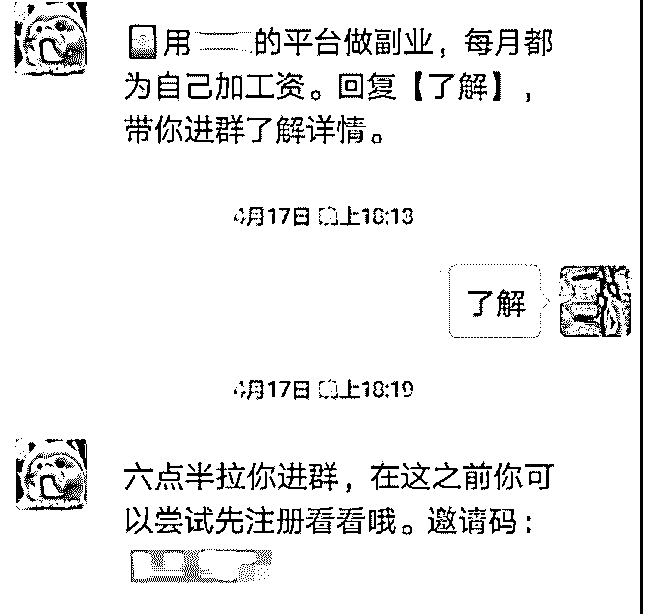
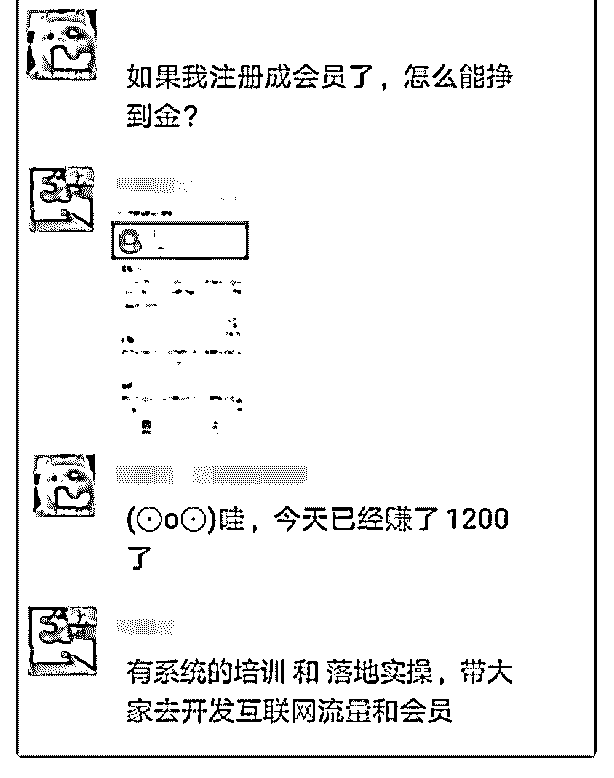
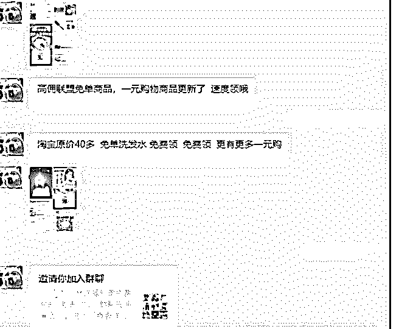
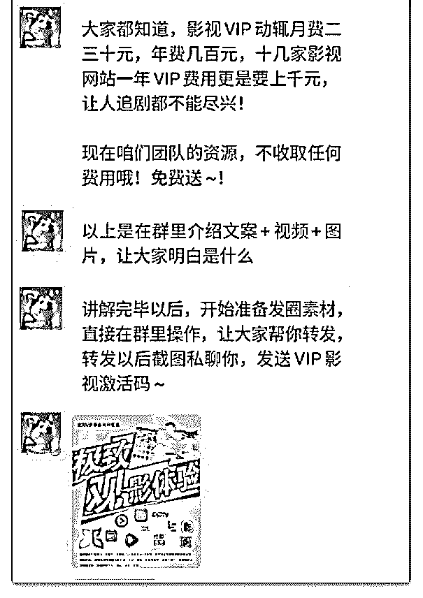

# 分享主题：从云集电

花爷梦呓换酒钱 : 分享主题：从云集电商上市，谈谈社交电商 对普通人来说意味着什么？

分享人：黄小鱼 分享背景：

社交电商可谓是近 2 年的风口： 前有拼多多只用不到 3 年时间突破 1000 亿元平台交易额，

中有每日一淘 6 个月实现估值 850 万人民币到 10 亿美金的翻 盘，

后有云集创立 4 年携 740 万会员、130 亿营收赴美上市…… 除了备受资本青睐，社交电商也给普通人带来了很多“暴

富”或者“躺赚”的机会……

分享正文： 嗨咯，大家好，我是黄小鱼，很高兴今天来给花爷群里的小

伙伴做分享。今天我分享的主题是社交电商，先来交代一下

分享背景。

（图 1） 五一期间，在本狗准备就寝之时，收到了各种私信，如上图

所示。

云集电商今天美国纳斯达克上市，钻石会员免费送 3 天！

社交电商可谓是近 2 年的风口： 前有拼多多只用不到 3 年时间突破 1000 亿元平台交易额， 中有每日一淘 6 个月实现估值 850 万人民币到 10 亿美金的翻

盘，

后有云集创立 4 年携 740 万会员、130 亿营收赴美上市…… 除了备受资本青睐，社交电商也给普通人带来了很多“暴

富”或者“躺赚”的机会。

比如说，我在朋友圈经常能看到这些图：

（图 2） 为什么大批资本跑步入场社交电商？ 为什么总有团队宣扬“轻松月入过万”？

在这样的大背景下，普通人还有机会通过社交电商逆袭吗？

…… 以上，就是这次分享中想要和大家探讨的部分。 一、社交电商是什么？ 首先，还是来了解一下社交电商的源起背景。

1、传统时代

传统的营销三板斧为：买央视广告、铺货、促销，这种模式 成就了一批传统时代的国民品牌。那个时候全国人民都还在 看电视，品牌商砸广告之后，投入和产出能够成正比。

消费者通过： 看广告判断哪家商品正规， 看铺货判断哪家商品火爆， 看促销判断哪家商品划算。 消费者的购物状态为： 被动接收信息，做出购买决策。 2、PC 时代

随着互联网时代的兴起，搜索引擎的不断升级，人们的消费 习惯和需求也发生了巨大的改变，逐渐从线下商圈过渡到线 上 PC 端，更乐于在线上实现购买行为。

在早期的流量红利期，C2C 模式（个人对个人）的淘宝平 台、B2C 模式（商对客）的京东&天猫平台应运而生。商家通 过在主流平台砸广告（比如淘宝的钻石展位和直通车等）就 可以获得大面积的曝光，快速占领用户心智，然后通过价格 促销实现成交。

消费者的购物状态为：

主动搜索信息，做出购买决策。

3、移动时代 流量红利褪去，野蛮生长的互联网时代进入下半场。消费越

来越便利，销售形式和经营方式越来越多元。一方面是企业

获客成本的居高不下，一方面是消费者对品牌的信任成本不

断提升。

有的消费者需要通过多重筛选做出判断，营销路径拉长，购 买决策成本上升；有的消费者（下沉市场）根本就不会搜 索……在这样的环境之下，一种更为便捷的方式就是——熟 人推荐取代品牌广告。

消费者的购物状态为： 遵循熟人推荐，做出购买决策。 总结一下：

（图 3） 说完背景，我们进入到第二部分。

二、为什么越来越多的企业开始做社交电商？

1、企业之困

（1）流量获取成本越来越高 有研究显示，互联网平台的获客成本在 2012 年是 71 块钱左

右，到 2018 年已经涨到 365 块钱，获客成本增至 5 倍。与之对 应的是用户增长量的降低：2012 年相比 2011 年的互联网用户 增长率是 63%，2018 年相比 2017 年已经跌到了 15%，2019 年还 会更低。

在这种情况之下，互联网流量已经进入到存量博弈的阶段。

（2）用户留存转化率越来越低 企业之前通过多方品牌曝光获取的用户，大多积聚在公域流

量池，这导致企业无法和用户之间形成良好的互动循环。用

户买完一次产品之后，仍将面临大量新的选择。

如果在用户做出新一轮的购买决策之前，企业的产品信息不 能直接触达用户，并给出价格、品质、服务方面异于其他竞 对的展示，那么用户下一次的购买决策很可能会做出调整。

（3）企业运转成本越来越高 市场不景气，整个大环境都不是很好。企业用人用地成本

高，19 年裁员已经是常态。

2、企业之光 在品牌效应逐渐衰弱，平台流量红利期基本结束的情况下，

企业该如何破局呢？

根据公式：销售额=流量*转化率*客单价，社交电商的运行思 路是：

（1）搭建自有流量池

之前的流量都被集中到淘宝、天猫、京东、苏宁等平台，现 在企业通过社交电商模式，建立了属于自己的私域流量池， 也就是可以反复利用、并且免费直接触达的用户池。

他们将这批用户沉淀在自己的 APP、微信公众号、微信群、 微信个人号、头条或者抖音等平台，提升了接触用户的几 率，增强了和用户之间的粘性。

（2）提升转化率 在公域流量平台，用户倾向于通过平台搜索比较的方式，确

定自己想要购买的东西，企业的信用成本非常高，用户购物

时花费的时间成本也比较高。

但是社交电商通过“熟人推荐”模式，提升了用户对产品的信 任度，并帮助用户缩短了购买商品花费的时间，降低决策成 本，进而提升转化率。

（3）提升客单价 成立于 18 年 5 月的“每日一淘”，就是通过这套模式，从受众

广、消费频次高的生鲜水果类产品切入，仅用 6 个月，获取 30

万付费用户，估值上涨 80 倍。

社交电商的本质是“熟人经济+信任经济”，当用户进入私域流 量池之后，拉近了和用户之间的距离，并且通过熟人信用持 续提升粘附性，产生更高的复购率，提升单个客户平均消费 金额。此后，再根据“自买省钱，分享赚钱”的理念，带来新 一轮的拉新转化。

所以说，社交电商其实是一套可以低成本持续获取精准用户 的增长策略，因此会被越来越多的企业所青睐。

三、做社交电商可以赚钱吗？

普通人可以通过社交电商赚钱吗？答案是可以。 这里，就需要了解社交电商的模式。 目前市面上有 2 种比较主流的类型： 1、无门槛准入型

前期通过无门槛的流量获取方式迅速起量，比如小红书、芝 麻鲸选等。之后用户主要的获益方式是分佣。这个模式的优 点在于前期增量足够，缺点在于后期用户的主动能动性不好 掌控。

关于芝麻鲸选的推广逻辑，我之前写过一篇文章，大家可以 参考一下。

APP 都不见踪影就有 100 万注册量，最近热门的“芝麻鲸选”到 底是啥?

2、会员晋升制 前期进入需要购买一个大礼包（一般是 300+元），比如每日

一淘、素店等。

这里以“每日一淘”初始阶段的会员制度为例，准入门槛为 399 元的创业礼包，并且根据后续实际推广人数，将会员分为 3 阶：VIP 导购-销售总监-销售总经理。每个阶段，除了购买产 品的佣金，还会有不同层级的团队培养奖励。之后用户主要 的获益方式是拉新+分佣（个人&团队）。

（图 4）

这个模式的缺点在于有门槛，初始用户量增速较缓，容易卡 在起量模块。优点在于搭配团队管理培训津贴，能够充分提 升每个节点的主观能动性，穿透力足够。正因如此，每日一 淘前期有大批人赚得盆满钵满也就不足为奇了。

总之，不管是哪种模式，个人都能通过实际的推广转化，获 取与之对应的收益。并且，前期铺垫越足，团队越大，可以 赢得的利润比越高，也就是所谓后期的“躺赚”。

四、普通人怎么通过社交电商赚钱？ 了解了社交电商的源起、受到众多资本推崇的原因以及普通

人的盈利模式之后，你会发现，一大批想要抓住这波红利的

人，都按耐不住了。

本狗也跟了一个团队，发现他们是这样进行推广的：

1、用爆粉软件批量添加群友；

2、推送私信，告知近期有一个福利项目，入群回复“XXX”；

（图 5）

3、群内 3 天宣讲，从大环境到社交电商本身，再到项目红利 前景等方面进行分享，期间会展示收益不错的后台截图，搭 配培训方案打消顾虑，引导注册。

（图 6）

4、完成注册的人进入“核心群”，培训方案主要是用同样的方 式拉群，同步复制朋友圈所有内容。

……

实话说，以上这套方法，确实可以推进，但是大部分人应该 不愿意这样操作。这种方式没有考虑到不同个体的差异性， 而是通过一层一层的流量榨取方式，扩充团队规模。

那如何更好地利用社交电商实现可持续的、不损人脉的营收 方式呢？

我总结了 4 点： 1、“流量思维”转为“用户思维” “流量思维”的模型是：引流——成交。

就像这哥们，加我之后的目的就是发广告 233333。

（图 7） 就像这个培训团队，让下面的人用 VIP 影视激活码作为诱饵，

发一条朋友圈，引导更多人帮忙转发进而获取新增流量。

（图 8） 这种方式也许会带来效果，但是新增流量不可持续，也不能

沉淀。

“用户思维”的核心在于尊重用户、理解用户，以用户为核 心，挖掘痛点，满足需求。

比如做社交电商，如果你能把用户关心的产品，从各个维度 进行比较分析，直接提供最实惠的购买决策，那就是给用户 提供了实际价值。这种方式可以持续，还可以和用户成为更 好的朋友。

2、“个人品牌”高于“推广平台” 很多人推社交电商，都喜欢从平台本身出发进行推广。 比如： “每日一淘属于腾讯系，可以大把享受微信红利！”

“云集电商今天美国纳斯达克上市，钻石会员免费送 3 天！”

“芝麻鲸选是线下社区团购+线上 CPS 相结合，阿里京东技术大 拿坐镇，纳斯达克上市公司资本加持！”

……

这些平台牛逼吗？嗯，听起来都牛逼！ 但是你要知道，社交电商是以信任为核心的社交型交易模

式。平台牛逼只是作为这个事情是否靠谱的参考因素之一，

不能作为引导别人做出决策的关键因素。如果一直沿用这样

的思路推行，损耗更多的是你自己的社交信用。

所以说，做社交电商一定要有自己的理念，有自己的核心价 值，这样时代给予你的红利，才能转为你自己的能力。

3、重视个人私域流量池打造

有了“用户思维”和“个人品牌”的想法之后，我们还需要持续打 造个人私域流量池。

这里很重要的一点是，用户分层+精细化运营。 用户分层可以有 4 层：陌生用户-知道用户-基础信任用户-深度

信任用户。

（1）陌生用户：所有跟你产品有关，但不知道你的产品/你是 谁的用户。

这部分用户数量庞大，散落在各个平台和渠道，需要你在打 造“个人品牌”的过程中不断积累，并培养成高粘性用户群。

这部分用户有认知，但是没有评估能力，他们可以成为帮你 传播的用户群体。

（2）基础信任用户：买过你一次产品。 这部分用户有信任度，还需要通过超出预期的产品持续满足

他们的期待值，并转为深度信任用户。

（3）深度信任用户：购买过 3 次以上你的产品。 这部分用户将成为你的核心小伙伴，也就是“1000 个铁杆粉丝

理论”。

根据不同层级的用户，做不同的转化路径设置，推进你的成 交之路。

4、将赚钱这件事情流程化

任何事情想要持续，都需要形成一套完整的 SOP（Standard Operating Procedure，标准化操作流程）。

如果你想通过社交电商赚钱，同样的，你需要有一套行之有 效的方案，

比如： 流量从哪里来？初始种子用户哪里找？

流量来了，怎么拉近用户距离，培养信任度？ 怎么输出个人理念？怎么进行用户分层？ 怎么通过社群运营带货？怎么经营朋友圈？ 每个阶段的用户动态如何观测？ 每个步骤推行之后效果如何评估？ 怎么调整和优化？

……

将可能遇到的问题体系化、标准化，让你的小伙伴可以复制 操作。

但需要注意的是，所有的 SOP 都只能作为参考，如果只是无 脑推行每一个步骤，效果自然也不会尽如人意。

未来人带货是大势所趋，社交电商对于普通人来说，是个还

不错的个体崛起、打造个人品牌、积蓄私域流量池的机会。 过程中如果可以带着团队小伙伴一起成长，不断提升能力， 也会得到不错的回报。

事情需要逐步推进，千万别让你的朋友觉得“我把你当朋友， 你却把我当流量”。

赚钱是个长期项目，我们需要做稳定的、正能量的事情。 分享 over~

我先来回答之前小助手发给我的几个问题。 问答：

Q1.为啥上市的时候 拼多多和云集都说自己不是社交电商？

黄小鱼：因为只讲社交电商的故事太小，需要个更大的容 器。社交电商，其实更多的偏重点是在于前端的获客方式或 者说裂变方式，那么整个去看电商，有另外一半的比重一定 是在供应链端的。而供应链的整合，或者说供应链的反向定 制，也是股市中很重要的一个组成部分。

Q2.社交电商对电商从业者会有什么影响？ 黄小鱼：社交电商会改写传统电商的获客逻辑和成本结构，

如果传统电商不及时转型的话，很有可能会被这一波新入场

的人赶超过去。

Q3.普通人能利用社交电商做些什么？

黄小鱼： 普通人利用社交电商，其实最根源的还是建立自己

的个人品牌，打造个人品牌的同时去打造自己的私域流量 池。有了这两个要素之后，可以去抓未来，一个又一个不具 备不确定性的风口。

其实关于这个模块，我在分享中也有比较详细的说明，如果 大家需要进一步做法交流的话，可以加我的微信 huangxiaoyu677

Q4.我有一个疑问，社交电商的话，很多个人他的专业能力是 有限的，如果有一个在线的 Costco，较少的 sku，可以让用户 闭着眼睛买东西，那么这个社交电商还有多大的想象力呢

黄小鱼：这想象力很小啊，因为电商的本质一定是多 sku 地矩 阵去铺这个事情。较小 sku 就意味着用户在这个电商平台的商 业行为较少，那其实到最后就是 GMV 较少。

其实，大礼包的销售额和用户在电商平台上不同 SKU 之间的 销售额是一个很重要的比值，也是衡量这个电商项目是不是 健康的一个重要标准。

电商项目最终一定拼的是你的 GMV，那 SKU 越多 GMV 一定越 多。社交电商是电商的一种增长策略，他最后竞争的逻辑依 然逃不开电商的底层逻辑。

Q5.社交电商的话，会不会多人在里面分佣啊，这样商品的成 本就上去了啊?多级的人在里面分佣

黄小鱼： 销售分佣不是多级的。会员费分销是多级的，销售 分佣其实就一级的关系。而且当你推荐的小伙伴成为会员之 后，你就拿不到他的销售分销了，除非你自己直接推荐或者 卖出去的商品才有分佣。

2019-05-12(17 赞)

评论区：

李泊 : 大佬，你分析 芝麻鲸选的链接 还有吗？

花爷梦呓换酒钱 : 好像没聊过芝麻鲸选，说过社交电商 [`t.zsxq.com/IAEIYvZ`](https://t.zsxq.com/IAEIYvZ)

黄小鱼 : 我写过芝麻鲸选的文章 [APP](https://mp.weixin.qq.com/s/3TNFXroQwacO4AIXusxSnQ)[都不见踪影就有](https://mp.weixin.qq.com/s/3TNFXroQwacO4AIXusxSnQ)[100](https://mp.weixin.qq.com/s/3TNFXroQwacO4AIXusxSnQ)[万注册量，最近热门的](https://mp.weixin.qq.com/s/3TNFXroQwacO4AIXusxSnQ)[“](https://mp.weixin.qq.com/s/3TNFXroQwacO4AIXusxSnQ)[芝麻鲸选](https://mp.weixin.qq.com/s/3TNFXroQwacO4AIXusxSnQ)[”](https://mp.weixin.qq.com/s/3TNFXroQwacO4AIXusxSnQ)[到底是啥](https://mp.weixin.qq.com/s/3TNFXroQwacO4AIXusxSnQ)[?](https://mp.weixin.qq.com/s/3TNFXroQwacO4AIXusxSnQ)

关注公众号"懒人找资源"，星球资源一站式服务