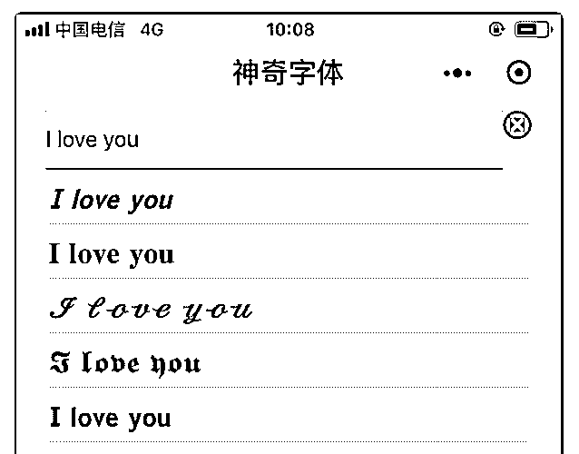
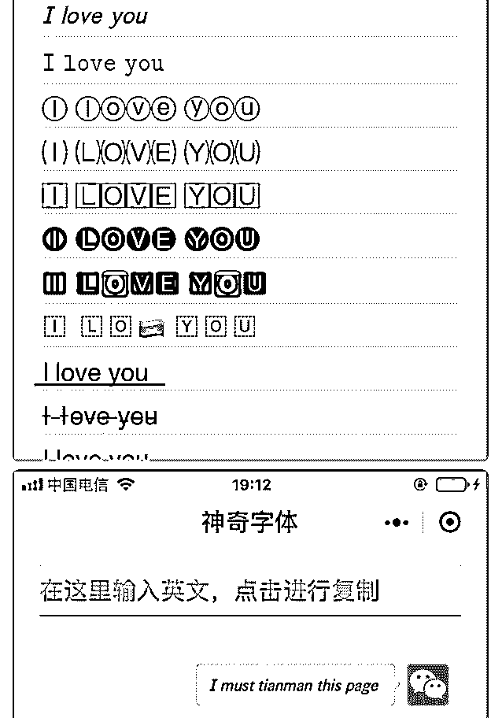
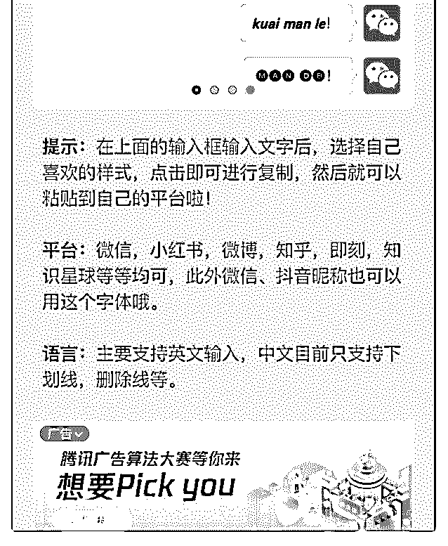

# 几天时间做了一个小

windliang : 几天时间做了一个小程序，神奇字体，可以生成

. 类似的个性字体，复盘了一下从想法诞生，到落地执行，到 推广，到开通流量主的详细过程，分享一下。

[小程序神奇字体的从零到一](https://mp.weixin.qq.com/s/CQTk6KMV6sWlF3A2hYEF1Q)

2019-05-07(19 赞)

评论区：

lorna : 有个基本一模一样的，叫 神奇字体库，也是你发布的吗？

windliang : 不是

Leo :

windliang : 看了下，连名字都模仿有点过分了

lorna :

RwatitFahs* : [强]厉害

阿辉（私人号） : 天才程序员

关注公众号"懒人找资源"，星球资源一站式服务