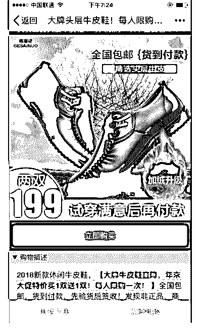
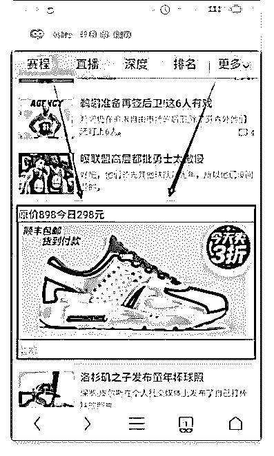
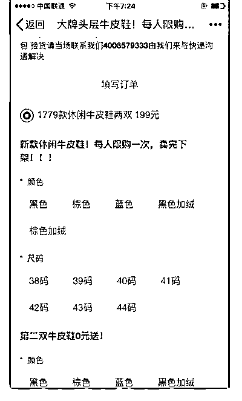
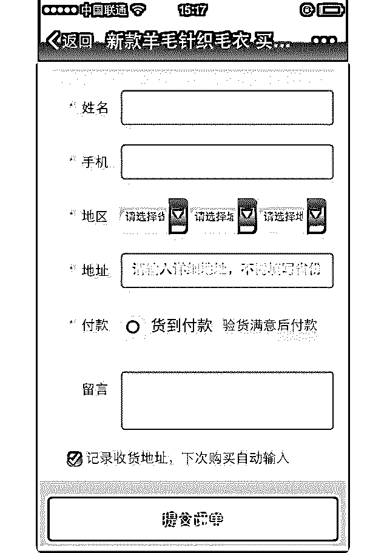

# 分享主题：二类电商

花爷梦呓换酒钱 : 分享主题：二类电商的商业模型 分享嘉宾：鹏举

分享背景：鹏举是 17-18 年二类电商项目实操人，二类电商是 指：通过投放单款产品落地页刺激用户下单，通过货到付款 的方式完成最终交易的电商模式。这种模式在头条，腾讯 各 大平台都可以看到。

分享正文： 大家好，我叫鹏举，在河南郑州，感谢花爷给这个分享机

会，群里牛人很多，我看到有几个微信好友也在群里，感觉

世界好小，花爷好牛，哈哈

今天分享的是二类电商商业模式，我们操作了很多年二类电 商，现在这个模式同样到处都是，大家应该都见过，只是不 了解他的模式而已！

二类电商的特点有两个：第一个首先就是非品牌，不是什么 知名品牌；第二个就是短时爆款，非标品类型，我截几个图 片给大家看看。

（图 1-图 5） 我想大家都看过这些广告，这些广告基本上到处都是，有几

个特点：第一个：这些产品都不是知名的品牌。第二：产品

描述给人感觉价比非常高。第三：交易方式全部是货到付款

二类电商产品大多是短时爆款，比如应季的衣服，夏天时候 的灭蚊灯，灭蚊器，电子产品，化妆品等等，我大概给大家 讲解一下他的盈利模式

就拿我们之前操作过的一个例子：智能手表 当时我们智能手表卖 198 元，广告是在微信公众号文章底部投

放，属于腾讯的广告。当时广告成本大概在 40 元左右会有一

个订单，对接深圳智能手表工厂，产品的成本是 50 元一个，

快递费用 10 元，订购的大部分是年轻人，很多大学生，因为

当时智能手表正火，产品的签收率 60%-70%。

那么我们来算一下利润：

198（销售价格）-40（广告费）-50（产品成本）-10（快递 费）=98

因为签收率 60%-70%，我们按照 60%来计算 98*60%（签收率）=59 元 我们最后得出的毛利润是 59 元每个订单，再除去退货运费，

包装，人工等等，大概还有 40-50 的纯利润。

有了利润，接下来做的就是放大广告投放力度，在广告成本 可控的情况下，放的越大获利也就越多，一天 1000 单的话会 有 4-5 万的获利。我们当时数据好的时候，一天会投出去几十 万吧，这就是二类电商的商业模式。

但每个产品都有生命周期，长的有 2-3 个月，短的只有十几 天，原因在于一旦你广告投放加大，同行就会跟进！用户被 很快洗一遍，广告成本开始增加，直到覆盖了你所有利润，

那么生命周期结束，换下一个产品。

（图 6） 这个也是二类电商，晚上刚刚看到的，大家可以看看。 二类电商的选品和广告投放是最关键的两个因素！ 选品有两个方法，一个是跟投别人的，看别人投什么多，你

跟着投，只要能跟的及时，基本上都会有盈利，第二个是自

己测试，自己测试的话对团队要求比较高，选品能力、文案

能力、广告投放等等。对于一般团队来说自己测试创新，要

求很高，但一旦你成为第一个吃螃蟹的人，那么获利也是最

多的。

第二个关键因素，广告投放，关于广告投放，要说的太多 了，不同的广告平台，不同的受众人群，投放方法也不一 样。广告是花钱烧出来的经验，需要实践的！

接下来我说一下二类电商容易踩的坑。

1：供应链 一旦一个产品卖爆，你会发现货源跟不上，客户下单了你没

货，厂家及时生产不上来，过个 10 天你再发货，签收率低到

你想死。产品好不容易备足了，结果被同行做烂掉了，货全

押你手上

2：广告成本 广告成本直接决定着你能不能把这个产品继续做下去，如果

广告成本控制不好，很容易亏钱，广告投放是花钱烧出来的

经验，不是随便一个小白就可以去做的，当然也可以找广告 公司代投，代投也要有一个懂的人监督才行，当然，新手也 不是不能做，小额试投，慢慢摸索也是可以慢慢入行。

广告投放平台有很多，腾讯，头条，抖音，各大新闻平台， 都可以看到二类电商的投放身影，像头条的鲁班系统，就是 一个二类电商系统。

其实二类电商模式就是一道很简单的算数题，销售价格 - 成 本 = 利润。

但是这里面最大的变量 是广告成本，就是产生一个订单需要 花的钱，广告成本直接决定了这个产品能不能做，当然现在 如果后端强大，那么前端可以不赚钱，用二类电商模式拓展 客户，后端盈利！

好了，这个就是二类电商的赚钱模式，我的分享结束了，大 家有问题可以问我。

问答：

1、怎么知道哪些产品做烂了，哪些还有机会，只能靠投放测 试嘛

鹏举：如果一个产品。你看他在上面投了很长时间了，那你 再去做的话，可能就没那么容易盈利。但是最终的数据还是 要靠测试来才知道他到底有没有盈利的空间，看是很难看出 来的。

2、抖音现在敢这么玩嘛？很多人抖+开起来不赚钱的原因在 哪呀？

鹏举：抖音上现在也有做的呀，一种是你看那个抖音广告， 它跳到淘宝上这是一种，另外一种是货到付款呀，也有很多 这种化妆品啊什么的。

3、一般怎么看到二类电商的广告 鹏举：很多呀，基本上每个品牌都有，现在抖音上都有。如

果他基本上找货到付款的模式，而不是找平台的模式的话，

他应该都属于二类电商嘛，不走平台的，我们叫同城图片二

类电商。

4、「当然现在如果后端强大，那么前端可以不赚钱，用二类 电商模式拓展客户，后端盈利！」@鹏举 我不太理解这句话 的意思 后端指的什么 前端指的什么？

鹏举：这里面所说的前端就是。比如说他卖茶叶的吧，他们 228。可能他的广告成本就花个一百三四呀。然后的话算下来 他就不赚钱，广告成本，产品成本再加物流乱七八糟，可能 228 恰好打平，但是他把这些客户沉淀下来，比如说加到微信 呀，或者后期推销，靠后期盈利，那这是它的后端。

2019-05-04(24 赞)

评论区：

webcheer : 以分享

雨亭之东 : 通过 appgrowing adbug 信息流雷达 等广告情报系统可以追踪到各渠道广告，包括二类电商，可以通过投放产

品、规模、持续周期来判断大致情况；在腾讯新闻 今日头条等客户端刷刷广告 也能看到许多类似广告

花爷梦呓换酒钱 : 行家啊，有些工具比较贵，普通人很难触及到。

雨亭之东 : 哈哈哈 在这个行当做 了解点

miller-朱凡 1* : 有哪些工具？老板

关注公众号"懒人找资源"，星球资源一站式服务