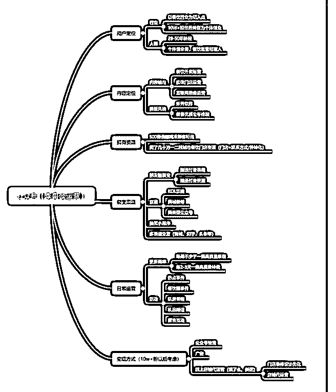

# 花爷好，我地质专业

(提问)李荣禄 : 花爷好，我地质专业，干了 5 年餐饮，抱着不 当将军的士兵不是好士兵的的心态，从服务员开始入行餐饮 业一路到职业经理人，团队一年多时间，从 0 到 100 家加盟 店，各人成长也非常大

自媒体时代最好的 IP 就是自己，虽文采平平，但也想尝试下 写个关于餐饮人创业的号，列了下思路 （附图） 琢磨了一个 多月了，迟迟还未动笔，请教花爷几个问题

1.我要从什么切入点写，用什么样的方式写

2.好多知识点，都是零散的，我该如何有序融合在一起，一篇 赏心悦目的文章逻辑是怎么样的

3.你认为我这个号要有什么样的价值体现比较合适当下

4.目前有爬了几十万个一二线门店联系方式资源，有什么方式 高效低成本转化到公众号吗

2019-05-03

回答：看了下你的思路和脑图，感觉你问的问题，并不是最

重要的，我就不按照你提问的顺序回答了。 1\. 你的定位有问

题： 首先，先找从餐饮行业入手，再切到个人创业——几乎

不可能。餐饮行业特别垂直，个人创业又特别宽泛，特别垂

直的行业想跃迁到特别宽泛的领域，难度大到不可能。 2\. 所

以，先确定你的定位，给你三个方向： a.面向高收入餐饮老

板的营销管理内容 b.面向个人餐饮创业者（或观望创业者）

的内容 c.面向实体行业的营销内容 以上三者，只能选一个。

3.是不是选了以上三者之一，就够了？不，还不够细分，我给

你举例说明。 a.面向高收入餐饮老板做内容，一般变现方式

是线下培训，客单价高（至少五位数）。可以参考我们社群 里的@余奕宏老师，他在餐饮老板的营销领域里，又切了一 个更细分的领域，餐饮店的门头和菜单战略。 b.面向个人餐 饮创业者，可以参考我经常念叨的“开店笔记”。开店笔记主 要只满足一个需求：大量基层人民想开店，但不懂加盟、选 址、运营的坑，又没有人指导。所以开店笔记靠满足这个需 求起家，目前知识星球年收入近两百万，其中还有学员花更 多钱加盟他的品牌店。这是个典型双赢的商业模式，起点来 自于一个很细分的需求。 c.面向实体行业的营销内容——如 果你真的想做个人创业这个领域的生意，那至少得细分到实 体行业创业还是互联网创业，不能只深耕垂直行业。小马宋 是这个模式的成功案例，但我建议你别选这个模式，难度太 大。 4\. 所以发现了吗，你选的领域越细分，满足的需求越稀 缺，成功难度就越小。上面 abc 三种，明显 c 的难度是最大的， 而且不止大一点点。 5.如何把零散知识点融汇成一篇文章？ 当你确定了上面提到的定位，你的目标人群、你要满足的用 户需求就清晰了，我觉得文章框架也就很清楚了。找到用户 喜欢的核心论点，再拆分成层层递进的小论点即可。 明白了 吗，同样一件事，有很多事件可以去写。重要的是弄清楚定 位，找对视角，所以我才说做自媒体是一门生意，你不是写 你爱写的，你是写用户爱看的。 6\. 至于你脑图里划的裂变之 类的，属于放大镜性质，当你冷启动成功之后，再试着去 做，现在不要考虑这么多，这就是我说的节奏感。 对了，手 机号码资源如何用来涨粉，同样只是一个渠道，可以群发短 信引流，但具体发什么，就要看你的定位和引流诱饵设置 了。(70 赞)

评论区：

花爷梦呓换酒钱 : 补充一句：你说琢磨了一个月还没动笔？千万别这样，你三天内想不出来的问题，再硬想三年也没用。

人生的焦虑感是靠实干来缓解的，先做起来。

李荣禄 : 花爷谢谢你的回答，我知道该怎么做了，谢谢！

白歌 : 这个是精华

吾儿滨滨 : 讲的好分析好好，花友怎么不点赞呢

花爷梦呓换酒钱 : 放假呢，正常，一般过一个礼拜还会有人点赞

西装暴徒 : 哥们的导图宽泛，你去美团餐饮学院看看就有思路了…我就是学院的学员，私下可以聊聊哈，我在花爷群里。

李荣禄 : 非常感谢，我私你。

: 微信 w740512907 餐饮同行交流下

关注公众号"懒人找资源"，星球资源一站式服务