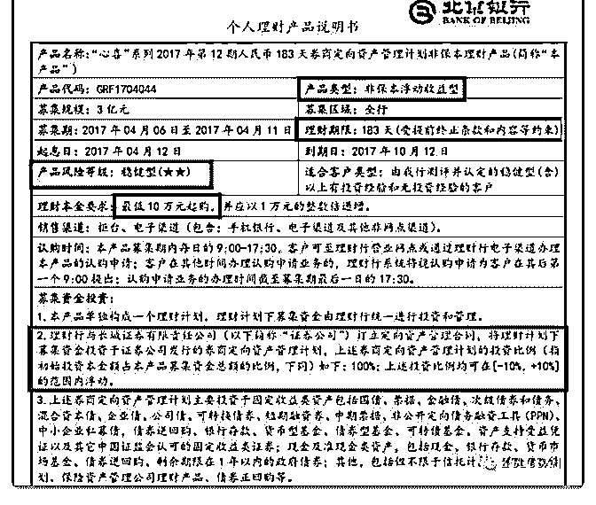
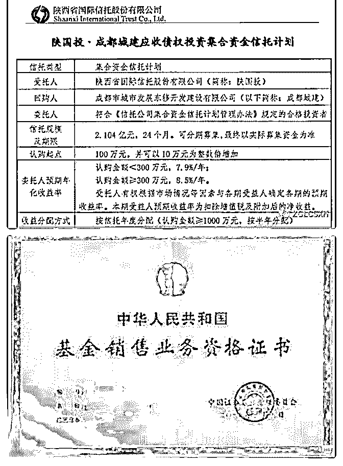
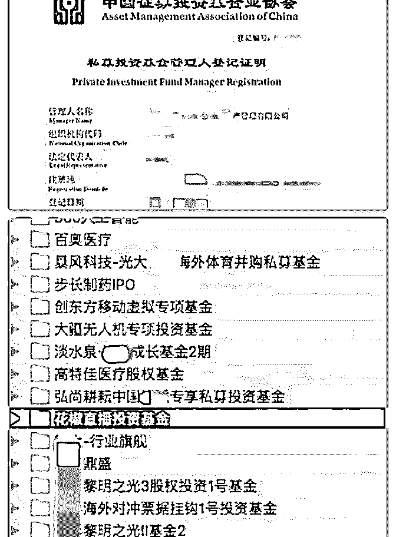
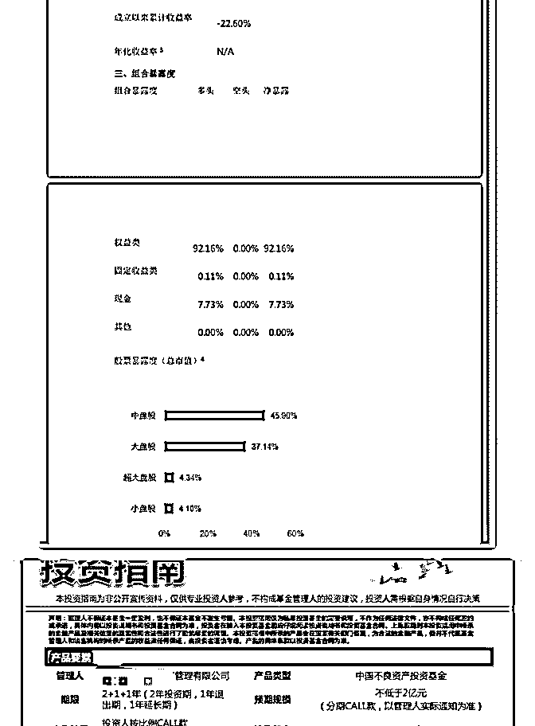
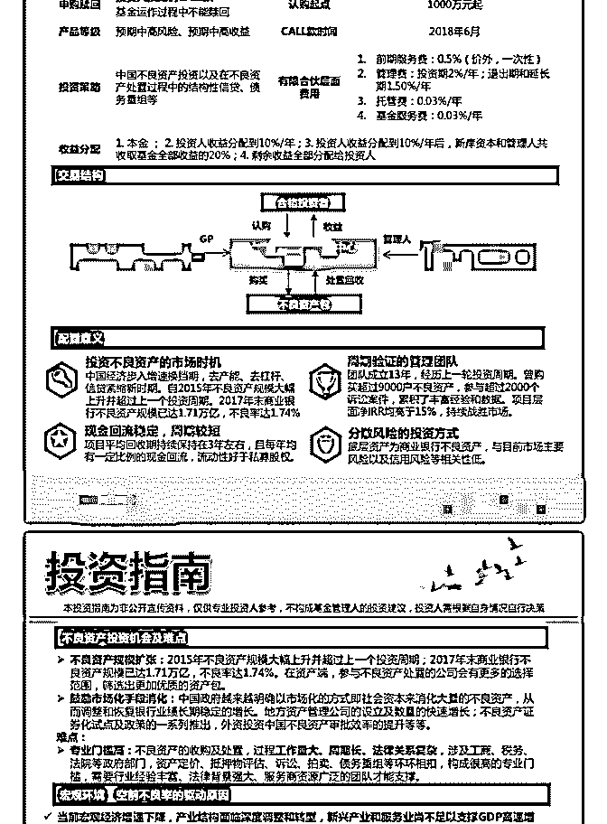
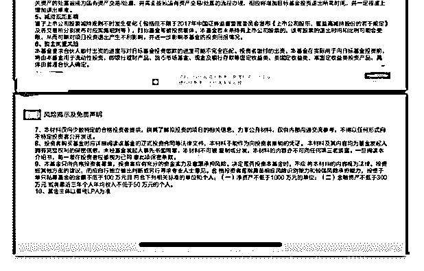

# 分享主题：有钱人的

花爷梦呓换酒钱 : 分享主题：有钱人的游戏--私募基金 花爷提醒：所有金融类分享需要注意，投资需谨慎！ 分享人介绍：

大家好，我叫陈厚，从 2014 年进入财富管理行业，距今已有 5 年，先后待过两家在美国上市的头部三方财富管理公司，服 务于 VIP 高净值个人客户，通过对客户财富管理需求的分析， 为高净值客户提供全方位的全球资产配置服务，通过投资沙 龙、高端论坛、家族峰会、高尔夫比赛等市场活动进行客户 的转化与开发，根据客户的资产规模、生活目标、预期收益 目标和风险承受能力进行需求分析，出具专业的资产配置计 划方案。

做的产品：二级市场私募基金，固定收益，股权投资，全球 房产，投资移民，家族传承等等，去年自己出来做独立理财 师，和机构直接合作。

交流合作可以扫下方二维码：

（图 1） 分享正文：

自我介绍一下，我叫陈厚 从 2014 年进入财富管理行业，距今 已有 5 年，先后待过两家在美国上市的头部三方财富管理公 司，服务于 VIP 高净值个人客户，现为独立理财师。今天的分 享内容是私募基金为什么要 100 万门槛？投的是啥？

我昨天有做过介绍，也看到大家给我的提问了，然后并且有 好几个群友加我的好友，跟我沟通一下私募基金的情况，因 为他们自己投了。大家可以了解投私募基金一般是比较私密 的，不是对外公开的。所以今天讲的内容可能不适合大多数 人，大家可以当作一个新的知识，去了解一下。

花爷的群质量还是很高的，包括接下来还会进群的新的小伙 伴们。能投资私募基金的话，其实门槛不低的。具体内容的 话，接下来听我分享一下你们就可以知道了。

私募基金概念介绍： 在这里我就先说一下私募基金，（私募基金）一般人是不太

容易了解到的，所谓私募就是单独的，私下的，定向非公开

的基金，私的结果就是一般人不知道基金什么时候发行，怎

么购买，怎么成立，过去的管理业绩如何，未来的投资策

略，甚至连这个基金赚钱还是亏钱都不知道。

法律规定明确，禁止私募基金公开推荐或者变相公开推荐， 不得通过媒介渠道推荐私募基金，比如说在朋友圈发呀，比 如说那个发公众号啊，比如说，登报啊各种，是不能的，它 只能给自己公司品牌打广告，但不能给一个单个的私募基金 去做宣传，如果一旦宣传的话，就是基金要停售，甚至还面 临处罚的风险。

那为什么说私募基金就是面向富人的基金呢，经管的思维是 这样的，越有钱的人就越有智慧嘛，越亏的起。专业术语， 就是说，风险承受能力越高，当然大家懂得，不一定越有钱 就真的越明白投资。 私募基金的投资者必须是合格投资者， 那谁才是合格投资者？其实合格投资者要求还蛮严格的啊， 我发给大家看一下。

合格投资者要求： 合格投资者需具备相应风险识别能力（有智慧的聪明人）和

风险承担能力。

投资于单只资产管理产品不低于 100 万人民币且符合三个条 件：

1、家庭金融资产不低于 300 万元，或者近 3 年本人年均收入不 低于 50 万元；

2、最近 1 年末净资产不低于 1000 万元的法人单位；

3、金融监督管理部门视为合格投资者的其他情形； 大家看到合格投资者这个说明，会感觉只要在北上广深随便

拥有一套房就可以轻易达标了，其实这些是不够的，严格来

说房产不是金融资产，金融资产是指银行存款、股票、债

券、基金份额、资产管理计划、银行理财产品、信托计划、

保险产品、期货及其他衍生产品等。

那我这边有几份这样的资产证明，可以证明他有多少金融资 产的，因为是隐私我不好发出来，还有一个就是如果公司开 具这个资产证明，比如说连续三年收入超过 50 万，这个也是 可以的，但是很多地方都会作假，尤其是一些老人，他早就

不工作了，那他手上也不一定有那么多金融资产，有的都开 不出来，所以说这个地方可能会出现造假，这个我就不多说 了，因为各个地方确实不一样，只私募基金这个行业因为确 实比较隐秘，或者说是私下，所以很多东西，在公开场合或 者公开的地方可能都听不到。

（图 2） 那我这边发一个银行的理财产品出来看一下，可以看到这个

银行理财产品，它是有产品的风险等级的，什么稳健型啊等

等，这个有好几个私募基金的话，也要分这个具体的基金，

它的项目的风险等级也是不一样的，这个产品的类型就是银

行产品，都是非保本浮动收益型。然后期限 183 天啊，最低认

购金额是 10 万起，就以 1 万的倍数递增。然后的话，就看了一

下这个产品的具体情况，就是银行理财，注意一下。

（图 3） 我发的第二张是一张信托计划的图，可以看到它的认购起点

到了 100 万，然后是 10 万为整数往上加，就是说你至少有 100

万才可以投。并且，它的认购金额小于 300 万，它的收益是

7.9%/年，认购金额大于 300 万的话，收益是 8.5%/年。其实如

果认购金额还要超过（一定数额），比如说超过 1000 万的

话，其实还是可以去谈的，收益可能更高。这块儿的话就不

展开，就先看一下这个产品的情况。

信托产品其实严格来说也是私募基金的一部分，因为很多人 也没看过信托产品的资料。那我发一下这个私募基金的分 类，大家可以在里面看一下，其实是私募基金（种类）非常 的多。甚至市场场上多到你无法想象， 其实相对而言，这个 圈子也挺大的 。

私募基金的分类：

▌私募证券投资基金 主要投资于公开交易的股份有限公司股票、债券、期货、期

权、基金份额以及中国证监会规定的其他证券及其衍生品

种。

▌私募证券类 FOF 基金 主要投向证券类私募基金、信托计划、券商资管、基金专户

等资产管理计划的私募基金。

▌私募股权投资基金 除创业投资基金以外主要投资于非公开交易的企业股权。

▌私募股权投资类 FOF 基金

主要投向私募基金、信托计划、券商资管、基金专户等资产 管理计划的私募基金。

▌创业投资基金 主要向处于创业各阶段的未上市成长性企业进行股权投资的

基金（新三板挂牌企业视为未上市企业）；（对于市场所

称“成长基金”，如果不涉及沪深交易所上市公司定向增发股

票投资的，按照创业投资基金备案）

▌创业投资类 FOF 基金 主要投向创投类私募基金、信托计划、券商资管、基金专户

等资产管理计划的私募基金。

▌其他私募投资基金 投资除证券及其衍生品和股权以外的其他领域的基金。

▌其他私募投资基金类 FOF

主要投向其他类私募基金、信托计划、券商资管、基金专户 等资产管理计划的私募基金。

大家看到这个私募基金的分类非常的多，很多人可能都没有 听过。之前有群友分享过这个商品期货的，其实它这里面也 是可以作为对冲基金，或者是期货里面的私募基金，它也是 这里面的分类，当然自己做属于个人的那一块。如果有机构 在做的话，它起点金额一般也都是 100 万起的。

100 万是入门基础

那就说到一个点，就是说--高门槛，100 万是入门的基础，而 且很好理解，就是玩得起私募的话，你最少也是一个中产 吧，那为什么要把身份的门槛拔得这么高，其实有几个点 啊，大家可以也可以看一看。

第一个是提高客户群的这个风险承受能力，监管部门设置 100 万的启动门槛不是为了限制投资者，恰恰是为了保护投资 者，一般来说，越成熟的高端投资者，风险识别能力更强， 风险承受能力强，那因此呢，100 万的门槛是以资金量为指 标，隔离风险承受能力比较弱的普通投资者。

不仅说是门槛要提高，而且还有限制参与人数，确保这个私 募的性质，私募嘛，还是就是听名字叫私下募集，它主要针

对的就是高净值人群。而不宜公开的就是宣传方式向特定人 群发售，就是向特定人群小范围的做宣讲，然后做推荐。

还有就是降低资金流动的风险，如果你在公募啊，银行啊， 你可以提出来的，私募基金的话，它是有时间期限的，如果 在这个时间期限，是提不出来的，就是你签好了合同和协议 的，打官司都没有用。

我刚刚提到的这个锁定期是指，一般认购以后会以一年的时 间作为锁定期，有的时间更长，要看具体基金的情况。还有 定期赎回，就是如果你这个私募基金投向证券市场的，可能 它就是定期。比如说告诉你，每个季度的几月几号可以赎 回，如果你超过（期限）的话，你就不能去拿，这不能拿回 来，你只能在这个时间，因为是合同里面规定的。最后一点 也是很关键的一点，叫收益权的分配， 这个私募基金为什么 要做这一块，因为你看（私募基金）可以赚的多，那它（管 理人）后面分配利益就更多，有人之前在提到这个问题，问 了我说，要扣除 20%的收益来跟管理人来分成。即如果这个 项目赚的更多，那管理人也赚的更多。

（图 4） 私募基金的这个牌照是稀缺性的，就是这个（牌照）资源是

很稀缺的，然后我再给你们说一个，就是信托的话，全国仅

68 家信托公司，一大半是国企，受银监会监管，银监会不会

再新发牌照。银行、信托、券商、保险四大金融支柱产业

中，信托排列第二。

（图 5） 大家可以看到，因为这个门槛比较高，并且这个机构就是私

募基金的机构，他们加入的门槛也在提高，私募基金投资范

围很广泛，可以是股票、股权、期货、债券......因此属于高风 险投资类型。私募基金管理人，通常是和投资者存在收益分 享机制的，就是帮人管钱、赚钱，最后自己也从中可以分一 些收益。通常的规律是二八原则，即赚了钱，投资者拿走 80%的收益部分，管钱的分享剩余的 20%，所以大家的基本利 益是一致的。

其实在这里我已经把私募基金为什么要 100 万门槛，投资的是 哪些内容（已经）大概讲一讲了。那现在的话我就讲一些案 例吧 。这是 2016 年的一些项目，大家可以看一下这些项目， 有的可能你还比较熟悉，但你可能听都没听过，原来还可以 投资它。

案例：

（图 6） 我刚刚发的这张图呢，大家可以看一下，这里面有些项目你

可能听过，并且看过，我跟你随便举两个例子，大疆无人机

专项投资基金，这个能投进去已经非常难得了，很多机构是

投不进去的，外面都不知道，大疆无人机还可以投资啊，这

个项目一进去，估值就翻了一番，投 100 万就可以（涨

到）200 万，如果投 1000 万可能就变成 2000 万，当然是估值，

因为大疆无人机还没上市，当然再往下看，最下面那个就是

在我划了这个马赛克的地方---蚂蚁金服，这是什么项目。。

。我不用多说哈，还有就是说，这里面有亏的项目吗？有

的，而且亏损很严重，有可能这里面的钱一分钱都拿不回

来。

有哪几个呢，我说一下这个 360 人工智能，这个项目非常坑， 说这个是 360 的一个什么人工智能 AI 项目，后来发现只是卖一 个手表，把它包装成什么什么样呢，就是一个儿童手表，后

来发展成这个项目了，也就说你 100 万或者更多钱，投进去可 能一分钱都没有了，然后还有人说暴风科技海外并购基金， 暴风科技，A 股上市公司，当年非常疯狂的。这个项目也很 凉，可能这个钱也拿不回来，当然哈， 所以说有好有坏的。 那这里面我就再讲一个回报率很高，已经拿回来了，就说我 这个点开的这个。花椒直播。这个项目才一年多的时间，好 像翻了 20 多倍，收购以后直接翻了 20 多倍出来。

（图 7） 那我这边又单独拎一个产品出来了，就叫淡水泉，大家可以

查一下，这个私募基金非常大，而且非常知名，因为我们群

友呢，是有购买过这个二级市场的私募的，可以看一下这个

基金的这个情况哈，非常不好，什么样的，它的净值只有

0.774，什么概念，它从一开始的也是 100 万，它变成了 77.4

万。而且后续还有亏损，当然现在我没有再去查看这个净

值，就是当时的一个净值，你可以看一下它的年化的收益率

是多少，百分之负的 20 多，那你 1000 万进去就亏掉了多少

钱，可以自己算一下。然后这个组合的这个情况啊，然后具

体项目情况啊，只能发给这个客户去看的，所以大家其实都

看不到。注意一下，这是 2016 年的产品啊，我再提醒一下。

那我就在这里又说明了一点，不是说一个项目都是赚钱，那 你亏钱的话，你也可能亏得很惨，那这里面的话有几个项目 没有推出的，其实它们的这个起投金额都很高，并不是 100 万，有的项目是什么，比如说 300 万，500 万，1000 万，甚至 有 3000 万起投。比如说那个大疆无人机，那个项目还适用美 金投的。就国内没有份额，就国内用人民币投不进去，因为 大疆无人机的这个结构，就是用海外的资金投的，它准备是 在美国上市的。所以说国内的基金是投不进去的，必须用美 金。那这个用美金的话，这个门槛又可留住了很多人，因为 很多人海外账户都没有，并且的话你换美金。你知道我们现

在每个人的额度只有 5 万，你要换 10 万美金甚至更多美金啊， 这又是一个门槛 。

（图 8） 那讲到门槛这个事情，就来讲一下，其实有些项目的话，它

门槛非常高的，比如说这个项目它的时间也很长，二加一加

一，也就是两年投资期是至少的，还有一年的退出期，一年

的延长期，如果做的快的话，可能很快能回来，但是这样的

项目一般都不容易快，有可能还会再往后延，起投金额是

1000 万，可以看一下它这个费用不低的，其实如果你看到之

前的那个项目情况的话，可以看到它的管理费，各方面算上

来，一个基金最少可以赚多少钱，就是我如果这个项目不赚

钱的话，项目管理公司可以赚多少钱。

（图 9） 那我又发了一个基金，这个基金算下来的话，可以感受一下

哈，起投金额是 500 万起，然后投资期蛮长的。那算下来总体

的管理费不超过 7.2%，那你算一下。七点二，我就按照五个

亿去算的话，五个亿收 7.2%的管理费，可以算一下是多少

钱，然后这个基金的话其实还是管理人各方面啊，它（管理

人）就很少的人，团队人不多，包括后端的 carry 呀，因为本

身投的就是二手基金，就是很多基金要退出了， 退不出来，

他们去挑里面的一些好的项目，这种基金的话是外面市场上

都不多的，所以也都是对着一些有钱的，对吧，然后的话

呢，就是或者是一些机构啊，这样的去售卖的。

Q&A:

1\. 私募的目标人群应该是有钱人为主，作为独立理财师，获 客富人有没有什么技巧？

陈厚：第一个就是说，目标人群都是有钱人，我们之前分享 的时候也说了，然后就是获客有什么技巧，其实说真的，我 们身边有很多的自己就是有钱人，所以身边人的话就不太懂 理财，（因为）他身边都是有钱人嘛，对吧，然后（可以） 帮他们去做打理这块，就是（让）他们比较轻松一点，所以 你们懂的，就是说（这）也是看圈子，看人脉的，那一开始 如果你什么都没有的话，确实挺困难的，在之前的时候我会 参加一些活动，然后还有打陌生电话，还有那时候之前是可 以打一些高端名单的，叫练习话术。或者有些确实比较好的 产品，比如说我之前提到的蚂蚁金服啊，大疆无人机啊，那 其实这些渠道对外的话都没有销售的。那客户一听到这个有 兴趣，那就可以给你聊一聊。

再有一个就是转介绍。就是你有一个客户可以去裂变的，就 是你帮客户赚到的钱了，然后这客户身边都是有钱人啊，然 后他觉得这个项目不错，就会带朋友过来，然后我们经常会 有宣讲啊，一些活动啊，有些比较高端的沙龙。然后客户就 会过来参加，他会带上朋友来，他觉得这个项目挺好的，也 会分享给自己的一般来说是最先是亲戚，然后就是身边的朋 友，可以一起来听一下，（对朋友介绍）这个公司也不错， 然后我也赚了钱，大家一起来聊一聊。一般来说这样的一个 会比较容易获得信任感。

2\. 私募、信托、理财，区别在哪，能不能简单给大家介绍一 下？

陈厚：那第二个问题其实在分享中已经有做解答，就私募基 金的话，其实包含的东西比较多，其信托其实也是它其中的 一部分，它门槛也是 100 万起嘛，只是有一些结构上，或者是 内容上的不同，几乎忽略不计，那理财的话其实就包含了私 募和信托，理财（方面），讲真的没有 100 万做投资的话，理

财真的没有什么效果，当然作为小白的话，学习学习还是可 以的，但不要一心只扑在理财上面，因为没有什么本金，收 获的金钱效益并不会太大。

3.私募在推出新一期产品时，会选择怎么样的组合。以什么作 为不同产品定位的差别？

陈厚：第三个问题的话，我觉得明显就是在问这个股票型的 私募基金，就是二级市场，然后选这样的组合，其实这个组 合的话是不一定的，就同一家公司的私募基金，它都会出好 几个策略，比如说是多少投这个成长股，多少投黑马股，比 如说一些小盘子的，有的投什么医药啊，有的投什么白酒 啊，它是分组合的，当然有人会把这些组合在一起，这个定 位的差别没办法解释清楚，因为要具体到这个基金才可以去 讲清楚这个情况。

4.私募的获利是 20%的盈利分成吗？是否会设定净值 0.8 之类 的清盘线？

陈厚：那第四个的话在分享中也有说，一般来说是获利 20%，然后分成。其实很多基金的话，它是这样来分成的， 就是说 8%或者百分之多少，如果不超过 8%的话，基金管理人 是不分钱的，超过 8%之后的，钱在按照二八分，然后设置这 个净值，你看我上面那个淡水泉的情况，它已经跌破了 0.8 了，但并没有清盘了，对吧，所以具体情况还是要看合同 的，看这个基金的这个情况的。

5.什么时候学习理财合适呢？刚工作资金少，这个时候理财有 意义吗？还是先提升自己，等工资高了之后再理财？

陈厚：那第五个问题的话，其实花爷也有一篇文章有做解 答，你可以去看一下，学习理财越早越好是真的，因为你钱

少，亏就亏了，别怕嘛，对吧，那你学到的这些经验的话是 非常有用的，因为你有了钱以后再做理财，那时候你什么都 不懂，一脸懵逼，然后把那个钱亏了，不是那么好赚的，那 提升自己和理财的话，就是你不要把心思全都扑到理财上去 了，你提升自己是第一位的，理财是副业，就是让你的学习 学习，去看一下，去了解一下，你工资高了去理财，那个更 好了，对吧，（因为）你有经验了嘛。

6.身边有人和别人合伙一起投资私募，有亏完的，如何识别里 面的坑。

陈厚：那第六个呢，就这么说哈，你身边人就跟别人一起投 私募吧，就亏完了，这很正常，真的，说明什么，就是风险 没控制好嘛，然后的话呢，这里面的坑确实很多，如果叫我 一下两下说（是说）不完的，因为其实这里面的风险，不仅 说是它有没有坑，就是哪怕是蚂蚁金服。这个我假设如果说 蚂蚁金服是触碰国家的高压线啊，或者怎么样强制关停，它 有没有可能，有的。那投资蚂蚁金服的话，你觉得可以赚钱 的，后来呢，还是会亏嘛，但是确实有很多人是过度销售， 就说这个项目一定好的，你一定赚钱的，怎么怎么样，给你 多少多少倍的，就是承诺回报什么，这种坑就非常大，一般 来说就不要去管它。

7.投资沙龙、高端论坛、家族峰会、高尔夫比赛等市场活动进 行客户的转化与开发，这些活动是如何了解的，大多数高资 产的人的投资主要是那几块，有没有大致的比例？私人业务 方面以及如何取得顾客的信任。

陈厚：第七个问题的话，其实就是内部都是有一些交流的， 像一些投资沙龙啊，各方面的其实我们都是有一些活动会发 一发邀请啊，邀约啊，因为这样会带客户过去，方便成交 嘛，对吧，然后就是一些家族峰会啊，就是比较私密型的

啊，这样的话，其实说你有客户你就可以带过去，那其他的 一些活动开发和转化的话，就是有的是公司有的，有的是自 己有的。一般来说的话你资产比较多的话，（看你）投资是 哪块，房产不用说，比如我有的客户（手里）有 100 多套房 子，保险肯定要买的。然后的话，再有就是一些私募股权的 投资，还有手上的现金流，他们宁愿存在银行里面的不动的 钱，现金流，然后有的真的是做家族信托，钱比较多嘛，留 给下一代下一代这样的。

2019-04-24(18 赞)

关注公众号"懒人找资源"，星球资源一站式服务