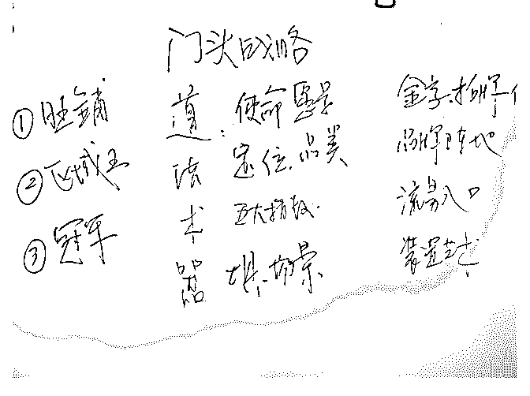

# 分享主题：20 年广

花爷梦呓换酒钱 : 分享主题：20 年广告人讲述亲身打造个人品 牌的历程

分享人介绍： 余奕宏，20 年广告品牌策划人，在北京创业，被称为餐饮业

的“明星星探和校长”。

我精通一套“个人专家品牌”塑造法，快速杠杆借力，打造优 势专家品牌；成功地让我太太从月入 5000 元的普通白领，两 年成为行业细分领域第一品牌，年入 200 万；

王小白菜单赢利规划师， 服务品牌包括海底捞、西贝、九毛九、眉州东坡等几百个品

牌；想获得更多餐饮生意和个人专家品牌塑造价值；

公众号：xingzheyh“奕宏品类观” 分享正文：

大家好，我是余奕宏，非常感谢花爷，还有感谢我们社群的 小伙伴的热情。我分享的是个人专家品牌打造。我今天晚上 跟大家分享的这个主题是讲个人的专家品牌的打造方法，就 因为时间有限，我就直接奔主题，同时呢，我也只讲两个真 实的案例。

案例一：

那先自我介绍一下，我叫余奕宏，广告人，做了 20 年左右的 广告，可以说，在南京，我们当时（所在）的广告公司应该 排名前三强，然后我在那家公司做合伙人。这个南京，我们 算是好像觉得自己还挺不错的一个广告公司，还是一个挺不 错的广告人，但是事实上把它放到全中国来看，这个很普通 了，因为南京的广告份额跟北上广深是没办法相提并论的。

所以就是说，我在广告人当中，如果把中国的广告人都加起 来。我可能应该排不进前 100 吧。

排不进前 100，不代表说我的这个专业能力啊，或者是什么

（条件方面）的，我进不到前 100，而是说。你没有差异化特

色，你就是一个某个广告公司的。高管也好，或者叫创始人

也好，或者是合伙人也好，你是没有任何的特色的。我们这

家公司在江苏有竞争力，但是把它放到全国呢，那他的竞争

力又在哪儿呢，所以其实我今天跟大家探讨的这个话题呢，

对我们每一个人，无论你是不是做餐饮，或者是你是不是做

广告，都不重要，重要的是你要思考一个问题，是你怎么样

在某一个领域，某一个行业里面，脱颖而出，至少做到前三

强，最好能做到第一名。

我是一个危机感很强的人啊，所以，我在 2011 年、2012 年的 时候，（我）那个时候负责公司的媒介投放，每年大概，在 我手上，要经手也不算多，大概两个多亿的这个广告投放。 日子应该是过得非常的舒服，因为我其实已经算是半个甲方 了，对我来讲，我们虽然是广告公司，但是我是把两个亿的 订单，投放给电视台和投放给我的下家的广告公司，所以其 实我也是半个甲方，日子过得非常的舒服，但是。我有一种 强烈的危机感，因为我总觉得日子一旦舒服就。是一件不美 妙的事情。

于是我开始寻求转型，后来我遇到了新浪微博的总裁——葛 景栋，他到我们公司来找江苏的合作公司，跟我讲了微博， 讲了 Facebook，讲了 Twitter（等等），就是西方的这个社交网 络的发展史，那个应该是在 2012 年四月份左右。他把我讲 懂，我当时就知道说，原来媒体界发生变革了，我们传统的 大众媒体，将一去不复返，它的势能只会越来越差。所以那 些年里面，媒体的朋友来问我，说怎么办，我跟他们讲了一 个字，我说跑，跑的越快越好，早跑的都比晚跑得好，但是 可惜很多人都没有听。大多数人来跟你竞争，提意见，只要 不是付费的啊，付费的他都未必能听你的，就不要说是不付 费的。

葛总（当时）给我讲懂了两件事情，第一件事情，他告诉 我，传媒发生了变化，第二件事情，我当时就明白了，因为 我毕竟研究了 20 年左右的这个产品广告，然后我当时知道时 候，好，普通人建立品牌的时候到了，因为原来（情况/条 件）的话，在大众媒体的时候，你是没有机会去建立品牌 的，因为，那个成本很高，如果报纸不采访你，如果电视台 不采访你，你自己打广告都没有用，但是在社交网络里面， 每个人都是一个品牌，你可以去，通过（那个时候就）微 博，还有微信。今天还有抖音，还有各种各样的直播平台， 我们看到很多人都在这些社交网络上突然窜红啊，有的叫我 们叫他们网红也好，或者什么也好，我最红的时候走在北京 的街头上都被人认出来。

后来我就明白了这件事，让我明白这件事情的时候，我就知 道机会来了，于是我开始放弃我原来的这个手上的既得利 益。我开始去研究，社交网络，而且做了一家公司，然后做 了一些案例。应该算是，在当地大获成功，我就知道整个社 交网络的这个套路是什么了。后来，我就开始写公众号，然 后我们也算是当时是吃到公众号的红利的一波。

大家听到这的时候肯定会这样说，原来其实还是因为你们有 红利，你们通过社交网络啊，尤其是通过什么微博呀，或者 是微信啊，做了这个方面的传播啊，你们吃到了这样的一个 红利，那下一波，是不是大家开始去寻找抖音啊什么的，我 在这儿，其实我想重点跟大家分享的，倒不是说怎么利用这 些新媒体来传播自己，因为这个有很多的课程，你们都可以 在网上买到。

真正我想说的是，有两个非常重要的东西，第一个就是定 位，就是你怎么样去给自己找到那样的一个位置，怎么样给 自己找到一个定位，让你能够成为第一，成为某一个领域里 面的第一。这是最重要的，因为如果你做的这个事情只是模 仿他人。可能社交网络会帮你红上去，但是你无法脱颖而 出，但是你是没有标签的，别人是不知道你是干什么的，你 只是众多的红人当中一个，那个风过去了，你也就不在了， 就跟很多网红都品牌也是一样的，就因为他其实缺乏定位， 它是靠炒作，靠某一个小的技巧，然后借助这个抖音也好， 借助这个传播红起来了。

什么意思呢，我讲一个例子啊，比方说，不知道大家有没有 喝过喜茶，喜茶和答案茶。答案茶属于典型的网红品牌，就 是做了一个噱头，就是你来点茶，然后给出一个答案，可以 占卜一样的，然后就红了，红了以后，然后放加盟，迅速放 加盟，然后圈了很多钱，这种网红品牌。那么这个喜茶呢， 他就属于叫做有定位的品牌，因为是喜茶开创了芝士奶盖 茶。那他至少是中国最早原创的芝士奶盖茶。所以它也是这 个网络让它红的，但是因为它是一个有根的品牌，我们且不 论它内部的运营的优劣，最重要的是它是一个有根的品牌， 它是一个有清晰定位的品牌。更重要的是它是第一个创造了 芝士奶盖茶的品牌。无论它是不是第一个创造的，但至少你 是从它那儿知道的。

OK，我讲到这儿的时候，其实你们就知道说，为什么绝大多 数的网红。是没有价值的，就是你们在那些直播平台上看到 的，绝大多数的网红，他们就是“风口上的猪”，那个平台起 来了他们就起来了，平台落了他们就落了。然后他的生命周 期也非常非常的短，所以我今天跟大家分享的呢，是讲的叫 做个人专家品牌，为什么叫个人专家品牌呢，就是他是一个 在某一个细分领域里面。他能够称之为顶尖的专家，这对我 们这个社群里面来讲，我相信可能很有价值，因为我们社群 里面卧虎藏龙啊，都有各种各样的这个精英，事实上这些精 英。我们如何能让自己从经营跨越到第一，跨越到唯一。就 你的市场是完全不一样的。

我就讲讲我自己的经历，那个时候我也是靠写微信（文章） 红了，我写了一些关于餐饮业的一些文章，红了之后我就成 立了一个俱乐部，叫失控互联网餐饮俱乐部。你看这个就属 于当时的网红，因为当时在 2015 年的时候，互联网餐饮很 火，我就是一个话题，我自己原来又懂网络，又懂传统媒 体，然后我还有一些电商的经历，所以我就知道，当时餐饮 业外卖已经开始崛起，包括北京的一些互联网品牌，我就开 始拆解他们。这就是话题，然后大家就很感兴趣啊，都纷纷 加入。但我觉得那个是很难长久的。

我自己就在研究，研究什么呢，我在研究什么是这个行业， 因为我见到餐饮业的时候，我就想说，我得在这个行业里面 一直干下去，因为那时候我已经 40 岁了，我不是小孩子了， 我得一直在这行业干下去，那我就要知道的是这个行业的 道，这个行业的规律是什么，什么是决定这个行业成败的本 质，或者说决定一家餐厅成败的本质，或者说是一个品牌成 败的本质，所以我就开始去寻找，去探寻。当时因为有一些 投资人，还有一些人来找我去做一家公司，就是我今天做的 这个公司，叫未来食，我们一起去做投资吧，我说投资我不

懂，餐饮我那个时候还是刚刚入门，我得去做一番研究，后 来我就去研究它。那等我研究完了以后，我知道原来其实不 是互联网餐饮。

行业真正的机会是在于开始做品类，品牌，就是我们讲的叫 做细分市场，因为整个的行业竞争，到后来的时候就开始大 量涌现细分的品牌，这是我在 2015 年的时候得出的结论，今 天你回头看的话，你会觉得说这有什么，这大家不都是这么 讲的吗，现在不就是有这个种各样的小而美品牌，或者是叫 十分品牌，但是在 2015 年的时候，那个世道很混乱的时候， 想找到真相，其实还是要花一些心思的，我是因为跟投资人 走的特别近，受他们的影响比较多，他们也会跟我讲，说他 们真正看重的。是什么，不是那些什么所谓的互联网品牌。 而是说，它是不是一个品类的品牌。

那基于此，后来我就在北京开了这个课——品类战略，因为 我自己在 92 年的时候就开始看品类定位的书，那我讲品类战 略，我开了几期课程，那时反正也收到钱，因为那个时候有 流量，但是我总觉得还是不对，为什么我觉得不对，因为， 定位也好，评论也好，这不是我开创的，这个已经是特劳特 和里斯的知识资产了，他们俩是牢牢地封锁了这个行业的， 第一，这两家公司也是做到中国的这个在咨询行业战略咨询 里面的第一名，我认识的绝大多数学定位学和品类的这些咨 询师，过得都很不怎么样，就是每年接一点点小案子，做一 些小客户，也就勉强赚点小钱而已。

那我想这个不对啊，我必须要成为这个里面的第一。但我不 可能成为定位的第一，也不可能成为品类战略的第一。我后 来。就开始研究整个的线下门店，因为餐饮基本上还是以线 下门店为主，后来我终于发现通过我的专业知识，我发现说 原来。他们在线下门店，都不知道怎么用线下门店去获客， 都忽视了这个门头。然后我再往下深挖的时候，我发现原来

门头不仅是我们看到的这个门头，他代表的是这个创始人的 思想和理念，代表的是这个创始人对生意的理解，对顾客的 理解。包括他通盘的考虑，后来我就开创了一个门类，这个 门类就叫做门头战略。

于是我开始重新定义门头，因为我认为线下门店的门头，它 有四大功能，从道法术器来说，从道上来讲，它是金字招 牌，它是一家餐厅的金字招牌，或者是一家门店的金字招 牌，它代表了这个企业的使命愿景，价值观，不管这个企业 有没有，但它代表着。那么第二个呢，从这个法的层面上来 讲呢，它是这个线下门店的品牌竞争的阵地，就说它所有的 品牌的表达，品牌的竞争阵地，那么从术的层面上来讲呢， 它是线下门店的第一的流量入口，就是你线下门店主要是靠 这个门头来获取流量的，而且它是第一流量入口，那么最后 一个呢，其实门头还是什么的，就是从器的层面上呢，它是 获客的所有装置，你不要把门头看成是一个招牌，整个的门 脸全部都是获客装置。

后来这个当我有了这样的一个定位以后，我开始写文章，这 种文章我其实只写了几篇。但是影响非常大，因为别人可以 清晰的认知你，清晰的定义你，并且当你开创一个新的门类 的时候，你一开始就是第一名，没有人跟你竞争。大家知道 发生了什么吗，就是我做了一年多一点的培训。我在培训业 肯定也不是有名的，我就做了一年的培训，结果餐饮行业。 几乎所有的知名品牌，就是你们能够报（出名字）的知名品 牌，都参加了我的课程。而且我其实原来根本不认识他们， 都他们主动来报名参加我的课程，这个包括西贝莜，海底 捞，老乡鸡，东坡等等，都来报了我的这个（课程）。

我有一句名言，叫：不换门头就换老板，是我的战斗口号， 已经变成这些大老板的口头禅，跟他们的员工教育的时候， 都是这么说，说校长讲的，所以不换门头就换老板，你看你

们。想怎么着吧，所以很有意思，这是第一个案例，这是一 个非常非常真实的案例。

当我有了这样的一个定位，有了这样的一个，个人专家的品 牌的时候呢，我获取的是整个行业的全部投入资源，来找我 的都是这个领域里面的，顶级的投资人，或者是顶级的媒 体，顶级的大会等等，就基本上是。我不用再去主动找别 人，而是他们来主动来找我，你看，这就是当你成为个人专 家品牌的时候，你就成为了这个行业的一个连接器，一个中 心节点。

那可能还会有人说，那当然了，因为你都做了 20 多年广告 了，你自己有这么强的沉淀，这个毫无疑问，因为我毕竟服 务过世界五百强，服务过中国的国内五百强，服务很多知名 的一些企业，包括像光明，雪花，悦达起亚，还有等等，服 务很多这样的品牌。那他们会觉得说，那是因为你有你有这 么深的累积，下面我讲一个。运用我这套理论，大获成功， 但是他本身原来在传统上并没有什么特别累积的人，就是你 们讲的叫素人。

案例二： 这个人呢，她是我很熟悉的人，因为我们在一起已经十年

了，她是我太太，2015 年。八月份我 41 岁，我来北京，然后

跟她讲，我说要到北京去，我们重新来开创我们新的天地，

开创我们新的事业，她就开了一个车，我因为不会开车，她

就开了一个车，我们两个人就把家搬到北京来了，到了北

京，我记得非常清楚，是 2015 年的 8 月 4 号，大概过了两三

天，我们安定下来以后，她就跟我讲了。她说这个老余，我

现在跟你一块儿到北京来创业了，你那就不能再把我当成一

个助理来用了，因为以前她就是我的金牌助理呀，她帮我做

很多事情，然后她说你也帮我做个定位，你整天吹牛说帮人

家公司做定位，那你帮我做个定位。

我是有一套这个方法论的，但是这个方法论，不是我不愿意 跟你分享，是因为需要面对面的交流，因为它需要沟通，就 是需要了解你的一些情况，我才能帮你去做这个方面的定 位，后来我就帮她用这个方法论去找，后来我就给她找到了 一个细分的领域，这个细分的领域就是餐厅的菜单，广告人 有个优势，就是他对用户特别敏感，就是我们总是观察用户 的不满，不安和不便，于是我发现中国人点餐实在太痛苦 了，就是你推我，我推你，你们都会发现这个现象。

有的时候我们在那儿点餐的时候，那服务员在后面，我背后 都冒冷汗，然后把菜单从前翻到后，从后翻到前，也不知道 干点什么，然后最后胡乱点一些，结果点的都不好吃，这其 实是因为什么呢，是因为这个菜单，他没有规划好，没有路 径，他不是站在用户点选的那个场景里面去思考这个问题 的，还有呢，就是你吃一顿饭，今天晚上吃完了以后，你根 本不知道今天吃的是什么，这菜点的越多，你对这家餐厅就 越没有印象，我发现这都是痛点，然后我就跟这个老板讲， 我说，你去研究这个吧，这个挺有价值的。

那她（余太太）是一个非常有超强超强执行力的人，当我跟 他讲完，我大概应该是在 8 月 6，7 号跟她说这个事情。那她大 概应该是 8 月 9 号左右就把第一篇文章写出来了，就是他到餐 厅去。看人家菜单，她就把那文章写出来，写出来以后就转 发了这个朋友圈啊，我帮她转发朋友圈，那我朋友圈呢，里 面都是这个餐饮行业的资深大佬，然后餐饮老板内参的，

（我们餐饮行业最大的这个媒体的）总编就看到了。就问我 说这文章谁写的，我是你嫂子写的啊，他说我要跟她约稿， 后来就帮他们登在了餐饮老板内参上，餐饮老板内参是这个 行业里面的最大的自媒体。所以他传播一下还是非常不一样 的。

那这个时候有人要说了，那当然了，是因为你，你有资源 啊，你相当于用大 V 来带她，可以说是有用，因为至少说没有 人说，你写第一篇文章就能上这个行业的一个权威媒体的。 更重要的，我想讲的是什么呢，就是其实还是靠一个人持续 的执行力，持续的精进，这是更重要的。我觉得她最厉害的 一点是她做了三年半了，她从那个时间开始起，第一天开始 去研究这个事情，中间的这有 1000 多天，从来没有一天断 过。然后她就一个人写文章，一边写文章，一边接客户，一 边去服务客户，做课程。

她几乎一个人贡献了这个领域里面，全网 95%以上的文章。 你在网络上搜菜单规划的，95%以上的文章都是王小白（余 太太）一个人写的，也就是说，不是因为有我推荐了她，而 是说她有超强的专注力和执行力，在这一点上，我觉得我们 不管是做这个创业者，还是我们做这个个人品牌专家，还是 说我们做一个生意。然后这都非常，极其稀缺的品质，就今 天这个世道太浮躁了，因为大家觉得到处都是机会，好像不 小心遇到了机会，可能我们就鸡犬升天，迎娶白富美了，所 以真正能够安下心来，踏踏实实去研究一个东西的事儿是少 之又少的。

所以我今天跟大家分享东西都不是捷径，你要是想说给我讲 个秘诀，没有秘诀，其实就是你怎么样找到一个细分的领 域，首先你得找到一个细分的领域，不要跟风，不要看着别 人干的什么东西，然后你说，这个好像我也能干，那这种没 有价值，因为当你不能成为第一的时候，你也就是跟风蹭一 下，然后赚点小钱而已，只有第一才是赢家通吃。

所以后来她（王小白）也一样啊，她服务的这些，她（现 在）比我更有名。因为来加她微信的人都是这个行业里面， 顶尖的品牌老板，来加我的人很奇怪，反而有些是这个二把

手，三把手什么之类的，来加她的基本上都是这个行业的品 牌老大，他们主动来加她，因为越是懂行的人也就越知道 啊，菜单非常的重要，几乎是这个领域里面的一个命脉，那 我们去见西贝的贾总，就说餐厅啊，餐饮的那个菜单是餐厅 的一，就是没有这个一。一切都无从谈起，然后九毛九的这 个管总也说，我衡量一个人餐饮做的怎么样，我就看他会不 会看菜单，那他能不能从菜单上看出问题。

其实我和我太太，我们俩都不属于聪明人，我们都不是说有 多聪明，天资有多好，有什么样的这个资源和人脉。对我们 来讲其实还是蛮普通，还是很平凡的人，更重要的是我们的 年龄，她也 30 多岁，我也 40 多岁了，那其实我们跟很多年轻 的比较起来，我们有两个短板啊，一个是精力没有那么旺 盛，但我们创业的精力还是很旺盛。另外一个就是，我们其 实学习新生的事物，比方说，我在这两天在群里面听到答 案，讲这些很新奇的，这些东西，事实上，我其实很多没有 深入了解过，但是正是因为这样，我们觉得自己时间有限， 精力有限，我们就把这些有限的时间和精力，极其极其专注 的用在某一个领域里面，我们只在这一个领域里面去做深刻 的研究，当我今天研究下来可以这样讲，我对整个门头的理 解，我可以毫不夸张的讲，我超越了全中国，全中国就没有 人任何一个人，他不可能坐下来跟我谈，说他对门头的理 解，他能超过我，我觉得这是不可能的，我待会发张图给你 们，你们一看就明白。

还是那句话，就是因为我们认知到自己的精力能力，方方面 面都非常非常的有限，所以我们决定只在某一个细分的领域 里面的精进到天下无敌，我们的理想就是天下无敌，就有一 天我拿出去的时候，没有人可以跟我去争。那就我就认为 说，我可以赢得所有的市场。也就是说这个领域，比方说我 举例假设这个门头的领域，它的市场有多大，我成为这个领 域的第一的时候，那它的市场就全归我，或者说他的头部市

场就全归我了，今天来找到我的这个，就合作伙伴也好，或 者是投资人也好，基本上就是这个行业里面。应该算是最顶 级的。

那就是我给这个线下门店做的一张投战略的导图，我没有画 那个思维导图，我就用这个简单的一个表格，你们可以看出 来说原来一个门头居然可以跟这个战略有关系，道法术器对 吧，这绝对不是装逼，而是说。我就是把他那个背后的规律 和逻辑给研究出来了。

其实我这个分享挺无聊的，那为什么我讲挺无聊呢，就是真 正能够这样干的人太少了，我是一个还是挺无私的人，我特 别希望我身边的人都能过得很好，当我发现一个人身上有特 长的时候，我就跟他说，你应该在某一个领域里面应该怎么 样做，我说其实我们就是普通人，我们就是这么做过来的， 我把这个告诉你，你就应该这么做啊，但我后来发现了，我 身边没有人真正的这样去坚持，太难了。

因为我觉得难主要是难在舍弃。因为我们总觉得自己的机会 特别的多，就自己的精力也特别的旺盛，人是特别容易受诱 惑的，就是每隔不要说三个月了，可能每隔三周。就可能会 遇到一个机会，可能就会遇到一个新鲜的东西，你不能够在 一个领域里面持续去精进。而且有一样东西很重要，就是你 一开始的时候就设定自己，一定能够成为这个领域里面的第 一，你要相信你自己能够成为这个领域里面的第一。于是你 就能够最后成为这个领域的第一。

（图 1） 这张图表你们是第二个看到的，因为我有个收费群，现在 500

个人了，每个人平均 6000 到 12000。他们是今天下午才第一次

看到，你们是第二个看到这张图表的。

我分享差不多就到这儿，我想借花爷这个地。招募一下将来 的合作伙伴，如果你在不管是平面设计，还是在室内设计 上。你有一些建树，或者说你很熟悉，很熟练，或者是你身 边有这样的朋友，我希望你能帮我去做推荐，因为我们将来 想把这个事情能做的牛逼吧，我也希望能够帮这样的有设 计，想法的人，帮他成为这个领域的顶尖高手，因为我见过 太多人，中国做设计的人可能数以千计，但是真正杀出来的 是凤毛麟角啊，但我可以告诉他一套方法论。

Q&A:

1、离开了传统媒体行业，为何会选择餐饮作为切入点？ 余奕宏： 我为什么会选择餐饮做切入点，因为我做广告行业

的时候，会去研究各个行业的发展趋势，就是比方说，人均

GDP 到多少之后，这个行业会发生什么变化，渠道到了什么

样阶段时候，这个行业会发展什么样的变化，它会有这种规

律的东西出现的。然后呢，在 2015 年的时候，餐饮行业有两

个大的趋势被我们捕捉了，第一个，就是购物中心啊，那个

时候购物中心已经在全国开始广泛建立了，对吧，今天购物

中心已经泛滥了，那个时候我就知道，当购物中心诞生的时

候，就是线下的服务业开始规模化的时候，因为一定是渠道

先行。

那么另外一个就是外卖，外卖差不多应该是从 2012 年，2013 年就开始有了，那么到了 2015 年的时候呢，其实那个份额还 很小，就全国那个时候一年大概在 400 亿。现在大概差不多有 两三千亿左右吧，但是那个时候我就预言，我说外卖将来一 定会上万亿，因为它其实就是餐饮行业的电商，所以我就知 道说这个行业一旦开始发生这种两大变革，这行业就开始规 模化，加速规模化，然后正好那个时候，北京开始有这个皇

太极呀，什么西少爷这些，然后资本也开始注入，当资本和 人才进入一个行业的时候，那这个行业也开始发生变化，所 以我开始选择说，那我开始研究这个行业。

一个行业没有完成它的规模化的时候，这个行业就属于叫做 高速增长行业，每年我们国家 GDP 才六点几，餐饮每年是 10%。它是在线下的所有的行业，里面发展还是比较比较快 的一个。

2、我平时喝奶茶比较多，像一线品牌的喜茶，奈雪，二线品 牌的 CoCo，一点点，如果想加盟或投资一个餐饮业的连锁品 牌，可以从哪几个方面来判断这个品牌是否是优质品牌，未 来是否有更大的市场份额呢？

余奕宏： 加盟我就简单讲一下啊，加盟这个事情是特别特别 复杂的，我今天还跟中国最大的这个加盟公司的一个超市合 伙人，我们在一起交流，就这个行业的最大特点叫信息不对 称，就是加盟者，他其实就是一个顾客。他对这个行业，对 这家公司等等，他其实是完全不了解的。

那么很遗憾的事情就是这样的，就是你喜欢的品牌，你看得 上的品牌，绝大多数是不放加盟的，那比方说，你讲喜茶、 奈雪，他们是不放加盟的，像 CoCo，一点点啊，他们也放加 盟，我看现在的价格也很高，然后这就给很多伪品牌就带来 了很大的机遇，我就讲一讲它这个里面的黑幕，就是你去要 想加盟喜茶、奈雪，他们就在百度上打广告，然后你打电话 过去以后，他就跟你讲，这个喜茶、奈雪加盟已经放完了。 但是我们现在，有一个跟它同系列的品牌，我们主要针对什 么什么样的市场，你们可以加盟，那大多数人并不懂，就是 就中弹了。

那从哪些方面呢，其实关键是两点啊，特别特别重要的，就

是第一点呢，它是不是有很完整的供应链，就是他说我是卖 的配方给你，还是说你就自己弄吧，这都不靠谱的，因为它 的产品就没有完整标准化和可控，包括食品安全等等。那么 第二个呢，就是他有没有辅助团队来去培训，去支持你，这 是第二点。但是这两点呢，其实你会发现，绝大多数的外行 他是无法判断的。

因为这只有你签了加盟之后，你才看到说它有这个供应链， 和它真正是有团队来支持你的，那么你怎么判断它是一个真 实的品牌呢，就是你看它自己有没有真实的直营店。有很多 品牌，有很多以前的传统的快招公司，它租一层楼，在这个 楼里面有几十个甚至上百个品牌，它是没有门店的，那你就 在这里面挑，你随便挑一个，你喜欢哪一种，你就拿回家自 己去做吧，那这种大多数都是割韭菜的。

2019-04-15(27 赞)

评论区：

静静吃肉 : 提炼一下关键词 执行力

巧儿 coey : 怎么这篇 kam bu d

花爷梦呓换酒钱 : 啥？

巧儿 coey : 刚刚这篇文章一直卡住看不到，点击了好久 现在可以看到了，这么晚还在回复辛苦了！

花爷梦呓换酒钱 : 我一直睡得晚……刚好看到

巧儿 coey : 都是夜猫子，也要保重身体呦，最近都泡在这里学到很多，谢谢你！

花爷梦呓换酒钱 : 那多泡泡

巧儿 coey : 必须的 哈哈

关注公众号"懒人找资源"，星球资源一站式服务