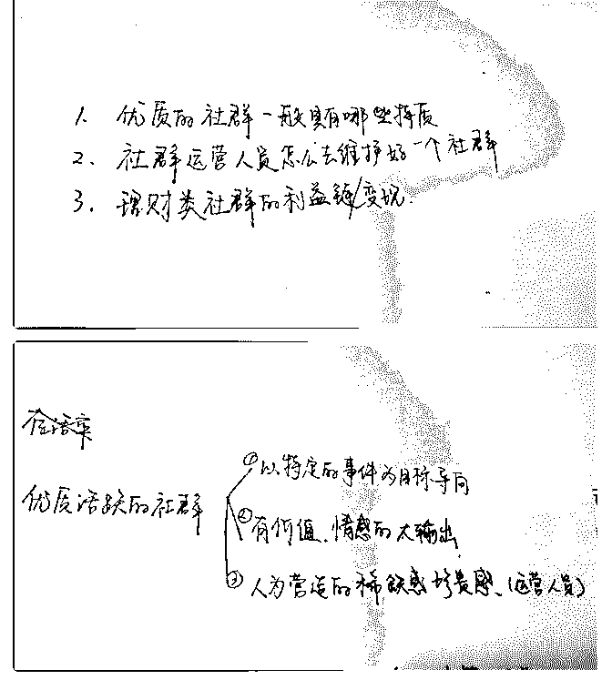
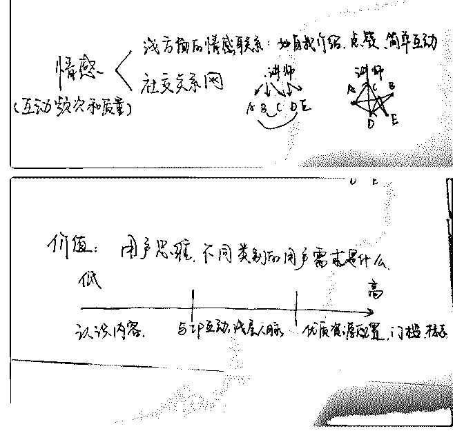
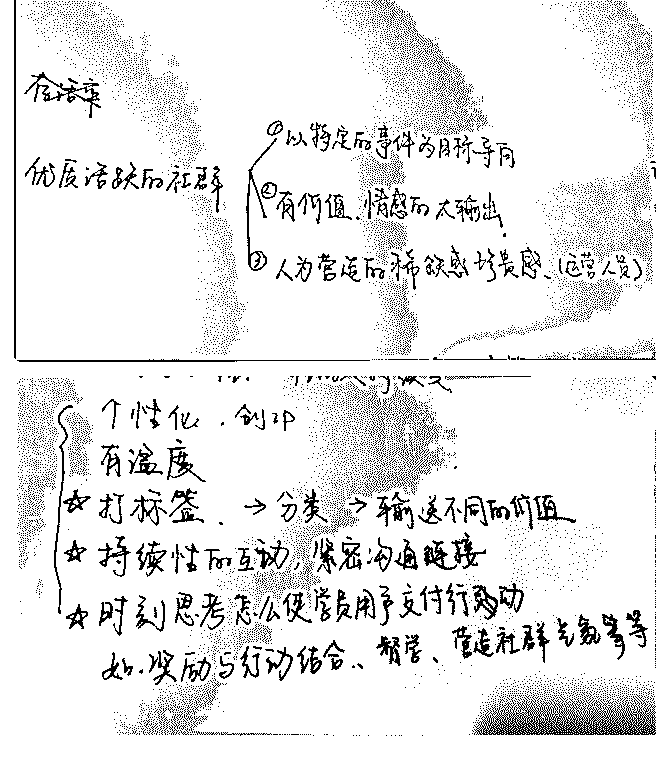

# 分享主题：以花爷社

花爷梦呓换酒钱 : 分享主题：以花爷社群为例，讲述优质社群 特质

分享人：大家好，我叫瘦杭，在广州在线财商教育做社群运 营，也有收了一个保险微课堂社群的代运营。主要是设计社 群流程和社群人员的考核制度，目的是活跃社群提高转化

（买单买课买产品）今天来和大家分享我在社群方面的小小 见解。

分享背景： 社群运营的好，潜力和收益都非常的大。比如梁晓玲，做心

理学在线课程，1000 人的社群能给她创造一年上千万的收

入。某知识大 V，利用粉丝群卖空了某款实体产品供应商的

所有库存。大家老是说：花爷我花了多少钱进这个群，超

值，值回票价。那么，小伙伴们思考一下，票价是一种纯主

观感受，是一个概念。是什么样的社群才会使大家说值回票

价。

分享正文： 我今天想小小地分享以下三点

（图 1）

因为是刚刚下班才整理出来，有点仓促，希望大家体谅一下 哈。

第一、优质的社群有什么样的特质？

大家花 30 秒思考一下，除去工作群，某段时间内，你最关注 的三个社群分别是什么？有什么特点？我们所说的社群是有 价值的社群哈，不是纯信息流，每天发广告互相发链接那 种。

（图 2） 优质或者活跃的社群一般有以下三个特征：

1、特定事件为导向，比如 100 天学习英语，考研考公激励群 等等

这就需要运营人员有意无意地引导用户去朝着一个目标前 进，或者共同关注某一系列事。

2.、有情感，价值的大输出。这是优秀社群的重中之重 首先说情感，情感我个人分为两个方面。一个是浅方面的情

感联系，另外一个是社交网

（图 3）

浅方面的情感联系 自我介绍，简单互动，点赞等等。在花 爷这个群里，或者在长投自己很多社群里，是不是都要求大 家进群自我介绍？这其实在心理学中叫做自我袒露，你越对 别人坦白越多，你对陌生人的信任感就越强，所以在一个陌 生的群里，社群运营需要去尽可能地让大家去介绍自己，互 动点赞都是一个道理。

社交关系网又是怎么回事呢？大家可以看回我上面的那个图

大多数社群只能做到部分学员与讲师或者所谓班班的关系 网，而一个优质的社群是需要做到建立全群的社交链接。花 爷让学员来做分享，这就是在建立社交沟通的链接。让大家 认识我，知道我是干嘛的。我和大家的关系就会更紧密，就 会更离不开这个群。要说浅方面的情感联系是在提高互动频 次，那么建立社交关系网就是在提高情感质量了。

说完了情感，我们来说价值。 一个社群光有情感没有价值也不会有多长远的路，或者说多

大的潜能。比如大家的家庭群本身就够亲密了吧，天然的社

交。但是我们很少能得到认为的自身发展或者价值。社群运

营人员要给出什么样的价值，是需要有一个用户思维。这涉

及到标签化和分类运营。由于时间和场地的限制，我没有办

法告诉大家如何具体的标签化或者去做用户画像，从而得知

她们的需求。但是我可以告诉大家一个相对模糊的分类，不

同社群用户的痛点。

（图 4） 付费较少，中短期营的用户，比较重视认知内容的丰富性。

级别越往高处走的用户比较喜欢能与某个 ip 互动，有联系，

能够获得浅层人脉。高端用户看重的社群能是一个门槛，优

质资源的配置，代表他的某个标志，大家看看，花爷这个群

提供给我们的是什么。

我们跳出社群运营这个思路，作为一个普通的用户应该从这 个优质的池子里，优质的社群里得到些什么。

（图 5） 优质活跃的社群需要的第三个，就是人为去营造一种稀缺

感，珍贵感。

不断强调社群的厉害性，独特性。不仅仅是社群，个人品牌 也是，需要不断的向外界洗脑灌输着你的 ip 特点，有些社群 或者课程老师总是强调，大家好，我是 xxx ，获得 xxx 成 就，社群也一样，作为运营人员，必须有意无意地灌输自己 的群内的价值。这点大家以后多观察一些社群，就会发现 了，如果个人做不了，也没有办法在社群引起呼应。就借助 外力，即托儿。托儿的作用还是挺厉害的，托儿怎么做这又 是一个大文章。

珍贵感怎么来的呢？ 互联网教育有个缺陷就是持久性，没听的课程可以回听，没

看的文章可以马住。这会有很多的学员没有办法及时交付行

动，这很简单，散群，课程失效。如果花爷说，等我讲完

了，直接散群或者今晚 24 点后，我讲的内容全部失效消失加

上一些宣扬我优质的话，相信大家学习的动力一下子就上来

了。社群也一样，不管付不付费的课程，解散了，然后去引

流或者引导转化都比永久有效不解散的群来的好。

而且做社群的小伙伴要知道，社群的生命力是有限的，踊跃 的永远是那一部分人，不活跃的旧群就是在耗费他们的精力 和价值，也在消耗你的精力。旧的不去，新的不来嘛。好 了，我刚刚讲完了个人认为的优质社群的特质。

1、要有特定的目的事件为导向；

2、价值（站在用户思维思考）情感（浅层情感和社交网）的 大输出；

3、最后要人为去营造稀缺感，珍贵感。

已经讲了一个小时了， ，那我接下来快进 一下。讲一下社 群运营日常需要哪些动作。

不管是社群运营也好，小伙伴们也好，我觉得是要有全局观 在看问题。社群运营的重点不是卖产品，而是怎么创造持续 性的收入，卖产品付费不难，难的是持续性变现。就像大家 来这里，不是单纯看我的分享，而且想能不能和我连接在一 起，和很多优秀的人联系在一起。以后能不能有更多的资 源，给自己发展。怎么去持续变现呢，怎么让用户重复付 费，首先你得让你的社群学员们交付学习行动吧，又得夸夸 花爷社群了。其实做到付费不难，难得是如何让用户去交付 行动，很多人包括我们自己，多的是交完钱就当学习过了。 那用户没学习，没交付学习行动，自然别想去二次变现多次 变现了。

那么社群运营的人要稍微运营好社群，我个人觉得至少要做 到以下几点。

（图 6）

个性化，有自己的 ip，有温度，这是最基本的要求。不累 述。

第三个是打标签 ，这个很重要。 我会要求我的小兼职运营团队，对每一期开营的学员打上两

至三个标签。这方便我将来对不同标签的学员去输送不同的

内容。班主任打标签的过程也是让她们去建立沟通链接的过

程，也就是第四点，持续性的互动，建立沟通链接。

社群运营的小伙伴会问我，瘦杭到底怎么做沟通链接啊。我

就会说，那你就要在群里和她们多互动，她们打卡的时候你 鼓励了吗，你有用心的去加学员，用心的点赞留言吗？大家 不是社群运营的人员，可以思考一下怎么在这个群中创建自 己的社交链接。

最后一个社群运营人员需要具备的就是时刻思考着怎么让大 家去交付学习行动，这个刚刚我讲了。目前我也在探索中， 可以利用督学，奖励与行动结合，营造气氛等等。

总结一下社群运营人员需要个性化，有自己的 ip 定位，对人 群打标签，持续性的互动，紧密沟通链接。思考怎么使学员 交付学习行动。

前几点我认为和个人人脉发展是相同的，大家在花爷创建的 优质群里，表现自己，连接人脉。再次夸夸花爷的群~

由于时间关系，我就讲到这儿啦，今天分享的主要是优质社 群具备哪些特质，以及社群运营人员怎么维护好一个社群。 谢谢大家听了我这么久的啰里啰嗦

2019-04-11(26 赞)

关注公众号"懒人找资源"，星球资源一站式服务